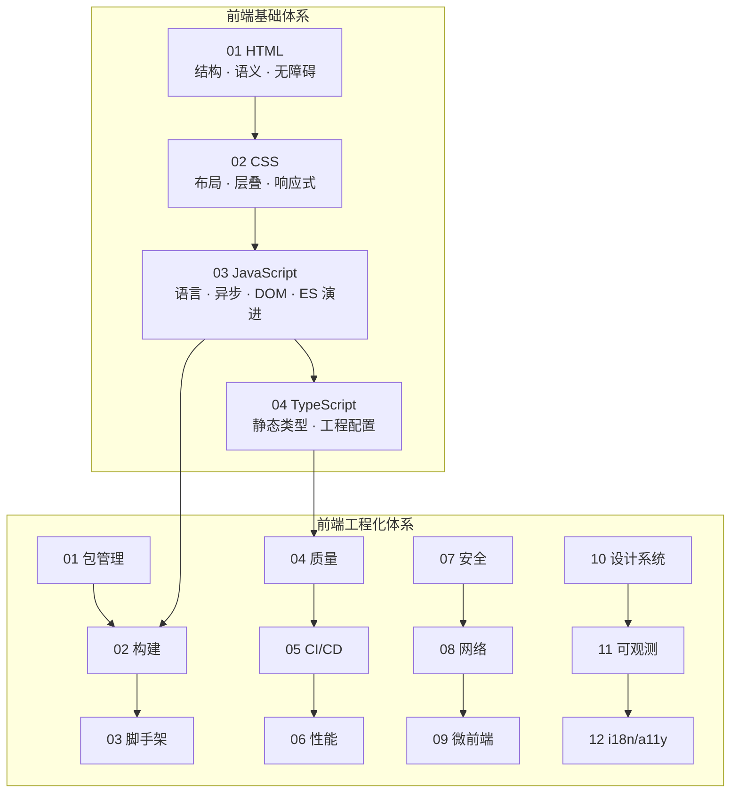

# Knowledge-base

个人知识体系，涵盖**前端基础**与**前端工程化**两大模块。文档通用、普适，适用于 React / Vue 等技术栈，可按主题选读。

---

## 仓库结构

```
Knowledge-base/
├── 前端基础体系/          # HTML · CSS · JavaScript · TypeScript
└── 前端工程化体系/        # 工具链 · 规范 · 交付 · 架构
    └── 编码规范/          # React / Vue 编码标准
```

---

## 体系总览



| 模块 | 定位 | 文档数 |
|------|------|--------|
| [前端基础体系](./前端基础体系/) | 浏览器端语言与标记：从 HTML 到 TypeScript | 4 篇 |
| [前端工程化体系](./前端工程化体系/) | 现代前端工具链、规范与实践 | 12 篇 + 2 编码规范 |

---

## 前端基础体系

> 四大支柱：**HTML 标记** → **CSS 样式** → **JavaScript 行为** → **TypeScript 类型**。ES 新特性并入 JavaScript 篇，不单列章节。

| 篇 | 文档 | 定位 | 与工程化衔接 |
|----|------|------|--------------|
| 01 | [HTML 与语义化](./前端基础体系/01-HTML与语义化.md) | 标签、文档结构、无障碍标记 | 工程化 12 国际化与无障碍 |
| 02 | [CSS 体系](./前端基础体系/02-CSS体系.md) | 布局、动画、响应式 | 工程化 06 性能、10 设计系统 |
| 03 | [JavaScript 体系](./前端基础体系/03-JavaScript体系.md) | 语言机制、异步、DOM、ES5–ES2026 | 工程化 02 构建、08 浏览器与网络 |
| 04 | [TypeScript 体系](./前端基础体系/04-TypeScript体系.md) | 编译期类型、泛型、tsconfig | 工程化 04 代码规范 |

### 各篇章节目录（速查）

**01 · HTML** — 文档结构 · 标签分类 · HTML5 · 表单与多媒体 · 语义化 · 无障碍与 ARIA · SEO

**02 · CSS** — 渲染管线 · 盒模型与 BFC · 选择器/伪类/伪元素 · 优先级 · 布局（Flex/Grid）· 动画 · 媒体查询 · 兼容

**03 · JavaScript** — 运行时 · 类型 · 闭包/this/原型 · DOM/事件/异步 · 事件循环 · ES5→ES2026

**04 · TypeScript** — 基础类型 · 函数/对象/interface/class · 泛型 · 推论/断言/守卫 · 类型运算 · 模块/装饰器 · tsconfig

### 推荐路径

| 目标 | 顺序 |
|------|------|
| 零基础 | 01 → 02 → 03（前半）→ 03（异步/DOM） |
| 上岗 | 03 全文 → 04 → 02 进阶 |
| 面试原理 | 03 事件循环/闭包/原型 + 02 BFC/层叠 + 04 类型系统 |

---

## 前端工程化体系

> 系统介绍现代前端工程化所涉及的工具链、规范与实践。各篇章独立成文，从概念、机制、配置示例、故障排查到 Checklist 分层展开。

### 编码规范

| 文档 | 说明 |
|------|------|
| [React 编码规范](./前端工程化体系/编码规范/React编码规范.md) | React 18+ / TypeScript / Hooks |
| [Vue 编码规范](./前端工程化体系/编码规范/Vue编码规范.md) | Vue 3 / Composition API / TypeScript |

### 工程化模块

| 序号 | 文档 | 主题概要 |
|------|------|----------|
| 01 | [包管理层](./前端工程化体系/01-包管理层.md) | Node.js、包管理器、SemVer、lock 文件、依赖治理 |
| 02 | [模块化与构建层](./前端工程化体系/02-模块化与构建层.md) | ESM/CJS、Webpack/Vite、编译器、分包与构建调优 |
| 03 | [脚手架与项目初始化](./前端工程化体系/03-脚手架与项目初始化.md) | Vite 模板、自定义 CLI、Monorepo、版本发布 |
| 04 | [代码规范与质量保障](./前端工程化体系/04-代码规范与质量保障.md) | ESLint、Prettier、TypeScript、测试、质量门禁 |
| 05 | [CI/CD 与自动化部署](./前端工程化体系/05-CI_CD与自动化部署.md) | GitHub Actions、Docker、Nginx、发布策略 |
| 06 | [性能优化与监控](./前端工程化体系/06-性能优化与监控.md) | Core Web Vitals、加载/运行时优化、性能预算、RUM |
| 07 | [前端安全体系](./前端工程化体系/07-前端安全体系.md) | XSS/CSRF、CSP、认证、供应链安全 |
| 08 | [浏览器与网络基础](./前端工程化体系/08-浏览器与网络基础.md) | HTTP、缓存、同源、CORS、事件循环 |
| 09 | [微前端与模块联邦](./前端工程化体系/09-微前端与模块联邦.md) | 架构模式、Module Federation、运行时集成 |
| 10 | [设计系统与组件工程化](./前端工程化体系/10-设计系统与组件工程化.md) | Design Token、Storybook、组件库发包 |
| 11 | [可观测性与错误监控](./前端工程化体系/11-可观测性与错误监控.md) | 日志、Sentry、Source Map、告警与排障 |
| 12 | [国际化与无障碍](./前端工程化体系/12-国际化与无障碍.md) | i18n 工程化、RTL、a11y 规范与检测 |

### 主题分组

**环境与依赖** — 01 包管理层  
**构建与产物** — 02 模块化与构建层、03 脚手架与项目初始化  
**质量与规范** — 04 代码规范与质量保障、React/Vue 编码规范  
**交付与运行** — 05 CI/CD、06 性能、07 安全、08 浏览器与网络  
**架构与体验** — 09 微前端、10 设计系统、11 可观测性、12 国际化与无障碍

### 工程治理横切关注点

1. **确定性** — lock 文件、固定 Node/包管理器版本、CI frozen install
2. **可观测性** — 构建分析、错误监控、性能 RUM、部署审计
3. **安全性** — 依赖审计、CSP、Secrets 不进客户端产物
4. **性能预算** — bundle 上限、Core Web Vitals 基线
5. **可演进性** — 技术选型 ADR、渐进式迁移路径

---

## 阅读方式

叙述 + **表格**（对照）+ **示意图**（流程/结构）+ **代码**（写法）穿插出现，避免大段纯文字或仅贴一段代码。

---

## 外部参考

[MDN](https://developer.mozilla.org/zh-CN/) · [ECMA-262](https://tc39.es/ecma262/) · [TypeScript 手册](https://www.typescriptlang.org/docs/handbook/) · [Can I use](https://caniuse.com) · [web.dev](https://web.dev/)
