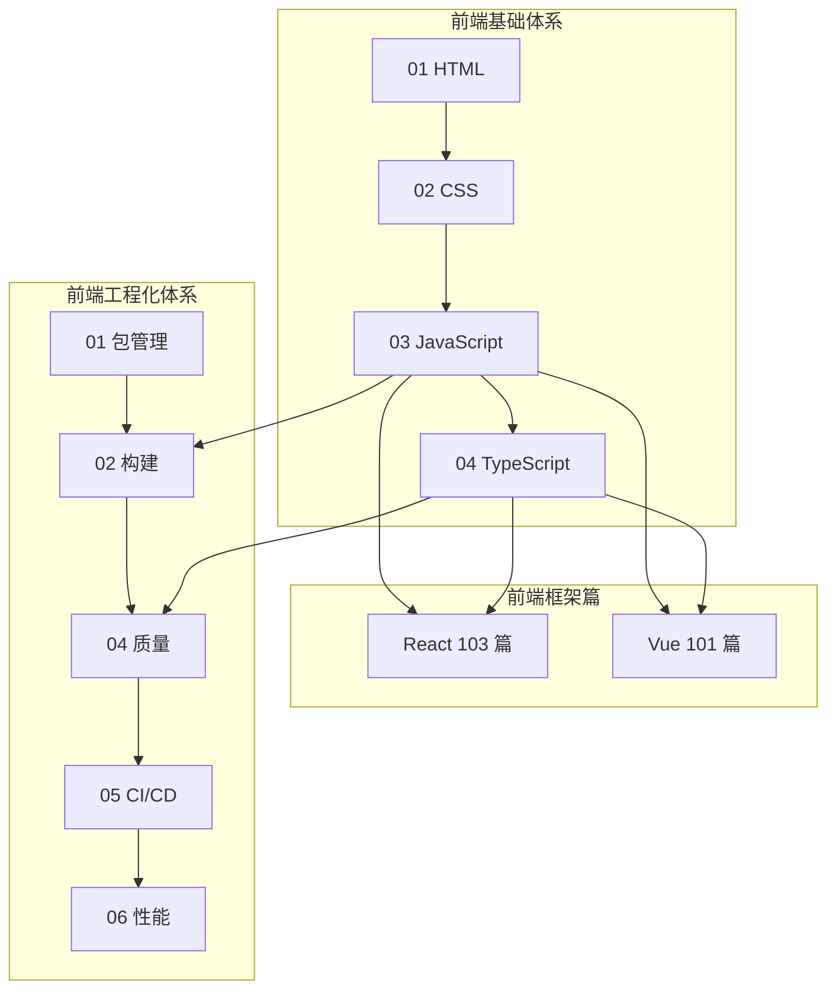

# 前端知识体系

个人前端学习笔记仓库，按**基础 → 框架 → 工程化**组织。各篇独立可读，用于复盘「是什么、为什么、怎么做」，而不是对外教程。

---

## 文档怎么写

- **体裁**：个人笔记体——白话为主，术语保留；开篇点题，正文自然叙述，文末 **小结** 收束（要点、易混点、自检）。
- **不出现「我」**：视角是个人笔记，正文用客观/祈使表述（「宜…」「常见…」「切忌…」）。
- **单篇自洽**：正文不依赖跨章跳转；需要查目录时用各框架下的 `00-阅读地图.md`。
- **形式**：叙述 + 表格 + mermaid + 代码示例穿插，避免大段纯文字。

**团队规范**（与笔记正文分开）：[React 编码规范](./前端框架篇/React/React编码规范.md) · [Vue 编码规范](./前端框架篇/Vue/Vue编码规范.md)

---

## 仓库结构

```
前端知识体系/
├── 前端基础体系/          # HTML · CSS · JavaScript · TypeScript（4 篇）
├── 前端框架篇/            # React · Vue · （RN / Flutter / Uni-app 待补充）
└── 前端工程化体系/        # 工具链 · 规范 · 交付 · 架构（12 篇）
```

---

## 规模一览

| 模块 | 定位 | 规模 |
|------|------|------|
| [前端基础体系](./前端基础体系/) | 标记、样式、语言、类型 | **4 篇**（长文合订） |
| [前端工程化体系](./前端工程化体系/) | 包管理、构建、质量、交付、安全等 | **12 篇** |
| [React](./前端框架篇/React/00-阅读地图.md) | React 18+ 从入门到生产 | **20 模块 / 103 篇** + 阅读地图 |
| [Vue](./前端框架篇/Vue/00-阅读地图.md) | Vue 2→3，Options / Composition 双线 | **20 模块 / 101 篇** + 阅读地图 |
| 跨端 | React Native、Flutter、Uni-app | 占位，待写 |

---

## 体系总览



---

## 前端基础体系

四大支柱：**HTML → CSS → JavaScript → TypeScript**。ES 新特性并入 JavaScript 篇，不单列章节。

| 篇 | 文档 | 侧重 |
|----|------|------|
| 01 | [HTML 与语义化](./前端基础体系/01-HTML与语义化.md) | 结构、语义、无障碍、SEO |
| 02 | [CSS 体系](./前端基础体系/02-CSS体系.md) | 布局、层叠、动画、响应式 |
| 03 | [JavaScript 体系](./前端基础体系/03-JavaScript体系.md) | 语言机制、异步、DOM、ES 演进 |
| 04 | [TypeScript 体系](./前端基础体系/04-TypeScript体系.md) | 类型系统、泛型、工程配置 |

**入门顺序建议**：01 → 02 → 03（语言与异步）→ 04。面试原理可重点看 03 事件循环/闭包/原型、02 BFC/层叠、04 类型运算。

---

## 前端框架篇

### React

入口：[00-阅读地图](./前端框架篇/React/00-阅读地图.md)

| 分期 | 模块 | 内容 |
|------|------|------|
| P0 入门 | 01～06 | 认知、JSX、组件、事件表单、Hooks、渲染调和 |
| P1 架构 | 07～13 | 组件模式、状态、数据请求、路由、性能、并发、TS |
| P2 生产 | 14～20 | SSR/元框架、测试、a11y/安全/i18n、类组件迁移、React 19、跨端、排障 |

### Vue

入口：[00-阅读地图](./前端框架篇/Vue/00-阅读地图.md)

按 Vue 自身知识结构组织（非 React 对照），主线示例：

| 目标 | 建议模块 |
|------|----------|
| Vue 3 上手 | 01 → 02 → 03 → 05 → 11 → 12 |
| 理解原理 | 06 响应式 → 07 编译渲染 → 10 内置能力 |
| Vue 2 维护 / 升级 | 04 Options API → 19 迁移与版本演进 |

### 跨端（待补充）

React Native、Flutter、Uni-app 等目录已预留，正文尚未撰写。

---

## 前端工程化体系

12 篇独立成文，覆盖从依赖安装到上线观测的全链路。

| 序号 | 文档 | 主题 |
|------|------|------|
| 01 | [包管理层](./前端工程化体系/01-包管理层.md) | Node、pnpm/npm、SemVer、lock |
| 02 | [模块化与构建层](./前端工程化体系/02-模块化与构建层.md) | ESM/CJS、Webpack/Vite |
| 03 | [脚手架与项目初始化](./前端工程化体系/03-脚手架与项目初始化.md) | 模板、Monorepo |
| 04 | [代码规范与质量保障](./前端工程化体系/04-代码规范与质量保障.md) | ESLint、Prettier、测试 |
| 05 | [CI/CD 与自动化部署](./前端工程化体系/05-CI_CD与自动化部署.md) | Actions、Docker、发布 |
| 06 | [性能优化与监控](./前端工程化体系/06-性能优化与监控.md) | Web Vitals、RUM |
| 07 | [前端安全体系](./前端工程化体系/07-前端安全体系.md) | XSS/CSRF、CSP |
| 08 | [浏览器与网络基础](./前端工程化体系/08-浏览器与网络基础.md) | HTTP、缓存、CORS |
| 09 | [微前端与模块联邦](./前端工程化体系/09-微前端与模块联邦.md) | Module Federation |
| 10 | [设计系统与组件工程化](./前端工程化体系/10-设计系统与组件工程化.md) | Token、Storybook |
| 11 | [可观测性与错误监控](./前端工程化体系/11-可观测性与错误监控.md) | Sentry、告警 |
| 12 | [国际化与无障碍](./前端工程化体系/12-国际化与无障碍.md) | i18n、a11y |

**主题分组**：环境与依赖（01）→ 构建（02～03）→ 质量（04）→ 交付与运行（05～08）→ 架构与体验（09～12）。

---

## 怎么读

1. **按缺口选读**：不必从头到尾；缺 HTML 补 01，缺 Vite 补工程化 02，缺 Hooks 进 React 05。
2. **框架用阅读地图**：React / Vue 模块多，从各自 `00-阅读地图.md` 进模块索引。
3. **编码规范单独看**：写代码、Review 时对照框架下的编码规范，与原理笔记分开。

---

## 外部参考

[MDN](https://developer.mozilla.org/zh-CN/) · [ECMA-262](https://tc39.es/ecma262/) · [TypeScript 手册](https://www.typescriptlang.org/docs/handbook/) · [React 文档](https://react.dev/) · [Vue 文档](https://cn.vuejs.org/) · [web.dev](https://web.dev/)
