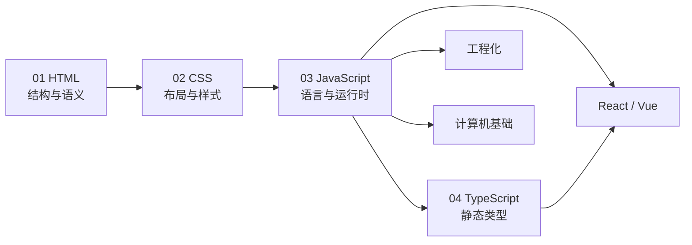

# 前端基础体系 · 阅读地图

> 前端知识体系的 **语言与标记底座**：HTML、CSS、JavaScript、TypeScript 四大支柱合订为 4 篇长文。各篇独立可读，开篇点题、文末 **小结**；ES 新特性并入 JavaScript 篇，不单列章节。

**规模**：**4 篇合订**（✅ 已全部撰写）

**前置建议**：无硬性前置；可与 [React](../前端框架篇/React/00-阅读地图.md) / [Vue](../前端框架篇/Vue/00-阅读地图.md) 入门模块并行，但宜先读完 03 JavaScript 再进框架。

**与后续篇章的衔接**：框架篇依赖 JS/TS 语言机制；工程化篇依赖模块与异步概念；[计算机基础篇](../计算机基础篇/00-阅读地图.md) 从原理层解释事件循环、网络、编译等底层。

---

## 阅读地图

| 序号 | 文档 | 内容侧重 | 体量 | 状态 |
|------|------|----------|------|------|
| **01** | HTML 与语义化 | 文档树、语义标签、表单、无障碍、SEO | ~480 行 | ✅ |
| **02** | CSS 体系 | 盒模型、BFC、布局、动画、响应式 | ~870 行 | ✅ |
| **03** | JavaScript 体系 | 运行时、类型、闭包、异步、DOM、ES 演进 | ~1700 行 | ✅ |
| **04** | TypeScript 体系 | 类型系统、泛型、类型运算、工程配置 | ~1080 行 | ✅ |

写法：**叙述 + 表格 + mermaid + 代码示例**，单篇内自洽，按章节递进阅读。

---

## 目录总览

---

## 篇目索引

### 01 · HTML 与语义化

| 文档 | 主题 | 状态 |
|------|------|------|
| [01-HTML与语义化](./01-HTML与语义化.md) | 文档树、块级/行内、语义标签、表单、ARIA、SEO | ✅ |

**章内主线**：HTML 在页面中的角色 → 文档结构 → 语义化 → 表单与交互 → 无障碍 → SEO 与元信息。

### 02 · CSS 体系

| 文档 | 主题 | 状态 |
|------|------|------|
| [02-CSS体系](./02-CSS体系.md) | 盒模型、BFC、选择器、层叠、Flex/Grid、动画、响应式 | ✅ |

**章内主线**：样式流水线 → 盒模型与 BFC → 选择器与优先级 → 布局体系 → 动画与 transform → 响应式与兼容 → 工程化组织。

### 03 · JavaScript 体系

| 文档 | 主题 | 状态 |
|------|------|------|
| [03-JavaScript体系](./03-JavaScript体系.md) | 堆栈、类型、闭包、this、原型、异步、DOM、ES 模块 | ✅ |

**章内主线**：运行时模型 → 语言核心 → 函数与 this → 原型链 → 异步与事件循环 → DOM/BOM → 模块化与 ES 演进。

> 事件循环、内存模型的原理层对照见 [计算机基础篇 · 操作系统 / 浏览器 / 并发](../计算机基础篇/00-阅读地图.md)。

### 04 · TypeScript 体系

| 文档 | 主题 | 状态 |
|------|------|------|
| [04-TypeScript体系](./04-TypeScript体系.md) | 基础类型、泛型、类型运算、模块、tsconfig | ✅ |

**章内主线**：TS 定位与发展 → 基础类型 → 函数与对象建模 → 泛型 → 类型安全 → 类型运算 → 模块与工程配置。

---

## 推荐学习路径

| 目标 | 建议路径 |
|------|----------|
| **零基础入门** | 01 HTML → 02 CSS → 03 JavaScript（语言核心 + 异步） |
| **进框架前** | 03 闭包/异步/模块 → 04 TypeScript 基础类型与泛型 |
| **面试语言题** | 03 事件循环、闭包、原型、this → 04 类型运算 |
| **补样式布局** | 02 盒模型/BFC → Flex/Grid → 层叠与优先级 |
| **工程类型配置** | 04 模块与 tsconfig → [工程化 14](../前端工程化体系/00-阅读地图.md) |

---

## 与现有篇章的分工

| 主题 | 本篇（实践/语言） | 其他篇章 |
|------|-------------------|----------|
| 事件循环 | 03 JS 运行时模型 | [计算机基础 · OS/浏览器/并发](../计算机基础篇/00-阅读地图.md) 原理层 |
| HTTP/缓存/CORS | — | [工程化 08](../前端工程化体系/08-浏览器与网络基础.md) 浏览器实践 |
| 组件与 Hooks | — | [React](../前端框架篇/React/00-阅读地图.md) / [Vue](../前端框架篇/Vue/00-阅读地图.md) |
| 构建与模块 | 03 ESM 概念 | [工程化 02](../前端工程化体系/02-模块化与构建层.md) Webpack/Vite |
| 类型在组件中 | 04 泛型与类型运算 | React 13 / Vue 15 框架实践 |

**原则**：本篇讲「语言怎么写、运行时怎么跑」；框架篇讲「组件怎么组织」；计算机基础篇讲「底层为什么这样」。

---

## 小结

前端基础体系 **4 篇合订**已全部撰写，建议按 **01 → 02 → 03 → 04** 顺序通读，或按上表缺口选读。

**易混点**：Node 运行时版本 ≠ 浏览器 JS 特性；TS 类型擦除后运行时仍是 JS；CSS 布局问题先查盒模型与 BFC，再查 Flex/Grid。

核对：进框架前是否已掌握 03 的异步与模块？写 TS 组件前是否已理解 04 的泛型与类型运算？
