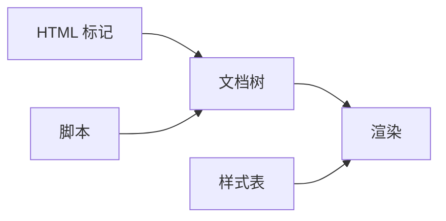
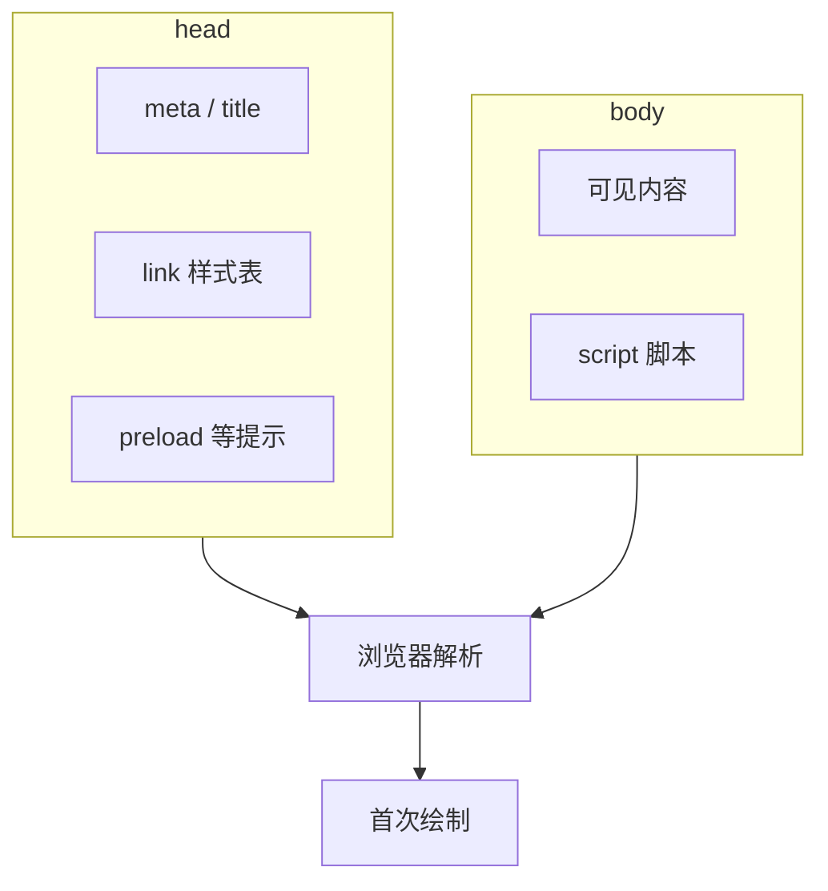
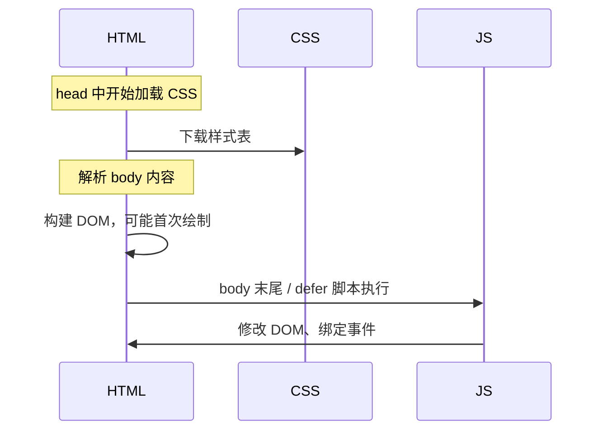
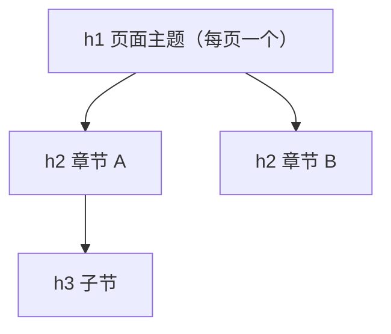
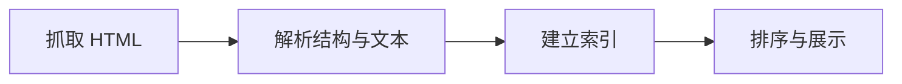

# 01 · HTML 与语义化

HTML 是页面的文档层：浏览器据此建树，再与 CSS、JavaScript 合成可见界面。无论模板、框架还是 SSR，最终都要产出合法、语义正确的 markup。

## HTML 在页面中的角色

浏览器读取 HTML 字节流，解析为**文档树**，再与样式表合成可见页面。模板、框架或 SSR 最终都要落到同一目标：合法、语义正确的 HTML（或与之等价的文档结构）。



HTML 由 WHATWG 持续维护，无「HTML6」式大版本号；**HTML5** 通常指语义标签、表单增强、音视频、Canvas 等相对 HTML4 的整体能力跃迁。

---

## 文档骨架

### 2.1 最小完整结构

一份可上线页面的骨架通常包含：文档类型声明、根元素、`head`（元数据与资源引用）、`body`（可见内容与脚本）。

```html
<!DOCTYPE html>
<html lang="zh-CN">
  <head>
    <meta charset="UTF-8" />
    <meta name="viewport" content="width=device-width, initial-scale=1" />
    <title>页面标题 — 站点名</title>
    <meta name="description" content="约 120–160 字摘要" />

    <!-- 样式：一般放 head -->
    <link rel="stylesheet" href="/assets/main.css" />

    <!-- 关键脚本可 preload；非关键脚本见 body 末尾 -->
    <link rel="preload" href="/assets/main.js" as="script" />
  </head>
  <body>
    <main>...</main>

    <!-- 脚本：默认放 body 末尾 -->
    <script src="/assets/main.js" defer></script>
  </body>
</html>
```



### 2.2 CSS 与 JS 如何引入

| 资源 | 常见写法 | 放置位置 |
|------|----------|----------|
| 外部样式表 | `<link rel="stylesheet" href="...">` | **head** |
| 内联样式 | `<style>...</style>` | head（少量关键样式） |
| 外部脚本 | `<script src="...">` | **body 末尾**，或 head + `defer` / `async` |
| 内联脚本 | `<script>...</script>` | 同上 |
| ES 模块 | `<script type="module" src="...">` | body 末尾或 head（模块默认 defer） |

**样式表示例：**

```html
<!-- 普通外链样式 -->
<link rel="stylesheet" href="/css/main.css" />

<!-- 媒体查询：仅打印时加载 -->
<link rel="stylesheet" href="/css/print.css" media="print" />

<!-- 预加载关键样式（首屏急需时） -->
<link rel="preload" href="/css/critical.css" as="style" />
<link rel="stylesheet" href="/css/critical.css" />
```

**脚本示例：**

```html
<!-- 推荐：defer，下载不阻塞解析，DOM 就绪后按顺序执行 -->
<script src="/js/app.js" defer></script>

<!-- 独立统计/广告：async，下载完即执行，顺序不保证 -->
<script src="/js/analytics.js" async></script>

<!-- ES 模块：默认 defer 行为 -->
<script type="module" src="/js/main.js"></script>
```

| 脚本属性 | 下载 | 执行时机 | 是否阻塞 HTML 解析 | 典型用途 |
|----------|------|----------|-------------------|----------|
| 无（默认） | 阻塞解析 | 立即执行 | **是** | 遗留写法，避免 |
| `defer` | 并行 | DOM 解析完成后、顺序执行 | 否 | 主业务脚本 |
| `async` | 并行 | 下载完即执行，顺序不定 | 否 | 第三方、统计 |
| `type="module"` | 并行 | 类似 defer | 否 | 现代模块化脚本 |

### 2.3 为什么样式放 head、脚本放 body 末尾

**样式放 head 的原因：**

- 浏览器按**从上到下**解析 HTML。样式表在 head 中可尽早开始下载，在渲染 body 内容前尽量准备好规则，减少**无样式内容闪一下**（FOUC）。
- 若在 body 末尾才引入首屏样式，用户可能先看到未排版内容，再突然跳变。

**脚本放 body 末尾（或使用 defer）的原因：**

- 普通 `<script src="...">` **会阻塞** HTML 解析：下载并执行完脚本前，后面的 markup 无法继续解析，首屏渲染被推迟。
- 放在 body 末尾时，DOM 主体已解析完毕，用户更快看到内容；脚本再改 DOM、绑事件。
- `defer` 把脚本放 head 也能不阻塞解析，适合多个按序依赖的业务脚本。



**例外：** 必须在首屏前运行的极小「关键脚本」可 inline 在 head；体积务必控制。关键 CSS 也可 inline 在 head，用于极快首屏，但维护成本较高。

### 2.4 meta 与 head 常用元素

#### 基础与文档信息

| 元素 / 属性 | 含义 | 说明 |
|-------------|------|------|
| `<!DOCTYPE html>` | 文档类型 | 触发标准模式；须写在第一行 |
| `<html lang="zh-CN">` | 页面主语言 | 影响读屏发音、翻译、搜索引擎语言判断 |
| `<meta charset="UTF-8">` | 字符编码 | **须尽早出现**；否则浏览器可能误判编码导致乱码 |
| `<title>` | 文档标题 | 标签页、书签、搜索结果标题；每页宜唯一 |
| `<base href="...">` | 基准 URL | 影响相对路径解析；一页最多一个，慎用 |

#### 移动端与视口

| meta | 含义 |
|------|------|
| `name="viewport" content="width=device-width, initial-scale=1"` | 视口宽度等于设备宽，初始缩放 1:1；缺少时移动端常按 ~980px 渲染再缩小 |
| `initial-scale=1` | 首次加载缩放比例 |
| `maximum-scale=1, user-scalable=no` | 禁止用户缩放；**无障碍不推荐**（低视力用户需放大） |
| `viewport-fit=cover` | 刘海屏安全区，常配合 CSS `env(safe-area-inset-*)` |
| `name="theme-color" content="#1a1a1a"` | 浏览器地址栏/系统 UI 主题色（Android 等） |
| `name="color-scheme" content="light dark"` | 告知浏览器页面支持浅色/深色，影响默认表单、滚动条等 |
| `name="format-detection" content="telephone=no"` | iOS Safari 不自动把数字识别为电话链接 |

#### SEO 与爬虫

| meta / link | 含义 |
|-------------|------|
| `name="description" content="..."` | 页面摘要，常出现在搜索结果 snippet；约 120–160 字，与正文一致 |
| `name="keywords" content="..."` | 关键词列表；主流搜索引擎权重已很低，可选 |
| `name="author" content="..."` | 作者信息 |
| `name="robots" content="index, follow"` | 本页是否索引（index/noindex）、是否跟踪链接（follow/nofollow） |
| `name="googlebot" content="..."` | 仅针对 Google 爬虫的指令，可细于 robots |
| `link rel="canonical" href="..."` | 规范 URL，合并重复地址的权重 |
| `link rel="alternate" hreflang="..."` | 多语言/地区版本对应关系 |

`robots` 常见取值：

| 取值 | 含义 |
|------|------|
| `index` / `noindex` | 允许 / 禁止收录 |
| `follow` / `nofollow` | 允许 / 禁止跟踪页内链接 |
| `noarchive` | 不展示缓存快照 |
| `nosnippet` | 不展示摘要 |

#### 社交分享

| meta | 含义 |
|------|------|
| `property="og:title"` | Open Graph 标题（微信、Facebook 等预览） |
| `property="og:description"` | 分享描述 |
| `property="og:image"` | 预览图 URL |
| `property="og:url"` | 规范分享 URL |
| `property="og:type"` | 类型，如 `website`、`article` |
| `name="twitter:card"` | Twitter/X 卡片样式，如 `summary_large_image` |
| `name="twitter:title"` 等 | Twitter 专用字段，可与 og 并存 |

#### 安全、刷新与 HTTP 等价

| meta | 含义 |
|------|------|
| `http-equiv="Content-Security-Policy" content="..."` | 内容安全策略（更推荐 HTTP 响应头下发） |
| `http-equiv="X-UA-Compatible" content="IE=edge"` | 旧版 IE 使用最新引擎；现代项目通常不需要 |
| `http-equiv="refresh" content="5;url=..."` | 定时跳转；**SEO 与体验差**，慎用 |
| `name="referrer" content="strict-origin-when-cross-origin"` | 控制 Referer 请求头如何发送 |

#### 应用与图标

| link / meta | 含义 |
|-------------|------|
| `link rel="icon" href="favicon.ico"` | 标签页图标 |
| `link rel="apple-touch-icon" href="..."` | iOS 主屏图标 |
| `meta name="apple-mobile-web-app-capable" content="yes"` | 全屏 Web App 模式（旧写法，新标准用 manifest） |
| `link rel="manifest" href="manifest.json"` | PWA 清单：名称、图标、主题色、启动方式 |

#### 资源加载提示

| link | 含义 |
|------|------|
| `rel="preload" as="style"` | 高优先级预加载当前页即将用到的资源 |
| `rel="preload" as="font" crossorigin` | 预加载字体（跨域须 `crossorigin`） |
| `rel="prefetch" href="..."` | 低优先级，空闲时预取**下一页**可能用的资源 |
| `rel="preconnect" href="https://api.example.com"` | 提前完成 DNS + TCP + TLS |
| `rel="dns-prefetch" href="..."` | 仅 DNS 预解析 |

### 2.5 head 与 body 分工小结

| 区域 | 适合放置 | 原因 |
|------|----------|------|
| **head** | meta、title、样式表、preload、canonical、结构化数据脚本 | 尽早告诉浏览器编码、视口、SEO；尽早拉样式 |
| **body 开头** | 跳过导航链接、首屏可见内容 | 可访问性：键盘用户可直达主内容 |
| **body 末尾** | 业务脚本、非关键统计 | 不阻塞 DOM 解析与首屏渲染 |
| **body 中部** | 文章、表单、组件等可见 markup | 爬虫与用户直接消费的内容 |

---

## 标签分类

### 3.1 内容标签

承载具体信息类型，对搜索引擎与读屏都更友好。

| 标签 | 用途 |
|------|------|
| `h1`–`h6` | 标题层级，构成文档大纲 |
| `p` | 段落 |
| `ul` / `ol` / `li` | 无序 / 有序列表 |
| `dl` / `dt` / `dd` | 术语列表 |
| `figure` / `figcaption` | 插图与说明 |
| `blockquote` | 引用 |
| `pre` / `code` | 代码块 / 行内代码 |
| `time` | 时间（配合 `datetime`） |
| `article` | 独立完整内容（文章、评论） |
| `main` | 页面主内容（宜唯一） |

### 3.2 布局与结构标签

HTML5 **语义地标**，替代纯 `div` 堆砌。

| 标签 | 角色 |
|------|------|
| `header` | 页眉或区块头 |
| `footer` | 页脚或区块脚 |
| `nav` | 导航链接组 |
| `section` | 有主题的内容分组（宜带标题） |
| `aside` | 侧边、补充信息 |
| `main` | 主内容区 |

```html
<body>
  <header><nav aria-label="主导航">...</nav></header>
  <main>
    <article>
      <h1>文章标题</h1>
      <section><h2>第一节</h2><p>...</p></section>
    </article>
  </main>
  <footer>...</footer>
</body>
```

### 3.3 文本格式化标签

| 标签 | 语义 |
|------|------|
| `strong` | 重要性（非仅加粗） |
| `em` | 语气强调 |
| `mark` | 高亮 |
| `small` | 附属说明 |
| `abbr` | 缩写（`title` 解释） |
| `cite` | 作品名 |
| `del` / `ins` | 删除 / 插入（修订） |
| `sub` / `sup` | 下标 / 上标 |

避免用 `b` / `i` 仅做样式；无语义时用样式表控制外观。

### 3.4 无语义容器

| 标签 | 何时用 |
|------|--------|
| `div` | 纯布局或样式钩子，**无**更好语义时 |
| `span` | 行内容器，内联样式钩子 |

原则：**能用语义标签就不用 div**。div 本身无含义，爬虫与读屏无法识别区块角色。

### 3.5 交互与嵌入

| 标签 | 用途 |
|------|------|
| `a` | 超链接、锚点、mailto、tel |
| `button` | 按钮（提交 / 普通 / 重置） |
| `input` / `textarea` / `select` | 表单控件 |
| `img` / `picture` | 图片 |
| `video` / `audio` | 音视频 |
| `iframe` | 嵌入页（注意 sandbox） |
| `dialog` | 对话框 |
| `details` / `summary` | 折叠块 |
| `canvas` | 脚本绘图位图 |
| `svg` | 矢量图 |
| `template` | 不参与渲染的模板片段 |

---

## 常用属性

| 属性 | 说明 |
|------|------|
| `id` | 页内唯一，锚点与 label 关联 |
| `class` | 样式类，**无语义** |
| `lang` | 语言 |
| `hidden` | 隐藏且不参与交互 |
| `tabindex` | 焦点顺序（`0` 入序，`-1` 可编程聚焦，正数避免） |
| `title` | 提示（不能替代 label） |
| `data-*` | 自定义数据钩子 |
| `contenteditable` | 可编辑 |
| `draggable` | 拖拽 |

链接：`href`、`target="_blank"` 须配 `rel="noopener noreferrer"`。  
媒体：`src`、`srcset`、`sizes`、`width` / `height`、`alt`、`loading="lazy"`。

---

## HTML5 重要能力

| 能力 | 代表标签 / 能力 |
|------|----------------|
| 语义结构 | `header`、`nav`、`main`、`article`、`section`、`footer` |
| 表单增强 | `email`、`url`、`date`、`range`、`color`；`placeholder`；`required`、`pattern` |
| 音视频 | `video`、`audio`、`<track kind="captions">` |
| 图形 | `canvas`、内联 `svg` |
| 本地存储 | `localStorage` / `sessionStorage` |
| 离线缓存 | Service Worker |
| 实时通信 | WebSocket |

表单示例：

```html
<form method="post">
  <label for="email">邮箱</label>
  <input id="email" type="email" name="email" required autocomplete="email" />

  <label for="age">年龄</label>
  <input id="age" type="number" min="0" max="150" />

  <button type="submit">提交</button>
</form>
```

`novalidate` 可关闭浏览器默认校验气泡，由页面脚本统一展示错误信息。

---

## 表格与多媒体

**表格**只用于二维数据，不用做页面布局。

```html
<table>
  <caption>销售表</caption>
  <thead><tr><th scope="col">区域</th><th scope="col">金额</th></tr></thead>
  <tbody><tr><th scope="row">华东</th><td>100</td></tr></tbody>
</table>
```

**图片**：信息图写清 `alt`；装饰图 `alt=""`。首屏关键图片不宜懒加载，以免拖慢最大内容绘制。

```html

```

---

## 语义化与文档大纲



| 实践 | 原因 |
|------|------|
| 每页一个主 `h1` | 明确页面主题 |
| 标题不跳级 | 读屏与大纲清晰 |
| `main` 包裹主内容 | 地标跳转 |
| 按钮用 `button`，导航用 `a` | 键盘与读屏行为正确 |
| 表单 `label` 关联控件 | 可访问名称 |

语义化同时帮助搜索引擎区分导航、正文、侧栏，理解哪一块才是页面核心。

---

## 无障碍与 ARIA

**Accessible Rich Internet Applications** 用角色、状态、属性补充语义，但**不能替代**原生元素。

| 规则 | 说明 |
|------|------|
| 第一规则 | 有原生元素（如 `button`）就不要用 `div role="button"` |
| 名称 | `aria-label` 或 `aria-labelledby` |
| 状态 | `aria-expanded`、`aria-selected`、`aria-checked` |
| 动态更新 | `aria-live="polite"` 或 `role="alert"` |
| 隐藏装饰 | `aria-hidden="true"`（勿藏焦点可达内容） |

```html
<button aria-expanded="false" aria-controls="menu" id="btn">菜单</button>
<ul id="menu" hidden>...</ul>

<div role="alert" id="toast"></div>
```

焦点须可见：勿 `outline: none` 而不给替代样式。

---

## 搜索引擎优化

SEO 的目标是让爬虫**发现、理解、正确索引**页面，并在搜索结果中呈现准确、有吸引力的摘要。HTML 是 SEO 的地基：许多信号直接来自标签与 head 元数据。

### 9.1 爬虫如何理解页面



爬虫主要依赖：**可抓取的 HTML 文本**、**链接关系**、**head 元数据**、**结构化数据**。若正文仅由脚本在浏览器里异步插入，而初始 HTML 几乎为空，收录与摘要质量往往会变差。需要脚本渲染的站点，通常应保证首屏关键内容出现在**初始 HTML** 或服务端渲染输出中。

### 9.2 head 中的 SEO 元数据

| 元素 | 建议 |
|------|------|
| `<title>` | 唯一、准确描述本页；格式常见为「页面主题 — 品牌名」；长度约 50–60 字符内可读完整 |
| `meta description` | 120–160 字自然语言摘要，不堆砌关键词；与正文一致 |
| `link rel="canonical"` | 指定规范 URL，合并带参、带尾斜杠等重复地址的权重 |
| `meta name="robots"` | 如 `noindex,nofollow` 控制是否索引、是否跟踪链接 |
| `html lang` | 声明页面语言，利于多语言站点 |

```html
<head>
  <title>2026 前端性能优化指南 — 示例站</title>
  <meta name="description" content="从指标、加载到运行时，系统梳理前端性能优化思路与常见手段。" />
  <link rel="canonical" href="https://example.com/guides/performance" />
  <meta name="robots" content="index, follow" />
</head>
```

`keywords` meta 对主流搜索引擎影响已很有限，不必投入过多精力。

### 9.3 正文结构与语义标签

| 做法 | 对 SEO 的意义 |
|------|----------------|
| 每页一个 `h1` | 明确页面主題 |
| `h2`–`h6` 层级清晰 | 形成内容大纲，便于理解章节关系 |
| `article` 包裹正文 | 标识独立内容单元 |
| `nav` 包裹导航 | 区分导航与正文 |
| `main` 标识主内容 | 突出核心区域 |
| 列表用 `ul`/`ol` | 保留列表语义，而非 div 堆叠 |

标题应描述内容，而非仅为放大字号。关键词自然出现在标题与首段即可，避免隐藏文字、关键词堆砌等作弊手段。

### 9.4 链接与 URL

| 做法 | 说明 |
|------|------|
| 描述性锚文本 | 「查看性能优化指南」优于「点击这里」 |
| 合理内链 | 相关页面互链，帮助爬虫发现与理解站点结构 |
| 可读 URL | `/guides/performance` 优于 `/p?id=3847` |
| 稳定链接 | 改版时做 301 重定向，避免大量 404 |
| 外链新窗口 | `rel="noopener noreferrer"`，必要时对赞助链接加 `rel="sponsored"` |

```html
<a href="/guides/performance">前端性能优化完整指南</a>
```

### 9.5 图片与多媒体

| 做法 | 说明 |
|------|------|
| 有意义的 `alt` | 描述图片内容，兼顾读屏与图片搜索 |
| 装饰图 `alt=""` | 避免无意义重复朗读 |
| `figure` + `figcaption` | 图文关系更清晰 |
| 文件名与路径 | 可读英文或拼音路径即可，非决定性因素 |

### 9.6 社交分享与 Open Graph

搜索结果之外，链接在聊天应用、社交平台中的预览由 Open Graph 等 meta 控制：

```html
<meta property="og:title" content="2026 前端性能优化指南" />
<meta property="og:description" content="从指标到实践的完整梳理。" />
<meta property="og:image" content="https://example.com/og/performance.png" />
<meta property="og:url" content="https://example.com/guides/performance" />
<meta property="og:type" content="article" />
<meta name="twitter:card" content="summary_large_image" />
```

`og:image` 建议固定比例（常见 1200×630），体积适中，与页面主题一致。

### 9.7 结构化数据

**JSON-LD** 以 `<script type="application/ld+json">` 嵌入，向搜索引擎说明实体类型与字段，可能获得富摘要（如文章日期、评分、面包屑）。

**文章示例：**

```html
<script type="application/ld+json">
{
  "@context": "https://schema.org",
  "@type": "Article",
  "headline": "2026 前端性能优化指南",
  "description": "从指标、加载到运行时的系统梳理。",
  "datePublished": "2026-06-17",
  "dateModified": "2026-06-17",
  "author": {
    "@type": "Person",
    "name": "张三"
  },
  "image": "https://example.com/cover.jpg"
}
</script>
```

**面包屑示例：**

```html
<script type="application/ld+json">
{
  "@context": "https://schema.org",
  "@type": "BreadcrumbList",
  "itemListElement": [
    { "@type": "ListItem", "position": 1, "name": "首页", "item": "https://example.com/" },
    { "@type": "ListItem", "position": 2, "name": "指南", "item": "https://example.com/guides" },
    { "@type": "ListItem", "position": 3, "name": "性能优化" }
  ]
}
</script>
```

结构化数据须与**页面上可见内容一致**，不得标记虚假评分或不存在的信息。

### 9.8 多语言与站点级配置

| 机制 | 作用 |
|------|------|
| `hreflang` | 声明同一内容的不同语言/地区版本 |
| `sitemap.xml` | 列出希望收录的 URL，可含 `lastmod` |
| `robots.txt` | 控制爬虫能否访问某些路径（非强制保密手段） |

```html
<link rel="alternate" hreflang="zh-CN" href="https://example.com/zh/page" />
<link rel="alternate" hreflang="en" href="https://example.com/en/page" />
```

### 9.9 常见 SEO 问题

| 问题 | 后果 | 方向 |
|------|------|------|
| 整页正文靠客户端渲染且初始 HTML 为空 | 收录慢、摘要差 | 服务端渲染或预渲染关键内容 |
| 多 URL 同一内容 | 权重分散 | `canonical` |
| 标题/描述与正文无关 | 点击率高、跳出率高 | 真实匹配用户意图 |
| 全站同一 title | 无法区分页面 | 每页独立 title |
| 隐藏文字、门页、链接农场 | 惩罚风险 | 白帽做法 |
| 大量 404 / 链式重定向 | 抓取预算浪费 | 修复链接与 301 |

页面体验（加载速度、布局稳定、交互流畅）也会影响搜索排名，这与 HTML 中是否正确设置图片尺寸、`viewport`、是否阻塞渲染的资源等有关。

---

## Web Components

Web Components 包含自定义元素、Shadow DOM 与 `<template>`：

| 部分 | 说明 |
|------|------|
| `<template>` | 文档内可复用的标记片段 |
| 自定义标签 | 通过脚本注册，如 `<user-card>` |
| Shadow DOM | 组件内部 DOM 与样式隔离 |

```html
<template id="card-tpl">
  <style>:host { display: block; }</style>
  <slot></slot>
</template>
<user-card>内容</user-card>
```

适合跨框架复用组件；服务端渲染与全局主题定制成本较高，无强需求时仍常用框架组件库。

---

## 小结

HTML 的本质是**可被机器理解的文档**：浏览器据此建树、合成页面；爬虫与读屏也依赖同一套结构。选对标签、维护清晰的标题大纲，是样式与脚本能正确工作的前提。

head 尽早声明 charset 与 viewport；样式放 head、脚本 defer 或放 body 末尾；语义地标（main/nav/article）替代无意义 div 堆砌；表单 label 关联、按钮与链接分工明确；SEO 元数据与 JSON-LD 须与可见正文一致。

**易混点**：section 宜带标题，否则不如 div；ARIA 不能替代原生控件；装饰图 alt 留空、信息图 alt 写清内容；首屏关键图不宜 lazy；`maximum-scale=1` 损害无障碍。

核对：去掉 CSS 后结构是否仍可读？每页是否只有一个 h1？canonical 是否指向规范 URL？焦点样式是否可见？
