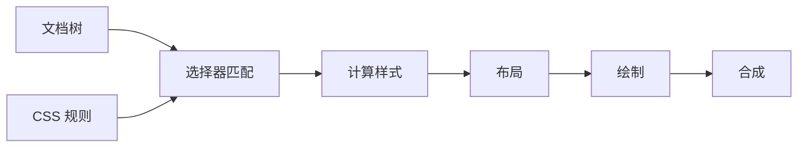
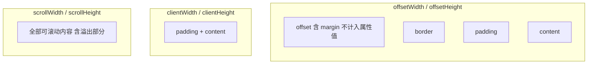
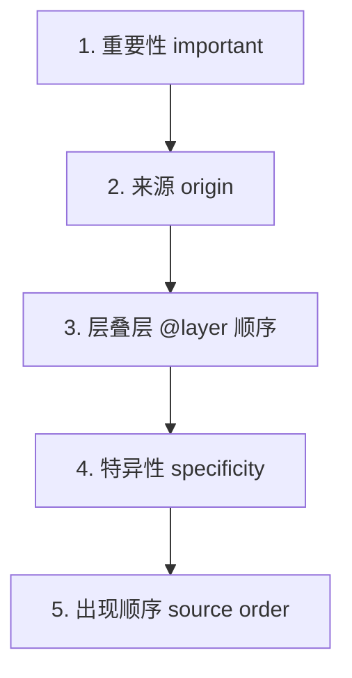
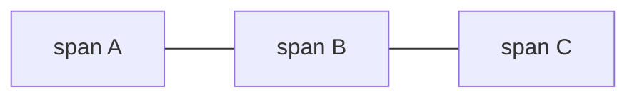
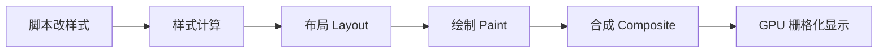
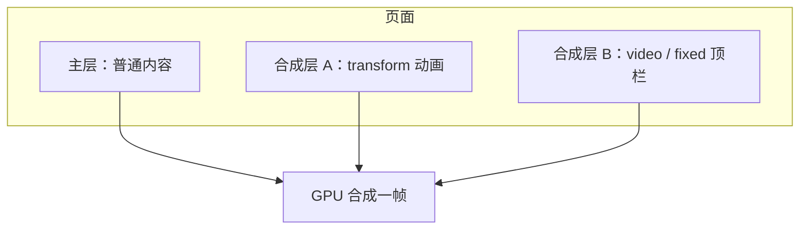

# 02 · CSS 体系

CSS 通过选择器匹配文档节点，参与布局、绘制与合成流水线。写样式前先想清楚：这条属性会触发 reflow、repaint，还是只走合成。

## CSS 如何作用到页面

浏览器为文档树中的节点**匹配选择器**，计算最终样式，再经布局、绘制、合成显示到屏幕。



| 修改属性 | 典型代价 |
|----------|----------|
| `width`、`height`、`margin`、`top` | 布局（重排） |
| `color`、`background`、`box-shadow` | 重绘 |
| `transform`、`opacity` | 合成层，适合动画 |

---

## 盒模型与 BFC

### 2.1 标准盒模型

每个元素是一个**矩形盒子**：content → padding → border → margin。

```css
*, *::before, *::after { box-sizing: border-box; }
```

| 模式 | `width` 含义 |
|------|--------------|
| `content-box`（默认） | 仅内容宽 |
| `border-box`（推荐） | 含 padding + border |

相邻块级元素**垂直 margin 会折叠**（取较大值，非相加）。父元素设 `padding`/`border`、`display: flow-root` 等可阻止折叠。

### 2.2 BFC（块级格式化上下文）

独立布局区域：内部浮动不影响外部；可**清除浮动**、阻止 margin 折叠。

| 触发方式 | 说明 |
|----------|------|
| `display: flow-root` | 推荐，副作用小 |
| `overflow: hidden/auto` | 常用但可能裁切 |
| `float` 非 none | 元素自身成为 BFC |
| `position: absolute/fixed` | |
| `display: flex/grid` | 子项各自 BFC |

```css
.clearfix { display: flow-root; }
```

### 2.3 元素尺寸：offset / client / scroll

布局调试与滚动容器开发时，常通过脚本读取元素的**几何尺寸**。这些属性把盒模型具象为数字，须分清各自包含的范围。



**示意图（宽度方向）：**

```
|-- margin --|-- border --|-- padding --|-- content --|-- padding --|-- border --|
             |<-------- offsetWidth --------------------------------->|
             |<-------- clientWidth ----------------->|
|<---------------------- scrollWidth（内容总宽，可大于 client）----------------->|
```

| 属性 | 宽/高包含范围 | 典型用途 |
|------|----------------|----------|
| **offsetWidth** / **offsetHeight** | content + padding + border + 纵向/横向滚动条占位 | 元素**占位大小**（布局占用） |
| **offsetLeft** / **offsetTop** | 相对 **offsetParent** 左上角偏移 | 定位、拖拽、埋点坐标 |
| **clientWidth** / **clientHeight** | content + padding（**不含** border、滚动条） | 可视内容区大小 |
| **clientLeft** / **clientTop** | 左侧/上侧 **border** 宽度 | 较少直接用 |
| **scrollWidth** / **scrollHeight** | 溢出内容的**完整**宽高（含不可见部分） | 判断是否溢出、滚动到底 |
| **scrollTop** / **scrollLeft** | 已滚动距离 | 无限滚动、回到顶部 |

```javascript
const el = document.querySelector('.scroll-box');

el.offsetWidth;    // 占位宽（含 border）
el.clientWidth;  // 可视内容区宽（含 padding，不含 border）
el.scrollWidth;  // 内容总宽；若 > clientWidth 则有横向溢出

el.scrollTop = 0;           // 滚到顶部
el.scrollTop = el.scrollHeight - el.clientHeight;  // 滚到底部
```

**对比记忆：**

| 对比 | 结论 |
|------|------|
| `offset` vs `client` | offset **多算 border**（及滚动条）；client 是「内侧」可视区 |
| `client` vs `scroll` | scroll 是**内容真实尺寸**；未溢出时 scroll ≈ client（块级元素常有细微差异） |
| `getBoundingClientRect()` | 相对**视口**的矩形，含 transform 影响；与 offset 参照系不同 |

**注意：**

- 读取这些属性可能触发**回流**（layout），高频循环中批量读取会卡顿；可先读后写，或集中读取缓存。
- `display: none` 的元素尺寸一般为 0。
- `box-sizing: border-box` 影响的是 CSS `width` 如何分配，**不改变** offset/client 各字段的定义。
- `offsetParent` 通常是最近的定位祖先或 `table/td/th`；`fixed` 元素 offsetParent 可能为 `null`（或视口相关，视浏览器而定）。

---

## 选择器、伪类与伪元素

### 3.1 基础选择器

| 选择器 | 示例 | 匹配 |
|--------|------|------|
| 类型 | `p` | 元素名 |
| 类 | `.btn` | class 含 btn |
| ID | `#app` | id（页内唯一） |
| 属性 | `[type="email"]` | 属性条件 |
| 通配 | `*` | 全部（reset 慎用） |
| 并集 | `h1, h2` | 多选一 |

**组合器**：后代 `A B`、子代 `A > B`、相邻兄弟 `A + B`、通用兄弟 `A ~ B`。

### 3.2 伪类（单冒号 `:`）

| 类别 | 示例 |
|------|------|
| 链接 | `:link`、`:visited` |
| 交互 | `:hover`、`:active`、`:focus`、`:focus-visible` |
| 结构 | `:first-child`、`:nth-child(2n)`、`:nth-of-type` |
| 表单 | `:checked`、`:disabled`、`:invalid`、`:placeholder-shown` |
| 逻辑 | `:not(.disabled)`、`:is(h1,h2)`、`:where(.reset *)` |

`:is()` 取参数中最高优先级；`:where()` 优先级为 0，适合 reset。

### 3.3 伪元素（双冒号 `::`）

| 伪元素 | 用途 |
|--------|------|
| `::before` / `::after` | 装饰、图标（须 `content`） |
| `::first-line` / `::first-letter` | 首行 / 首字 |
| `::placeholder` | 占位符 |
| `::selection` | 选中文本 |
| `::backdrop` | 对话框遮罩 |

```css
.required::after {
  content: ' *';
  color: #ef4444;
}
```

---

## 优先级与覆盖策略

样式冲突时，浏览器按**层叠**规则决定哪一条生效。理解这套规则，才能解释「为什么这条样式不生效」以及「如何安全地覆盖第三方样式」。

### 4.1 层叠的完整决策顺序

从高到低，依次比较；**某一档能分出胜负则不再往下看**：



| 顺序 | 因素 | 说明 |
|------|------|------|
| 1 | **重要性** | 带 `!important` 的声明优先于同类型下不带 `!important` 的 |
| 2 | **来源** | 一般优先级：作者样式 > 用户样式 > 浏览器默认样式；`!important` 时用户代理规则有特殊反转（了解即可） |
| 3 | **@layer** | 后声明的 layer 整体优先于先声明的 layer；未入 layer 的样式优先级最高 |
| 4 | **特异性** | 选择器越「精确」，优先级越高 |
| 5 | **出现顺序** | 特异性相同时，**后写的**覆盖先写的 |

### 4.2 特异性如何计算

特异性可记为四元组 `(inline, id, class/attr/pseudo-class, element/pseudo-element)`，**从左到右比较，大的胜出**。

| 选择器部分 | 权重 |
|------------|------|
| 内联 `style="..."` | 1000 |
| `#id` | 100 |
| `.class`、`[attr]`、`:hover` 等伪类 | 10 |
| 元素名、`::before` 等伪元素 | 1 |

```css
/* (0, 0, 1, 1) = 0,1,1 */
nav a { color: #333; }

/* (0, 0, 2, 0) = 0,2,0 — 胜出 */
.nav .active { color: #000; }

/* (0, 1, 1, 1) = 1,1,1 — 再胜出 */
#main .nav .active { color: #111; }
```

**注意：**

- 10 个元素选择器 `(0,0,0,10)` **仍小于** 1 个 class `(0,0,1,0)`。
- `:not(.foo)` **本身**特异性为 0，但括号内的 `.foo` **计入**。
- `:is(.a, #b)` 取参数中**最高**特异性（此处为 `#b` 的 100）。
- `:where(.a, #b)` 特异性恒为 **0**。
- 通配符 `*`、组合器 `>`、`+`、**不增加**特异性。

### 4.3 继承与 initial / inherit / unset

| 关键字 | 行为 |
|--------|------|
| `inherit` | 强制继承父元素计算值 |
| `initial` | 恢复属性规范定义的初始值 |
| `unset` | 若属性可继承则等同 inherit，否则等同 initial |
| `revert` | 回退到浏览器默认（或用户）样式 |

**可继承**（常见）：`color`、`font-family`、`font-size`、`line-height`、`visibility` 等。  
**不可继承**（常见）：`margin`、`padding`、`border`、`width`、`height`、`background` 等。

子元素未写 `color` 时会继承父级 `color`；未写 `margin` 则**不会**继承父级 margin。

### 4.4 !important 与覆盖困境

```css
.title { color: blue !important; }
.title { color: red; }           /* 无效，无 important */
.title { color: green !important; } /* 与 blue 比特异性与顺序 */
```

| 场景 | 建议 |
|------|------|
| 业务组件 | **避免** `!important` |
| 工具类 `.hidden { display: none !important; }` | 可接受，范围明确 |
| 覆盖第三方库 | 优先提高 layer 或略增特异性，最后才用 `!important` |
| 已被 `!important` 盖住 | 只能同属性也加 `!important` 且特异性更高或更晚，易陷入军备竞赛 |

### 4.5 @layer 显式分层

`@layer` 把样式分到命名层，**层与层之间**按声明顺序覆盖，层内仍比特异性。

```css
@layer reset, base, components, utilities;

@layer reset {
  * { margin: 0; padding: 0; }
}

@layer base {
  a { color: #2563eb; }
}

@layer components {
  .btn { padding: 8px 16px; }
}

@layer utilities {
  .text-center { text-align: center; }
}
```

后声明的 `utilities` 层整体高于 `components`，即使 `.btn` 特异性更高，`.text-center` 仍可能覆盖同属性（若在 utilities 层且针对同一元素）。

**未写入任何 layer 的样式**，优先级高于所有具名 layer，新建样式若不想被 layer 压住，要么入更高 layer，要么不写 layer。

### 4.6 工程覆盖策略

| 策略 | 做法 | 目的 |
|------|------|------|
| **扁平 class（BEM）** | `.card__title，large`，避免 `#header ul li a` | 特异性可预测 |
| **单一职责选择器** | 一个 class 对应一块样式 | 减少嵌套战争 |
| **分层架构** | reset → token → 组件 → 工具类 | 与 `@layer` 或文件顺序一致 |
| **禁止 ID 选择器写组件样式** | ID 特异性过高 | 后期难覆盖 |
| **第三方隔离** | 单独文件 + 明确 layer 或 wrapper class | 升级库时不波及全局 |
| **CSS 变量** | 改 `--color-primary` 而非到处改 hex | 主题切换不抬特异性 |

```css
/* 反模式：特异性过高 */
#app .sidebar .menu li a.active { color: red !important; }

/* 推荐 */
.menu-link.is-active { color: var(--color-primary); }
```

### 4.7 调试：样式为何不生效

在开发者工具 **Computed** 面板查看：

1. 规则是否**匹配**到元素（选择器写错）
2. 是否被**更高特异性**规则划掉
3. 是否被 **@layer** 或 `!important` 盖住
4. 是否被 **inline style** 覆盖
5. 属性是否**不可继承**却写在父级上

---

## 布局体系

布局要解决：元素**在文档中占多大、排在哪里、如何随屏幕变化**。现代页面以 **Flex + Grid** 为主，但**普通流、定位、浮动**仍是理解布局与排查问题的基础。

### 5.1 普通流（Normal Flow）

**普通流**是默认布局方式：块级元素自上而下占满一行，行内元素在行内从左到右排列。

**块级元素**，每个盒子独占一行，垂直堆叠：

```
┌──────────────────────────────┐
│           块 1              │  ← 占满包含块宽度
└──────────────────────────────┘
┌──────────────────────────────┐
│           块 2              │
└──────────────────────────────┘
┌──────────────────────────────┐
│           块 3              │
└──────────────────────────────┘
         ↓ 自上而下排列
```

**行内元素**，在同一行内水平排列，宽度由内容决定：



```
[ span A ] [ span B ] [ span C ]  →  同一行，从左到右
```

| display（部分） | 在流中的表现 |
|-----------------|--------------|
| `block` | 独占一行；可设 width/height/margin 四向 |
| `inline` | 与文字同行；width/height 对上下 margin 常无效 |
| `inline-block` | 同行排列，但可当「小块」设宽高 |
| `none` | 脱离文档流，不占位、不可见 |
| `contents` | 自身盒子「消失」，子元素参与父级布局（慎用 a11y） |

块级元素默认 **width: auto** 时填满包含块内容区；**margin: auto** 左右可水平居中（须有限定宽度）。

行内元素之间 HTML 换行可能产生 **约 4px 空隙**（字体基线间隙），可用 `font-size: 0` 在父级或 flex 布局消除。

### 5.2 相对定位 relative

```css
.box {
  position: relative;
  top: 10px;
  left: 20px;
}
```

| 要点 | 说明 |
|------|------|
| 参照物 | **元素原本在普通流中的位置** |
| 是否脱流 | **不脱流**；原位置仍占位，像「影子」留在那里 |
| 典型用途 | 微调位置；作为 **absolute 子元素的定位父**；配合 `z-index` |

`top` / `right` / `bottom` / `left` 表偏移量；同时设 top 与 bottom 且 height 为 auto 时，高度会被拉伸（绝对定位中更常用）。

### 5.3 绝对定位 absolute

```css
.parent { position: relative; }
.child {
  position: absolute;
  top: 0;
  right: 0;
}
```

| 要点 | 说明 |
|------|------|
| 参照物 | 最近 **position 不为 static** 的祖先；若无，则为初始包含块（常等同 viewport） |
| 是否脱流 | **脱流**；不占原位置，兄弟当它不存在 |
| 典型用途 | 角标、下拉层、关闭按钮、图片上的标签 |

**常见坑：** 父级未设 `relative`，绝对定位元素相对更外层或 viewport 飞走。  
**尺寸：** 设 `top + bottom + height: auto` 可垂直撑满定位包含块（left/right 同理）。

### 5.4 固定定位 fixed 与粘性定位 sticky

**fixed**：相对**视口**定位，滚动页面不随内容移动。全屏遮罩、固定顶栏常用。

**sticky**：在滚动未到阈值前表现像 **relative**，到达 `top`/`bottom` 等阈值后表现像 **fixed**，但**限制在最近 scroll 祖先内**。

```css
.header {
  position: sticky;
  top: 0;
  z-index: 10;
}
```

| sticky 失效常见原因 | |
|---------------------|---|
| 祖先 `overflow: hidden/auto/scroll` | 粘性参照变成该祖先而非 viewport |
| 未设 `top` / `bottom` | 无粘住阈值 |
| 父级高度与 sticky 元素同高 | 无滚动空间 |

### 5.5 堆叠上下文与 z-index

`z-index` 仅对 **positioned** 元素（非 static）或 flex/grid 子项等生效，且只在**同一堆叠上下文**内比较。

**会创建新堆叠上下文**（部分）：`position` + `z-index` 非 auto、`opacity < 1`、`transform` 非 none、`filter`、`will-change` 等。

```css
.modal-wrap { z-index: 1000; }  /* 若父级 transform 创建新上下文，盖不住外部 fixed 遮罩 */
```

排查「z-index 很大仍被挡」：向上查哪一层创建了堆叠上下文。

### 5.6 浮动 float 与清除

浮动最初用于**文字环绕图片**；元素向左/右浮动后**脱普通流**，直到遇到浮动边界或行框。

```css
.img-left {
  float: left;
  margin: 0 16px 8px 0;
}
```

| 行为 | 说明 |
|------|------|
| 脱流 | 不占文档流中原块级位置 |
| 行内环绕 | 后续行内内容、块级文字会环绕浮动盒 |
| 父级高度塌陷 | 若父级无 BFC，高度可能不包含浮动子元素 |

**清除浮动 clear：**

```css
.clear { clear: both; }  /* 元素顶部低于所有左/右浮动盒 */
```

**清除浮动（父级包住子浮动）现代写法：**

```css
.float-container {
  display: flow-root;  /* 触发 BFC，推荐 */
}
```

**legacy 写法：**

```css
.clearfix::after {
  content: '';
  display: table;
  clear: both;
}
```

页面级多列布局 today 用 **Flex/Grid** 替代 float；维护老项目、图文环绕仍须掌握 float。

### 5.7 Flex 弹性布局

Flex 是 **一维**布局：沿一条主轴（main axis）分配空间，交叉轴（cross axis）对齐。

```css
.toolbar {
  display: flex;
  flex-direction: row;        /* row | row-reverse | column | column-reverse */
  flex-wrap: wrap;            /*  nowrap | wrap */
  justify-content: space-between;  /* 主轴对齐 */
  align-items: center;        /* 交叉轴单行对齐 */
  align-content: space-between; /* 多行时交叉轴分布 */
  gap: 12px;
}
```

**容器属性速查：**

| 属性 | 作用 |
|------|------|
| `flex-direction` | 主轴方向 |
| `flex-wrap` | 是否换行 |
| `justify-content` | 主轴对齐：flex-start / center / space-between / space-around 等 |
| `align-items` | 单行交叉轴对齐 |
| `align-content` | 多行时交叉轴对齐 |
| `gap` / `row-gap` / `column-gap` | 行列间距 |

**子项属性：**

```css
.item {
  flex: 1 1 0;       /* grow shrink basis */
  flex-grow: 1;      /* 剩余空间分配比例 */
  flex-shrink: 0;    /* 0 = 不缩小，防挤压 */
  flex-basis: 200px; /* 初始主轴尺寸 */
  align-self: flex-end;
  order: 0;          /* 视觉顺序，慎改破坏读屏顺序 */
}
```

`flex: 1` 常等价于 `flex: 1 1 0%`（可伸缩、初始 0，平分剩余）。

**经典模式：**

```css
/* 水平垂直居中 */
.center {
  display: flex;
  justify-content: center;
  align-items: center;
  min-height: 100dvh;
}

/* 底栏固定 + 中间滚动 */
.page {
  display: flex;
  flex-direction: column;
  min-height: 100dvh;
}
.content { flex: 1; overflow: auto; }
.footer { flex-shrink: 0; }

/* 等分列 + 文本截断 */
.col { flex: 1 1 0; min-width: 0; }
.truncate { overflow: hidden; text-overflow: ellipsis; white-space: nowrap; }
```

**Flex 踩坑：** 子项默认 `min-width: auto`，长文本/宽图会把 flex 项撑破，截断场景设 `min-width: 0` 或 `overflow: hidden`。

### 5.8 Grid 网格布局

Grid 是 **二维**布局：同时定义行与列轨道，适合整页骨架、仪表盘、响应式卡片墙。

```css
.layout {
  display: grid;
  grid-template-columns: 240px 1fr;
  grid-template-rows: auto 1fr auto;
  grid-template-areas:
    "header header"
    "sidebar main"
    "footer footer";
  gap: 16px;
  min-height: 100dvh;
}

.header  { grid-area: header; }
.sidebar { grid-area: sidebar; }
.main    { grid-area: main; }
.footer  { grid-area: footer; }
```

**列/行定义：**

```css
/* 固定 + 弹性 + 最小最大 */
grid-template-columns: 200px 1fr minmax(300px, 30%);

/* 自动填充响应式卡片 */
grid-template-columns: repeat(auto-fill, minmax(280px, 1fr));
grid-template-columns: repeat(auto-fit, minmax(280px, 1fr));
/* auto-fill：尽可能多列；auto-fit：合并空列，现有列变宽 */
```

**子项定位：**

```css
.span-two {
  grid-column: 1 / span 2;   /* 从第 1 列起跨 2 列 */
  grid-row: 2 / 4;
}
/* 或 grid-area: 1 / 1 / 3 / 3;  row-start / col-start / row-end / col-end */
```

**对齐：**

| 属性 | 作用 |
|------|------|
| `justify-items` / `align-items` | 单元格内对齐 |
| `justify-content` / `align-content` | 整网格在容器内对齐（轨道总尺寸小于容器时） |
| `place-items: center` | align + justify 简写 |

| 选型 | 场景 |
|------|------|
| Flex | 导航栏、工具条、一行按钮、垂直居中 |
| Grid | 页面分区、卡片矩阵、同时控行与列 |
| 普通流 + margin | 简单文档、文章流 |
| absolute | 角标、浮层、精确覆盖 |

---

## 居中方案

| 场景 | 写法 | 说明 |
|------|------|------|
| 定宽块水平居中 | `width: 960px; margin-inline: auto;` | 普通流即可 |
| 单行文本水平 | `text-align: center;` | 行内内容 |
| Flex 水平垂直 | `display:flex; justify-content:center; align-items:center;` | 最常用 |
| Grid 居中 | `display:grid; place-items:center;` | 单行单列亦简洁 |
| 绝对定位居中 | 见下 | 已知宽高时 |
| 绝对 + transform | 未知宽高 | 不撑开父级 |

```css
/* 绝对定位 + margin auto（须定宽高） */
.center-abs {
  position: absolute;
  inset: 0;
  width: 200px;
  height: 100px;
  margin: auto;
}

/* 绝对 + transform（宽高未知） */
.center-trans {
  position: absolute;
  top: 50%;
  left: 50%;
  transform: translate(-50%, -50%);
}
```

单行文字垂直居中（仅单行）：`height` 与 `line-height` 相等。多行请用 Flex/Grid。

---

## 过渡、动画与 transform

### 7.1 transition 过渡

在**属性值变化**时插值，适合 hover、focus、class 切换。

```css
.btn {
  transition-property: background-color, transform;
  transition-duration: 0.2s;
  transition-timing-function: ease;
  transition-delay: 0s;
  /* 简写 */
  transition: background-color 0.2s ease, transform 0.15s ease;
}
```

| timing-function | 效果 |
|-----------------|------|
| `ease` | 慢-快-慢 |
| `linear` | 匀速 |
| `ease-in-out` | 对称加减速 |
| `cubic-bezier(0.4, 0, 0.2, 1)` | 自定义曲线 |

`transition: all` 慎用，任意属性变化都过渡，可能误动画 layout 属性。

### 7.2 @keyframes 与 animation

```css
@keyframes fade-in-up {
  0% {
    opacity: 0;
    transform: translateY(16px);
  }
  100% {
    opacity: 1;
    transform: translateY(0);
  }
}

.modal {
  animation-name: fade-in-up;
  animation-duration: 0.35s;
  animation-timing-function: ease-out;
  animation-fill-mode: forwards;   /* 保持最后一帧 */
  animation-iteration-count: 1;    /* infinite 可循环 */
  animation-direction: normal;     /* alternate 往复 */
  animation-delay: 0s;
  animation-play-state: running;   /* paused 暂停 */
}
```

### 7.3 transform 二维与三维

| 函数 | 作用 |
|------|------|
| `translate(x, y)` / `translateX` | 位移，不占 layout 空间 |
| `scale(x, y)` | 缩放 |
| `rotate(angle)` | 旋转 |
| `skew(x, y)` | 倾斜 |
| `matrix(...)` | 合并变换 |

```css
.card:hover {
  transform: translateY(-4px) scale(1.02);
}
.gpu-hint {
  transform: translateZ(0);  /* 有时促合成层，勿滥用 */
}
```

动画与过渡优先 **transform + opacity**，避免逐帧改 `width`/`left`/`margin` 触发布局。

### 7.4 无障碍：减少动效

```css
@media (prefers-reduced-motion: reduce) {
  *, *::before, *::after {
    animation-duration: 0.01ms !important;
    animation-iteration-count: 1 !important;
    transition-duration: 0.01ms !important;
  }
}
```

### 7.5 浏览器 GPU 加速与合成层

第一节提到：改 `transform`、`opacity` 常只走**合成（Composite）**，由 GPU 参与，适合动画。理解「层」与「合成」，才能正确做性能优化，而不是到处加 `translateZ(0)`。

#### 渲染流水线与 GPU 介入点



| 阶段 | 触发条件示例 | 代价 |
|------|----------------|------|
| Layout | width、height、margin、left、top、flex 重算 | 高 |
| Paint | color、background、box-shadow、文字 | 中 |
| Composite | transform、opacity、已提升的层 | 相对较低 |

**GPU 加速**在此指：部分图层由合成线程交给 **GPU** 做位图合成与变换，减轻主线程绘制压力；**并非**所有 CSS 属性都自动走 GPU。

#### 什么是合成层（Compositor Layer）

浏览器可将某些元素**提升**为独立合成层，单独纹理上传 GPU，变换时**只合成、不重绘**整页。



**常见触发提升的因素**（因浏览器而异，以 DevTools 为准）：

| 因素 | 说明 |
|------|------|
| `transform` 非 none（尤其 3D） | `translateZ(0)`、`translate3d(0,0,0)` |
| `opacity` 动画 | 与 transform 同时出现时更常见 |
| `will-change: transform` / `opacity` | 提前告知浏览器，**动画结束后应移除** |
| `filter`、`backdrop-filter` | 可能单独成层 |
| `<video>`、`<canvas>`、WebGL | 常独立层 |
| `position: fixed` / `sticky` | 部分场景提升 |
| 层子元素 3D 变换 | `transform-style: preserve-3d` |

#### 常用写法与含义

```css
/* 提示浏览器该元素将发生 transform 变化 */
.animated-card {
  will-change: transform;
  transition: transform 0.3s ease;
}
.animated-card:hover {
  transform: translateY(-4px);
}
/* 动画结束后移除 will-change，避免长期占内存 */

/* 传统「开启硬件加速」写法：强制 3D 变换上下文 */
.gpu-layer {
  transform: translateZ(0);
  /* 或 transform: translate3d(0, 0, 0); */
}
```

| 写法 | 作用 | 注意 |
|------|------|------|
| `transform: translateZ(0)` | 创建 3D 渲染上下文，可能提升为合成层 | 滥用增加内存；无动画元素不必加 |
| `will-change: transform` | 提前分配资源，减少首帧卡顿 | 用完删掉；不要对大量元素长期设置 |
| `backface-visibility: hidden` | 3D 翻转时隐藏背面，有时配合翻转卡片 | |
| `-webkit-font-smoothing` | 抗锯齿，**不是** GPU 加速 | 勿与合成层混为一谈 |

#### 动画性能建议

| 推荐 | 避免 |
|------|------|
| 只动画 `transform`、`opacity` | 动画 `width`、`height`、`top`、`left`、`margin` |
| 需要时用 `will-change`，结束移除 | 全站 `.page * { will-change: transform }` |
| `requestAnimationFrame` 驱动 JS 动画 | `setInterval` 改布局属性 |
| 列表长用虚拟滚动 | 上千节点同时提升合成层 |

#### 过多合成层的代价

每个合成层对应 GPU 纹理，**层越多占显存越多**，合成本身也有开销。DevTools **Layers** 面板可查看哪些元素被提升、原因是什么。

| 现象 | 可能原因 |
|------|----------|
| 动画仍卡顿 | 主线程 Long Task；或每帧仍触发布局/重绘 |
| 内存涨 | 过多 `will-change` / `translateZ(0)` |
| 文字发虚 | 3D 变换子像素渲染与缩放 |

#### `contain` 与渲染隔离

```css
.card {
  contain: layout style paint;
}
```

限制元素内部布局/绘制影响外部，利于浏览器优化；与合成层不同，但同属**缩小重排重绘范围**的手段。

#### 与第一节的对应关系

改 `transform`、`opacity` → 多数情况**跳过 Layout**，在 Composite 阶段由 GPU 合成 → 适合高频动画。改 `width`、`color` → 仍可能 Layout 或 Paint → 不适合 60fps 连续动画。

---

## 0.5px 细线

在 `devicePixelRatio ≥ 2` 的屏上，CSS 的 `1px` 边框可能对应多个物理像素，看起来偏粗。

| 方案 | 说明 |
|------|------|
| `border: 0.5px solid` | 写法简单；部分 Android 不支持或表现不一 |
| 伪元素 + `scaleY(0.5)` | 兼容好，列表分割线常用 |
| `box-shadow: 0 0.5px 0 #eee` | 模拟下边框 |
| `linear-gradient` 1px 高 | 渐变画线 |

```css
.hairline-bottom {
  position: relative;
}
.hairline-bottom::after {
  content: '';
  position: absolute;
  left: 0;
  right: 0;
  bottom: 0;
  height: 1px;
  background: #e5e7eb;
  transform: scaleY(0.5);
  transform-origin: 0 100%;
}
```

---

## 媒体查询与响应式

### 9.1 视口宽度断点

**移动优先**：默认小屏样式，再用 `min-width` 增强。

```css
.container { padding: 16px; }

@media (min-width: 576px) { .container { padding: 24px; } }
@media (min-width: 768px) { .sidebar { display: block; } }
@media (min-width: 1024px) { .container { max-width: 1200px; margin-inline: auto; } }
```

| 参考断点 | 典型场景 |
|----------|----------|
| < 576px | 手机竖屏 |
| 576–768px | 大手机 / 小平板 |
| 768–1024px | 平板 |
| ≥ 1024px | 桌面 |

断点应来自**设计与内容**，非死记设备型号。

### 9.2 其它媒体特性

```css
@media (prefers-color-scheme: dark) {
  :root { --bg: #111; --text: #eee; }
}

@media (prefers-reduced-motion: reduce) { /* 见 7.4 */ }

@media (hover: hover) and (pointer: fine) {
  .card:hover { box-shadow: 0 4px 12px rgba(0,0,0,.1); }
}

@media print {
  .no-print { display: none; }
}
```

### 9.3 容器查询

按**组件容器**宽度适配，而非全屏断点：

```css
.card-wrapper {
  container-type: inline-size;
  container-name: card;
}

@container card (min-width: 400px) {
  .card-inner {
    display: flex;
    flex-direction: row;
  }
}
```

### 9.4 常用长度单位

| 单位 | 说明 |
|------|------|
| `px` | 像素 |
| `rem` | 相对根元素 `font-size` |
| `em` | 相对当前元素字号 |
| `%` | 相对父元素 |
| `vw` / `vh` | 视口宽高；移动端地址栏问题可用 `dvh` |
| `clamp(min, pref, max)` | 流体尺寸 |

```css
h1 { font-size: clamp(1.5rem, 1rem + 2vw, 2.5rem); }
.hero { min-height: 100dvh; }
```

---

## 浏览器前缀与兼容

### 10.1 厂商前缀

早年标准未定时使用 `-webkit-`、`-moz-` 等前缀试验实现。

```css
.sticky-old {
  position: -webkit-sticky;
  position: sticky;
}
.box {
  -webkit-transform: translateZ(0);
  transform: translateZ(0);
}
```

**标准属性写在最后**，覆盖前缀版本。现代项目用 **Autoprefixer** 按 browserslist 自动补全。

### 10.2 @supports 特性检测

```css
@supports (display: grid) {
  .layout { display: grid; }
}

@supports not (gap: 1rem) {
  .flex-gap > * + * { margin-left: 1rem; }
}
```

### 10.3 常见兼容现象

| 现象 | 处理 |
|------|------|
| iOS `100vh` 含地址栏 | `100dvh` 或 JS 设置 `--vh` 变量 |
| 滚动链到 body | `overscroll-behavior: contain` |
| 表单默认外观不一 | `-webkit-appearance: none; appearance: none;` 后自定义 |
| 字体过细 | `-webkit-font-smoothing: antialiased`（按需） |

---

## CSS3 与后续演进要点

**CSS3** 并非单一规范，而是 CSS2.1 之后一批**模块化**能力的统称。下列为前端日常高频内容。

### 11.1 选择器与逻辑（CSS3+）

| 能力 | 示例 |
|------|------|
| 属性选择器增强 | `[href^="https"]`、`[class*="btn"]` |
| 结构伪类 | `:nth-child()`、`:empty`、`:not()` |
| 逻辑组合 | `:is()`、`:where()`、`:has()` |
| 否定 | `:not(.disabled)` |

`:has()` 示例，**父选择子状态**：

```css
.form:has(input:invalid) .submit-btn {
  opacity: 0.5;
  pointer-events: none;
}
```

### 11.2 颜色与透明度

| 能力 | 示例 |
|------|------|
| `rgba()` / `hsla()` | 带 alpha |
| 渐变 | `linear-gradient`、`radial-gradient`、`conic-gradient` |
| `opacity` | 整元素透明 |
| `currentColor` | 继承当前文字色 |

```css
.badge {
  background: linear-gradient(135deg, #667eea, #764ba2);
  color: white;
}
.overlay {
  background: rgba(0, 0, 0, 0.45);
}
```

### 11.3 圆角、阴影与滤镜

```css
.card {
  border-radius: 12px;
  box-shadow: 0 4px 24px rgba(0, 0, 0, 0.08);
}
.avatar {
  filter: grayscale(100%);
  backdrop-filter: blur(8px);  /* 毛玻璃，背后内容模糊 */
}
```

| 属性 | 说明 |
|------|------|
| `border-radius` | 圆角；50% 可圆形 |
| `box-shadow` | 外阴影；多组叠加 |
| `text-shadow` | 文字阴影 |
| `filter` | 滤镜：模糊、对比度等 |
| `backdrop-filter` | 背景模糊（须半透明背景） |

### 11.4 过渡与动画（CSS3 动画模块）

见**第七节**；CSS3 起 `@keyframes`、`animation-*` 与 `transition` 成为标准，替代大量 JS 定时器动画。

### 11.5 变换 transform（2D/3D）

```css
.flip-card {
  perspective: 1000px;
}
.flip-inner {
  transform-style: preserve-3d;
  transition: transform 0.6s;
}
.flip-card:hover .flip-inner {
  transform: rotateY(180deg);
}
```

### 11.6 多列与弹性盒、网格

| 模块 | 说明 |
|------|------|
| **Multi-column** | `column-count`、`column-gap` 报纸分栏 |
| **Flexbox** | 一维弹性布局（第五节） |
| **Grid** | 二维网格（第五节） |

```css
.article-columns {
  column-count: 2;
  column-gap: 2rem;
}
```

### 11.7 自定义属性（变量）

```css
:root {
  --color-primary: #2563eb;
  --space-4: 1rem;
  --radius-md: 8px;
}

.btn-primary {
  background: var(--color-primary);
  padding: var(--space-4);
  border-radius: var(--radius-md);
}
```

变量可在运行时由脚本修改，实现主题切换；与预处理器变量不同，**在浏览器中生效**。

### 11.8 逻辑属性与书写模式

适配 RTL 与国际化：

```css
.card {
  margin-inline: auto;
  padding-block: 1rem;
  padding-inline: 1.5rem;
  border-inline-start: 3px solid var(--color-primary);
}
```

### 11.9 现代颜色：oklch、color-mix

```css
:root {
  --brand: oklch(55% 0.2 250);
  --brand-light: color-mix(in srgb, var(--brand) 70%, white);
}
```

感知均匀，比纯 hex 调亮色更自然。

### 11.10 原生嵌套（CSS Nesting）

```css
.card {
  padding: 1rem;
  & .title { font-weight: 600; }
  &:hover { box-shadow: 0 2px 8px rgba(0,0,0,.08); }
}
```

类似 Sass 嵌套，减少重复写 `.card .title`。

---

## 样式组织与工程化方案

| 方案 | 特点 |
|------|------|
| **BEM** | `.block__element，modifier`，扁平、可预测 |
| **CSS Modules** | 构建时类名哈希，局部作用域 |
| **Tailwind** | 原子类 + 设计 token 配置 |
| **CSS-in-JS** | 与组件同文件，动态主题；视库有运行时成本 |
| **设计 token** | `--color-*`、`--space-*` 集中管理 |

原则：**单一主方案**、**控制特异性**、**组件与工具类分层**，避免全局 ID 与 `!important` 混战。

---

## 小结

CSS 体系里要先弄清：改哪条属性会付出什么渲染代价：布局属性触发 reflow，绘制属性触发 repaint，transform/opacity 多数情况只走合成。

全局 border-box；Flex 管一维、Grid 管二维；层叠顺序为 important → 来源 → @layer → 特异性 → 出现顺序；动画优先 transform + opacity；移动优先 + dvh 处理移动端视口。

**易混点**：offset 含 border，client 不含；sticky 受祖先 overflow 影响；z-index 只在同一堆叠上下文比较；`flex: 1` 与 `min-width: auto` 导致文本撑破；will-change 用完须移除。

核对：DevTools Computed 里被划掉的规则原因是否说得清？居中方案是否选对了场景？第三方样式覆盖是否靠 layer 而非 !important 军备竞赛？
