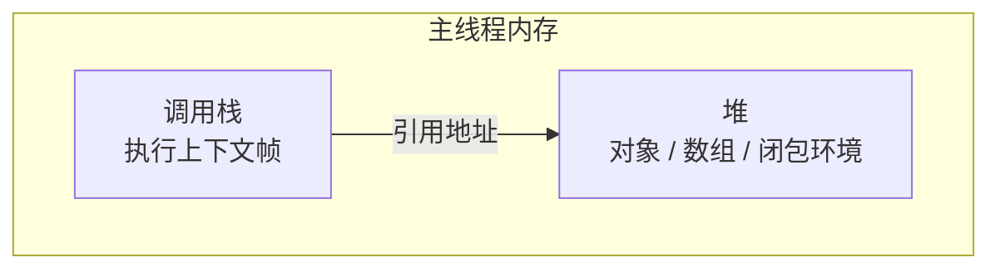
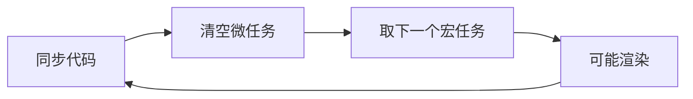
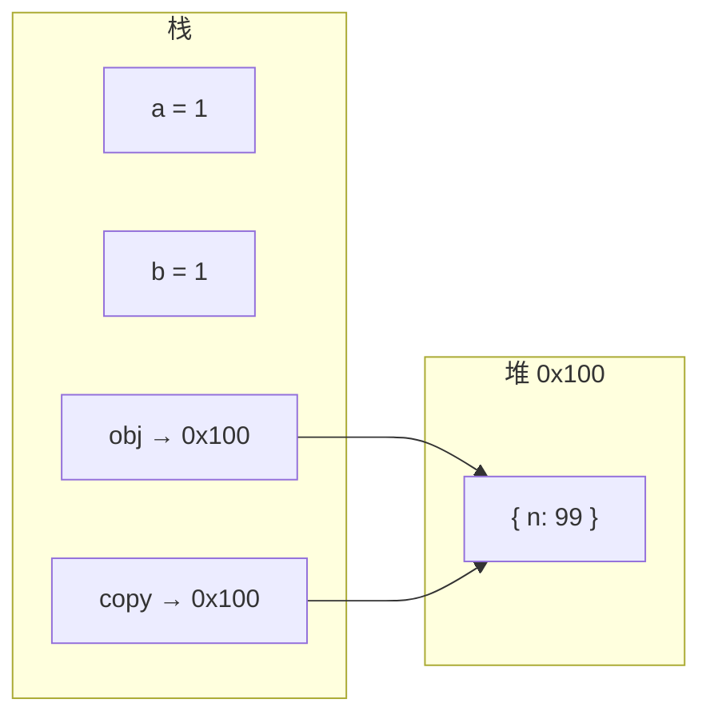
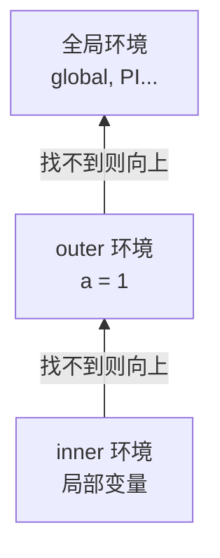
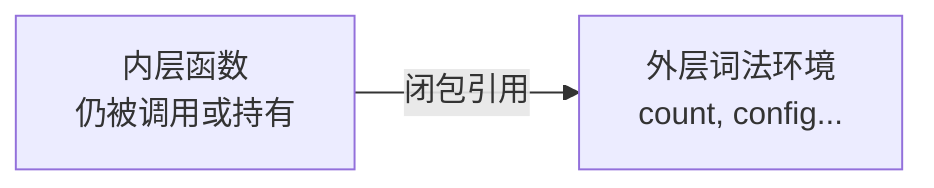
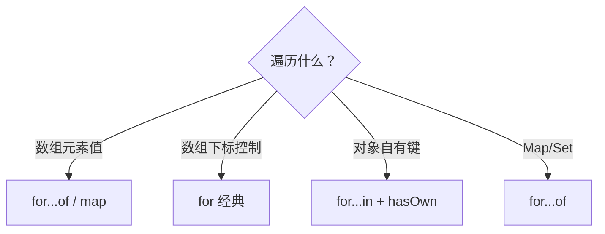
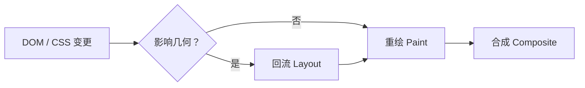
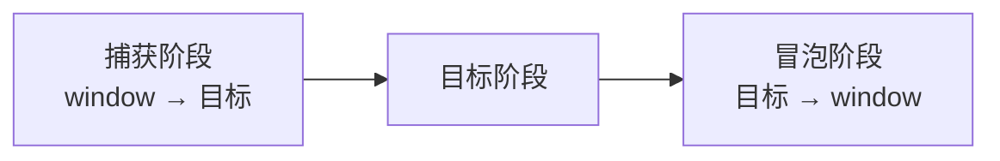
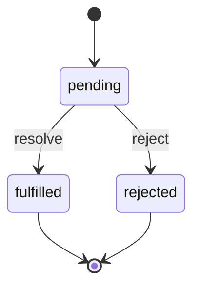

# 03 · JavaScript 体系

JavaScript 在浏览器主线程执行，单线程 + 事件循环模型贯穿类型、异步、DOM 与性能排查。本篇按运行时 → 语言核心 → 浏览器 API → 异步顺序展开。

## 运行时：堆、栈与队列

JavaScript 在浏览器**主线程**执行：同一时刻只有一个**调用栈**在跑同步代码。栈上执行、堆上存对象、任务进队列，这三件事串起来，异步与性能问题才看得懂。

### 1.1 内存模型：栈与堆



| 结构 | 存什么 | 特点 |
|------|--------|------|
| **栈** | 原始值（number、boolean 等）、函数调用帧、局部变量引用 | 后进先出；函数返回即弹栈 |
| **堆** | 对象、数组、函数、闭包捕获的外层环境 | 由垃圾回收管理；多个变量可指向同一对象 |

```javascript
let a = 1;           // 原始值在栈上
const obj = { n: 2 }; // obj 存堆地址；{ n: 2 } 在堆上
const copy = obj;     // copy 与 obj 指向同一堆对象
copy.n = 99;
console.log(obj.n);   // 99 — 引用共享
```

### 1.2 执行上下文与调用栈

每次函数调用会压入一帧**执行上下文**，包含：变量环境、词法环境、`this` 绑定等。调用结束则出栈。

```
调用栈（自下而上）：

┌─────────────────┐
│  inner()        │  ← 栈顶，正在执行
├─────────────────┤
│  outer()        │
├─────────────────┤
│  全局脚本        │
└─────────────────┘
```

同步代码**深度递归**或无限调用会导致 **栈溢出**（`Maximum call stack size exceeded`）。异步回调不占用调用栈等待 I/O，而是把后续逻辑交给任务队列。

### 1.3 任务队列：宏任务与微任务

浏览器除调用栈外，还有**宏任务队列**与**微任务队列**。当前宏任务中的同步代码跑完后，会先**清空微任务**，再取下一个宏任务。

| 队列 | 典型来源 |
|------|----------|
| **宏任务** | 整段 `<script>`、`setTimeout`/`setInterval`、I/O、UI 事件、`requestAnimationFrame`（渲染相关） |
| **微任务** | `Promise.then` / `catch` / `finally`、`queueMicrotask`、`MutationObserver` |



**Web Worker** 在**独立线程**跑 JS，无 DOM，与主线程 `postMessage` 通信。主线程仍负责布局、绘制与用户交互。

---

## 数据类型

JavaScript 是**动态类型**语言：变量不绑定类型，运行时的**值**才有类型。类型判断与转换写错，是业务 bug 的高发区。

### 2.1 七种原始类型 + object

| 类型 | 示例 | `typeof` | 说明 |
|------|------|----------|------|
| `undefined` | 未赋值、无返回值 | `'undefined'` | 声明未赋值为 undefined |
| `null` | 空值占位 | `'object'` | 历史遗留；用 `x === null` 判断 |
| `boolean` | `true` / `false` | `'boolean'` | |
| `number` | `42`、`NaN`、`Infinity` | `'number'` | IEEE 754 双精度浮点 |
| `bigint` | `100n` | `'bigint'` | 任意大整数；不能与 number 混算 |
| `string` | `'hi'`、`"hi"`、`` `hi` `` | `'string'` | UTF-16 码元序列 |
| `symbol` | `Symbol('id')` | `'symbol'` | 唯一标识，常用于对象私有键 |
| **object** | `{}`、`[]`、函数、Date | `'object'` / `'function'` | 引用类型；函数 typeof 为 function |

**`typeof` 的局限：** `typeof null === 'object'`；数组也是 `'object'`，应用 `Array.isArray(arr)`。

```javascript
const id = Symbol('id');
const user = { [id]: 1, name: 'Li' };
// Symbol 键在 JSON.stringify、for...in 中默认不可见
```

### 2.2 假值与真值

在布尔上下文中，值会被转为 true/false。**假值仅 8 个**：

`false`、`0`、`-0`、`0n`、`''`、`null`、`undefined`、`NaN`

其余皆为**真值**，包括 `[]`、`{}`、`'0'`、`'false'`。

```javascript
if (items.length) { /* 有元素 */ }

// 默认值：分清 || 与 ??
port ?? 3000;   // 仅 null / undefined 时用 3000
port || 3000;   // 0、'' 也会被替换 — 常见 bug

count ?? 0;     // 推荐：保留合法的 0
enabled || true; // enabled 为 false 时仍变 true — 慎用
```

| 表达式 | 结果 | 原因 |
|--------|------|------|
| `Boolean([])` | true | 空数组是对象 |
| `Boolean('0')` | true | 非空字符串 |
| `0 \|\| '默认'` | `'默认'` | 0 是假值 |
| `0 ?? '默认'` | `0` | 0 不是 null/undefined |

### 2.3 类型转换

| 方式 | 说明 |
|------|------|
| `Number(x)` / `parseInt` / `parseFloat` | 显式转数字；`parseInt('08', 10)` 须写进制 |
| `String(x)` / `` `${x}` `` | 显式转字符串 |
| `Boolean(x)` | 显式转布尔 |
| `==` | 抽象相等，两侧类型不同会先转换 — **避免** |
| `===` / `!==` | 严格相等，无隐式转换 — **默认使用** |
| `Object.is(a, b)` | 同 `===`，但 `NaN === NaN`，`+0 !== -0` |

**常见隐式转换陷阱：**

```javascript
[] + [];        // ''（数组转字符串再拼接）
[] + {};        // '[object Object]'
{} + [];        // 0 或 '[object Object]'（视是否当语句块）
'5' - 3;        // 2
'5' + 3;        // '53'
null == undefined;  // true
null === undefined; // false
```

### 2.4 number 与精度

所有 number 均为**双精度浮点**，部分十进制小数无法精确表示：

```javascript
0.1 + 0.2;              // 0.30000000000000004
Number.EPSILON;         // 最小可区分差
Math.abs(0.1 + 0.2 - 0.3) < Number.EPSILON; // 近似相等判断

(0.1).toFixed(2);       // '0.10' — 金额展示常用
// 金额计算：整数分存储，或 decimal 库
```

`NaN` 不等于任何值包括自身；用 `Number.isNaN(x)` 判断（区别于全局 `isNaN` 会先转换）。

### 2.5 原始类型与引用类型

JavaScript 在存储与传递上分为两大类：**原始类型**（值类型）与**引用类型**（对象类型）。

| 对比 | 原始类型 | 引用类型 |
|------|----------|----------|
| 包含 | `undefined`、`null`、`boolean`、`number`、`bigint`、`string`、`symbol` | `object`：普通对象、数组、函数、Date、RegExp 等 |
| 存储 | 值通常直接在栈上（引擎实现可优化） | 变量存**堆地址**，栈上是指针 |
| 赋值 | **拷贝值**，互不影响 | **拷贝引用**，指向同一对象 |
| `===` | 比较值 | 比较**引用地址**（同一对象才 true） |
| 可变性 | 不可变（immutable） | 可变（mutable） |

```javascript
// 原始类型：改 b 不影响 a
let a = 1;
let b = a;
b = 2;
console.log(a); // 1

// 引用类型：改 copy 会影响原对象
const obj = { n: 1 };
const copy = obj;
copy.n = 99;
console.log(obj.n); // 99
```



**函数参数传递：** 均为「传值」，原始类型传值的拷贝，引用类型传**引用的拷贝**（仍指向同一对象）。

```javascript
function change(primitive, ref) {
  primitive = 100;
  ref.n = 100;
}
let x = 1;
const o = { n: 1 };
change(x, o);
console.log(x);   // 1 — 形参 reassign 不影响实参
console.log(o.n); // 100 — 通过引用改了堆上对象
```

**`const` 与引用：** `const` 保证**绑定不能重新赋值**，不保证对象内容不变。

```javascript
const user = { name: 'Li' };
user.name = 'Wang';  // 可以
// user = {};        // TypeError
```

**比较两个对象「内容相同」** 不能直接用 `===`，需深比较或序列化（注意键序与 undefined 等限制）：

```javascript
JSON.stringify({ a: 1 }) === JSON.stringify({ a: 1 }); // true（简单场景）
```

---

## 控制流：条件语句与循环

程序通过**条件分支**决定走哪条路，通过**循环**重复执行。与类型、作用域结合紧密，写错条件或循环边界是逻辑 bug 的常见来源。

### 3.1 条件语句

#### if / else if / else

```javascript
const score = 85;

if (score >= 90) {
  grade = 'A';
} else if (score >= 60) {
  grade = 'B';
} else {
  grade = 'C';
}
```

条件表达式会先转为布尔值。尽量写**明确条件**，避免隐式转换踩坑：

```javascript
if (list.length) { /* 有元素 */ }
if (value != null) { /* 非 null 且非 undefined */ }
```

#### switch

适合**同一表达式的多分支**匹配；须记得 `break`，否则**贯穿**到下一个 case。

```javascript
switch (status) {
  case 'pending':
    showPending();
    break;
  case 'done':
    showDone();
    break;
  default:
    showUnknown();
}
```

| 注意 | 说明 |
|------|------|
| 严格相等 | `case` 用 `===` 比较 |
| fall-through | 故意贯穿时加注释说明 |
| 大范围 | 分支过多时改 `if/else` 或查表对象 |

```javascript
const handlers = {
  pending: showPending,
  done: showDone,
};
handlers[status]?.();
```

#### 三元运算符 `? :`

```javascript
const label = count > 0 ? `${count} 条` : '暂无';
```

适合简单二选一；嵌套多层会降低可读性，复杂逻辑用 `if`。

#### 逻辑短路 `&&` / `||`

```javascript
user && user.login();           // user 为假则不执行右侧
const name = input || '匿名';    // 左侧假值用右侧（注意 0、''）
const port = config.port ?? 3000; // 仅 null/undefined 用默认
```

| 运算符 | 左侧为假时 | 常见用途 |
|--------|------------|----------|
| `&&` | 返回左侧，不执行右侧 | 条件执行、JSX 渲染 |
| `\|\|` | 返回右侧 | 默认值（慎用） |
| `??` | 仅 null/undefined 取右侧 | 默认值（推荐） |

### 3.2 循环语句

| 语句 | 典型场景 |
|------|----------|
| `for` | 已知次数、需要索引 |
| `while` / `do...while` | 条件驱动；`do...while` 至少执行 1 次 |
| `for...in` | 对象可枚举键 |
| `for...of` | 数组、Map、Set 等可迭代值 |
| `break` / `continue` | 跳出循环 / 跳过本轮 |

```javascript
// while：条件满足才继续
let n = 3;
while (n > 0) {
  console.log(n--);
}

// do...while：至少跑一次
let input;
do {
  input = readLine();
} while (!input);

// for 经典
for (let i = 0; i < arr.length; i++) {
  if (arr[i] === target) break;
  if (arr[i] < 0) continue;
  process(arr[i]);
}
```

### 3.3 try / catch / finally 与 throw

**同步代码**中的异常用 `try/catch/finally` 捕获；**异步** Promise 用 `.catch` 或 `async/await` + `try/catch`。

```javascript
try {
  const data = JSON.parse(raw);
  process(data);
} catch (err) {
  console.error('解析失败', err.message);
  showToast('数据格式错误');
} finally {
  hideLoading(); // 无论成败都执行
}
```

| 语法 | 作用 |
|------|------|
| `try { }` | 包裹可能抛错的代码 |
| `catch (err) { }` | 捕获异常，`err` 常为 `Error` 实例 |
| `finally { }` | 清理资源：关 loading、释放锁 |
| `throw new Error('msg')` | 主动抛出，中断当前执行流 |

```javascript
function divide(a, b) {
  if (b === 0) throw new Error('除数不能为 0');
  return a / b;
}

try {
  divide(1, 0);
} catch (e) {
  console.log(e instanceof Error); // true
  console.log(e.message);
}
```

**注意：**

- `try/catch` **捕不到**异步回调里未 `await` 的异常，须在 Promise 链或 `async` 函数内处理。
- 不要吞掉错误：空 `catch` 会让排查变难；至少打日志或上报。
- `finally` 里若 `return`，可能覆盖 `try/catch` 的返回值（少用）。

```javascript
async function load() {
  try {
    const res = await fetch('/api');
    if (!res.ok) throw new Error(res.status);
    return await res.json();
  } catch (e) {
    reportError(e);
    throw e;
  }
}
```

---

## 对象操作

普通对象是键值对的集合，是 JS 业务代码的默认数据结构。本节覆盖**创建、读写删、遍历、合并**与常见静态 API。

### 4.1 创建与访问

```javascript
// 字面量（最常用）
const user = { name: 'Li', age: 18 };

// 构造器 + new
const d = new Date();

// 指定原型
const dict = Object.create(null); // 无 Object.prototype 污染

// 读 / 写
user.name;           // 点语法 — 键为合法标识符
user['age'];         // 括号 — 动态键、含特殊字符
user.city = 'BJ';    // 新增属性

// 可选链（ES2020）
const city = user?.address?.city ?? '未知';
```

| 写法 | 适用 |
|------|------|
| `obj.key` | 键名固定且合法 |
| `obj[keyVar]` | 键名运行时决定 |
| `obj?.a?.b` | 中间可能为 `null`/`undefined` |
| `obj?.[expr]` | 可选链 + 动态键 |

### 4.2 删除、判断与合并

```javascript
delete user.temp;              // 删自有属性
'age' in user;                 // 含原型链
Object.hasOwn(user, 'age');    // 仅自有（推荐）

Object.assign(target, src);    // 浅合并到 target
const merged = { ...defaults, ...overrides };
```

| API | 作用 |
|-----|------|
| `delete obj.k` | 删除自有属性（`configurable: true` 时） |
| `in` / `hasOwn` | 键是否存在 |
| `Object.assign` / spread | 浅合并，嵌套对象仍共享引用 |
| `Object.freeze` | 冻结对象，不能增删改（浅） |

### 4.3 遍历对象

```javascript
const obj = { a: 1, b: 2, [Symbol('id')]: 99 };

Object.keys(obj);                    // ['a', 'b']
Object.values(obj);                  // [1, 2]
Object.entries(obj);                 // [['a', 1], ['b', 2]]

for (const [k, v] of Object.entries(obj)) {
  console.log(k, v);
}

// for...in：含继承可枚举键，须过滤原型
for (const key in obj) {
  if (Object.hasOwn(obj, key)) console.log(key, obj[key]);
}
```

| 方式 | 遍历内容 | 数组能用吗 |
|------|----------|------------|
| `Object.keys/values/entries` | 自有、可枚举字符串键 | 可以，但键是字符串索引 |
| `for...in` | 可枚举键（含原型） | **不推荐** |
| `for...of` | 可迭代**值** | **推荐** |

### 4.4 解构、展开与 JSON

```javascript
const { name, age, ...rest } = user;
const { role = 'guest' } = user;

const copy = { ...user, age: 19 };       // 不可变更新一层

JSON.stringify(user);
JSON.parse(str);
```

业务中「表单 → 对象」「对象 → 请求体」常走 `JSON.stringify` / `parse`；嵌套结构须深拷贝时可用 `structuredClone` 等。

### 4.5 属性描述符与 getter/setter

```javascript
const account = {};
Object.defineProperty(account, 'balance', {
  get() { return this._b ?? 0; },
  set(v) {
    if (v < 0) throw new RangeError('不能为负');
    this._b = v;
  },
  enumerable: true,
  configurable: true,
});
```

`class` 字段、`Proxy` 是更现代的封装方式；`defineProperty` 在库与面试中仍常见。

---

## 严格模式与 eval

### 5.1 严格模式 `'use strict'`

在脚本或函数顶部声明后，引擎以**更严格**规则运行，及早暴露错误。

```javascript
'use strict';

// 禁止：未声明变量赋值
// x = 1;  // ReferenceError

// 禁止：删除不可配置属性
// delete Object.prototype;

// 禁止：函数重复参数名
// function f(a, a) {}

// 独立调用函数时 this 为 undefined（非严格模式下为全局对象）
function standalone() {
  console.log(this); // undefined
}
```

| 场景 | 是否默认严格 |
|------|----------------|
| ES 模块 `import`/`export` | 是 |
| `class` 内部 | 是 |
| 普通 `<script>` | 否，需手动声明 |

团队项目应统一严格模式或模块语法，避免混用导致 `this` 行为不一致。

### 5.2 eval 与动态执行

`eval(code)` 把字符串当代码在当前词法作用域执行：

```javascript
const x = 1;
eval('console.log(x)'); // 1 — 能访问闭包变量
```

**生产环境应禁用：**

| 风险 | 说明 |
|------|------|
| XSS 注入 | 用户输入拼进 eval 即远程执行 |
| 优化受阻 | 引擎难以静态分析 |
| 调试困难 | 堆栈指向 eval 内部 |

**替代方案：**

```javascript
JSON.parse(str);                    // 解析 JSON
new Function('a', 'b', 'return a+b'); // 仍需谨慎，少用
// 业务规则：配置表、DSL、安全沙箱（iframe + CSP）
```

---

## 作用域与闭包

**作用域**决定变量「在哪里可见」；**作用域链**决定引擎「去哪里找变量」；**闭包**让函数在定义处的作用域存活，即使外层已执行完毕。三者连在一起，是理解 `var`/`let` 差异、模块私有与内存泄漏的基础。

### 6.1 作用域的种类

| 类型 | 范围 | 典型声明 |
|------|------|----------|
| **全局作用域** | 整个脚本/模块，浏览器中常挂到 `window`（`let`/`const` 不成为属性） | 脚本顶层 `const API = ...` |
| **函数作用域** | 函数体内 | `function fn() { var x }` |
| **块级作用域** | `{}`、`if`、`for` 等块内 | `let` / `const` |
| **模块作用域** | 单个 ES 模块文件内 | `import` / `export` 文件 |

```javascript
const global = '全局'; // 模块/脚本顶层

function outer() {
  const fnScoped = '函数内';
  if (true) {
    const blockScoped = '块内';
    // 可访问 global、fnScoped、blockScoped
  }
  // blockScoped 此处不可访问 — ReferenceError
}
```

内层可访问外层，外层**不能**访问内层，像套娃，只能往外看，不能往里看。

### 6.2 词法作用域

作用域在**写代码时**由嵌套结构决定（词法 = 看源码位置），而非运行时调用栈。JavaScript **只有词法作用域**，没有动态作用域。

```javascript
const global = 'G';

function outer() {
  const a = 1;
  function inner() {
    console.log(a, global); // 可访问 outer 与全局
  }
  return inner;
}

const fn = outer();
fn(); // 仍打印 1, G — inner 记住定义时的环境，与在哪调用无关
```

### 6.3 作用域链

当代码访问变量 `x` 时，引擎从**当前词法环境**出发，沿**作用域链**向外一层层查找，直到全局；还找不到就 `ReferenceError`。



```
访问 inner 里的变量 name：

  inner 作用域 ──没有──▶ outer 作用域 ──没有──▶ 全局 ──没有──▶ ReferenceError
       │有则直接用
```

```javascript
let x = 'global';

function foo() {
  let x = 'foo';
  function bar() {
    console.log(x); // 'foo' — 沿链找到 foo 的 x，不会用 global
  }
  bar();
}
foo();
```

| 概念 | 说明 |
|------|------|
| 词法环境 | 存放当前作用域的绑定（变量名 → 值） |
| 外层引用 | 每个环境记录「外层是谁」，串成链 |
| 遮蔽 shadowing | 内层同名变量挡住外层同名变量 |
| 查找规则 | 就近原则：先当前层，再父层，直到全局 |

函数参数、`catch` 块也会形成自己的作用域。`with` 会动态改链（严格模式禁用），现代代码应避免。

### 6.4 var、let、const 与提升

| 声明 | 作用域 | 提升 | 重复声明 | 必须初始化 |
|------|--------|------|----------|------------|
| `var` | 函数 | 是（值为 undefined） | 允许 | 否 |
| `let` | 块 | 暂时性死区 TDZ | 不允许 | 否 |
| `const` | 块 | TDZ | 不允许 | 是 |

**TDZ（Temporal Dead Zone）：** 从块开始到 `let`/`const` 声明行之前，访问该标识符会 `ReferenceError`。

```javascript
console.log(x); // ReferenceError（非 undefined）
let x = 1;
```

```javascript
// 经典 var 循环问题
for (var i = 0; i < 3; i++) {
  setTimeout(() => console.log(i), 0); // 3, 3, 3
}

for (let i = 0; i < 3; i++) {
  setTimeout(() => console.log(i), 0); // 0, 1, 2 — 每轮独立绑定
}
```

`let` 在 `for` 循环中会为**每一轮**创建新的词法绑定，因此与 `setTimeout` 闭包配合正确；`var` 只有**一个**函数级 `i`，循环结束后 `i === 3`。

### 6.5 闭包

**闭包** = 函数 + 其引用的**外层词法环境**。外层函数执行完毕、调用栈弹出後，只要内层函数仍被引用，外层变量就**不会被销毁**。



```javascript
function createCounter() {
  let count = 0; // 本应在 outer 返回後「消失」，但被闭包留住
  return {
    inc() { return ++count; },
    get() { return count; },
  };
}
const c = createCounter();
c.inc(); // 1
c.inc(); // 2
// 外部无法直接改 count，形成私有状态
```

**闭包如何形成：** 内层函数在定义时「记住」外层作用域；内层被返回、当作回调、或赋给变量时，外层环境随之存活。

```javascript
function makeLogger(prefix) {
  return (msg) => console.log(`${prefix}: ${msg}`);
}
const logErr = makeLogger('ERROR');
logErr('timeout'); // ERROR: timeout — prefix 被闭包捕获
```

| 用途 | 示例 |
|------|------|
| 私有状态 | 模块模式、计数器 |
| 工厂函数 | 按配置生成不同行为的函数 |
| 偏函数 / 柯里化 | 固定部分参数 |
| 事件/定时器回调 | 访问组件内变量 |
| React Hooks | `useState` 闭包保存状态 |

**经典坑：循环 + 异步**

```javascript
// 错：var 共用一个 i
for (var i = 0; i < 3; i++) {
  setTimeout(() => console.log(i), 0); // 3, 3, 3
}

// 对：let 每轮新绑定
for (let i = 0; i < 3; i++) {
  setTimeout(() => console.log(i), 0); // 0, 1, 2
}

// 对：IIFE 锁住当轮 i（ES5 写法）
for (var i = 0; i < 3; i++) {
  ((j) => setTimeout(() => console.log(j), 0))(i);
}
```

**内存泄漏：** 闭包长期存活且持有大对象、已移除的 DOM 节点、未清理的监听器，会导致无法回收。组件卸载时 `removeEventListener`、`clearInterval`、`AbortController.abort()`。

### 6.6 块级作用域与模块

`let`/`const` + ES 模块使「文件级私有」成为默认：

```javascript
// utils.js
const secret = '内部';      // 模块作用域，不挂到全局
export function api() { return secret; }
```

避免污染 `window`；打包工具再做 tree-shaking。

---

## this 与 call / apply / bind

`this` 由**调用方式**决定，与函数定义位置无关（箭头函数为词法 `this`）。

### 7.1 绑定规则

| 调用方式 | this 指向 |
|----------|-----------|
| `new Fn()` | 新创建的实例对象 |
| `fn.call(obj)` / `apply(obj)` / `bind(obj)()` | 显式指定的 `obj` |
| `obj.method()` | `obj` |
| 独立函数调用（严格模式） | `undefined` |
| 独立函数调用（非严格） | 全局对象（浏览器为 `window`） |
| DOM 事件 `el.onclick = fn` | 触发元素（部分场景） |

```javascript
const user = {
  name: 'Li',
  greet() { console.log(this.name); },
};
user.greet();           // 'Li'
const g = user.greet;
g();                    // undefined（严格）— this 丢失

// 修复：bind 或箭头包装
setTimeout(user.greet.bind(user), 0);
```

### 7.2 call、apply、bind

```javascript
fn.call(ctx, arg1, arg2);       // 立即调用，参数列表
fn.apply(ctx, [arg1, arg2]);    // 立即调用，参数数组
const bound = fn.bind(ctx, arg1); // 返回新函数，可柯里化预设参数
```

| 方法 | 是否立即执行 | 参数形式 |
|------|--------------|----------|
| `call` | 是 | 逐个传入 |
| `apply` | 是 | 数组 |
| `bind` | 否 | 逐个传入，返回绑定后的函数 |

**手写 bind 思路：**

```javascript
Function.prototype.myBind = function (ctx, ...preset) {
  const fn = this;
  return function (...args) {
    // new 调用时 this 应指向实例，不能强行绑 ctx
    if (new.target) return new fn(...preset, ...args);
    return fn.apply(ctx, [...preset, ...args]);
  };
};
```

### 7.3 类中的 this

```javascript
class Handler {
  constructor() {
    this.count = 0;
  }
  onClick() {
    this.count++; // 作为回调传递时可能丢 this
  }
}
const h = new Handler();
button.addEventListener('click', h.onClick);        // 易错
button.addEventListener('click', () => h.onClick()); // 可行
button.addEventListener('click', h.onClick.bind(h)); // 可行
// 类字段箭头函数：onClick = () => { this.count++ }
```

---

## 箭头函数

箭头函数是**词法 this**：`this` 在定义时从外层捕获，**没有自己的 this**。

```javascript
const add = (a, b) => a + b;
const double = (n) => {
  return n * 2;
};
const make = (x) => (y) => x + y; // 返回函数时可省略外层花括号需加括号
```

```javascript
const obj = {
  name: 'A',
  regular() {
    console.log(this.name); // 'A'
  },
  arrow: () => {
    console.log(this.name); // 外层 this，非 obj
  },
};
```

| | 普通函数 | 箭头函数 |
|---|----------|----------|
| `this` | 动态，看调用方式 | 词法捕获外层 |
| `arguments` | 有 | 无，用 `...args` |
| `new` | 可作构造函数 | 不能 |
| `prototype` | 有 | 无 |
| 适用 | 对象方法、构造函数、需动态 this | 回调、需固定外层 this |

**不适合箭头函数的场景：** 对象字面量方法（若需 `this` 指对象）、原型方法、`addEventListener` 回调且需 `this` 为元素时（除非故意用外层 this）。

---

## 防抖、节流、柯里化与函数缓存

高频事件（输入、滚动、resize）直接绑业务逻辑会拖垮主线程。常用模式：**防抖**合并尾部触发、**节流**限制频率。

### 9.1 防抖 debounce

连续触发时，只在**停止触发一段时间後**执行一次（或首次立即执行）。适合：搜索联想、窗口 resize 结束後布局。

```javascript
function debounce(fn, ms, { leading = false } = {}) {
  let timer;
  return function (...args) {
    const callNow = leading && !timer;
    clearTimeout(timer);
    timer = setTimeout(() => {
      timer = null;
      if (!leading) fn.apply(this, args);
    }, ms);
    if (callNow) fn.apply(this, args);
  };
}

const onSearch = debounce((q) => fetch(`/api?q=${q}`), 300);
input.addEventListener('input', (e) => onSearch(e.target.value));
```

| 模式 | 行为 |
|------|------|
| 默认（trailing） | 停止输入 300ms 後才请求 |
| `leading: true` | 第一次立即执行，之後防抖 |

### 9.2 节流 throttle

固定时间窗口内最多执行**一次**。适合：滚动加载、拖拽、进度上报。

```javascript
function throttle(fn, ms) {
  let last = 0;
  let timer;
  return function (...args) {
    const now = Date.now();
    const remain = ms - (now - last);
    if (remain <= 0) {
      last = now;
      fn.apply(this, args);
    } else if (!timer) {
      timer = setTimeout(() => {
        last = Date.now();
        timer = null;
        fn.apply(this, args);
      }, remain);
    }
  };
}

window.addEventListener('scroll', throttle(onScroll, 200), { passive: true });
```

也可用 `requestAnimationFrame` 做「每帧最多一次」的滚动动画节流。

### 9.3 柯里化 currying

把 `f(a, b, c)` 变成 `f(a)(b)(c)`，便于固定部分参数、函数组合。

```javascript
const add = (a) => (b) => (c) => a + b + c;
add(1)(2)(3); // 6

// 实用：配置型 API
const request = (baseURL) => (path) => fetch(baseURL + path);
const api = request('https://api.example.com');
api('/users');
```

与 **偏函数**（`bind` 预设参数）类似；柯里化强调「一次一个参数」的变换形式。

### 9.4 函数执行缓存 memoize

对**纯函数**缓存相同入参的结果，避免重复计算。

```javascript
function memoize(fn, { resolver = (...args) => args[0] } = {}) {
  const cache = new Map();
  return function (...args) {
    const key = resolver(...args);
    if (cache.has(key)) return cache.get(key);
    const val = fn.apply(this, args);
    cache.set(key, val);
    return val;
  };
}

const fib = memoize(function fib(n) {
  if (n <= 1) return n;
  return fib(n - 1) + fib(n - 2);
});
```

注意：缓存 key 为对象引用时，内容相同但引用不同会 miss；可序列化或自定义 `resolver`。

---

## new 关键字与原型继承

JavaScript **没有类继承的底层实现**，对象之间通过 **原型（prototype）** 共享方法；多个对象链式查找形成 **原型链**。ES6 `class` 是语法糖，底层仍是 `prototype` 与 `[[Prototype]]`。

### 10.1 new 做了什么

```javascript
function Person(name) {
  this.name = name;
}
Person.prototype.sayHi = function () {
  console.log(`Hi, ${this.name}`);
};

const p = new Person('Li');
```

简化步骤：

1. 创建空对象，并将其 `[[Prototype]]` 链接到 `Person.prototype`
2. 以该对象为 `this` 执行构造函数
3. 若构造函数没有返回对象，则返回该新对象；若返回对象，则忽略链接的 prototype

```javascript
function myNew(Ctor, ...args) {
  const obj = Object.create(Ctor.prototype);
  const ret = Ctor.apply(obj, args);
  return ret instanceof Object ? ret : obj;
}
```

### 10.2 原型、prototype 与 __proto__

三个概念最容易混，须一次分清：

| 名称 | 谁身上有 | 是什么 |
|------|----------|--------|
| **`prototype`** | **函数**（构造器） | 普通对象；`new` 出来的实例的 `[[Prototype]]` 指向它 |
| **`[[Prototype]]`** | **对象** | 内部槽，描述「父对象」；浏览器可用 `__proto__` 访问（勿在生产改写） |
| **原型** | 泛指 | 通过 `[[Prototype]]` 串起来的继承关系 |

```javascript
function Person(name) {
  this.name = name;
}
Person.prototype.sayHi = function () {
  console.log(this.name);
};

const p = new Person('Li');

// 三者关系：
Person.prototype === Object.getPrototypeOf(p); // true
// p.__proto__ === Person.prototype  （非标准但常见）

Person.prototype.constructor === Person; // true
```

```mermaid
flowchart LR
  subgraph ctor [构造函数 Person]
    FP["Person.prototype<br/>sayHi 等方法"]
  end
  subgraph inst [实例 p]
    Own["自有属性 name"]
  end
  Own --- pnode[p 对象]
  pnode -->|[[Prototype]]| FP
  FP -->|constructor| ctor
```

- **`Person.prototype`**：显式挂载共享方法的地方
- **`p` 的 `[[Prototype]]`**：指向 `Person.prototype`，不是指向 `Person` 函数本身
- **箭头函数、对象字面量**没有 `prototype` 属性（箭头函数不能 `new`）

```javascript
const obj = { a: 1 };
Object.getPrototypeOf(obj) === Object.prototype; // 普通对象的原型是 Object.prototype
```

### 10.3 原型链与属性查找

**原型链** = 从实例出发，沿 `[[Prototype]]` 逐级向上，直到 `null` 的一条链。

```mermaid
flowchart BT
  inst["实例 p<br/>自有: name"]
  proto["Person.prototype<br/>sayHi"]
  obj["Object.prototype<br/>toString, hasOwnProperty..."]
  n["null"]
  inst -->|[[Prototype]]| proto --> obj --> n
```

**读取属性 `p.sayHi` 的过程：**

```
1. p 自身有 sayHi 吗？ — 没有
2. 沿 [[Prototype]] 到 Person.prototype — 有 sayHi，返回
3. 若还没有，继续到 Object.prototype
4. 直到 null → undefined
```

```javascript
p.sayHi();                    // 链上的方法，调用时 this 仍是 p
p.hasOwnProperty('name');     // true — 自有属性
p.hasOwnProperty('sayHi');    // false — 在原型上
'sayHi' in p;                 // true — 链上存在即可

const dict = Object.create(null); // 原型为 null，纯净字典，无 toString
```

**写入属性**默认在**实例自身**上创建，不会改原型（除非实例没有该键且涉及某些特殊行为；一般记住「赋值 shadow 在实例」即可）。

```javascript
p.age = 18;           // 写在 p 上
Person.prototype.x = 1; // 所有实例共享 x（慎用，污染原型）
```

**修改与共享：** 原型上的引用类型字段被所有实例共享；实例自有属性会遮蔽原型同名属性。

```javascript
function Foo() {}
Foo.prototype.list = [];
const a = new Foo();
const b = new Foo();
a.list.push(1);
console.log(b.list); // [1] — 共享同一数组，常在构造函数里 this.list = []
```

### 10.4 instanceof 与原型检测

`p instanceof Person` 检查 `Person.prototype` 是否在 `p` 的原型链上。

```javascript
Object.getPrototypeOf(p) === Person.prototype; // true
```

跨 iframe / Worker 时 `instanceof` 可能失效，可用 `Object.prototype.toString.call(x)` 或 `Symbol.toStringTag`。

**手动沿链判断：**

```javascript
function instanceOf(obj, Ctor) {
  let proto = Object.getPrototypeOf(obj);
  while (proto) {
    if (proto === Ctor.prototype) return true;
    proto = Object.getPrototypeOf(proto);
  }
  return false;
}
```

### 10.5 继承方式演进

| 方式 | 说明 | 今天 |
|------|------|------|
| 原型链 | `Child.prototype = new Parent()` | 了解即可 |
| 寄生组合 | `Object.create(Parent.prototype)` + 盗用构造函数 | ES5 常见 |
| `class extends` | `super` 调用父构造 | **推荐** |

```javascript
class Animal {
  constructor(name) {
    this.name = name;
  }
  speak() {
    return `${this.name} makes a sound`;
  }
}

class Dog extends Animal {
  constructor(name, breed) {
    super(name); // 必须先 super 再访问 this
    this.breed = breed;
  }
  speak() {
    return `${super.speak()} (${this.breed})`;
  }
  static species() {
    return 'Canis';
  }
}
```

| 特性 | 说明 |
|------|------|
| 静态方法 | 挂在类上，`Dog.species()` |
| 私有字段 `#x` | ES2022，类外不可访问 |
| getter/setter | 与对象字面量相同 |

---

## 数组、拷贝与迭代

数组是带数字索引的特殊对象。现代写法区分**会改原数组**与**返回新数组**的方法；末尾合并**深浅拷贝**与**迭代对比**，避免拆成两节重复阅读。

### 11.1 增删与拼接

| 方法 | 改原数组 | 说明 |
|------|----------|------|
| `push` / `pop` | 是 | 末尾 |
| `unshift` / `shift` | 是 | 开头 |
| `splice(start, del, ...items)` | 是 | 任意位置删改插 |
| `concat` / spread | 否 | 合并为新数组 |

```javascript
const arr = [1, 2, 3];
arr.splice(1, 1, 9);  // 删索引 1 的 1 个，插入 9 → [1, 9, 3]
const next = [...arr, 4];
```

### 11.2 遍历与变换

| 方法 | 返回值 | 用途 |
|------|--------|------|
| `forEach` | undefined | 副作用遍历 |
| `map` | 新数组 | 映射 |
| `filter` | 新数组 | 筛选 |
| `reduce` | 累积值 | 求和、分组、管道 |
| `some` / `every` | boolean | 是否存在 / 是否全部满足 |
| `find` / `findIndex` | 元素 / 索引 | 找第一个满足条件的 |
| `flat(depth)` / `flatMap` | 新数组 | 展平、map+flat |

```javascript
const users = [
  { name: 'A', age: 20 },
  { name: 'B', age: 17 },
];

const adults = users.filter((u) => u.age >= 18);
const names = users.map((u) => u.name);
const totalAge = users.reduce((sum, u) => sum + u.age, 0);

const byAge = Object.groupBy(users, (u) => (u.age >= 18 ? 'adult' : 'minor'));
```

### 11.3 查找与包含

```javascript
[1, 2, 3].includes(2);           // true
[1, 2, NaN].includes(NaN);       // true（区别于 indexOf）
[{ id: 1 }].find((x) => x.id === 1);
```

### 11.4 排序与不可变更新

```javascript
const nums = [3, 1, 2];
nums.sort((a, b) => a - b);       // 原地排序，须传比较函数

// ES2023：不改原数组
nums.toSorted((a, b) => a - b);
nums.toReversed();
nums.with(1, 99);                 // 替换索引 1
nums.toSpliced(1, 1, 9);
```

在 React 等不可变状态下，优先 `map`/`filter`/spread/`with`，避免原地 `sort`/`splice` 引发渲染问题。

### 11.5 类数组与迭代

```javascript
function fn() {
  const args = Array.from(arguments); // 或 [...arguments]
}
document.querySelectorAll('li');      // NodeList，可 forEach，部分可 spread
```

### 11.6 for 循环与迭代对比

JavaScript 有多种遍历写法，适用对象、数组、可迭代协议各不相同，混用是常见 bug 来源。

| 写法 | 遍历什么 | 适用 | 能否 break/continue |
|------|----------|------|---------------------|
| `for (init; test; step)` | 按索引/条件 | 数组下标、需要倒序/步长 | 能 |
| `for...in` | 对象**可枚举键**（含继承） | 普通对象键名 | 能 |
| `for...of` | **可迭代值** | 数组、Map、Set、字符串 | 能 |
| `forEach` | 回调每项 | 数组 | 不能 break |
| `while` / `do...while` | 条件 | 未知次数循环 | 能 |

#### 经典 for

```javascript
const arr = ['a', 'b', 'c'];

for (let i = 0; i < arr.length; i++) {
  console.log(i, arr[i]); // 需要索引、倒序、步长 2 时用
}

for (let i = arr.length - 1; i >= 0; i--) {
  // 倒序删除时常用
}
```

#### for...in — 仅对象

**数组不要用 `for...in`** — 键是字符串索引，还可能扫到原型属性；对象可用 `Object.entries` 或 `for...in`（配合 `hasOwn`）；数组请用 `for...of` 或 `map`/`filter`。

#### for...of — 遍历值

依赖 **可迭代协议**（`Symbol.iterator`）：数组、字符串、Map、Set、arguments、NodeList 等。

```javascript
for (const ch of 'hi') {
  console.log(ch); // h, i
}

const map = new Map([['a', 1], ['b', 2]]);
for (const [key, val] of map) {
  console.log(key, val);
}

for (const n of arr) {
  if (n === 0) break; // 可以 break — 优于 forEach
}
```

需要**同时要索引和值**时：

```javascript
for (const [i, val] of arr.entries()) {
  console.log(i, val);
}
// 或 arr.forEach((val, i) => ...)
```

#### 对比示例

```javascript
const arr = [10, 20];

for (const i in arr) {
  console.log(typeof i, i); // 'string' '0' '1' — 键是字符串
}

for (const v of arr) {
  console.log(v); // 10, 20 — 直接是元素值
}
```

#### async 与 for 循环

```javascript
// for...of + await：按顺序逐个异步
for (const id of ids) {
  await fetch(`/api/${id}`);
}

// forEach 里 await 不会等待整体完成
ids.forEach(async (id) => { await fetch(id); }); // 并行发出，勿当串行

// 并行：Promise.all + map
await Promise.all(ids.map((id) => fetch(`/api/${id}`)));
```



### 11.7 深浅拷贝：方式对比

赋值共享引用；拷贝要分清**浅**（只复制第一层）与**深**（递归复制嵌套结构）。

| 方式 | 深度 | 注意 |
|------|------|------|
| `=` | — | 引用共享，非拷贝 |
| `{...obj}` / `[...arr]` | 浅 | 嵌套对象仍共享 |
| `Object.assign({}, obj)` | 浅 | 同 spread |
| `structuredClone(obj)` | 深 | 现代推荐 |
| `JSON.parse(JSON.stringify(obj))` | 深 | 丢 `undefined`、函数、`Symbol`、`Date`、循环引用 |
| 递归 + WeakMap | 深 | 自实现或 lodash `cloneDeep` |

```javascript
const original = {
  a: 1,
  nested: { b: 2 },
  date: new Date(),
};

const shallow = { ...original };
shallow.nested.b = 99;
console.log(original.nested.b); // 99 — 浅拷贝共享 nested

const deep = structuredClone(original);
deep.nested.b = 0;
console.log(original.nested.b); // 99
```

### 11.8 structuredClone 限制

不可克隆：函数、DOM 节点、某些内置对象、**循环引用**在部分旧环境不支持等。循环引用在现代浏览器中 `structuredClone` 可处理。

```javascript
const circle = {};
circle.self = circle;
structuredClone(circle); // 可行
```

### 11.9 拷贝实践建议

| 场景 | 建议 |
|------|------|
| 状态管理更新一层 | spread / `Object.assign` |
| 表单快照、离线缓存 | `structuredClone` |
| 含函数的配置 | 浅拷贝 + 明确哪些字段深拷 |
| API 数据 | 通常 JSON 序列化即可 |

---

## 正则表达式

正则描述**字符串模式**，用于校验、提取、替换。

### 12.1 创建与基础 API

```javascript
const re1 = /pattern/flags;
const re2 = new RegExp('pattern', 'flags');

'abc123'.match(/\d+/);              // ['123']
'a1b2'.replace(/\d/g, '*');         // 'a*b*'
/^1[3-9]\d{9}$/.test('13800138000'); // 手机号简化校验
```

| 标志 | 含义 |
|------|------|
| `g` | 全局，多次 `exec` 依次匹配 |
| `i` | 忽略大小写 |
| `m` | 多行，`^` `$` 匹配行首行尾 |
| `s` | dotAll，`.` 匹配换行 |
| `u` | Unicode |
| `y` | sticky，从 `lastIndex` 锚定 |

### 12.2 元字符速查

| 模式 | 含义 |
|------|------|
| `.` | 除换行外任意字符（`s` 时含换行） |
| `\d` `\w` `\s` | 数字、单词字符、空白 |
| `[abc]` `[0-9]` | 字符类 |
| `^` `$` | 开头、结尾 |
| `*` `+` `?` `{n,m}` | 量词 |
| `( )` | 捕获分组 |
| `(?: )` | 非捕获分组 |
| `(?<name> )` | 命名捕获 |

```javascript
const re = /(?<year>\d{4})-(?<month>\d{2})/;
const m = '2026-06'.match(re);
m.groups.year; // '2026'
```

### 12.3 前瞻与贪婪

```javascript
/\d+?/.exec('123');     // 非贪婪
/(?=@)/;                // 正向前瞻
/(?!\.)/;               // 负向前瞻
```

复杂校验可配合表单 `pattern` 属性或校验库；避免用正则解析 HTML/JSON。

---

## Proxy 代理与 Reflect

`Proxy` 在对象上拦截基本操作；`Reflect` 提供与 Proxy trap 一一对应的默认行为，便于在 trap 里「先做点事再转发」。

### 13.1 常用 trap

| trap | 拦截 |
|------|------|
| `get` | 读属性 |
| `set` | 写属性 |
| `has` | `in` 操作符 |
| `deleteProperty` | `delete` |
| `apply` | 函数调用 |
| `construct` | `new` |

```javascript
const user = { name: 'Li', age: 18 };

const proxy = new Proxy(user, {
  get(target, key, receiver) {
    if (key === 'age' && target.age < 0) return 0;
    return Reflect.get(target, key, receiver);
  },
  set(target, key, value) {
    if (key === 'age' && typeof value !== 'number') {
      throw new TypeError('age 须为数字');
    }
    return Reflect.set(target, key, value);
  },
});
```

### 13.2 典型应用

| 场景 | 做法 |
|------|------|
| 响应式系统 | Vue 3 `reactive` 基于 Proxy |
| 不可变草稿 | Immer 在 Proxy 上记录变更 |
| 校验 / 日志 | set/get 里统一拦截 |
| 负数组索引 | `get(target, key)` 解析 `-1` |

```javascript
const revocable = Proxy.revocable(user, handler);
revocable.proxy.name;
revocable.revoke();
// revocable.proxy.name — TypeError
```

`Object.defineProperty` 只能逐属性拦截；Proxy 可代理整个对象，但**无法代理原始值**，且对已冻结对象等有限制。

---

## 模块化

### 14.1 ESM 与 CommonJS

| 规范 | 语法 | 环境 |
|------|------|------|
| **ESM** | `import` / `export` | 浏览器 `<script type="module">`、现代 Node |
| **CJS** | `require` / `module.exports` | Node 传统、部分打包产物 |

```javascript
// math.js
export const PI = 3.14159;
export function add(a, b) {
  return a + b;
}
export default function sub(a, b) {
  return a - b;
}

// app.js
import sub, { PI, add } from './math.js';
const lazy = await import('./heavy.js'); // 动态 import，返回 Promise
```

| 对比 | ESM | CJS |
|------|-----|-----|
| 加载 | 静态分析，编译期链接 | 运行时 `require` |
| 值 | 输出**绑定**（live binding） | 导出值的拷贝 |
| 顶层 await | 支持（ES2022） | 不支持 |
| Tree-shaking | 友好 | 较难 |

### 14.2 导出导入细节

```javascript
export { foo as bar };
import * as ns from './mod.js';
import { type User } from './types.ts'; // 仅类型，编译后擦除
```

**循环依赖：** ESM 中先执行模块体再链接导出，未初始化的导出为 TDZ；应避免相互依赖的核心逻辑，或抽公共模块。

### 14.3 浏览器与打包

```html
<script type="module" src="app.js"></script>
<!-- 默认 defer；支持 import -->
```

生产环境常经打包器合并、哈希文件名、按需加载；`import()` 用于路由级代码分割。

---

## 浏览器：DOM、渲染、Web API 与事件

HTML 解析为**文档树**；脚本通过 DOM API 操作页面，通过 BOM / Web API 访问网络、存储与历史记录。本节将 **DOM、回流/重绘、fetch/Storage/History、事件** 收拢在一处，便于对照性能与交互。

### 15.1 DOM 查询与修改

```javascript
const el = document.querySelector('#app');
const items = document.querySelectorAll('.item');

el.textContent = '安全文本';           // 转义，防 XSS
el.innerHTML = '<b>仅信任内容</b>';      // 用户输入勿直接插

el.classList.add('active');
el.classList.toggle('open', isOpen);
el.setAttribute('aria-expanded', 'true');

parent.append(el);                       // 移动已有节点
parent.appendChild(document.createElement('li'));
el.remove();
```

| API | 说明 |
|-----|------|
| `getElementById` | 单元素，ID 唯一 |
| `querySelector(All)` | CSS 选择器，灵活 |
| `closest(sel)` | 向上找匹配祖先 |
| `matches(sel)` | 是否匹配选择器 |
| `dataset` | `data-*` 属性 |

批量插入用 `DocumentFragment`；避免在循环中交替读写布局属性（会触发回流）。

### 15.2 回流、重绘与渲染性能

浏览器渲染大致链路：**HTML/CSS → 布局（Layout）→ 绘制（Paint）→ 合成（Composite）**。

| 术语 | 别名 | 触发条件 | 成本 |
|------|------|----------|------|
| **回流** | Reflow / Layout | 几何变化：增删节点、改宽高/位置、换字体、读布局属性 | 高 — 可能整树重算 |
| **重绘** | Repaint | 外观变化但不影响布局：改 `color`、`visibility`、`background` | 中 — 跳过布局 |
| **合成** | Composite | 仅 `transform`、`opacity` 等 GPU 层变化 | 低 — 适合动画 |



**常见触发回流的操作：**

- 修改 `offsetWidth`、`clientHeight`、`scrollTop` 等**布局属性**
- 在循环中交替「写 DOM + 读布局」（**强制同步布局**）
- `window.resize`、字体加载完成

```javascript
// 差：每次读 offsetHeight 都可能强制回流
for (const el of items) {
  el.style.width = el.offsetHeight + 'px';
}

// 好：先读后写，或 class 一次性切换
const h = el.offsetHeight;
el.style.width = h + 'px';
```

**优化习惯：**

| 做法 | 原因 |
|------|------|
| 合并 DOM 写入、`DocumentFragment` | 减少回流次数 |
| 动画用 `transform` / `opacity` | 走合成，少触发布局 |
| 滚动/resize 监听加 `{ passive: true }` | 不阻塞合成线程 |
| 离线改样式，再一次性挂载 | 避免中间态布局 |

`requestAnimationFrame` 回调在**下次重绘前**执行，适合做视觉动画。

### 15.3 Web API：fetch、Storage 与 History

#### fetch

基于 Promise 的 HTTP 请求 API。

```javascript
async function getJSON(url, options = {}) {
  const ctrl = new AbortController();
  const timer = setTimeout(() => ctrl.abort(), 10_000);

  try {
    const res = await fetch(url, {
      method: options.method ?? 'GET',
      headers: { 'Content-Type': 'application/json', ...options.headers },
      body: options.body ? JSON.stringify(options.body) : undefined,
      credentials: 'same-origin', // cookie：omit | same-origin | include
      signal: ctrl.signal,
    });
    if (!res.ok) throw new Error(`HTTP ${res.status}`);
    return await res.json();
  } finally {
    clearTimeout(timer);
  }
}
```

| 要点 | 说明 |
|------|------|
| 返回值 | `fetch` 返回 Promise；**404/500 仍 resolve**，须检查 `res.ok` |
| reject | 仅网络故障、CORS 拦截、`abort` 等 |
| 取消 | `AbortController` + `signal` |
| 与 XHR | 现代项目默认 fetch；上传进度等仍可能用 XHR |

#### localStorage / sessionStorage

同源键值存储，值只能是**字符串**（对象须 `JSON.stringify`）。

| | `localStorage` | `sessionStorage` |
|---|----------------|------------------|
| 生命周期 | 持久，除非手动清除 | 标签页/session 结束清除 |
| 作用域 | 同源所有标签页共享 | 仅当前标签页 |
| 容量 | 约 5MB（因浏览器而异） | 同左 |

```javascript
const KEY = 'prefs';

function savePrefs(data) {
  localStorage.setItem(KEY, JSON.stringify(data));
}

function loadPrefs() {
  const raw = localStorage.getItem(KEY);
  return raw ? JSON.parse(raw) : null;
}

// 其他标签页修改时同步（仅 localStorage）
window.addEventListener('storage', (e) => {
  if (e.key === KEY) applyPrefs(JSON.parse(e.newValue));
});
```

**注意：** 勿存 token 等敏感信息（XSS 可读）；大对象改存 IndexedDB；隐私模式可能抛错或配额为 0。

#### History API（SPA 路由）

在不整页刷新的情况下改 URL 与历史栈，配合 `popstate` 实现前端路由。

```javascript
// 入栈：地址栏变为 /page/2，不请求新 HTML
history.pushState({ page: 2 }, '', '/page/2');

// 替换当前条目（登录後跳首页常用）
history.replaceState({ page: 1 }, '', '/home');

// 用户点前进/后退
window.addEventListener('popstate', (e) => {
  renderRoute(e.state); // state 即 push/replace 时传入的对象
});
```

| API | 作用 |
|-----|------|
| `pushState(state, title, url)` | 新增历史记录，URL 变、不刷新 |
| `replaceState(...)` | 替换当前记录 |
| `popstate` | 用户导航历史时触发；**主动 push 不触发** |
| `history.state` | 当前条目关联的 state |

与 `location.hash` 路由相比，History 路径更干净；服务器须配置 fallback 到 `index.html`。

#### 其他 BOM 速查

| 对象 | 作用 |
|------|------|
| `window` | 全局、定时器 |
| `location` | URL、`href`、`reload` |
| `navigator` | UA、剪贴板、`serviceWorker` |

### 15.4 事件流：捕获、目标、冒泡

一次用户操作（如点击）会经历三阶段：**捕获** → **目标** → **冒泡**。



```
点击 <div id="outer"><button id="btn">删</button></div> 时：

捕获：window → document → ... → outer → btn
目标：btn
冒泡：btn → outer → ... → document → window
```

```javascript
outer.addEventListener('click', () => console.log('outer 冒泡'), false);
outer.addEventListener('click', () => console.log('outer 捕获'), true);
btn.addEventListener('click', () => console.log('btn'));
// 点击 btn 打印顺序：outer 捕获 → btn → outer 冒泡
```

| 选项 | 含义 |
|------|------|
| `addEventListener(type, fn, false)` 或 `{ capture: false }` | 在**冒泡**阶段触发（默认） |
| `addEventListener(type, fn, true)` 或 `{ capture: true }` | 在**捕获**阶段触发 |
| `{ once: true }` | 只触发一次後自动移除 |
| `{ passive: true }` | 承诺不调用 `preventDefault`，利于滚动性能 |

### 15.5 事件冒泡

**冒泡**：事件从**目标元素**向上传到祖先，直到根。多数冒泡型事件（`click`、`input` 等）默认如此，因此父元素可以「间接」收到子元素的交互。

```javascript
// 子元素没写监听，点击子区域仍会触发父级 click
<div class="card">
  <button class="del">删除</button>
</div>

document.querySelector('.card').addEventListener('click', (e) => {
  console.log('card 收到', e.target); // target 可能是 button
});
```

| 概念 | 说明 |
|------|------|
| `e.target` | **实际触发**事件的元素（如被点的按钮） |
| `e.currentTarget` | **当前正在执行监听器**的元素（绑定监听的那个） |
| 冒泡 | 同一事件从 target 向祖先逐级触发监听器 |

**不冒泡或特殊的事件**（须单独查 MDN）：如 `focus`、`blur` 不冒泡；`mouseenter`/`mouseleave` 不冒泡（与 `mouseover` 不同）。

### 15.6 阻止冒泡与阻止默认

两件事常一起考，含义完全不同：

| API | 作用 | 典型场景 |
|-----|------|----------|
| **`e.stopPropagation()`** | 阻止事件继续**向父/子传播**（捕获或冒泡） | 弹层内点击不要关掉外层遮罩 |
| **`e.stopImmediatePropagation()`** | 阻止传播 + **同元素上尚未执行的监听器** | 同一按钮绑了多个 handler，只跑第一个 |
| **`e.preventDefault()`** | 阻止浏览器**默认行为** | 阻止表单提交、链接跳转、复选框勾选 |

```javascript
// 弹层：点内容区不要冒泡到 document 关弹窗
panel.addEventListener('click', (e) => {
  e.stopPropagation();
});

document.addEventListener('click', closeModal);

// 阻止链接跳转，改走 SPA 路由
link.addEventListener('click', (e) => {
  e.preventDefault();
  router.push(href);
});

// 表单：校验失败时不提交
form.addEventListener('submit', (e) => {
  if (!valid) e.preventDefault();
});
```

```
点击「删除」按钮：

  stopPropagation()  →  父级 list 的 click 不会再触发
  preventDefault()   →  若点是 <a> 或 submit，阻止跳转/提交
  两者互不替代，可按需同时调用
```

**注意：**

- `stopPropagation` **不能**代替 `preventDefault`；链接仍会跳转，除非 `preventDefault`。
- 事件委托依赖冒泡：在父级监听时，子级不要随意 `stopPropagation`，否则委托失效。
- 滚动监听加 `{ passive: true }` 后**不能** `preventDefault` 取消滚动。

### 15.7 事件委托

在**共同祖先**上监听，用 `event.target` 判断实际点击元素。适合列表、动态插入子节点。

```javascript
list.addEventListener('click', (e) => {
  const btn = e.target.closest('.del');
  if (!btn || !list.contains(btn)) return;
  handleDelete(btn.dataset.id);
});
```

减少监听器数量，统一解绑；注意 `target` 可能是子元素内的文本节点，用 `closest` 更稳。

### 15.8 鼠标、键盘与自定义事件

```javascript
input.addEventListener('keydown', (e) => {
  if (e.key === 'Enter') submit();
  if (e.ctrlKey && e.key === 's') {
    e.preventDefault();
    save();
  }
});

el.dispatchEvent(new CustomEvent('item:select', {
  detail: { id: 1 },
  bubbles: true,
}));
```

UI 事件作为**宏任务**进入事件循环。

---

## 异步：回调地狱、Promise 与 async/await

异步避免阻塞主线程。从**嵌套回调**到 **Promise** 再到 **async/await**，是前端请求与流程控制的主线。

### 16.1 回调与回调地狱

早期异步（XHR、`setTimeout`、Node 风格）用**回调函数**在完成后执行：

```javascript
function loadUser(id, cb) {
  fetchUser(id, (err, user) => {
    if (err) return cb(err);
    cb(null, user);
  });
}
```

当步骤变多，回调**一层套一层**，形成「**回调地狱 / 金字塔**」：

```javascript
getUser(id, (err, user) => {
  if (err) return handle(err);
  getOrders(user.id, (err, orders) => {
    if (err) return handle(err);
    getDetail(orders[0].id, (err, detail) => {
      if (err) return handle(err);
      render(detail); // 嵌套越深越难读、难测、难并行
    });
  });
});
```

| 问题 | 说明 |
|------|------|
| 可读性差 | 逻辑顺序与缩进层级倒置 |
| 错误处理 | 每层都要 `if (err)`，难统一 |
| 并行困难 | 多路请求嵌套更易乱 |
| 控制流 | 串行/并行/竞态难以表达 |

**Promise** 把「未来结果」变成可链式组合的值；**async/await** 再把它写回接近同步的结构。

### 16.2 Promise 三态



```javascript
const p = new Promise((resolve, reject) => {
  if (ok) resolve(data);
  else reject(new Error('失败'));
});

p.then((value) => { /* 成功 */ })
 .catch((err) => { /* 失败 */ })
 .finally(() => { /* 无论成败 */ });
```

**注意：** `then` 回调里再抛错，会传到链上下一个 `catch`。`return` 一个 Promise 会扁平化。

### 16.3 async/await

```javascript
async function loadUser(id) {
  try {
    const res = await fetch(`/api/users/${id}`);
    if (!res.ok) throw new Error(`HTTP ${res.status}`);
    return await res.json();
  } catch (e) {
    console.error(e);
    throw e; // 或返回默认值
  }
}
```

| 要点 | 说明 |
|------|------|
| `async` 函数返回值 | 自动包成 Promise |
| `await` | 暂停函数，等 Promise settle |
| 错误 | `try/catch` 或 `.catch` |
| 并行 | `await Promise.all([a, b])`，勿串行无谓等待 |

```javascript
// 错误：forEach 不会等待 async
ids.forEach(async (id) => { await fetch(id); });

// 正确
await Promise.all(ids.map((id) => fetch(id)));
// 或 for...of 串行
for (const id of ids) await fetch(id);
```

### 16.4 Promise 静态方法

| 方法 | 语义 |
|------|------|
| `Promise.all` | 全部成功才成功；一个 reject 即 reject |
| `Promise.allSettled` | 全部结束，每项 `{ status, value/reason }` |
| `Promise.race` | 第一个 settle 的结果 |
| `Promise.any` | 第一个成功的；全失败才 `AggregateError` |
| `Promise.withResolvers` | ES2024，解构 `{ promise, resolve, reject }` |

### 16.5 fetch 与取消（速查）

```javascript
const ctrl = new AbortController();
fetch('/api', { signal: ctrl.signal });
ctrl.abort(); // 超时或用户取消
```

`fetch` 仅**网络错误** reject；HTTP 404/500 仍 resolve，须检查 `res.ok`。

---

## 事件循环：宏任务与微任务

### 17.1 一轮循环

1. 执行当前**宏任务**中的全部同步代码（如一段 script、一个 `setTimeout` 回调）
2. **清空微任务队列**（可能嵌套产生新微任务，继续清到空）
3. 必要时**渲染**（`requestAnimationFrame` 在此前后）
4. 取下一个宏任务，重复

```javascript
console.log('1');
setTimeout(() => console.log('2'), 0);
Promise.resolve().then(() => console.log('3'));
queueMicrotask(() => console.log('4'));
console.log('5');
// 1 → 5 → 3 → 4 → 2
```

### 17.2 来源对照

| 类型 | 来源 |
|------|------|
| 宏任务 | 整体 script、`setTimeout`/`setInterval`、I/O、UI 事件、`MessageChannel` |
| 微任务 | `Promise.then`、`async` 中 `await` 之后的代码、`queueMicrotask`、`MutationObserver` |

```javascript
async function demo() {
  console.log('A');
  await null;
  console.log('B'); // 微任务
}
demo();
console.log('C');
// A → C → B
```

### 17.3 与渲染、长任务

微任务过多且耗时，会推迟下一宏任务与**用户输入响应**（Long Task）。重计算应切片、`requestIdleCallback` 或 Worker。

`requestAnimationFrame` 回调在**下次重绘前**，适合做视觉动画，不等于微任务。

---

## Web Worker 多线程

Worker 在**后台线程**跑 JS，不阻塞主线程 UI，但**不能访问 DOM**。

```javascript
// main.js
const worker = new Worker(
  new URL('./worker.js', import.meta.url),
  { type: 'module' }
);

const buffer = new ArrayBuffer(8);
worker.postMessage({ type: 'process', buffer }, [buffer]); // 转移所有权

worker.onmessage = (e) => console.log(e.data);
worker.onerror = (e) => console.error(e.message);
worker.terminate();
```

```javascript
// worker.js
self.onmessage = (e) => {
  const result = heavyCompute(e.data);
  self.postMessage(result);
};
```

| 类型 | 说明 |
|------|------|
| Dedicated Worker | 单页专用，本篇默认 |
| SharedWorker | 多标签页共享 |
| Service Worker | 离线缓存、推送，与页面生命周期分离 |

| 适合 Worker | 不适合 |
|-------------|--------|
| 大 JSON 解析、加解密、图像像素处理 | 操作 DOM |
| CPU 密集、可序列化数据 | 轻量单次 fetch |
| 避免阻塞输入响应 | 频繁 postMessage 传大对象 |

---

## 垃圾回收与内存

JavaScript **自动管理**内存；开发者通过**解除引用**帮助回收，避免泄漏。

### 19.1 标记-清除

主流策略：从**根**（全局对象、调用栈中的引用）出发标记可达对象，不可达的由回收器释放。现代引擎还有**分代回收**、**增量标记**以减少卡顿。

```javascript
let cache = loadHugeData();
cache = null; // 断开引用，下次 GC 可回收
```

### 19.2 常见泄漏

| 原因 | 示例 |
|------|------|
| 意外全局 | 漏写 `const`，赋值到 `window` |
| 未清理监听/定时器 | 组件销毁未 `removeEventListener`、`clearInterval` |
| 闭包持有 DOM | 节点已从文档移除，仍被 JS 引用 |
| 缓存无限增长 | Map 只增不减 |

```javascript
// SPA 路由切换
useEffect(() => {
  const onResize = () => {};
  window.addEventListener('resize', onResize);
  return () => window.removeEventListener('resize', onResize);
}, []);
```

### 19.3 WeakMap / WeakRef

`WeakMap` 键必须是对象，键无其他引用时可被回收，适合**私有元数据**、DOM 节点关联数据。

`WeakRef` 弱引用对象，不阻止 GC；`FinalizationRegistry` 在对象被回收时回调（慎用，行为因环境而异）。

---

## 时间复杂度与空间复杂度

描述算法随数据规模增长的资源消耗，前端常用于评估列表、 diff、搜索逻辑。

### 20.1 常见阶

| 记号 | 名称 | 前端例子 |
|------|------|----------|
| O(1) | 常数 | `Map.get`、数组下标访问 |
| O(log n) | 对数 | 二分查找有序数组 |
| O(n) | 线性 | 单次遍历数组、过滤 |
| O(n log n) | 线性对数 | `sort` 比较排序 |
| O(n²) | 平方 | 双重循环、朴素两两比较 |

```javascript
// O(n²) — 大数据慎用
for (let i = 0; i < n; i++)
  for (let j = 0; j < n; j++) { /* ... */ }

// O(n) — 用 Set 去重
const uniq = [...new Set(arr)];
```

### 20.2 前端优化方向

| 方向 | 做法 |
|------|------|
| 少碰 DOM | 批量读写、虚拟列表减节点数 |
| 少分配 | 复用对象、避免热路径深拷贝 |
| 降频 | 防抖节流、rAF |
| 挪线程 | Web Worker 处理 CPU 密集 |
| 数据结构 | 查找多用 `Map`/`Set` 而非数组线性扫 |

空间复杂度：额外数组、递归栈深度也会占内存；深递归注意栈溢出。

---

## ECMAScript 演进（ES5 → ES2026）

语言按年度发布 ECMAScript 版本。工程上通过 `browserslist` + Babel + `core-js` 把新语法降到目标环境；TypeScript `target`/`lib` 与之对齐。

### 21.1 ES5 基线

仍会在老代码、面试手写题里遇到：

- 严格模式 `'use strict'`
- `JSON.parse` / `JSON.stringify`
- 数组：`forEach`、`map`、`filter`、`reduce`、`some`、`every`
- `Object.create`、属性描述符、`getter`/`setter`
- `Function.prototype.bind`
- `try/catch/finally`

```javascript
'use strict';
var obj = Object.create(null);
Object.defineProperty(obj, 'x', {
  value: 1,
  writable: false,
  enumerable: true,
  configurable: false,
});
```

### 21.2 ES6（ES2015），现代分水岭

| 特性 | 示例 |
|------|------|
| `let` / `const` | 块级作用域 |
| 箭头函数 | `(x) => x * 2` |
| class | `class A extends B` |
| 模块 | `import` / `export` |
| Promise | 异步标准 |
| 解构 | `const { a, ...rest } = obj` |
| spread / rest | `[...arr]`、`fn(...args)` |
| 模板字符串 | `` `hello ${name}` `` |
| 默认参数 | `fn(x = 1)` |
| Symbol、Map、Set | 新内置类型 |
| for...of | 可迭代协议 |

```javascript
const [first, ...others] = [1, 2, 3];
const merged = { ...defaults, ...overrides };
```

### 21.3 ES2016 – ES2019 精选

| 版本 | 特性 |
|------|------|
| ES2016 | `**` 指数、`Array.prototype.includes` |
| ES2017 | `async/await`、`Object.entries/values`、`String.padStart/End` |
| ES2018 | 异步迭代、`for await...of`、Rest/Spread 对象、正则命名组 |
| ES2019 | `Array.flat/flatMap`、`Object.fromEntries`、`String.trimStart/End`、可选 catch |

```javascript
const entries = [['a', 1], ['b', 2]];
Object.fromEntries(entries); // { a: 1, b: 2 }
```

### 21.4 ES2020

| 特性 | 示例 |
|------|------|
| 可选链 `?.` | `user?.address?.city` |
| 空值合并 `??` | `port ?? 3000` |
| `BigInt` | `9007199254740991n` |
| `Promise.allSettled` | 并行全结束 |
| 动态 `import()` | 按需加载 |
| `globalThis` | 统一全局 |

```javascript
const city = user?.profile?.city ?? '未知';
```

### 21.5 ES2021

- 逻辑赋值：`||=`、`&&=`、`??=`
- `String.prototype.replaceAll`
- `Promise.any`
- 弱引用：`WeakRef`、`FinalizationRegistry`

```javascript
let config = {};
config.timeout ??= 5000;
```

### 21.6 ES2022

- 类私有字段 `#field`、`#method`
- 类静态块 `static { }`
- `Array.prototype.at(-1)`、`String.prototype.at`
- 顶层 `await`（模块）
- `Error.cause` 链式错误

```javascript
class Counter {
  #count = 0;
  increment() { this.#count++; }
  static { /* 静态初始化 */ }
}
items.at(-1);
```

### 21.7 ES2023

不可变数组方法（不改原数组）：

- `toSorted`、`toReversed`、`toSpliced`、`with`

```javascript
const sorted = nums.toSorted((a, b) => a - b);
```

### 21.8 ES2024

- `Promise.withResolvers()`
- `Object.groupBy` / `Map.groupBy`
- 正则 `/v` 标志等

```javascript
const { promise, resolve, reject } = Promise.withResolvers();
const grouped = Object.groupBy(items, (x) => x.type);
```

### 21.9 ES2025

- Iterator 助手：`Iterator.from`、`map`、`filter`、`take`、`drop`、`toArray`
- `Set` 交并差：`intersection`、`union`、`difference`、`symmetricDifference`
- `Promise.try`
- 正则修饰符等

```javascript
const evens = Iterator.from([1, 2, 3, 4])
  .filter((n) => n % 2 === 0)
  .toArray();
```

### 21.10 ES2026（草案落地中）

以 TC39 已进入标准的特性为准，团队引入前查 [Can I use](https://caniuse.com) 与 `core-js` 版本：

| 特性 | 说明 |
|------|------|
| `Array.fromAsync` | 异步可迭代转数组 |
| `Map.getOrInsert` / `getOrInsertComputed` | 懒插入 |
| `Error.isError` | 可靠判断 Error |
| `Iterator.concat` | 连接多个迭代器 |
| `Uint8Array` base64/hex | 二进制与编码互转 |

```javascript
const items = await Array.fromAsync(asyncIterable);
const val = cache.getOrInsert(key, () => compute(key));
```

**工程建议：** Stage 4 后再纳入团队 baseline；实验性语法用 Babel 插件单独开启。后续方向关注 Temporal 日期时间、`using` 显式资源管理等草案。

---

## 小结

JavaScript 运行在**单线程主线程**上：调用栈跑同步代码，堆存对象，宏/微任务队列调度异步。类型、作用域、this、闭包与事件循环串在一起，是读懂业务 bug 与性能问题的基础。

默认 === 与 ?? 做默认值；let/const 块级 + TDZ；this 看调用方式，箭头函数词法绑定 this；Promise/async 处理异步，微任务优先于下一宏任务；DOM 读写批量做，动画用 rAF。

**易混点**：`typeof null === 'object'`；`||` 与 `??`；var 循环 + setTimeout；浅拷贝 vs 深拷贝；`==` 隐式转换；闭包持有 DOM 导致泄漏。

核对：能否手写宏/微任务输出顺序？能否解释防抖与节流差异？fetch 错误是否区分网络失败与 HTTP 4xx/5xx？组件卸载是否 abort 请求与清理监听？
