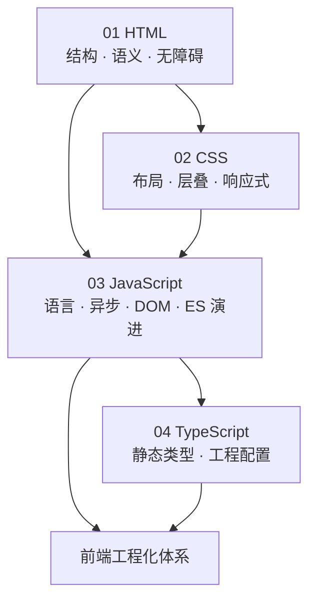

# 前端基础体系知识地图

> 四大支柱：**HTML 标记** → **CSS 样式** → **JavaScript 行为** → **TypeScript 类型**。ES 新特性并入 JavaScript 篇，不单列章节。

---

## 体系总览

| 篇 | 定位 | 与工程化衔接 |
|----|------|--------------|
| 01 HTML | 写什么标签、文档结构、无障碍标记 | 12 国际化与无障碍 |
| 02 CSS | 如何呈现、布局、动画、适配 | 06 性能、10 设计系统 |
| 03 JavaScript | 语言机制、异步、DOM、ES5–ES2026 | 02 构建、08 浏览器与网络 |
| 04 TypeScript | 编译期类型、泛型、tsconfig | 04 代码规范 |

---

## 各篇章节目录（速查）

### 01 · HTML 与语义化

文档结构 · 标签分类（内容/布局/文本/无语义）· HTML5 能力 · 表单与多媒体 · 语义化与大纲 · 无障碍与 ARIA · SEO

### 02 · CSS 体系

渲染管线 · 盒模型与 BFC · 选择器/伪类/伪元素 · 优先级与覆盖 · 布局（文档流/定位/浮动/Flex/Grid）· 居中 · 过渡与动画 · 0.5px · 媒体查询 · 浏览器兼容

### 03 · JavaScript 体系

运行时（堆/栈/队列）· 原始/引用类型 · 控制流/try-catch · **对象操作** · 作用域/闭包 · this/箭头/防抖节流 · 原型/继承 · 数组/拷贝 · 正则/Proxy/模块 · **DOM/回流重绘/fetch/Storage/History/事件** · **回调地狱**/Promise/async · 事件循环 · Worker · GC · 复杂度 · **ES5→ES2026**

### 04 · TypeScript 体系

发展脉络 · 基础类型（原始/数组/元组/enum/any/never）· 函数/对象/interface/class · 类型别名/合并 · 泛型 · 推论/断言/守卫/兼容 · 类型运算 · 模块/工具类型/装饰器 · tsconfig · 运行时边界

---

## 阅读方式

叙述 + **表格**（对照）+ **示意图**（流程/结构）+ **代码**（写法）穿插出现，避免大段纯文字或仅贴一段代码。不堆砌无助于理解的英文术语；必要规范名（如 ARIA、Promise）保留。

---

## 推荐路径

| 目标 | 顺序 |
|------|------|
| 零基础 | 01 → 02 → 03（前半）→ 03（异步/DOM） |
| 上岗 | 03 全文 → 04 → 02 进阶 |
| 面试原理 | 03 事件循环/闭包/原型 + 02 BFC/层叠 + 04 类型系统 |

---

## 外部参考

[MDN](https://developer.mozilla.org/zh-CN/) · [ECMA-262](https://tc39.es/ecma262/) · [TypeScript 手册](https://www.typescriptlang.org/docs/handbook/) · [Can I use](https://caniuse.com)
