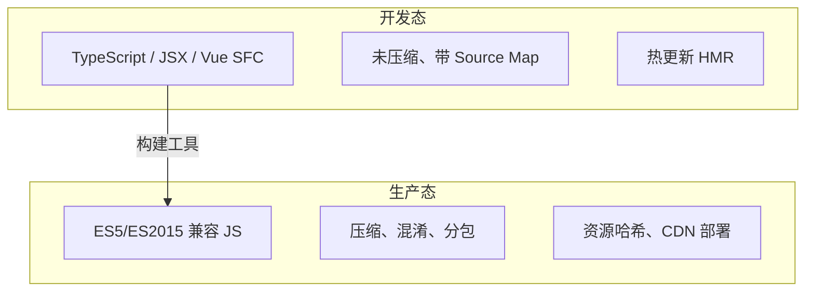
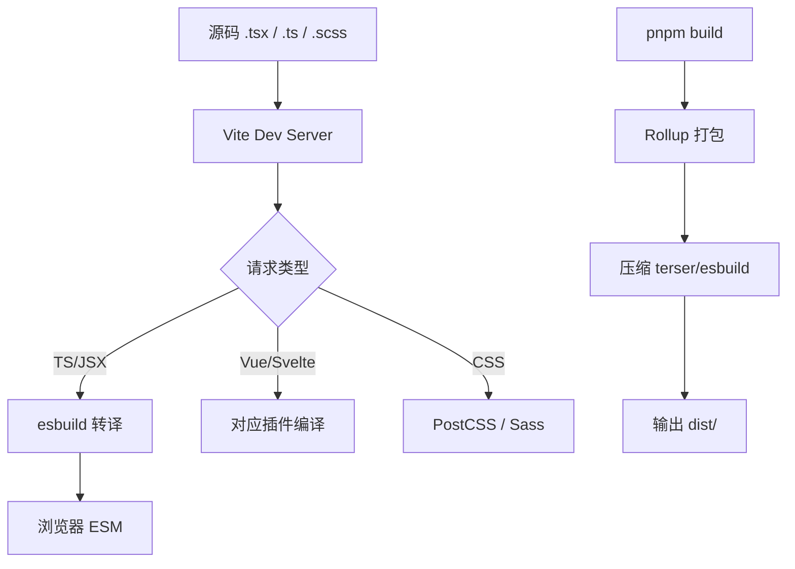
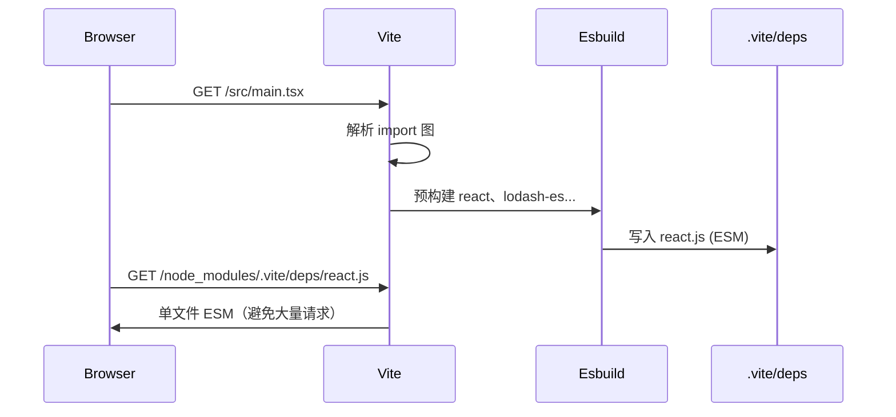

# 02 · 模块化与构建层（核心）

## 为什么需要模块化？

### 1.1 早期脚本的痛点

```html
<script src="jquery.js"></script>
<script src="utils.js"></script>
<script src="app.js"></script>
```

- 全局变量污染
- 依赖顺序必须手动保证
- 无法按需加载
- 难以维护大型应用

### 1.2 模块化的价值

把代码拆成**独立文件**，通过 `import` / `export` 显式声明依赖关系：

- 作用域隔离
- 依赖关系清晰
- 支持 tree-shaking（移除未使用代码）
- 便于团队协作

---

## 开发态 vs 生产态（速览）

| 维度 | 开发态 | 生产态 |
|------|--------|--------|
| 目标 | 快速反馈 | 体积小、加载快 |
| Source Map | 完整 | hidden / 无 |
| 模块 | 按需编译（Vite） | 分包 + hash |

---

## 模块规范：ESM 与 CommonJS

### 3.1 ES Module（ESM）— 现代标准

```javascript
// math.js
export function add(a, b) {
  return a + b;
}

export default function multiply(a, b) {
  return a * b;
}

// app.js
import multiply, { add } from './math.js';
```

特点：

- **静态分析**：`import` 必须在顶层，编译时可分析依赖
- 浏览器原生支持（`<script type="module">`）
- 前端新项目**首选 ESM**

### 3.2 CommonJS（CJS）— Node 传统

```javascript
// math.js
function add(a, b) {
  return a + b;
}
module.exports = { add };

// app.js
const { add } = require('./math');
```

特点：

- **动态加载**：`require()` 可在任意位置调用
- Node.js 传统模块系统
- 部分老工具和 npm 包仍使用 CJS

### 3.3 对比总结

| 特性 | ESM | CJS |
|------|-----|-----|
| 语法 | `import` / `export` | `require` / `module.exports` |
| 加载时机 | 编译时静态 | 运行时动态 |
| 浏览器 | 原生支持 | 不支持 |
| Tree-shaking | ✅ 友好 | ❌ 困难 |
| 前端新项目 | ✅ 推荐 | ❌ 避免（业务代码） |

### 3.4 互操作

构建工具会自动处理 ESM ↔ CJS 互转。业务代码统一写 ESM 即可。

---

## 开发态 vs 生产态



| 维度 | 开发态 | 生产态 |
|------|--------|--------|
| 目标 | 快速反馈、易调试 | 体积小、加载快、兼容广 |
| 代码 | 源码 + TS + JSX | 转译后的 JS |
| 体积 | 不压缩 | 压缩、tree-shake |
| 模块 | 按需编译 | 打包合并 / 分包 |
| Source Map | 完整 | 可选（hidden-source-map） |

---

## 构建工具概览

### 5.1 构建工具做什么？

1. **转译**：TS → JS、JSX → JS、Vue SFC → JS + CSS
2. **打包**：多文件合并或分包（code splitting）
3. **资源处理**：图片、字体、CSS、JSON
4. **开发服务器**：本地预览 + 热更新
5. **生产优化**：压缩、哈希、Tree-shaking

### 5.2 Webpack vs Vite

| 维度 | Webpack | Vite |
|------|---------|------|
| 诞生 | 2012，成熟生态 | 2020，现代设计 |
| 开发模式 | 全量打包后启动 | 原生 ESM + 按需编译 |
| 冷启动 | 较慢（项目越大越慢） | **极快** |
| HMR | 支持 | **更快** |
| 配置 | 灵活但复杂 | 开箱即用，配置简洁 |
| 插件生态 | **极其丰富** | 快速增长 |
| 适用 | 复杂定制、老项目 | **新项目首选** |

### 5.3 选型建议

- **新项目**：优先 Vite
- **老 Webpack 项目**：若无严重性能问题，可渐进迁移
- **需要极度自定义构建流程**：Webpack 仍是最灵活的选择

---

## Webpack 原理与实践

### 6.1 核心概念


| 概念 | 说明 | 示例 |
|------|------|------|
| Entry | 构建起点 | `./src/main.tsx` |
| Output | 输出目录与文件名 | `dist/[name].[hash].js` |
| Loader | 转换非 JS 文件 | `babel-loader`、`css-loader` |
| Plugin | 扩展构建能力 | 压缩、拷贝资源、定义环境变量 |
| Mode | 开发 / 生产模式 | `development` / `production` |

### 6.2 最小配置示例

```javascript
// webpack.config.js
const path = require('path');

module.exports = {
  entry: './src/main.tsx',
  output: {
    path: path.resolve(__dirname, 'dist'),
    filename: 'bundle.[contenthash].js',
    clean: true,
  },
  module: {
    rules: [
      {
        test: /\.tsx?$/,
        use: 'ts-loader',
        exclude: /node_modules/,
      },
      {
        test: /\.css$/,
        use: ['style-loader', 'css-loader'],
      },
    ],
  },
  resolve: {
    extensions: ['.tsx', '.ts', '.js'],
  },
  mode: 'production',
};
```

### 6.3 常用 Loader

| Loader | 作用 |
|--------|------|
| `babel-loader` | ES6+ / JSX 转 ES5 |
| `ts-loader` / `esbuild-loader` | TypeScript 编译 |
| `css-loader` | 解析 `@import`、`url()` |
| `style-loader` | 将 CSS 注入 DOM |
| `file-loader` / `asset modules` | 处理图片、字体 |

### 6.4 代码分割

```javascript
// 动态 import 触发分包
const Page = () => import('./views/UserProfile.tsx');
```

Webpack 会自动将动态 import 的模块拆成独立 chunk，实现**按需加载**。

---

## Vite 原理与实践

### 7.1 为什么 Vite 快？

**开发时**：

1. 不打包，直接利用浏览器原生 ESM
2. 请求某个模块时才编译该模块（按需）
3. 依赖预构建（esbuild）把 CJS 依赖转成 ESM

**生产时**：

使用 Rollup 打包，Tree-shaking 优秀。

### 7.2 基本使用

```bash
pnpm create vite my-app --template react-ts
cd my-app
pnpm install
pnpm dev      # 开发
pnpm build    # 生产构建
pnpm preview  # 预览构建产物
```

### 7.3 配置文件

```typescript
// vite.config.ts
import { defineConfig } from 'vite';
import react from '@vitejs/plugin-react';
import path from 'path';

export default defineConfig({
  plugins: [react()],
  resolve: {
    alias: {
      '@': path.resolve(__dirname, 'src'),
    },
  },
  server: {
    port: 3000,
    proxy: {
      '/api': {
        target: 'http://localhost:8080',
        changeOrigin: true,
      },
    },
  },
  build: {
    target: 'es2020',
    rollupOptions: {
      output: {
        manualChunks: {
          vendor: ['react', 'react-dom'],
        },
      },
    },
  },
});
```

### 7.4 环境变量

```bash
# .env.development
VITE_API_URL=http://localhost:8080/api
```

```typescript
const apiUrl = import.meta.env.VITE_API_URL;
```

只有 `VITE_` 前缀的变量会暴露给客户端代码。

---

## 编译器与转译器

构建工具负责「打包编排」，**编译器**负责「语法转换」。

### 8.1 Babel — 老牌转译王者

```javascript
// 输入（ES6+）
const greet = (name) => `Hello, ${name}!`;

// 输出（ES5）
var greet = function greet(name) {
  return 'Hello, ' + name + '!';
};
```

- 插件生态最丰富
- 通过 `@babel/preset-env` 按目标浏览器转译
- 通过 `@babel/preset-react` 处理 JSX
- **速度相对较慢**（纯 JS 实现）

```json
// .babelrc
{
  "presets": [
    ["@babel/preset-env", { "targets": "defaults" }],
    "@babel/preset-react",
    "@babel/preset-typescript"
  ]
}
```

### 8.2 SWC — 用 Rust 写的极速编译器

- 比 Babel **快 10–20 倍**
- Next.js、Rspack 等默认采用
- 配置与 Babel 类似但插件生态较小

### 8.3 ESBuild — 用 Go 写的超快打包器

- 编译速度极快（比 Webpack 快 10–100 倍）
- Vite 用它做**依赖预构建**
- 也可作为独立打包工具
- 不支持某些高级 TS 特性（如 `emitDecoratorMetadata`）

### 8.4 TypeScript 编译器（tsc）

- **类型检查** + 转译一体
- Vite 开发时不做类型检查（由 IDE 和 `tsc ，noEmit` 负责）
- 大型项目常分离：`vite build` + `tsc ，noEmit`

### 8.5 对比

| 工具 | 语言 | 速度 | 类型检查 | 典型场景 |
|------|------|------|----------|----------|
| Babel | JS | 慢 | ❌ | 老项目、复杂插件需求 |
| SWC | Rust | 快 | ❌ | Next.js、现代框架 |
| ESBuild | Go | 极快 | ❌ | 预构建、简单项目 |
| tsc | TS | 慢 | ✅ | 类型检查 |

---

## 完整构建流水线（以 Vite + React 为例）



---

## 关键优化概念

### 10.1 Tree-shaking

移除未被 `import` 使用的导出代码。要求 ESM 静态结构。

```javascript
// utils.js
export function used() {}
export function unused() {}

// app.js
import { used } from './utils';
// 打包后 unused 会被移除
```

### 10.2 Code Splitting（代码分割）

- 路由级懒加载
- 动态 `import()`
- 第三方库单独 chunk（`manualChunks`）

### 10.3 资源哈希

```
app.a1b2c3d4.js
```

内容变化 → 哈希变化 → 浏览器缓存失效，用户获取最新版本。

### 10.4 Source Map

开发：完整 Source Map，方便调试。  
生产：可选 `hidden-source-map` 上传到错误监控平台，不暴露给用户。

---

## 常见问题 FAQ

### Q1：Vite 还需要 Babel 吗？

React 项目通常 `@vitejs/plugin-react` 已内置；需兼容老浏览器时可加 `@vitejs/plugin-legacy`。

### Q2：为什么开发快但 build 慢？

生产构建要做完整打包、压缩、优化，比 dev 的按需编译重得多。

### Q3：路径别名 `@/` 怎么配？

Vite：`resolve.alias`；同步配置 `tsconfig.json` 的 `paths`。

### Q4：CommonJS 包在 Vite 里报错？

Vite 会用 esbuild 预构建 CJS 依赖；若仍有问题，可加入 `optimizeDeps.include`。

### Q5：Webpack 还要学吗？

生态存量大，维护老项目需要；新项目以 Vite 为主即可。

---

## 模块图与 Bundler 内核

### 12.1 ESM 静态分析与 Tree-shaking 边界

Tree-shaking 依赖 **静态模块结构**，编译期可确定 import/export 关系。

**能被 shake 的条件**：

- ESM `import` / `export`
- 无副作用（`sideEffects: false` 或 package.json 标注）
- 未被 re-export 整条 barrel 误伤

**常见失效场景**：

```javascript
// ❌ 整库导入 — lodash 全量进包
import _ from 'lodash';
_.debounce(fn, 300);

// ✅ 按需路径（视库是否支持 exports）
import debounce from 'lodash/debounce';

// ❌ CJS 动态 require — 无法静态分析
const mod = require(condition ? './a' : './b');

// ❌ 带副作用的模块 — 即使未引用也会保留
// package.json: "sideEffects": ["*.css", "./src/polyfill.ts"]
```

**Barrel file 陷阱**（`index.ts`  re-export 全目录）：

```typescript
// components/index.ts
export * from './Button';
export * from './Table';  // 100+ 组件

// 业务只 import Button，bundler 可能仍解析整个 barrel 图
import { Button } from '@/components';
```

**治理**：直接路径 import；或 `eslint-plugin-import` 限制 barrel；组件库发包时用 `exports` 细粒度入口。

### 12.2 Webpack 模块联邦（Module Federation）

微前端场景下，**运行时共享**远程模块，而非构建时合并：

```javascript
// host/webpack.config.js
new ModuleFederationPlugin({
  name: 'host',
  remotes: {
    mfApp: 'mfApp@https://cdn.example.com/mfApp/remoteEntry.js',
  },
  shared: {
    react: { singleton: true, requiredVersion: '^18.0.0' },
    'react-dom': { singleton: true },
  },
});
```

```javascript
// 动态消费远程模块
const RemotePage = React.lazy(() => import('mfApp/Page'));
```

| 维度 | 构建时集成（npm 包） | Module Federation |
|------|---------------------|-------------------|
| 部署 | 与 host 同发版 | **独立部署** |
| 共享依赖 | 打包器 dedupe | shared scope 协商 |
| 复杂度 | 低 | 高（版本、回滚、类型） |
| 适用 | 组件库、工具库 | 大型多团队微前端 |

**坑**：shared 版本不匹配 → 运行时双 React；remoteEntry 缓存 → 需 CDN 短缓存 + 版本化 URL。

### 12.3 Vite 依赖预构建（optimizeDeps）原理

冷启动时 Vite 用 **esbuild** 扫描入口，将 `node_modules` 中 **CommonJS / UMD** 依赖预打包为 ESM，写入 `node_modules/.vite/deps/`：



**强制干预**：

```typescript
// vite.config.ts
export default defineConfig({
  optimizeDeps: {
    include: ['problematic-cjs-package'],  // 漏扫描时手动加入
    exclude: ['already-esm-package'],       // 已是原生 ESM 可排除
    esbuildOptions: {
      target: 'es2020',
    },
  },
});
```

**诊断建议**：删 `node_modules/.vite` 后重启；对比 `--debug` 日志；升级 Vite 后预构建 hash 变化属正常。

### 12.4 生产构建：Rollup 与 Webpack 差异

| 维度 | Rollup（Vite prod） | Webpack |
|------|---------------------|---------|
| 设计目标 | 库 / ESM 友好 | 应用全能 |
| Scope hoisting | 默认更激进 | 依赖模块系统 |
| Code splitting | 静态 + 动态 import | 成熟、灵活 |
| HMR | 无（生产无此需求） | dev 专用 |
| 插件 | Rollup 插件 | Loader + Plugin 生态更大 |

Vite 5+ 可选 **Rollup 3** 或实验性 **Rolldown**（Rust）进一步提速生产构建。

### 12.5 新一代 Bundler  landscape

| 工具 | 实现 | 定位 |
|------|------|------|
| **Rspack** | Rust | Webpack 配置兼容、极速 |
| **Turbopack** | Rust | Next.js dev 默认方向 |
| **Rolldown** | Rust | Vite 生产打包替代 Rollup |
| **esbuild** | Go | 转译 / 预构建，非完整应用 bundler |
| **Parcel** | 多语言 | 零配置 |

**迁移评估**：Webpack → Rspack 可渐进（配置相似）；Webpack → Vite 需改插件与入口 HTML 结构。

### 12.6 分包策略（manualChunks）

**目标**：平衡「缓存命中率」与「首屏请求数」。

```typescript
// vite.config.ts — 按使用频率拆分
rollupOptions: {
  output: {
    manualChunks(id) {
      if (id.includes('node_modules')) {
        if (id.includes('echarts') || id.includes('monaco')) return 'vendor-heavy';
        if (id.includes('react') || id.includes('react-dom')) return 'vendor-react';
        return 'vendor'; // 其余第三方
      }
    },
  },
},
```

**反模式**：

- 拆太碎 → HTTP/1.1 下连接数爆炸（HTTP/2 缓解但仍有过载）
- `vendor` 单 chunk 2MB+ → 改一行业务代码，用户重下整个 vendor
- 动态路由 chunk 未 prefetch → 导航白屏

**工具**：`rollup-plugin-visualizer`、`webpack-bundle-analyzer` 量化各 chunk 占比。

### 12.7 构建性能调优

| 手段 | 说明 |
|------|------|
| 持久缓存 | Webpack `cache: { type: 'filesystem' }`；Turbo 远程缓存 |
| 缩小解析范围 | `resolve.modules`、`tsconfig paths` 精准；避免宽泛 alias |
| 多线程 | `thread-loader`、`esbuild-loader` 替代 babel-loader |
| 跳过类型检查 | 构建用 esbuild/swc，CI 并行跑 `tsc ，noEmit` |
| 增量构建 | Turborepo `dependsOn: ^build` 只构建变更包 |
| 提高 Node 内存 | `NODE_OPTIONS=，max-old-space-size=8192` 应对 OOM |

**度量**：记录 CI build 阶段耗时；`vite build ，profile` 生成 Chrome DevTools 可读的 profile。

### 12.8 SSR / SSG 构建管线（扩展）

SSR 应用（Next.js / Nuxt）构建产出**双端 bundle**：

```plaintext
Client bundle  → 浏览器 hydration
Server bundle  → Node 渲染 HTML
```

**关注点**：

- **hydration mismatch**：服务端与客户端 HTML 不一致
- **环境变量**：仅 `NEXT_PUBLIC_` / 等价前缀进 client
- **外部化**：服务端 bundle 将 `fs`、`express` 等 mark 为 external

SSG：`getStaticPaths` / `generate` 在 build 时跑，构建时间与页面数线性相关。

### 12.9 Source Map 生产策略

| 类型 | 用户可见 | 适用 |
|------|----------|------|
| `source-map` | ✅ 完整 | 不推荐生产 |
| `hidden-source-map` | ❌ 无 | 上传 Sentry，不暴露 |
| `nosources-source-map` | 仅栈 | 最小泄露 |
| 无 | — | 极高安全要求 |

```typescript
build: {
  sourcemap: 'hidden',
},
```

CI 将 `.map` 上传错误监控后**不部署**到 CDN。

### 12.10 构建故障排查手册

| 现象 | 可能原因 | 排查 |
|------|----------|------|
| `Cannot find module` | alias / exports 变更 | 查 tsconfig paths + 包 exports |
| HMR 全页刷新 | 非 React 组件 export | 保持组件 fast refresh 规则 |
| 包体积突增 30% | 误导入重库 / barrel | analyzer 对比两次 build |
| OOM | 超大依赖图 | 提内存 / 拆 entry |
| 双 React | 链接 + npm 混用 / federation shared 失败 | `pnpm why react` |
| CJS default export 错 | interop | `optimizeDeps.needsInterop` |

---

## 选型决策矩阵

| 场景 | 推荐 | 备注 |
|------|------|------|
| 新 SPA | Vite 5+ | dev 体验最优 |
| 微前端 runtime 集成 | Webpack Module Federation | 成熟方案 |
| Webpack 老项目提速 | Rspack 渐进迁移 | 配置复用度高 |
| 组件库发包 | Rollup / tsdown / unbuild | ESM-first |
| 需 IE11 | Webpack + Babel + polyfill | Vite legacy 插件亦可 |
| 超大型 Monorepo | Vite + Turborepo 缓存 | 按包增量构建 |

---

## 最佳实践

- [ ] 业务代码统一 ESM
- [ ] 新项目优先 Vite
- [ ] 路由与重型库懒加载
- [ ] 生产构建配置 `manualChunks` 拆分 vendor
- [ ] 类型检查独立脚本 `tsc ，noEmit`
- [ ] 环境变量仅 `VITE_` 前缀暴露客户端
- [ ] 配置 bundle analyzer 进 CI 或定期报告
- [ ] 文档化 manualChunks 策略与 chunk 命名
- [ ] 生产 Source Map 上传监控平台、不公开 CDN
- [ ] 审查 barrel export 与 sideEffects 声明

---

## 小结

构建层把**源码模块图**转成浏览器可加载的产物：开发态追求反馈速度，生产态追求体积、缓存与兼容。

业务代码统一 ESM；Vite 开发 esbuild 预构建 + 生产 Rollup；tree-shaking 依赖 sideEffects 标记；代码分割用 dynamic import；Source Map 生产用 hidden 或外置。

**易混点**：CJS 动态 require 无法摇树；开发态未压缩不代表生产体积；public 目录不参与打包；环境变量 VITE_ 前缀暴露给客户端。

核对：bundle analyzer 是否看过主 chunk 构成？lazy route 是否真正拆包？legacy 插件是否按需启用？
