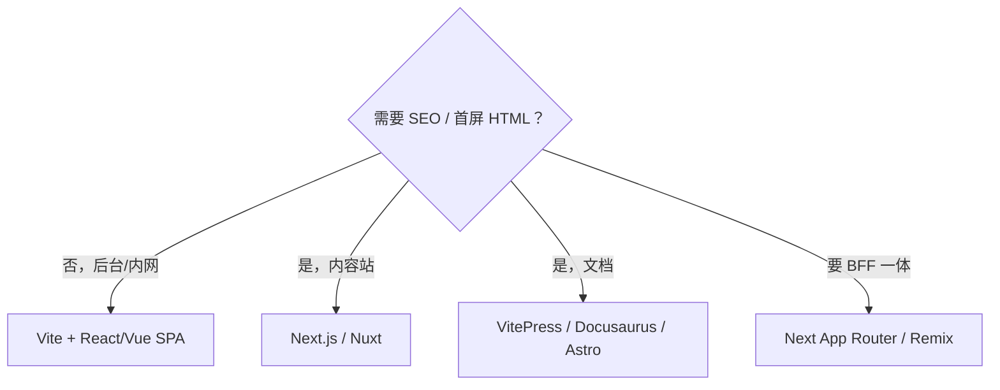
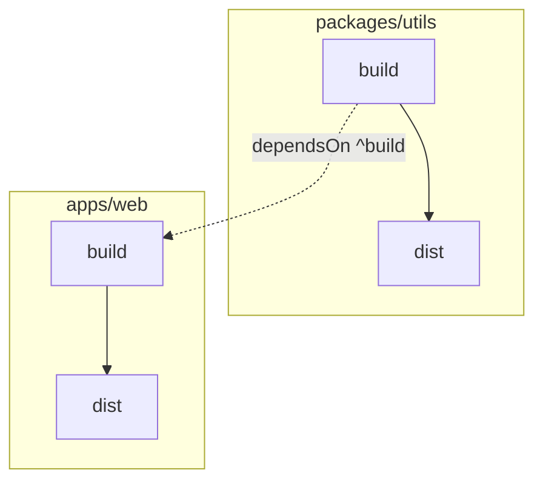

# 03 · 脚手架与项目初始化

## 什么是脚手架？

**脚手架（Scaffolding）** 是一组模板和命令，用于自动生成项目骨架：

- 目录结构
- 构建配置（Vite / Webpack）
- 代码规范（ESLint、Prettier）
- 示例代码与 README

类比：盖房子先搭脚手架，而不是从烧砖开始。

---

## 脚手架要解决什么问题

### 2.1 重复劳动

每个新项目若从零配置 Vite、ESLint、TS、测试、CI，首周往往耗在「搭环境」而非业务。脚手架把**已验证的最佳实践**固化成模板，让你第一天就写业务代码。

### 2.2 标准不一致

无统一脚手架时，各项目目录命名、别名、环境变量前缀、提交规范各异，人员流动与跨项目协作成本上升。

### 2.3 好脚手架的特征

| 特征 | 说明 |
|------|------|
| **可升级** | 模板版本号；提供 codemod 或迁移文档 |
| **可裁剪** | 交互式选项（是否 Router、是否 E2E） |
| **薄封装** | 不隐藏构建配置；`eject` 或暴露 `vite.config` |
| **与组织规范绑定** | 内置 `@org/eslint-config`、Changesets 等 |
| **文档即代码** | README 含 dev/build/deploy 命令 |

### 2.4 选型决策（SPA vs SSR）

| 需求 | 推荐起点 |
|------|----------|
| 后台管理、无 SEO | Vite + React/Vue SPA |
| 营销站、SEO、首屏 | Next.js / Nuxt |
| 文档站 | VitePress / Docusaurus / Astro |
| 全栈 BFF 一体 | Next App Router / Remix |

立项时写简短 ADR 记录选型理由 — 半途从 SPA 迁 SSR 成本极高。



---

### 3.1 Create React App（CRA）

```bash
npx create-react-app my-app
cd my-app
npm start
```

| 优点 | 缺点 |
|------|------|
| 零配置上手 | **已停止维护**（官方推荐迁移） |
| React 官方背书 | 基于 Webpack，启动慢 |
| 隐藏复杂配置 | 难以自定义而不 eject |

> **现状**：新项目**不推荐** CRA，请使用 Vite 或 Next.js。

### 3.2 Vue CLI

```bash
npm install -g @vue/cli
vue create my-app
```

| 优点 | 缺点 |
|------|------|
| 图形化 / 交互式选型 | 维护模式，官方推荐 Vite |
| 集成 Router、Vuex、TS | 基于 Webpack，较重 |

> **现状**：Vue 3 新项目用 `create-vue`（Vite 驱动）。

### 3.3 Vite 官方模板（推荐）

```bash
# 交互式
pnpm create vite

# 直接指定
pnpm create vite my-app --template react-ts
pnpm create vite my-app --template vue-ts
```

可用模板：

| 模板 | 说明 |
|------|------|
| `vanilla` / `vanilla-ts` | 纯 JS / TS |
| `react` / `react-ts` | React + TS |
| `vue` / `vue-ts` | Vue 3 + TS |
| `preact` / `svelte` / `solid` | 其他框架 |

**create-vue**（Vue 专属，功能更丰富）：

```bash
pnpm create vue@latest
```

交互选项：TypeScript、Router、Pinia、ESLint、Prettier 等。

### 3.4 其他流行脚手架

| 工具 | 框架 | 特点 |
|------|------|------|
| Next.js | React | SSR/SSG、全栈 |
| Nuxt | Vue | SSR、文件路由 |
| Remix | React | 全栈、Web 标准 |
| Astro | 多框架 | 内容站点、岛屿架构 |

选型取决于是否需要 SSR、SEO、全栈能力。

---

## 脚手架生成的典型结构

以 `react-ts` 模板为例：

```plaintext
my-app/
├── public/              # 静态资源（不经过构建处理）
├── src/
│   ├── assets/
│   ├── App.tsx
│   ├── main.tsx
│   └── vite-env.d.ts
├── index.html           # Vite 入口 HTML
├── package.json
├── tsconfig.json
├── vite.config.ts
└── .gitignore
```

初始化后建议立即：

1. 初始化 Git：`git init`
2. 安装依赖：`pnpm install`
3. 确认能跑：`pnpm dev`

---

## 自定义脚手架

当团队有多项目、需统一目录、规范、私有 npm 包时，应用**自定义脚手架**。

### 5.1 技术选型

| 工具 | 作用 |
|------|------|
| [inquirer](https://github.com/SBoudrias/Inquirer.js) | 交互式问答（项目名、是否 TS 等） |
| [ejs](https://ejs.co/) | 模板引擎，渲染文件内容 |
| [fs-extra](https://github.com/jprichardson/node-fs-extra) | 增强文件操作 |
| [chalk](https://github.com/chalk/chalk) | 终端彩色输出 |
| [commander](https://github.com/tj/commander.js) | CLI 命令解析 |

### 5.2 工作流程


### 5.3 最小实现示例

**目录结构**：

```plaintext
create-my-cli/
├── bin/
│   └── index.js          # CLI 入口
├── template/
│   ├── package.json.ejs
│   ├── vite.config.ts
│   └── src/
│       └── main.ts
└── package.json
```

**bin/index.js**（简化版）：

```javascript
#!/usr/bin/env node
import inquirer from 'inquirer';
import fs from 'fs-extra';
import path from 'path';
import { fileURLToPath } from 'url';
import ejs from 'ejs';

const __dirname = path.dirname(fileURLToPath(import.meta.url));

async function main() {
  const answers = await inquirer.prompt([
    { type: 'input', name: 'projectName', message: '项目名称?' },
    {
      type: 'list',
      name: 'framework',
      message: '选择框架',
      choices: ['react', 'vue'],
    },
    { type: 'confirm', name: 'typescript', message: '使用 TypeScript?', default: true },
  ]);

  const targetDir = path.resolve(process.cwd(), answers.projectName);
  const templateDir = path.join(__dirname, '../template');

  await fs.copy(templateDir, targetDir);

  const pkgPath = path.join(targetDir, 'package.json.ejs');
  const content = await fs.readFile(pkgPath, 'utf-8');
  const rendered = ejs.render(content, answers);
  await fs.writeFile(path.join(targetDir, 'package.json'), rendered);
  await fs.remove(pkgPath);

  console.log(`\n✅ 项目 ${answers.projectName} 创建成功！`);
  console.log(`   cd ${answers.projectName} && pnpm install && pnpm dev`);
}

main();
```

**template/package.json.ejs**：

```json
{
  "name": "<%= projectName %>",
  "private": true,
  "version": "0.0.0",
  "type": "module",
  "scripts": {
    "dev": "vite",
    "build": "vite build"
  }
}
```

### 5.4 发布与使用

```json
// create-my-cli/package.json
{
  "name": "create-my-app",
  "bin": { "create-my-app": "./bin/index.js" }
}
```

```bash
pnpm link --global
create-my-app
```

或使用 `npm init` 约定：`npm init my-app` 会执行 `create-my-app` 包。

### 5.5 脚手架应包含什么

- [ ] 统一目录结构
- [ ] ESLint + Prettier + EditorConfig
- [ ] Husky + Commitlint（可选）
- [ ] 路径别名 `@/`
- [ ] 环境变量 `.env.example`
- [ ] README 与贡献指南
- [ ] CI 配置模板

---

## Monorepo：多项目统一管理

### 6.1 什么是 Monorepo？

**Monorepo**（单仓库）把多个相关项目放在**同一个 Git 仓库**中：

```plaintext
my-monorepo/
├── packages/
│   ├── ui/              # 组件库
│   ├── utils/           # 工具库
│   └── web/             # 主应用
├── package.json
└── pnpm-workspace.yaml
```

对比 **Multi-repo**：每个包独立仓库，版本发布、依赖同步更繁琐。

### 6.2 适用场景

- 组件库 + 文档站 + 示例应用
- 多个微前端子应用 + 共享模块
- 全栈 monorepo（前后端同仓）

### 6.3 pnpm workspace（推荐基础）

**pnpm-workspace.yaml**：

```yaml
packages:
  - 'packages/*'
  - 'apps/*'
```

根 **package.json**：

```json
{
  "name": "my-monorepo",
  "private": true,
  "scripts": {
    "dev": "pnpm -r --parallel dev",
    "build": "pnpm -r build",
    "lint": "pnpm -r lint"
  }
}
```

**packages/ui/package.json**：

```json
{
  "name": "@myorg/ui",
  "version": "1.0.0",
  "main": "./dist/index.js"
}
```

**apps/web/package.json** 引用内部包：

```json
{
  "dependencies": {
    "@myorg/ui": "workspace:*"
  }
}
```

`workspace:*` 表示使用仓库内最新版本，无需发布到 npm。

### 6.4 Lerna

老牌 Monorepo 工具，侧重**版本管理与发布**：

```bash
lerna version    # 统一 bump 版本
lerna publish    # 发布到 npm
```

可与 pnpm workspace 配合：pnpm 管依赖，Lerna 管发布。

### 6.5 Turborepo

侧重**构建缓存与任务编排**：

```json
// turbo.json
{
  "$schema": "https://turbo.build/schema.json",
  "tasks": {
    "build": {
      "dependsOn": ["^build"],
      "outputs": ["dist/**"]
    },
    "lint": {},
    "dev": {
      "cache": false,
      "persistent": true
    }
  }
}
```

```bash
turbo run build    # 并行构建，缓存未变更的包
```



### 6.6 三者关系

| 工具 | 主要职责 |
|------|----------|
| pnpm workspace | 依赖链接、磁盘共享 |
| Lerna | 版本号、changelog、npm 发布 |
| Turborepo | 任务调度、远程/本地构建缓存 |

常见组合：**pnpm workspace + Turborepo**（日常开发构建），需要发 npm 时加 Lerna 或 changesets。

---

## Monorepo 治理与发布

### 8.1 Monorepo vs Multi-repo 决策框架

| 维度 | Monorepo | Multi-repo |
|------|----------|------------|
| 跨包重构 | **原子 commit**，一次 PR | 多 PR 协调、版本窗口 |
| CI 成本 | 需增量 / 缓存（Turbo） | 各仓独立，隔离好 |
| 权限 | 粗粒度（仓级） | **细粒度**（包级权限） |
| 发布 | Changesets 统一 | 各仓 semver 独立 |
| 克隆体积 | 大 | 小 |

**选 Monorepo 当**：共享代码 > 30%、组件库强耦合业务、需统一 lint/tsconfig。  
**选 Multi-repo 当**：团队自治、发布周期差异大、开源边界清晰。

### 8.2 包切分原则（Domain-driven）

```plaintext
apps/
  web/           ← 可部署应用（private: true）
  admin/         ← 另一入口
packages/
  ui/            ← 无业务逻辑的设计系统
  shared-utils/  ← 纯函数，零框架依赖
  api-client/    ← OpenAPI 生成，框架无关
  config-eslint/ ← 共享 ESLint flat config
  config-ts/     ← 共享 tsconfig 基座
```

**分层铁律**：`shared-utils` 禁止 import `ui`；`ui` 仅 peer 依赖 React；`apps` 是唯一顶层消费者。

### 8.3 Changesets — 现代版本发布

```bash
pnpm add -Dw @changesets/cli && pnpm changeset init
```

工作流：开发者 `pnpm changeset` → PR 合并 → CI 开 Version PR → 合并后 publish。支持 pre-release channel（`beta`）。

### 8.4 Nx 与 Turborepo 选型

| 工具 | 适用规模 | 核心能力 |
|------|----------|----------|
| Turborepo | 中小 Monorepo | 任务缓存、并行、远程 cache |
| Nx | 50+ 包、多团队 | Graph、affected、generators、边界 |

### 8.5 模块边界强制

使用 `eslint-plugin-boundaries` + `dependency-cruiser`：PR 引入环依赖或跨层 import 即 CI 失败。

### 8.6 Plop vs create-CLI

- **Plop**：仓内增量生成（页面、模块、组件）
- **create-xxx**：跨仓库初始化；模板版本须与 `@org/config-*` 包 semver 对齐

### 8.7 Turborepo 远程缓存

配置 `TURBO_TOKEN` + `TURBO_TEAM`，CI 与同事共享构建缓存，大型 Monorepo 可从 15min 降至 2min 级。

### 8.8 SSR 框架脚手架选型 ADR 要点

SEO / 首屏 / Edge 需求 → Next / Nuxt；纯后台 SPA → Vite。半途迁移成本极高，须在立项时写入 ADR。

---

## 常见问题 FAQ

### Q1：CRA 项目如何迁移到 Vite？

官方有 [迁移指南](https://vitejs.dev/guide/migration.html)；核心：换构建配置、改环境变量前缀、调整 `index.html` 位置。

### Q2：Monorepo 一定比 Multi-repo 好吗？

不是。小团队单应用用 Monorepo 反而增加复杂度；多包强关联时 Monorepo 优势明显。

### Q3：内部包不发布 npm 怎么用？

pnpm `workspace:*` 协议，应用直接引用本地包。

### Q4：脚手架要不要放进 Monorepo？

可以，`packages/create-cli` 作为其中一个 package，与业务模板同步演进。

### Q5：internal package 改了，apps 不生效？

检查是否构建产物型包（`main: dist/index.js`）— 须先 `pnpm ，filter @org/ui build` 或 Turbo `dependsOn: ^build`；源码型（`exports: ./src/index.ts`）需 bundler 直接消费 TS。

### Q6：workspace 协议 `workspace:*` vs `workspace:^`？

`*` 始终链接 monorepo 内最新；`^` 允许 semver 范围，发布时替换为实际版本号。

---

## Dev Container 与 Docker 开发环境

### 10.1 devcontainer.json

```json
{
  "name": "frontend",
  "image": "mcr.microsoft.com/devcontainers/javascript-node:20",
  "postCreateCommand": "pnpm install",
  "customizations": {
    "vscode": {
      "extensions": ["dbaeumer.vscode-eslint", "esbenp.prettier-vscode"]
    }
  }
}
```

新人 `Reopen in Container` 即得一致 Node + 扩展 — 与 CI 镜像版本对齐。

### 10.2 本地 Docker Compose（可选）

```yaml
services:
  web:
    build: .
    ports: ['5173:5173']
    volumes: ['.:/app', '/app/node_modules']
```

适合依赖本地 Redis / Mock API 的全栈联调。

### 10.3 模板版本与 codemod

脚手架模板应带 **semver tag**；Breaking 变更提供 codemod（jscodeshift）或迁移文档，而非 silent 破坏。

---

## Next.js / Nuxt 初始化要点

### 11.1 Next.js App Router

```bash
pnpm create next-app@latest --ts --eslint --app --src-dir
```

关注：`app/` 路由、Server Components 边界、`NEXT_PUBLIC_` 变量、Image 组件优化。

### 11.2 Nuxt 3

```bash
pnpm dlx nuxi init my-app
```

关注：文件路由、`useFetch`、`nuxt.config` 模块、SSR/SSG 模式选择。

---

## 环境变量与多环境

### 12.1 Vite 约定

| 文件 | 加载时机 |
|------|----------|
| `.env` | 所有模式 |
| `.env.local` | 本地覆盖，**不提交 Git** |
| `.env.development` | `pnpm dev` |
| `.env.production` | `pnpm build` |

仅 `VITE_` 前缀变量暴露给客户端 — **禁止**把服务端密钥写入 `VITE_*`。

```typescript
// 类型安全（vite-env.d.ts）
interface ImportMetaEnv {
  readonly VITE_API_BASE: string;
  readonly VITE_APP_ENV: 'development' | 'staging' | 'production';
}
```

### 12.2 Next.js 约定

`NEXT_PUBLIC_` 暴露给浏览器；其余仅在 Server Components / API Routes 可读。

### 12.3 多环境部署

```plaintext
build 产物相同 + 运行时注入 window.__RUNTIME_CONFIG__
或
各环境独立 build（VITE_API_BASE 不同）
```

Runtime Config 适合同一 Docker 镜像部署多环境；build 时写死适合静态 CDN 场景。

---

## React / Vue 工程化速查

框架篇中的工具链、类型检查、HMR、升级迁移等内容已抽取至 [14-框架工程化实践](./14-框架工程化实践.md)。本节保留立项选型要点。

### 初始化命令对照

| 目标 | React | Vue |
|------|-------|-----|
| SPA + TS | `pnpm create vite my-app ，template react-ts` | `pnpm create vue@latest` |
| SSR / 全栈 | `pnpm create next-app@latest` | `pnpm create nuxt` |
| 类型检查 CI | `tsc ，noEmit` | `vue-tsc ，noEmit` |
| 测试默认 | Vitest + RTL | Vitest + VTU |

### create-vue 交互选项建议

| 选项 | 中大型项目 |
|------|------------|
| TypeScript | ✅ |
| Vue Router | 多页 SPA ✅ |
| Pinia | 需全局状态 ✅ |
| Vitest | ✅ |
| ESLint + Prettier | ✅ |
| Vue DevTools | 开发可选 |

### Next.js / Nuxt 立项补充

| 检查项 | Next.js | Nuxt 3 |
|--------|---------|--------|
| 客户端 env | `NEXT_PUBLIC_*` | `NUXT_PUBLIC_*` |
| 服务端密钥 | 无 `NEXT_PUBLIC_` 前缀 | `runtimeConfig` 私有 |
| 部署目标 | Node / Vercel / 静态 export | Nitro 预设（node、vercel、static） |
| 类型检查 | `tsc ，noEmit` | `nuxt typecheck` |

### 从遗留脚手架迁移

| 从 | 到 | 关键变更 |
|----|-----|----------|
| CRA | Vite | 根 index.html、`import.meta.env`、删 react-scripts |
| Vue CLI | Vite | `VUE_APP_` → `VITE_`、vue-tsc 进 build |
| Webpack 自定义 | Vite | loader → 插件生态、CJS require → import |

详细步骤与 codemod 见框架篇迁移 Checklist 与 [14-框架工程化实践](./14-框架工程化实践.md)。

---

## 小结

脚手架的价值是**把已验证的工程约定固化成模板**，让立项第一天就写业务而非搭环境，模板宜薄、可升级、可裁剪。

SPA 用 Vite/create-vue；要 SEO 选 Next/Nuxt；Monorepo 用 pnpm workspace + Turborepo；环境变量区分 build-time 与 runtime；ADR 记录选型理由。

**易混点**：CRA/Vue CLI 已过时；把密钥写进 VITE_ 变量；Monorepo 环依赖；脚手架藏死配置无法 eject。

核对：README 是否写清 Node 版本与 install 命令？多环境 .env 是否 gitignore 敏感项？
