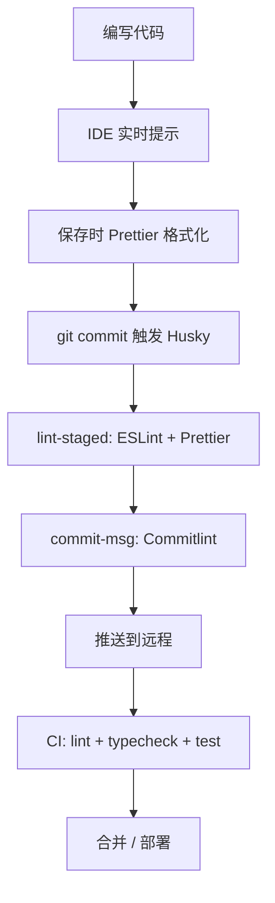
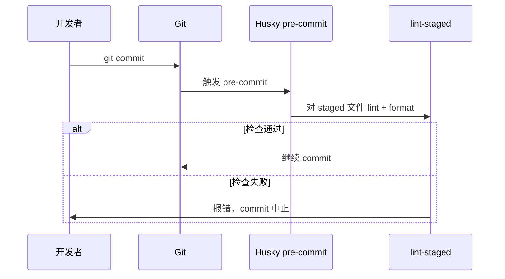
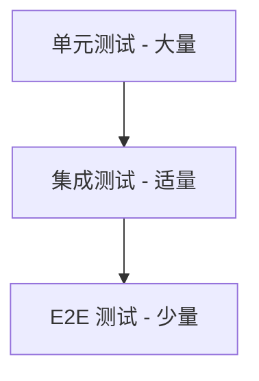

# 04 · 代码规范与质量保障

## 质量保障体系全景



| 阶段 | 工具 | 作用 |
|------|------|------|
| 编码 | TypeScript、IDE | 类型错误即时反馈 |
| 保存 | Prettier、ESLint | 格式与基础规则 |
| 提交前 | Husky、lint-staged | 只检查暂存文件 |
| 提交信息 | Commitlint | 规范 commit message |
| CI | GitHub Actions 等 | 全量检查，门禁 |

---

## ESLint — 代码质量检查

### 3.1 ESLint 是什么？

**ESLint** 是 JavaScript / TypeScript 的**静态分析**工具，检查：

- 语法错误与潜在 bug（未使用变量、不可达代码）
- 代码风格（部分规则）
- 最佳实践（如 React Hooks 规则）

它**不格式化**代码为主（那是 Prettier 的事），而是**找问题**。

### 3.2 安装与初始化

```bash
pnpm add -D eslint @eslint/js typescript-eslint
pnpm add -D eslint-plugin-react eslint-plugin-react-hooks
```

**eslint.config.js**（Flat Config，ESLint 9+）：

```javascript
import js from '@eslint/js';
import tseslint from 'typescript-eslint';
import reactPlugin from 'eslint-plugin-react';
import reactHooks from 'eslint-plugin-react-hooks';

export default tseslint.config(
  js.configs.recommended,
  ...tseslint.configs.recommended,
  {
    files: ['**/*.{ts,tsx}'],
    plugins: {
      react: reactPlugin,
      'react-hooks': reactHooks,
    },
    rules: {
      'react-hooks/rules-of-hooks': 'error',
      'react-hooks/exhaustive-deps': 'warn',
      '@typescript-eslint/no-unused-vars': ['error', { argsIgnorePattern: '^_' }],
      '@typescript-eslint/no-explicit-any': 'error',
    },
  },
  {
    ignores: ['dist/', 'node_modules/'],
  },
);
```

### 3.3 常用规则说明

| 规则 | 含义 |
|------|------|
| `no-console` | 禁止 console（或 warn） |
| `no-debugger` | 禁止 debugger |
| `eqeqeq` | 强制 `===` |
| `@typescript-eslint/no-explicit-any` | 禁止 any |
| `react-hooks/rules-of-hooks` | Hooks 只能在顶层调用 |

### 3.4 运行

```json
// package.json
{
  "scripts": {
    "lint": "eslint src --ext .ts,.tsx",
    "lint:fix": "eslint src --ext .ts,.tsx --fix"
  }
}
```

---

## Prettier — 代码格式化

### 4.1 Prettier 是什么？

**Prettier** 是** opinionated** 的代码格式化工具，不讨论风格，统一输出。

负责：缩进、引号、分号、换行、尾逗号等。

### 4.2 与 ESLint 的分工

| ESLint | Prettier |
|--------|----------|
| 代码质量、逻辑问题 | 纯格式 |
| 部分风格规则 | 统一所有格式 |

两者可能冲突（如 ESLint 的 indent vs Prettier），解决方案：

- 使用 `eslint-config-prettier` 关闭 ESLint 中与 Prettier 冲突的规则
- 或使用 `eslint-plugin-prettier` 把 Prettier 当 ESLint 规则跑

### 4.3 配置

**.prettierrc**：

```json
{
  "semi": true,
  "singleQuote": true,
  "tabWidth": 2,
  "printWidth": 100,
  "trailingComma": "all",
  "endOfLine": "lf"
}
```

**.prettierignore**：

```
dist
node_modules
pnpm-lock.yaml
```

### 4.4 EditorConfig

**.editorconfig** 跨编辑器统一基础设置：

```ini
root = true

[*]
charset = utf-8
indent_style = space
indent_size = 2
end_of_line = lf
insert_final_newline = true
trim_trailing_whitespace = true
```

---

## Husky + lint-staged — Git 钩子

### 5.1 为什么需要 Git 钩子？

本地 `lint` 靠自觉，容易忘记。在 **git commit 前**自动跑检查，不合规的代码**无法提交**。

### 5.2 Husky

**Husky** 简化 Git hooks 配置：

```bash
pnpm add -D husky
pnpm exec husky init
```

会在 `.husky/` 下生成钩子脚本。

### 5.3 lint-staged

只对**暂存区（staged）**的文件跑 lint，速度快：

```bash
pnpm add -D lint-staged
```

**package.json**：

```json
{
  "lint-staged": {
    "*.{ts,tsx}": ["eslint --fix", "prettier --write"],
    "*.{css,scss,json,md}": ["prettier --write"]
  }
}
```

**.husky/pre-commit**：

```bash
pnpm exec lint-staged
```

### 5.4 流程



---

## Commitlint — 提交信息规范

### 6.1 为什么规范 Commit？

- 自动生成 CHANGELOG
- 快速定位某次改动类型
- 语义化版本自动 bump（配合 semantic-release）

### 6.2 Conventional Commits 格式

```plaintext
type(scope): subject

[optional body]

[optional footer]
```

| type | 说明 |
|------|------|
| feat | 新功能 |
| fix | 修复 bug |
| docs | 文档 |
| style | 格式（不影响逻辑） |
| refactor | 重构 |
| perf | 性能 |
| test | 测试 |
| chore | 构建 / 工具 |
| ci | CI 配置 |

示例：

```plaintext
feat(auth): 添加登录页表单校验
fix(table): 修复分页器在空数据时崩溃
docs(readme): 补充本地开发说明
```

### 6.3 配置 Commitlint

```bash
pnpm add -D @commitlint/cli @commitlint/config-conventional
```

**commitlint.config.js**：

```javascript
export default {
  extends: ['@commitlint/config-conventional'],
  rules: {
    'subject-max-length': [2, 'always', 72],
  },
};
```

**.husky/commit-msg**：

```bash
pnpm exec commitlint --edit $1
```

### 6.4 交互式提交（可选）

使用 `commitizen` + `cz-conventional-changelog` 引导填写 commit message。

---

## TypeScript — 类型安全

### 7.1 为什么用 TypeScript？

JavaScript 是动态类型，运行时才发现类型错误：

```javascript
function add(a, b) {
  return a + b;
}
add('1', 2); // '12' — 可能不是预期
```

TypeScript 在**编译期**检查类型：

```typescript
function add(a: number, b: number): number {
  return a + b;
}
add('1', 2); // ❌ 编译错误
```

### 7.2 基础配置

**tsconfig.json**：

```json
{
  "compilerOptions": {
    "target": "ES2020",
    "module": "ESNext",
    "moduleResolution": "bundler",
    "strict": true,
    "jsx": "react-jsx",
    "baseUrl": ".",
    "paths": {
      "@/*": ["src/*"]
    },
    "noUnusedLocals": true,
    "noUnusedParameters": true,
    "noFallthroughCasesInSwitch": true,
    "skipLibCheck": true
  },
  "include": ["src"],
  "exclude": ["node_modules", "dist"]
}
```

**`strict: true`** 强烈建议开启，包含 `strictNullChecks` 等严格选项。

### 7.3 类型检查脚本

Vite 开发时不跑 tsc，须单独脚本：

```json
{
  "scripts": {
    "typecheck": "tsc --noEmit"
  }
}
```

CI 中必须执行 `pnpm typecheck`。

### 7.4 实用技巧

```typescript
// 接口定义 API 响应
interface ApiResponse<T> {
  code: number;
  data: T;
  message: string;
}

// 联合类型
type Status = 'pending' | 'success' | 'error';

// 泛型
function wrap<T>(value: T): { value: T } {
  return { value };
}

// 类型收窄
function handleId(id: unknown) {
  if (typeof id !== 'string') throw new Error('Invalid id');
  // id 此处为 string
}
```

---

## 测试 — Jest 与 Vitest

> **通识方法论**（策略、Mock、覆盖率、契约测试、CI 门禁）见 [13-前端测试方法论](./13-前端测试方法论.md)。本节侧重工具安装与配置。

### 8.1 为什么写测试？

- 重构有信心
- 回归 bug 减少
- 文档化「代码应有什么行为」

### 8.2 测试金字塔



前端日常以**单元测试**为主（工具函数、Hooks、纯逻辑组件）。

### 8.3 Vitest（Vite 项目首选）

与 Vite 共享配置，速度极快：

```bash
pnpm add -D vitest @testing-library/react @testing-library/jest-dom jsdom
```

**vite.config.ts**：

```typescript
/// <reference types="vitest" />
export default defineConfig({
  plugins: [react()],
  test: {
    globals: true,
    environment: 'jsdom',
    setupFiles: './src/test/setup.ts',
  },
});
```

**package.json**：

```json
{
  "scripts": {
    "test": "vitest",
    "test:run": "vitest run",
    "test:coverage": "vitest run --coverage"
  }
}
```

**示例测试**：

```typescript
// utils/format.test.ts
import { describe, it, expect } from 'vitest';
import { formatPrice } from './format';

describe('formatPrice', () => {
  it('formats number to currency string', () => {
    expect(formatPrice(1234.5)).toBe('¥1,234.50');
  });

  it('handles zero', () => {
    expect(formatPrice(0)).toBe('¥0.00');
  });
});
```

```tsx
// components/Button.test.tsx
import { render, screen, fireEvent } from '@testing-library/react';
import { Button } from './Button';

it('calls onClick when clicked', () => {
  const handleClick = vi.fn();
  render(<Button onClick={handleClick}>Click</Button>);
  fireEvent.click(screen.getByText('Click'));
  expect(handleClick).toHaveBeenCalledTimes(1);
});
```

### 8.4 Jest（传统选择）

Create React App、老项目常用：

```bash
pnpm add -D jest @types/jest ts-jest
```

配置较 Vitest 繁琐；新项目用 Vite 时优先 Vitest。

### 8.5 测试写什么？

| 优先 | 说明 |
|------|------|
| ✅ utils 纯函数 | 输入输出明确 |
| ✅ 自定义 Hooks | 用 `@testing-library/react` |
| ✅ 关键业务逻辑 | 计算、校验、状态机 |
| ⚠️ 简单展示组件 | 按需 |
| ❌ 快照滥用 | 易失效且价值低 |

---

## Stylelint（样式检查，可选）

```bash
pnpm add -D stylelint stylelint-config-standard-scss
```

**stylelint.config.js**：

```javascript
export default {
  extends: ['stylelint-config-standard-scss'],
  rules: {
    'selector-class-pattern': null,
    'no-descending-specificity': null,
  },
};
```

---

## 从零搭建完整示例

### 10.1 安装依赖

```bash
pnpm add -D eslint @eslint/js typescript-eslint eslint-plugin-react-hooks
pnpm add -D prettier eslint-config-prettier
pnpm add -D husky lint-staged
pnpm add -D @commitlint/cli @commitlint/config-conventional
pnpm add -D vitest @testing-library/react jsdom
pnpm add -D typescript
```

### 10.2 scripts 汇总

```json
{
  "scripts": {
    "dev": "vite",
    "build": "tsc --noEmit && vite build",
    "lint": "eslint src",
    "lint:fix": "eslint src --fix",
    "format": "prettier --write \"src/**/*.{ts,tsx,css,scss,json}\"",
    "typecheck": "tsc --noEmit",
    "test": "vitest",
    "test:run": "vitest run",
    "prepare": "husky"
  }
}
```

### 10.3 提交前本地自检

```bash
pnpm lint && pnpm typecheck && pnpm test:run
```

---

## 编码规范文档

工具解决「格式与基础规则」，**编码规范**解决「怎么组织代码、怎么命名、怎么设计组件」。

本系列提供框架专属规范（
- React 编码规范
- Vue 编码规范

建议在团队 Onboarding 时必读，并在 Code Review 中对照执行。

---

## 常见问题 FAQ

### Q1：ESLint 和 Prettier 冲突怎么办？

安装 `eslint-config-prettier`，放在 extends 最后。

### Q2：Husky 钩子不生效？

确认 `prepare` 脚本有 `husky`；Windows 注意 Git Bash 环境。

### Q3：老项目 lint 报错太多？

用 `--max-warnings 0` 逐步收紧；新代码先过 lint，老代码分批 fix。

### Q4：测试覆盖率要多少？

无统一标准；核心 utils 和 Hooks 建议 80%+，不追求 100%。

### Q5：CI 里 lint 和本地不一致？

统一 Node 版本、lock 文件、使用 `pnpm install ，frozen-lockfile`。

---

## 类型系统与架构级质量

### 13.1 TypeScript 严格度梯度

不建议一步到位 `strict: true`，可按团队成熟度**分阶段开启**：

| 阶段 | 开启项 | 收益 |
|------|--------|------|
| L1 | `strictNullChecks` | 消灭最多 runtime null 错误 |
| L2 | `noImplicitAny` | 禁止隐式 any |
| L3 | `strictFunctionTypes` | 函数参数逆变检查 |
| L4 | 全 `strict` + `noUncheckedIndexedAccess` | 索引访问也安全 |

```json
{
  "compilerOptions": {
    "strict": true,
    "noUncheckedIndexedAccess": true,
    "exactOptionalPropertyTypes": true,
    "noPropertyAccessFromIndexSignature": true
  }
}
```

**`noUncheckedIndexedAccess`**： `arr[i]` 类型为 `T | undefined`，强迫处理越界。

### 13.2 type-aware ESLint（typescript-eslint）

普通 ESLint 不读类型；**type-aware** 规则需 `parserOptions.project`：

```javascript
import tseslint from 'typescript-eslint';

export default tseslint.config(
  ...tseslint.configs.recommendedTypeChecked,
  {
    languageOptions: {
      parserOptions: {
        projectService: true, // TS 5.5+ 推荐
        tsconfigRootDir: import.meta.dirname,
      },
    },
    rules: {
      '@typescript-eslint/no-floating-promises': 'error',
      '@typescript-eslint/no-misused-promises': 'error',
      '@typescript-eslint/await-thenable': 'error',
      '@typescript-eslint/require-await': 'warn',
      '@typescript-eslint/switch-exhaustiveness-check': 'error',
    },
  },
);
```

**高价值规则**：未 await 的 Promise、在不该 async 处 async、switch 未穷尽 union。

**代价**：lint 变慢 → 用 lint-staged 只检查 staged 文件；CI 全量跑。

### 13.3 dependency-cruiser — 架构依赖可视化

```bash
pnpm add -D dependency-cruiser
```

```javascript
// .dependency-cruiser.cjs
module.exports = {
  forbidden: [
    { name: 'no-circular', severity: 'error', from: {}, to: { circular: true } },
    { name: 'api-no-views', from: { path: '^src/api' }, to: { path: '^src/views' } },
  ],
};
```

CI：`depcruise src ，config .dependency-cruiser.cjs` — 比「口头约定分层」可执行。

### 13.4 Biome — ESLint + Prettier 替代方案

[Rome → Biome](https://biomejs.dev/) 用 Rust 统一 lint + format，**速度 10–100x**。

| 维度 | ESLint + Prettier | Biome |
|------|-------------------|-------|
| 配置 | 两套 + 冲突处理 | 单文件 |
| 插件生态 | **极大** | 较小 |
| React/Vue 规则 | 成熟 | 快速追赶 |
| 适用 | 复杂定制 | 新项目 / 简化栈 |

**选型建议**：已有大量 ESLint 插件投资 → 保留 ESLint；全新项目 → 评估 Biome。

### 13.5 测试金字塔与工具选型

```plaintext
        ╱ E2E（Playwright）╲         ← 少量，关键路径
       ╱  集成（MSW + RTL）  ╲
      ╱   单元（Vitest）       ╲     ← 大量，纯逻辑
```

| 层级 | 工具 | 测什么 |
|------|------|--------|
| 单元 | Vitest | utils、reducer、composable |
| 组件 | Testing Library | 用户交互，不测实现 |
| API 契约 | MSW | mock HTTP，不 mock fetch 实现 |
| E2E | Playwright | 登录、下单等跨页流程 |
| 视觉 | Chromatic / Percy | UI 回归（Storybook） |

**反模式**：100% snapshot；mock 整个子树导致「测了 mock」；E2E 覆盖所有边界（慢且 flaky）。

### 13.6 MSW 集成示例

```typescript
// src/test/server.ts
import { setupServer } from 'msw/node';
import { http, HttpResponse } from 'msw';

export const server = setupServer(
  http.get('/api/users', () => {
    return HttpResponse.json([{ id: '1', name: 'Alice' }]);
  }),
);

// setup.ts
beforeAll(() => server.listen({ onUnhandledRequest: 'error' }));
afterEach(() => server.resetHandlers());
afterAll(() => server.close());
```

`onUnhandledRequest: 'error'` 强迫测试显式 mock，避免静默走真实网络。

### 13.7 CI 性能预算（Performance Budget）

```yaml
# .github/workflows/ci.yml
- name: Build size check
  run: |
    pnpm build
    pnpm dlx bundlesize --config .bundlesize.json
```

```json
// .bundlesize.json
{
  "files": [
    { "path": "./dist/assets/index-*.js", "maxSize": "250kb", "compression": "gzip" }
  ]
}
```

或使用 **size-limit**、**Lighthouse CI** 在 PR 评论体积 diff。

### 13.8 Flaky Test 治理

| 原因 | 对策 |
|------|------|
| 定时器未 fake | `vi.useFakeTimers()` |
| 异步未 await | `findBy*` + `waitFor` |
| 共享 mutable 状态 | 每 test 独立 `render` + `cleanup` |
| 依赖执行顺序 | 禁止 `describe` 间共享变量 |
| 网络竞态 | MSW + 固定 delay |

CI 失败重试**最多 1 次**并标记 quarantine，长期 flaky 须修或删。

### 13.9 Code Review 与自动化分工

| 自动化 | 人审 |
|--------|------|
| 格式、命名基础 | 业务逻辑正确性 |
| 类型、lint 规则 | API 设计、边界情况 |
| 覆盖率门禁 | 可读性、可维护性 |
| 依赖架构规则 | 产品语义 |

**原则**：自动化兜底「可机器判定的错」；人审聚焦「设计对不对」。

---

## Husky 与 Git 钩子详解

### 14.1 钩子类型

| 钩子 | 时机 | 典型任务 |
|------|------|----------|
| `pre-commit` | commit 前 | lint-staged、format |
| `commit-msg` | 写 message 后 | commitlint |
| `pre-push` | push 前 | test、typecheck（较重） |

### 14.2 lint-staged 配置

```json
{
  "lint-staged": {
    "*.{ts,tsx}": ["eslint --fix", "prettier --write"],
    "*.{css,scss}": ["stylelint --fix"],
    "*.md": ["prettier --write"]
  }
}
```

仅检查**暂存文件** — pre-commit 须在秒级完成。

### 14.3 commitlint

```javascript
// commitlint.config.js
export default {
  extends: ['@commitlint/config-conventional'],
  rules: {
    'subject-max-length': [2, 'always', 72],
    'type-enum': [2, 'always', ['feat', 'fix', 'docs', 'refactor', 'test', 'chore']],
  },
};
```

---

## Vitest 与覆盖率门禁

### 15.1 配置要点

```typescript
export default defineConfig({
  test: {
    environment: 'jsdom',
    globals: true,
    setupFiles: ['./src/test/setup.ts'],
    coverage: {
      provider: 'v8',
      reporter: ['text', 'lcov'],
      thresholds: {
        lines: 70,
        functions: 70,
        branches: 60,
      },
      include: ['src/utils/**', 'src/hooks/**'],
    },
  },
});
```

### 15.2 测什么不测什么

| 测 | 不测 |
|----|------|
| 纯函数 utils | 第三方库封装薄层 |
| reducer / store 逻辑 | 实现细节 snapshot |
| 用户交互路径（RTL） | CSS 像素 |

---

## Playwright E2E 在 CI

```yaml
- name: Install Playwright
  run: pnpm exec playwright install --with-deps chromium
- name: E2E
  run: pnpm exec playwright test
  env:
    CI: true
```

**稳定性**：`data-testid` 选择器、禁止固定 `sleep`、失败 trace 上传 artifact、重试最多 1 次。

---

## 小结

质量保障是**分层防线**：IDE 即时反馈 → 保存格式化 → 提交前 lint-staged → CI 全量 typecheck/test，规则须可执行而非停留在文档。

ESLint 9 Flat Config + typescript-eslint type-aware；Prettier 与 ESLint 用 eslint-config-prettier 解冲突；Husky + lint-staged 只检暂存；Commitlint 规范信息；strict TS 进 CI。

**易混点**：ESLint 管质量、Prettier 管格式；lint-staged 范围过大拖慢提交；any 关不掉；测试只测快照不验行为。

核对：CI 是否与本地同一套脚本？coverage 阈值是否 enforced？
