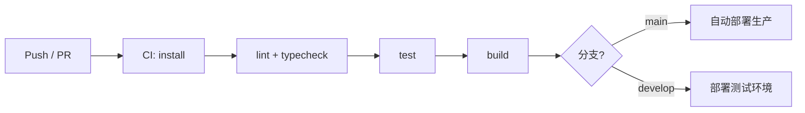
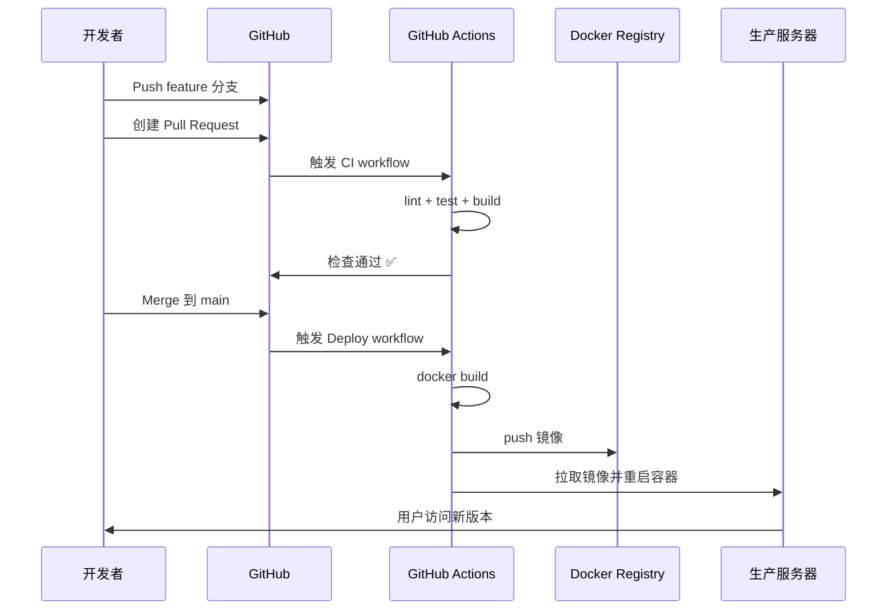
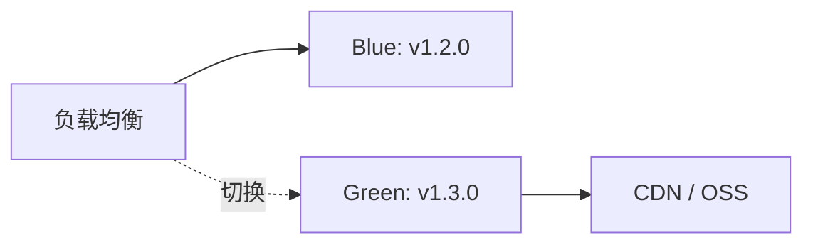

# 05 · CI/CD 与自动化部署

## CI/CD 基础概念

### 1.1 定义

| 术语 | 英文 | 含义 |
|------|------|------|
| CI | Continuous Integration | **持续集成**：频繁合并代码，自动构建和测试 |
| CD | Continuous Delivery / Deployment | **持续交付/部署**：自动发布到测试或生产环境 |

### 1.2 为什么需要 CI/CD？

**没有 CI/CD 时**：

1. 开发者本地跑一下「应该没问题」
2. 手动 build，手动上传 dist
3. 生产环境才发现依赖版本不对、lint 没过、测试挂了

**有 CI/CD 时**：



- 环境一致（CI 机器配置固定）
- 问题早发现（PR 阶段就拦截）
- 部署可重复、可回滚

---

## 流水线阶段拆解

| 阶段 | 输入 | 输出 | 失败即阻断 |
|------|------|------|------------|
| install | lock + package.json | node_modules | ✅ |
| lint | 源码 | 报告 | ✅ |
| typecheck | TS | 诊断 | ✅ |
| test | 源码 + 用例 | 覆盖率 | ✅ |
| build | 源码 | dist / image | ✅ |
| deploy | artifact | 线上版本 | 人工或自动 |

**并行化**：lint 与 typecheck 可同 job 顺序跑；test 与 build 可拆 job 并行（build 不依赖 test 时慎用）。

---

## GitHub Actions

### 3.1 是什么？

GitHub 内置的 CI/CD 平台，在仓库 `.github/workflows/` 下用 **YAML** 定义流水线。

### 3.2 核心概念

| 概念 | 说明 |
|------|------|
| Workflow | 一个完整的自动化流程 |
| Job | 一组步骤，可并行 |
| Step | 单个任务（checkout、run 命令等） |
| Action | 可复用的步骤单元 |
| Runner | 执行环境（GitHub 托管或自建） |

### 3.3 前端 CI 完整示例

**.github/workflows/ci.yml**：

```yaml
name: CI

on:
  push:
    branches: [main, develop]
  pull_request:
    branches: [main, develop]

concurrency:
  group: ${{ github.workflow }}-${{ github.ref }}
  cancel-in-progress: true

jobs:
  quality:
    runs-on: ubuntu-latest
    steps:
      - name: Checkout
        uses: actions/checkout@v4

      - name: Setup pnpm
        uses: pnpm/action-setup@v4
        with:
          version: 9

      - name: Setup Node.js
        uses: actions/setup-node@v4
        with:
          node-version: 20
          cache: 'pnpm'

      - name: Install dependencies
        run: pnpm install --frozen-lockfile

      - name: Lint
        run: pnpm lint

      - name: Type check
        run: pnpm typecheck

      - name: Unit tests
        run: pnpm test:run

      - name: Build
        run: pnpm build
        env:
          VITE_API_URL: https://api.example.com

      - name: Upload build artifacts
        uses: actions/upload-artifact@v4
        with:
          name: dist
          path: dist/
          retention-days: 7
```

### 3.4 自动部署示例

**.github/workflows/deploy.yml**：

```yaml
name: Deploy

on:
  push:
    branches: [main]

jobs:
  deploy:
    runs-on: ubuntu-latest
    steps:
      - uses: actions/checkout@v4

      - uses: pnpm/action-setup@v4
        with:
          version: 9

      - uses: actions/setup-node@v4
        with:
          node-version: 20
          cache: 'pnpm'

      - run: pnpm install --frozen-lockfile
      - run: pnpm build
        env:
          VITE_API_URL: ${{ secrets.VITE_API_URL }}

      # 示例：部署到服务器（SSH + rsync）
      - name: Deploy via SSH
        uses: appleboy/scp-action@v0.1.7
        with:
          host: ${{ secrets.DEPLOY_HOST }}
          username: ${{ secrets.DEPLOY_USER }}
          key: ${{ secrets.DEPLOY_SSH_KEY }}
          source: 'dist/*'
          target: '/var/www/html'
```

### 3.5 Secrets 管理

敏感信息（API Key、SSH 私钥）放在 **Repository Settings → Secrets and variables → Actions**，YAML 中用 `${{ secrets.XXX }}` 引用，**禁止**写进代码库。

### 3.6 常用 Action

| Action | 用途 |
|--------|------|
| `actions/checkout` | 拉取代码 |
| `actions/setup-node` | 安装 Node |
| `pnpm/action-setup` | 安装 pnpm |
| `actions/upload-artifact` | 保存构建产物 |
| `peaceiris/actions-gh-pages` | 部署到 GitHub Pages |

---

## Jenkins

### 4.1 是什么？

**Jenkins** 是开源、可自托管的 CI/CD 服务器，插件生态丰富，适合**企业内网**、需高度定制的场景。

### 4.2 与 GitHub Actions 对比

| 维度 | GitHub Actions | Jenkins |
|------|----------------|---------|
| 托管 | GitHub 云（免费额度） | 自建服务器 |
| 配置 | YAML 在仓库内 | UI + Jenkinsfile |
| 内网 / 私有部署 | 需 self-hosted runner | ✅ 天然适合 |
| 学习曲线 | 较低 | 较高 |
| 插件 | Marketplace Actions | 1800+ 插件 |

### 4.3 Jenkinsfile 示例

```groovy
pipeline {
  agent any

  tools {
    nodejs 'Node20'
  }

  stages {
    stage('Install') {
      steps {
        sh 'pnpm install --frozen-lockfile'
      }
    }
    stage('Quality') {
      parallel {
        stage('Lint') {
          steps { sh 'pnpm lint' }
        }
        stage('Typecheck') {
          steps { sh 'pnpm typecheck' }
        }
        stage('Test') {
          steps { sh 'pnpm test:run' }
        }
      }
    }
    stage('Build') {
      steps {
        sh 'pnpm build'
        archiveArtifacts artifacts: 'dist/**/*', fingerprint: true
      }
    }
    stage('Deploy') {
      when { branch 'main' }
      steps {
        sh './scripts/deploy.sh'
      }
    }
  }

  post {
    failure {
      echo 'Pipeline failed!'
    }
  }
}
```

### 4.4 何时选 Jenkins？

- 代码托管在 GitLab / Gitea 等，不用 GitHub
- 必须在内网构建，不能出网
- 需要与复杂企业内部系统（LDAP、审批流）集成

---

## Docker 容器化

### 5.1 为什么容器化前端？

- **环境一致**：Node 版本、构建命令封装在镜像里
- **部署简单**：`docker run` 即可
- **与后端同编排**：Kubernetes、Docker Compose 统一部署

### 5.2 多阶段构建 Dockerfile

前端是**静态文件**，典型做法：Node 阶段构建 → Nginx 阶段 Serving。

```dockerfile
# ========== 阶段 1：构建 ==========
FROM node:20-alpine AS builder

WORKDIR /app

RUN corepack enable && corepack prepare pnpm@9.0.0 --activate

COPY package.json pnpm-lock.yaml ./
RUN pnpm install --frozen-lockfile

COPY . .
ARG VITE_API_URL
ENV VITE_API_URL=$VITE_API_URL
RUN pnpm build

# ========== 阶段 2：运行 ==========
FROM nginx:1.25-alpine

COPY --from=builder /app/dist /usr/share/nginx/html
COPY nginx.conf /etc/nginx/conf.d/default.conf

EXPOSE 80

CMD ["nginx", "-g", "daemon off;"]
```

**nginx.conf**（SPA 路由支持）：

```nginx
server {
    listen 80;
    server_name localhost;
    root /usr/share/nginx/html;
    index index.html;

    gzip on;
    gzip_types text/plain text/css application/javascript application/json;

    location / {
        try_files $uri $uri/ /index.html;
    }

    location /api/ {
        proxy_pass http://backend:8080/;
        proxy_set_header Host $host;
        proxy_set_header X-Real-IP $remote_addr;
    }

    location ~* \.(js|css|png|jpg|jpeg|gif|ico|svg|woff2)$ {
        expires 1y;
        add_header Cache-Control "public, immutable";
    }
}
```

### 5.3 构建与运行

```bash
docker build -t my-frontend:latest --build-arg VITE_API_URL=https://api.example.com .
docker run -d -p 8080:80 my-frontend:latest
```

访问 `http://localhost:8080`。

### 5.4 Docker Compose（前后端一起）

```yaml
# docker-compose.yml
services:
  frontend:
    build:
      context: ./frontend
      args:
        VITE_API_URL: http://backend:8080
    ports:
      - '80:80'
    depends_on:
      - backend

  backend:
    image: my-backend:latest
    ports:
      - '8080:8080'
```

---

## 部署平台

### 6.1 自建 Nginx / 云服务器

**适用**：企业内网、完全自控、已有运维团队。

流程：

1. CI build 产出 `dist/`
2. rsync / scp 上传到服务器
3. Nginx 配置 root 指向 dist
4. SPA 配置 `try_files` 回退 `index.html`

**优点**：灵活、无平台限制  
**缺点**：运维成本高、HTTPS 证书需自行管理

### 6.2 Vercel

**适用**：React / Next.js / Vue 等现代框架，追求零配置。

```bash
npm i -g vercel
vercel
```

或在 GitHub 连接仓库，Push 自动部署。

| 优点 | 缺点 |
|------|------|
| 零配置、全球 CDN | 私有化部署有限 |
| Preview 部署（每个 PR 独立 URL） | 免费额度有限 |
| 自动 HTTPS | 国内访问可能较慢 |

**vercel.json**（SPA 回退）：

```json
{
  "rewrites": [{ "source": "/(.*)", "destination": "/index.html" }]
}
```

### 6.3 Netlify

与 Vercel 类似，静态站点 +  Serverless Functions。

```toml
# netlify.toml
[build]
  command = "pnpm build"
  publish = "dist"

[[redirects]]
  from = "/*"
  to = "/index.html"
  status = 200
```

### 6.4 GitHub Pages

免费托管静态站点，适合文档站、开源项目 Demo：

```yaml
- name: Deploy to GitHub Pages
  uses: peaceiris/actions-gh-pages@v3
  with:
    github_token: ${{ secrets.GITHUB_TOKEN }}
    publish_dir: ./dist
```

### 6.5 对象存储 + CDN

阿里云 OSS、腾讯云 COS、AWS S3 上传 `dist/`，前面挂 CDN：

- 成本低、扩展性好
- 需自行配置缓存策略、HTTPS、SPA 404 回源规则

### 6.6 平台选型参考

| 场景 | 推荐 |
|------|------|
| 个人项目 / 开源 Demo | Vercel、Netlify、GitHub Pages |
| 企业内网 | Nginx + Docker + 私有 K8s |
| 国内生产、要备案 | 云服务器 + OSS + CDN |
| Next.js SSR | Vercel 或自建 Node |

---

## 完整交付流程示例



### 7.1 环境划分

| 环境 | 分支 | 用途 |
|------|------|------|
| 开发 | feature/* | 本地 + 可选 Preview |
| 测试 | develop / test | QA 验证 |
| 预发 | release/* | 生产前最后验证 |
| 生产 | main | 真实用户 |

### 7.2 环境变量管理

| 环境 | 配置方式 |
|------|----------|
| 本地 | `.env.development`（不提交） |
| CI | GitHub Secrets / Jenkins Credentials |
| 生产 | 部署平台环境变量 / K8s ConfigMap |

**原则**：构建时注入的 `VITE_*` 会打进 JS 包，**不要**把真正秘密放进去；秘密走服务端 API。

---

## 部署最佳实践

### 8.1 缓存策略

```
index.html          → no-cache（始终拉最新入口）
app.[hash].js       → max-age=1y, immutable
app.[hash].css      → max-age=1y, immutable
```

Vite/Webpack 产物带 content hash，长缓存安全。

### 8.2 回滚

- Docker：保留上一版镜像 tag，`docker run` 旧 tag
- 静态部署：保留最近 N 个 dist 备份
- Git： revert commit 重新触发 CI

### 8.3 健康检查

```nginx
location /health {
    return 200 'ok';
    add_header Content-Type text/plain;
}
```

负载均衡器定期探测 `/health`。

### 8.4 错误监控

生产须接入 Sentry、Fundebug 等：

- 捕获 JS 运行时错误
- 未处理 Promise rejection
- 上报须脱敏（无 Token、无 PII）

---

## 常见问题 FAQ

### Q1：构建成功但页面空白？

检查 `base` 路径（Vite `base: '/subpath/'`）、资源 404、控制台报错。

### Q2：路由刷新 404？

SPA 须配置服务器回退到 `index.html`。

### Q3：环境变量在生产不生效？

`VITE_` 变量在 **build 时**注入，改变量须重新 build，不能改容器 env 了事。

### Q4：GitHub Actions 太慢？

启用 pnpm cache、并行 job、缩小 runner 任务范围。

### Q5：Docker 镜像太大？

多阶段构建、`.dockerignore` 排除 `node_modules`、用 alpine 基础镜像。

**.dockerignore**：

```
node_modules
dist
.git
*.md
.env*
```

---

## 发布策略与生产治理

### 10.1 部署模式对比

| 模式 | 原理 | 回滚速度 | 适用 |
|------|------|----------|------|
| **滚动发布** | 逐台替换实例 | 慢（需再滚一轮） | 默认 K8s Deployment |
| **蓝绿** | 两套环境切换流量 | **秒级**（切 LB） | 关键业务 |
| **金丝雀** | 5% → 50% → 100% 流量 | 快（切比例） | 需观察指标 |
| **Feature Flag** | 代码全量、功能开关 | 即时（关开关） | A/B、渐进放量 |

前端静态资源：**蓝绿 = 两套 dist 目录 / 对象存储 prefix**，LB 切换 root path；配合 **Feature Flag**（LaunchDarkly / 自研）解耦「部署」与「放量」。



### 10.2 多环境晋升流水线

```plaintext
feature/* → PR CI → merge develop → 部署 TEST
       → QA 通过 → merge release/* → 部署 STAGING
       → 审批 → merge main → 部署 PROD + Tag
```

**原则**：

- **构建一次，晋升产物**（同一 docker image tag / 同一 dist artifact）— 禁止 prod 重新 build
- 环境差异仅 **配置**（K8s ConfigMap / 环境变量），非重新编译
- 前端 `VITE_*` 在 build 时注入 → 须 **按环境分别 build** 或改用 **runtime config**（见下）

### 10.3 Runtime Config（避免 build 时写死 API）

**问题**：`VITE_API_URL` 打进 JS，12 套环境 = 12 次 build。

**方案**：`index.html` 或独立 `config.js` 由部署脚本注入：

```html
<!-- public/config.js — 部署时 sed 替换 -->
<script src="/config.js"></script>
```

```javascript
// config.js（部署生成，不进 Git）
window.__APP_CONFIG__ = { apiUrl: 'https://api.prod.example.com' };
```

```typescript
const apiUrl = window.__APP_CONFIG__?.apiUrl ?? import.meta.env.VITE_API_URL;
```

**权衡**：config.js 须 **no-cache**；secrets 仍不应放前端。

### 10.4 GitHub Actions 高阶用法

**矩阵构建**（多 Node 版本验证）：

```yaml
strategy:
  matrix:
    node: [18, 20, 22]
steps:
  - uses: actions/setup-node@v4
    with:
      node-version: ${{ matrix.node }}
```

**Reusable Workflow**（多仓共用 CI）：

```yaml
# .github/workflows/reusable-frontend-ci.yml
on:
  workflow_call:
    inputs:
      node-version:
        required: true
        type: string
```

**OIDC 免密钥云部署**（AWS / GCP）：

```yaml
permissions:
  id-token: write
  contents: read
- uses: aws-actions/configure-aws-credentials@v4
  with:
    role-to-assume: arn:aws:iam::xxx:role/deploy
```

避免长期 AK/SK 存 GitHub Secrets。

### 10.5 Kubernetes 部署 SPA

```yaml
apiVersion: apps/v1
kind: Deployment
metadata:
  name: frontend
spec:
  replicas: 3
  template:
    spec:
      containers:
        - name: nginx
          image: registry.example.com/frontend:1.3.0
          ports:
            - containerPort: 80
          readinessProbe:
            httpGet:
              path: /health
              port: 80
---
apiVersion: networking.k8s.io/v1
kind: Ingress
metadata:
  name: frontend
  annotations:
    nginx.ingress.kubernetes.io/ssl-redirect: 'true'
spec:
  rules:
    - host: app.example.com
      http:
        paths:
          - path: /
            pathType: Prefix
            backend:
              service:
                name: frontend
                port:
                  number: 80
```

**Ingress** 负责 TLS 终止、路由；Nginx 容器内 `try_files` 处理 SPA。

### 10.6 GitOps（Argo CD / Flux）

```plaintext
Git repo (manifests) ← 声明期望状态
        ↑
   Argo CD 同步
        ↓
   K8s 集群实际状态
```

前端镜像 tag 更新 = 改 manifest 中 `image: ...:1.3.0` → Argo 自动 rollout。  
**优势**：审计、回滚 = revert Git commit；与 CI build 解耦。

### 10.7 CDN 缓存与版本化

| 资源 | Cache-Control | 说明 |
|------|---------------|------|
| `index.html` | `no-cache` | 每次验证 ETag |
| `*.[hash].js/css` | `max-age=31536000, immutable` | 内容寻址，永久缓存 |
| `config.js` | `no-store` | 运行时配置 |

**purge 误操作**：全站 CDN purge 导致 thundering herd — 优先版本化 URL，少依赖 purge。

### 10.8 安全头（Nginx / Cloudflare）

```nginx
add_header Content-Security-Policy "default-src 'self'; script-src 'self'; style-src 'self' 'unsafe-inline'; img-src 'self' data: https:; connect-src 'self' https://api.example.com;" always;
add_header X-Frame-Options "SAMEORIGIN" always;
add_header X-Content-Type-Options "nosniff" always;
add_header Referrer-Policy "strict-origin-when-cross-origin" always;
add_header Permissions-Policy "camera=(), microphone=(), geolocation=()" always;
```

**CSP 落地**：Report-Only 模式先观察 → 再 enforce；Vite 内联 script 需 nonce 或 hash。

**SRI**（第三方 CDN 脚本）：

```html
<script src="https://cdn.example.com/lib.js"
  integrity="sha384-..."
  crossorigin="anonymous"></script>
```

### 10.9 DORA 指标（工程效能）

| 指标 | 含义 | 前端相关改进 |
|------|------|-------------|
| 部署频率 | 多久发一次版 | CI 自动化、Feature Flag |
| 变更前置时间 | commit → prod | 缓存、并行 CI、减少审批层 |
| 变更失败率 | 部署导致故障比例 | 金丝雀、E2E 门禁 |
| 恢复时间 MTTR | 故障恢复速度 | 蓝绿回滚、监控告警 |

### 10.10 事故响应 Runbook（模板）

1. **确认** — 监控 / 用户反馈；对比最近 deploy tag
2. **止损** — LB 切回上一版本 / 关 Feature Flag
3. **定位** — Source Map + Sentry 栈；是否仅特定 chunk
4. **修复** — hotfix 分支 → 加速 CI → 重新晋升
5. **复盘** — 根因、action item（补 E2E、补预算门禁）

---

## 小结

CI/CD 把**合并到主干**变成可重复的流水线：安装 → 静态检查 → 构建 → 测试 → 部署，任一步失败即阻断。

PR 触发 lint/typecheck/test/build；main 分支 deploy；缓存 pnpm store；Docker 多阶段构建静态资源；蓝绿/金丝雀降低发布风险。

**易混点**：CI 不 frozen lockfile；构建产物未 artifact 化；把 deploy token 写进仓库；E2E 不稳定却 gating 全流水线。

核对：流水线是否与 README 命令一致？回滚流程是否演练过？
