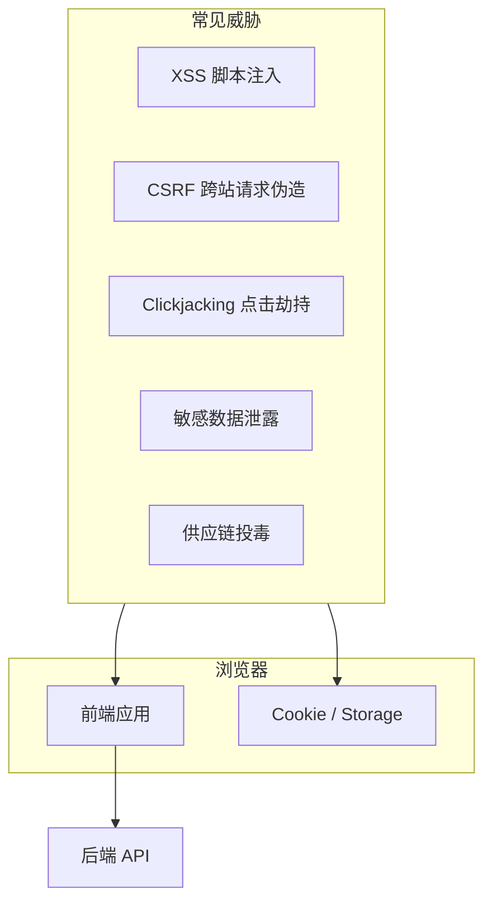
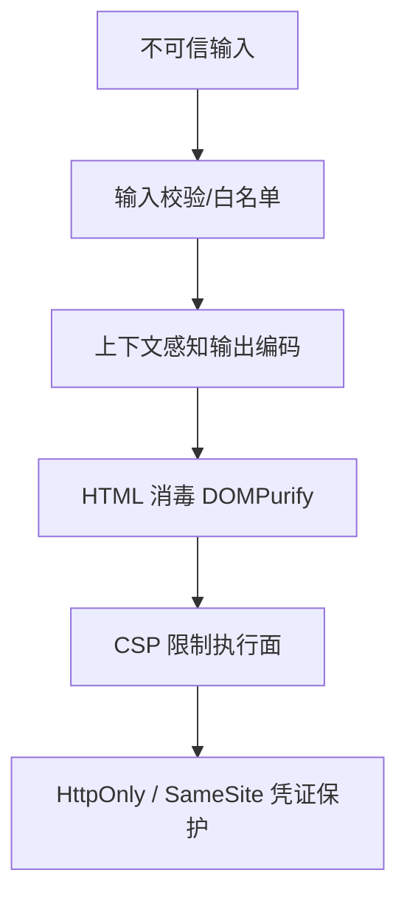

# 07 · 前端安全体系

## 前端在安全链中的位置

### 1.1 信任边界

浏览器中的 JavaScript 运行在**用户可控环境**里：恶意扩展、被 XSS 污染的页面、被篡改的 CDN 资源、开发者工具、中间人（无 HTTPS 时）都可能影响执行结果。因此：

- **鉴权与授权的最终判定必须在服务端** — 前端隐藏按钮、改路由不等于安全
- **前端职责**是缩小攻击面、正确编码输出、安全存放凭证、配合 CSP 与 Cookie 策略
- **纵深防御**：单点措施（例如只用 DOMPurify）不能替代多层防护



### 1.2 OWASP Top 10 与前端关联（扩展）

| 风险类别 | 前端典型诱因 | 工程化应对方向 |
|----------|--------------|----------------|
| 注入（A03） | XSS、模板注入、URL 注入 | 输出编码、CSP、禁止危险 API |
| 失效访问控制（A01） | 仅前端路由守卫 | 接口级鉴权、RBAC 服务端校验 |
| 安全配置错误（A05） | 缺 CSP、debug 上线、CORS `*` | 安全头、环境隔离 |
| 加密失败（A02） | HTTP 明文、弱 Token 策略 | 全站 HTTPS、HttpOnly Cookie |
|  SSRF / 其他 | 前端较少直接触发 | 上传 URL 白名单等 |

---

## XSS（跨站脚本）全面解析

### 2.1 什么是 XSS

攻击者将**可执行脚本**注入页面，在受害者浏览器中运行，可窃取 Cookie/Token、篡改 DOM、发起恶意请求、键盘记录、钓鱼。

### 2.2 三大经典类型

#### （1）存储型 XSS（Stored / Persistent）

**机理**：恶意 payload 被**持久化**到服务端（数据库、文件、缓存），其他用户访问页面时服务端返回已含脚本的 HTML。

**典型场景**：

- 评论区、论坛帖子、工单描述
- 用户昵称、个人简介
- 后台 CMS 富文本字段
- IM 消息、通知内容

**攻击链**：

```plaintext
攻击者提交评论: 
       ↓
服务端未消毒直接存 DB
       ↓
受害者打开帖子 → 脚本在其会话下执行 → 会话劫持
```

**特点**：危害面大、一次注入多人受害、易被 WAF 样本库收录后仍可能变种绕过。

#### （2）反射型 XSS（Reflected / Non-Persistent）

**机理**：恶意 payload 在**请求中**（URL 参数、表单、Header），服务端**原样反射**到响应 HTML，不持久存储。

**典型场景**：

```plaintext
https://search.example.com/q=<script>alert(1)</script>
https://error.example.com?msg=
```

**攻击链**：攻击者构造恶意链接 → 社交工程诱骗点击 → 脚本在受害者浏览器执行。

**特点**：需诱导点击；常出现在搜索、错误页、跳转页。

#### （3）DOM 型 XSS（DOM-based）

**机理**：**纯客户端** JavaScript 将不可信数据写入 DOM，**不经过服务端**反射。服务端日志可能完全看不到 payload。

**典型代码（危险）**：

```javascript
// location 来源
document.getElementById('out').innerHTML = location.hash.slice(1);

// document.write
document.write(decodeURIComponent(location.search));

// eval 类
eval('var x = "' + userInput + '"');

// jQuery 历史写法
$('#box').html(urlParam);
```

**React/Vue 中的 DOM 型风险点**：

```tsx
// ❌ 将 URL 参数直接灌进 dangerouslySetInnerHTML
<div dangerouslySetInnerHTML={{ __html: new URLSearchParams(location.search).get('content') }} />

// ❌ href 未校验协议
<a href={userSuppliedUrl}>链接</a>  // javascript:alert(1)
```

**特点**：传统 WAF 难以拦截；SPA 路由、客户端模板增多后更常见。

### 2.3 其他 XSS 变体（需知晓）

| 变体 | 说明 |
|------|------|
| **mXSS（突变 XSS）** | 浏览器 HTML 解析器消毒后结构「突变」再次产生脚本；sanitizer 与浏览器解析差异导致 |
| **Blind XSS** | payload 存入后台/日志系统，管理员查看时触发 |
| **Universal XSS (UXSS)** | 浏览器或扩展漏洞，非站点代码问题 |
| **Self-XSS** | 攻击者诱导用户自己在控制台粘贴代码；偏社会工程，仍须用户教育 |
| **CSS 注入** | 注入 `<style>` 或属性导致数据 exfil（如 background-url） |
| **JSONP / postMessage XSS** | 不校验 callback 名或 message origin |

### 2.4 XSS 常用 Payload 形态（用于防御测试）

防御须覆盖不仅是 `<script>alert(1)</script>`：

```html
<!-- 事件处理器 -->

<svg onload="...">
<body onpageshow="...">

<!-- 伪协议 -->
<a href="javascript:alert(1)">
<iframe src="javascript:...">

<!-- 编码绕过 -->

<script>alert(String.fromCharCode(88,83,83))</script>

<!-- 标签 breaking -->
"><script>...</script>


<!-- data: URI -->
<object data="data:text/html,<script>..."></object>
```

**测试建议**：使用 OWASP XSS Filter Evasion Cheat Sheet 思路做回归；自动化 DAST + 手工 payload。

---

## XSS 防御体系（分层）



### 3.1 第一层：输出编码（Context-Aware Encoding）

**核心原则**：在**正确的上下文**对不可信数据编码，而非一律 HTML escape。

| 输出上下文 | 编码要求 | 错误示例 |
|------------|----------|----------|
| HTML 文本节点 | HTML 实体编码 `&lt;` `&gt;` `&amp;` `&quot;` | 未编码 `<` |
| HTML 属性值 | 属性编码 + 引号包裹 | `href=javascript:...` |
| JavaScript 字符串 | JS Unicode/hex 转义 | 字符串拼接进 script |
| URL / href / src | URL 编码 + **协议白名单** | `javascript:` `data:` |
| CSS | CSS 编码，禁止 expression | url 外带 |

**React**：JSX 默认对 `{expr}` 做 HTML 转义（文本节点安全）。  
**Vue**：`{{ expr }}` 同理。  
**不安全 API**：

| 框架 | 危险 API |
|------|----------|
| React | `dangerouslySetInnerHTML`、未校验的 `href`/`src` |
| Vue | `v-html`、动态 `:href` |
| 原生 | `innerHTML`、`outerHTML`、`document.write`、`eval` |

### 3.2 第二层：输入校验（Input Validation）

- **白名单优于黑名单**：允许字符集、长度、格式（如 UUID、数字）
- **服务端必须校验** — 前端校验仅为 UX
- 富文本：只允许标签白名单（`p`、`b`、`a`…），禁止 `script`、`iframe`、`on*` 属性

```typescript
function isSafeHttpUrl(url: string): boolean {
  try {
    const u = new URL(url, window.location.origin);
    return u.protocol === 'http:' || u.protocol === 'https:';
  } catch {
    return false;
  }
}
```

### 3.3 第三层：HTML 消毒（Sanitization）

富文本等**必须保留 HTML** 的场景，使用成熟库 + 严格配置：

```typescript
import DOMPurify from 'dompurify';

const clean = DOMPurify.sanitize(dirtyHtml, {
  ALLOWED_TAGS: ['p', 'br', 'strong', 'em', 'a', 'ul', 'ol', 'li', 'h1', 'h2', 'h3'],
  ALLOWED_ATTR: ['href', 'title', 'target', 'rel'],
  ALLOW_DATA_ATTR: false,
  ADD_ATTR: ['target'],
});

// 强制外链安全
DOMPurify.addHook('afterSanitizeAttributes', (node) => {
  if (node.tagName === 'A') {
    node.setAttribute('rel', 'noopener noreferrer');
    if (node.getAttribute('target') === '_blank') {
      // 保持 rel
    }
  }
});
```

**注意**：

- 服务端再次消毒（双重保险）
- 关注 DOMPurify 版本 CVE，及时升级
- mXSS：保持 sanitizer 更新；避免消毒后再经浏览器「修复」插入

### 3.4 第四层：Content-Security-Policy（CSP）

即使存在注入点，CSP 限制脚本来源，使攻击难以执行。

**关键指令**：

| 指令 | 作用 |
|------|------|
| `default-src` | 默认策略 |
| `script-src` | JS 来源；`'nonce-xxx'` / `'sha256-...'` 替代 unsafe-inline |
| `object-src 'none'` | 禁 Flash 等 |
| `base-uri 'self'` | 防 base 标签改相对 URL |
| `frame-ancestors` | 防点击劫持（替代 X-Frame-Options） |
| `upgrade-insecure-requests` | HTTP 资源升 HTTPS |

**Report-Only 上线流程**：

```http
Content-Security-Policy-Report-Only: script-src 'self'; report-uri /api/csp-report
```

收集违规 → 修正 inline/第三方域名 → 切换 enforce。

**Vite 生产 nonce 思路**（概念）：

```typescript
// 服务端渲染 index.html 时注入
// <script nonce="${nonce}" src="/assets/index.js">
// CSP: script-src 'self' 'nonce-${nonce}';
```

### 3.5 第五层：Trusted Types（现代浏览器）

```javascript
// 强制 sink 走策略
if (window.trustedTypes && trustedTypes.createPolicy) {
  trustedTypes.createPolicy('default', {
    createHTML: (input) => DOMPurify.sanitize(input),
    createScriptURL: (url) => {
      if (url.startsWith('https://cdn.example.com/')) return url;
      throw new TypeError('Invalid script URL');
    },
  });
}
```

配合 CSP：`require-trusted-types-for 'script'`。

### 3.6 第六层：Cookie / Token 保护（降低 XSS 影响）

XSS 成功后的「损害半径」取决于凭证是否可被 JS 读取：

| 存储方式 | XSS 成功后 | 建议 |
|----------|------------|------|
| HttpOnly + Secure Cookie | JS **无法**直接读 Session ID | 会话型登录优先 |
| localStorage JWT | **可被** `localStorage.getItem` 窃取 | 必须强 CSP + 短过期 + 防 XSS |
| 内存 Token | 刷新丢失，窗口期内可读 | 配合 Refresh HttpOnly |

**禁止**：把长期 Refresh Token 无保护放 localStorage。

### 3.7 编码与 API 禁用清单

**禁止或严格审计**：

- `eval`、`new Function`、`setTimeout(string)`、`setInterval(string)`
- `innerHTML` / `outerHTML` / `insertAdjacentHTML` 写入不可信数据
- `document.write`
- 动态 `<script src>` 未校验 URL
- 第三方 `postMessage` 不校验 `event.origin`

---

## CSRF（跨站请求伪造）全面解析

### 4.1 什么是 CSRF

利用浏览器**自动携带 Cookie** 的机制，诱使已登录用户在**不知情**下向目标站点发起**已认证**请求。

**与 XSS 区别**：

| | XSS | CSRF |
|---|-----|------|
| 需要执行脚本 | 是 | 否（可用表单/img 等） |
| 读取响应 | 可以 | 跨域通常不能读 |
| 目的 | 盗数据、控页面 | 冒用身份发请求 |

### 4.2 典型攻击流程

```plaintext
1. 用户登录 bank.com，Session Cookie 写入浏览器
2. 用户访问 evil.com（或打开恶意邮件页面）
3. evil.com 页面含:
   <form action="https://bank.com/transfer" method="POST">
     <input name="to" value="attacker" />
     <input name="amount" value="10000" />
   </form>
   <script>document.forms[0].submit()</script>
4. 浏览器带 bank.com 的 Cookie 提交 → 服务端认为是用户本人操作
```

**GET 请求 CSRF**（应禁止用 GET 改状态）：

```html

```

### 4.3 防御措施（须组合使用）

#### （1）SameSite Cookie

```http
Set-Cookie: SESSION=abc; Path=/; Secure; HttpOnly; SameSite=Lax
```

| 值 | 跨站顶级导航 GET | 跨站 POST / iframe / AJAX |
|----|------------------|---------------------------|
| **Strict** | 不发送 Cookie | 不发送 |
| **Lax**（默认推荐） | 发送（如链接跳转） | **不发送** |
| **None** | 发送（须 `Secure`） | 发送 |

**局限**：Lax 无法防「顶级导航 GET 改状态」；旧浏览器不支持；跨子域场景需细配。

#### （2）CSRF Token（Synchronizer Token）

服务端生成随机 Token，嵌入表单或 Header；提交时校验。

```html
<form method="POST" action="/transfer">
  <input type="hidden" name="_csrf" value="RANDOM_TOKEN" />
  ...
</form>
```

```typescript
// axios 全局携带
axios.interceptors.request.use((config) => {
  if (['post', 'put', 'patch', 'delete'].includes(config.method ?? '')) {
    config.headers['X-CSRF-Token'] = getCsrfTokenFromMetaOrCookie();
  }
  return config;
});
```

**Double Submit Cookie 模式**：Cookie 存 Token，请求头/表单带同值；服务端比对（须防 Cookie 被子域覆盖，设置 `__Host-` 前缀 Cookie 更安全）。

#### （3）验证 Origin / Referer

```javascript
// 服务端伪代码
const origin = request.headers.origin || deriveFromReferer(request.headers.referer);
if (origin !== 'https://app.example.com') {
  return 403;
}
```

**注意**：Referer 可能被隐私策略剥离；HTTPS→HTTP 降级时 Referer 丢失；应作**辅助**手段。

#### （4）自定义 Header

```typescript
axios.defaults.headers.common['X-Requested-With'] = 'XMLHttpRequest';
```

**原理**：跨域简单请求无法随意加自定义 Header，预检 CORS 会拦截恶意站点。  
**局限**：不是 CSRF 专用方案；依赖 CORS 正确配置；不能替代 Token。

#### （5）业务层重认证

转账、改密、绑手机等操作要求：二次密码、OTP、WebAuthn — 即使 CSRF 也无法代填。

#### （6）避免 GET 修改状态

REST 规范 + 安全基线：**GET 幂等只读**；写操作用 POST/PUT/DELETE + Token。

### 4.4 前端 CSRF 配合清单

- [ ] 所有写操作走 POST/PUT/PATCH/DELETE
- [ ] 从服务端获取 CSRF Token 并随请求发送
- [ ] Cookie 会话方案确认 SameSite 策略
- [ ] 跨域 API 若用 Cookie，CORS `Allow-Credentials` + 明确 Origin 白名单
- [ ] 敏感操作 UI 二次确认（不能单独防 CSRF，提升可见性）

### 4.5 CORS 与 CSRF 的关系（易混淆）

- **CORS** 限制：恶意站点**读取**跨域响应
- **CORS 不阻止**带 Cookie 的**请求发出**
- 因此：**CSRF 不能靠 CORS 单独解决**

---

## 点击劫持（Clickjacking）

### 5.1 机理

恶意站点用透明 `iframe` 套目标页面，诱骗用户点击「领奖」实际点到「确认转账」。

### 5.2 防御

```http
Content-Security-Policy: frame-ancestors 'self';
X-Frame-Options: SAMEORIGIN
```

JS 破框（`if (top !== self) top.location = self.location`）不可靠，仅作补充。

---

## 开放重定向（Open Redirect）

```plaintext
https://trusted.com/login?redirect=https://evil.com/phish
```

**防御**：

- 重定向 URL 白名单（同源路径或预注册域名）
- 禁止完全开放 `?next=` 参数

```typescript
function safeRedirect(next: string): string {
  if (next.startsWith('/') && !next.startsWith('//')) return next;
  return '/';
}
```

---

## postMessage 安全

跨窗口通信须校验来源：

```typescript
window.addEventListener('message', (event) => {
  if (event.origin !== 'https://trusted.example.com') return;
  const data = event.data;
  // 仍须校验 data 结构与类型
});
```

`targetOrigin` 勿用 `'*'` 发送敏感数据。

---

## 原型链污染（Prototype Pollution）

恶意 JSON merge 污染 `Object.prototype`：

```javascript
// 危险：深度 merge 未过滤 __proto__
deepMerge({}, JSON.parse(userInput));
```

**防御**：使用无原型对象 `Object.create(null)`、冻结原型、`lodash` 升级 patched 版本、禁止 merge 用户可控 key `__proto__`、`constructor`。

---

## Content-Security-Policy 完整实践

### 9.1 生产推荐基线

```nginx
add_header Content-Security-Policy "
  default-src 'self';
  script-src 'self' 'nonce-$request_id';
  style-src 'self' 'unsafe-inline';
  img-src 'self' data: https:;
  font-src 'self' https://fonts.gstatic.com;
  connect-src 'self' https://api.example.com wss://ws.example.com;
  frame-src 'self' https://trusted-widget.com;
  frame-ancestors 'self';
  base-uri 'self';
  form-action 'self';
  object-src 'none';
  upgrade-insecure-requests;
" always;
```

### 9.2 第三方脚本

统计、客服、地图 SDK 须**逐个**加入 allowlist；优先 **nonce/hash** 而非 `'unsafe-inline'`。  
`'unsafe-eval'` 仅当构建工具强制要求，尽量消除（生产不用 eval）。

### 9.3 SRI（Subresource Integrity）

```html
<script
  src="https://cdn.example.com/lib.js"
  integrity="sha384-oqVuAfXRKap7fdgcCY5uykM6+R9GqQ8K/uxy9rx7HNQlGYl1kPzQho1wx4JwY8wC"
  crossorigin="anonymous"
></script>
```

CDN 被篡改时浏览器拒绝执行。

---

## 认证、Token 与 Secrets

### 10.1 方案对比

| 方案 | 适用 | XSS | CSRF | 备注 |
|------|------|-----|------|------|
| HttpOnly Session Cookie | 传统 Web | 低窃取 | 需 Token/SameSite | BFF 模式友好 |
| HttpOnly Refresh + 内存 Access | SPA 主流 | Access 可读窗口短 | Refresh 防 CSRF | 推荐 |
| localStorage JWT | 纯 SPA | **高** | 低 | 须极严 CSP |
| OAuth PKCE | 第三方登录 | 依实现 | 依实现 | 禁 implicit 流 |

### 10.2 环境变量

```bash
# 会进入客户端 bundle — 仅非敏感配置
VITE_API_BASE_URL=https://api.example.com
VITE_SENTRY_DSN=https://...

# 永不进前端仓库与 VITE_ 变量
API_SECRET=...
DB_PASSWORD=...
```

### 10.3 其他安全响应头

```nginx
add_header Strict-Transport-Security "max-age=31536000; includeSubDomains" always;
add_header X-Content-Type-Options "nosniff" always;
add_header X-Frame-Options "SAMEORIGIN" always;
add_header Referrer-Policy "strict-origin-when-cross-origin" always;
add_header Permissions-Policy "camera=(), microphone=(), geolocation=()" always;
add_header Cross-Origin-Opener-Policy "same-origin" always;
add_header Cross-Origin-Resource-Policy "same-origin" always;
```

---

## 供应链安全

### 11.1 npm 依赖风险

- **恶意包**：拼写相似 typosquatting
- **账号劫持**：维护者 npm 令牌泄露
- **传递依赖 CVE**：深层依赖漏洞

### 11.2 工程措施

```bash
pnpm audit
pnpm audit --audit-level=high
pnpm why suspicious-package
```

| 措施 | 说明 |
|------|------|
| lock 文件 + CI frozen install | 防版本漂移投毒 |
| Dependabot / Renovate | 自动升级 PR |
| `pnpm.overrides` | 紧急锁安全版本 |
| 私有 registry 代理 | 扫描缓存 |
| 新增依赖 Review | 看下载量、维护者、源码体积、postinstall 脚本 |
| 禁止 postinstall 跑网络请求 | `.npmrc` `ignore-scripts=true` 评估 |

### 11.3 事件响应

CVE 披露 → overrides 锁版本 → 全仓 lock 更新 → CI 全绿 → 热修发布 → 复盘是否可移除 overrides。

---

## 安全开发与测试

### 12.1 编码 Checklist

- [ ] 默认输出编码；富文本 DOMPurify + 服务端二次消毒
- [ ] URL 协议白名单（http/https/mailto/tel）
- [ ] 无未审计 `dangerouslySetInnerHTML` / `v-html`
- [ ] 写接口 CSRF Token；Cookie SameSite
- [ ] 敏感操作二次认证
- [ ] postMessage 校验 origin
- [ ] 上传：扩展名+MIME+大小+服务端存储隔离
- [ ] 外链 `rel="noopener noreferrer"`

### 12.2 测试手段

| 手段 | 用途 |
|------|------|
| OWASP ZAP / Burp | DAST 扫描 XSS/CSRF |
| eslint-plugin-no-unsanitized | 检测 DOM XSS sink |
| 依赖 audit CI 门禁 | CVE |
| 渗透测试 | 上线前/年度 |

---

## 安全事件响应

1. **检测** — WAF、Sentry 异常、用户报告、依赖告警  
2. **遏制** — 下线入口、吊销会话、WAF 规则、回滚发布  
3. **根除** — 补丁、升级、CSP 收紧  
4. **恢复** — 验证、监控加强  
5. **复盘** — 时间线、根因、Action Items、更新 Checklist  

---

## CSP 指令速查表

| 指令 | 控制范围 |
|------|----------|
| `default-src` | 默认 fallback |
| `script-src` | JS（inline、eval） |
| `style-src` | CSS |
| `img-src` | 图片 |
| `connect-src` | fetch、XHR、WebSocket |
| `frame-ancestors` | 防点击劫持 |
| `form-action` | 表单提交目标 |
| `object-src` | 建议 `'none'` |
| `report-to` | 违规上报 |

上线前可用 `Content-Security-Policy-Report-Only` 观察 1–2 周再 enforce。

---

## OAuth 2.0 + PKCE（SPA）

```plaintext
1. 生成 code_verifier / code_challenge
2. 跳转 authorize?response_type=code&code_challenge=...
3. 回调 ?code=... + 校验 state
4. 用 code + verifier 换 token（推荐经 BFF）
5. Access 存内存；Refresh 用 HttpOnly Cookie
```

禁止 Implicit Flow；`state` 防 CSRF。

---

## FAQ

**Q：只用 React 是不是就不会 XSS？**  
否。`dangerouslySetInnerHTML`、不安全 URL、第三方库 DOM 操作、服务端渲染注入仍可导致 XSS。

**Q：CSP 的 unsafe-inline 能不能留？**  
尽量消除；短期可用 nonce/hash 过渡；unsafe-inline 大幅削弱防护。

**Q：Double Submit Cookie 够吗？**  
子域 Cookie 覆盖、Content-Type 绕过等历史问题需正确实现；高安全场景仍推荐 Synchronizer Token。

**Q：HTTPS 够吗？**  
不够。HTTPS 防窃听与篡改传输层；XSS/CSRF 是应用层问题。

---

## 小结

前端安全侧重**缩小攻击面**：输入不可信、输出要编码、凭证不落地前端、CSP 限制脚本来源，供应链与依赖 audit 同属防线。

XSS 用转义 + CSP；CSRF 用 SameSite/Token；JWT 放 httpOnly cookie 优于 localStorage；SRI 校验 CDN；npm audit + overrides。

**易混点**：dangerouslySetInnerHTML；把 API Key 打进 bundle；CORS 不是认证；仅前端校验等于无校验。

核对：CSP 是否 report-only 试过？敏感路由是否强制 HTTPS？
