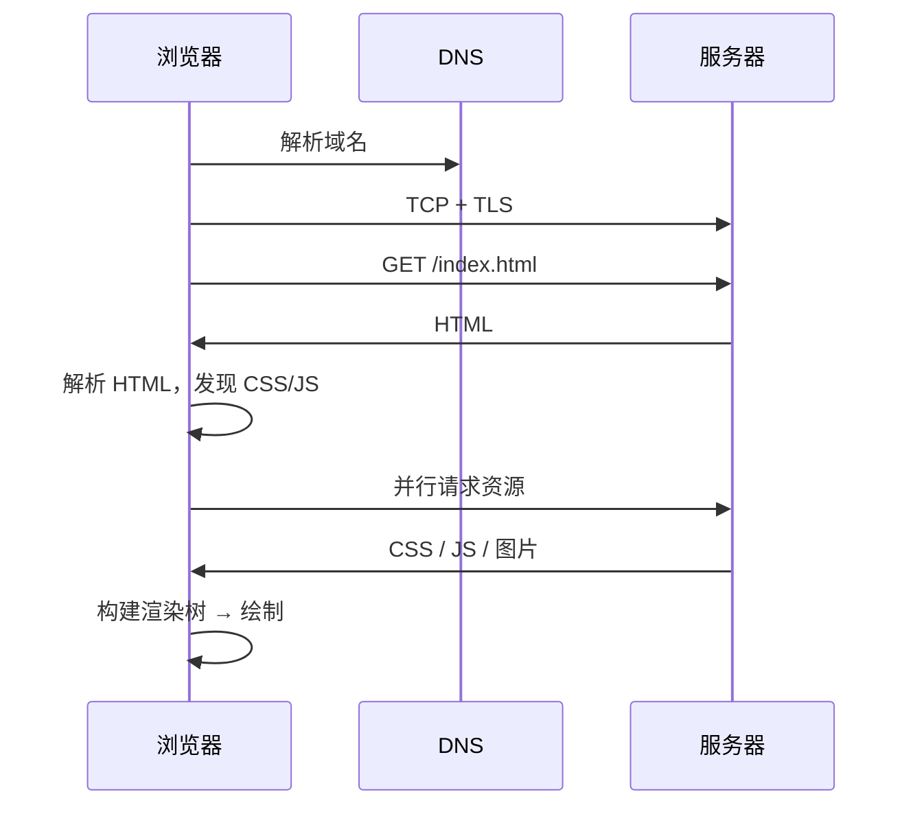
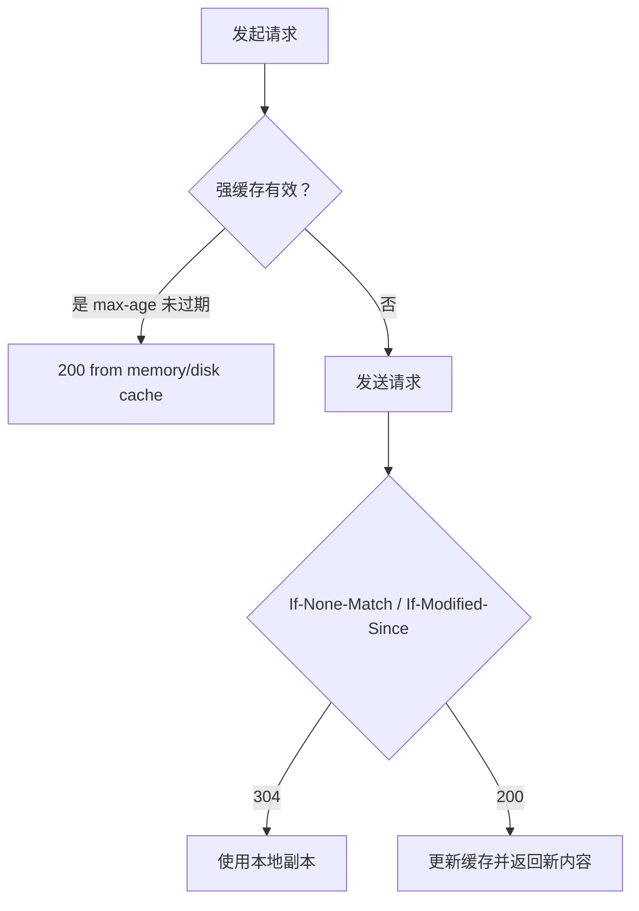

# 08 · 浏览器与网络基础

## 从 URL 到页面的完整链路

### 1.1 各阶段耗时（典型）

| 阶段 | 说明 | 优化方向 |
|------|------|----------|
| DNS 解析 | 域名 → IP | DNS 预解析 `dns-prefetch`、减少跨域 |
| TCP 握手 | 三次握手建立连接 | 连接复用、HTTP/2/3 |
| TLS 握手 | HTTPS 证书协商 | TLS 1.3、会话复用 |
| 发送请求 | HTTP Request | 减小 Header、HTTP/2 多路复用 |
| 等待响应 | TTFB | CDN、SSR、后端性能 |
| 下载内容 | 传输 body | 压缩 Brotli、体积优化 |
| 解析与渲染 | DOM/CSS/JS/Layout | 关键路径优化 |

### 1.2 DNS 解析

浏览器查缓存（浏览器缓存 → OS 缓存 → hosts → 递归 DNS 服务器）。

```html
<link rel="dns-prefetch" href="https://api.example.com" />
<link rel="preconnect" href="https://api.example.com" crossorigin />
```

`preconnect` 比 `dns-prefetch` 多完成 TCP+TLS，适合确定会请求的 API 域。

### 1.3 TCP 与 TLS

**TCP 三次握手**：SYN → SYN-ACK → ACK。  
**TLS 1.3**：通常 1-RTT 完成握手（首次或会话票据失效时更多）。

HTTPS 页面若大量小资源且未复用连接，握手开销显著 — HTTP/2 默认多路复用单连接缓解此问题。

### 1.4 流程总览



---

## HTTP 协议要点

### 2.1 HTTP/1.1 vs HTTP/2 vs HTTP/3

| 版本 | 特点 |
|------|------|
| HTTP/1.1 | 文本协议；同域连接数限制（浏览器约 6 条）；队头阻塞 |
| HTTP/2 | 二进制分帧、单连接多路复用、头部压缩 HPACK、Server Push（少用） |
| HTTP/3 | 基于 QUIC（UDP），解决传输层队头阻塞，弱网更稳 |

前端工程化：静态资源走 CDN 且启用 HTTP/2 是常态；DevTools Network 的 **Protocol** 列可确认。

### 2.2 请求与响应结构

```http
GET /api/users?page=1 HTTP/1.1
Host: api.example.com
Accept: application/json
Authorization: Bearer eyJ...
Accept-Encoding: gzip, deflate, br
Cache-Control: no-cache
```

```http
HTTP/1.1 200 OK
Content-Type: application/json; charset=utf-8
Cache-Control: private, max-age=60
ETag: "abc123"
Content-Encoding: br
```

### 2.3 常用请求头（前端须理解）

| Header | 作用 |
|--------|------|
| `Accept` | 期望响应类型 |
| `Authorization` | 认证凭证 |
| `Content-Type` | 请求体格式 |
| `Cache-Control` | 缓存策略 |
| `If-None-Match` | 协商缓存（ETag） |
| `Origin` | CORS 来源标识 |
| `Referer` | 来源页 URL |

### 2.4 方法与幂等性

| 方法 | 幂等 | 安全（不改状态） | 典型 body |
|------|------|------------------|-----------|
| GET | 是 | 是 | 无 |
| POST | 否 | 否 | 有 |
| PUT | 是 | 否 | 有 |
| PATCH | 否 | 否 | 有 |
| DELETE | 是 | 否 | 可选 |

**安全实践**：GET 不得修改服务端状态（防 CSRF 与爬虫误触）。

### 2.5 状态码处理（前端实现参考）

```typescript
async function handleResponse(res: Response) {
  if (res.status === 304) return getCachedBody(res.url);
  if (res.status === 401) return redirectToLogin();
  if (res.status === 403) throw new ForbiddenError();
  if (res.status === 429) return retryWithBackoff();
  if (res.status >= 500) throw new ServerError(res.status);
  if (!res.ok) throw new ApiError(res.status, await res.text());
  return res.json();
}
```

---

## DOM、CSSOM 与渲染 pipeline

### 3.1 构建过程

```plaintext
HTML 字节流 → Tokenizer → DOM Tree
CSS  字节流 → Tokenizer → CSSOM Tree
                              ↓
                    Render Tree（可见节点 + 计算样式）
                              ↓
                         Layout（回流/重排）
                              ↓
                         Paint（绘制）
                              ↓
                         Composite（图层合成）
```

### 3.2 阻塞关系

| 资源 | 阻塞 DOM 解析 | 阻塞渲染 |
|------|---------------|----------|
| CSS | 否（并行下载） | **是** |
| JS（classic，无 defer/async） | **是** | 间接 |
| JS defer | 否（DOMContentLoaded 前执行） | 延迟执行 |
| JS async | 否 | 下载完即执行，顺序不确定 |
| JS type=module | 默认 defer 行为 | 同 defer |

```html
<link rel="stylesheet" href="critical.css" />
<script defer src="app.js"></script>
<script async src="analytics.js"></script>
```

### 3.3 Reflow、Repaint、Composite

| 操作 | 触发 | 相对成本 |
|------|------|----------|
| 改 width/height/margin | Reflow + Repaint | 高 |
| 改 color/background | Repaint | 中 |
| 改 transform/opacity（合成层） | Composite | 低 |

**Layout Thrashing 示例**：

```javascript
// ❌ 每次读 offsetWidth 可能强制同步 layout
for (const el of elements) {
  el.style.width = el.offsetWidth + 10 + 'px';
}

// ✅ 读写分离
const widths = elements.map((el) => el.offsetWidth);
elements.forEach((el, i) => {
  el.style.width = widths[i] + 10 + 'px';
});
```

### 3.4 图层与 will-change

`transform: translateZ(0)` / `will-change: transform` 可提升为合成层，但滥用占 GPU 内存。仅在动画元素短期使用。

---

## 浏览器缓存（详解）

### 4.1 决策流程



```plaintext
发起请求
  → 强缓存有效？（Cache-Control: max-age 未过期 / Expires）
      是 → 200 from memory cache / disk cache（不发请求）
      否 → 发请求
          → 带 If-None-Match / If-Modified-Since
          → 304 Not Modified → 用本地副本
          → 200 → 更新缓存
```

### 4.2 Cache-Control 指令全集（常用）

| 指令 | 含义 |
|------|------|
| `max-age=N` | 强缓存 N 秒 |
| `s-maxage=N` | 共享缓存（CDN）专用 |
| `no-cache` | 可存但每次必须验证（常配合 ETag） |
| `no-store` | 禁止存储 |
| `private` | 仅浏览器可缓存 |
| `public` | CDN 可缓存 |
| `immutable` | 内容不变，浏览器不验证 |
| `must-revalidate` | 过期后必须向源验证 |

**静态前端推荐策略**：

```nginx
# index.html — 入口始终验证
location = /index.html {
  add_header Cache-Control "no-cache";
}

# 带 hash 静态资源
location /assets/ {
  add_header Cache-Control "public, max-age=31536000, immutable";
}
```

### 4.3 ETag 与 Last-Modified

```http
# 首次响应
ETag: "W/\"5f3a2b1c\""
Last-Modified: Wed, 01 Jan 2025 08:00:00 GMT

# 再次请求
If-None-Match: W/"5f3a2b1c"
If-Modified-Since: Wed, 01 Jan 2025 08:00:00 GMT
```

ETag 对动态压缩内容更准；`W/` 弱验证允许语义等价小幅差异。

### 4.4 用户刷新行为

- 普通 F5：可能带 `Cache-Control: max-age=0` 触发验证
- Ctrl+F5：强制绕过缓存重新下载

---

## Cookie 与 Web Storage

### 5.1 Cookie 属性详解

```http
Set-Cookie: SESSION=abc123; Path=/; Domain=.example.com; Max-Age=86400; Secure; HttpOnly; SameSite=Lax
```

| 属性 | 说明 |
|------|------|
| `HttpOnly` | JS `document.cookie` 不可读，防 XSS 窃取 |
| `Secure` | 仅 HTTPS 发送 |
| `SameSite=Strict/Lax/None` | 跨站是否携带；`None` 须配 `Secure` |
| `Domain` | 生效域；设 `.example.com` 则子域共享 |
| `Path` | 路径前缀 |
| `Max-Age` / `Expires` | 过期 |
| `__Host-` 前缀 | 须 Secure、Path=/、无 Domain，防子域覆盖 |

### 5.2 localStorage / sessionStorage / IndexedDB

| API | 生命周期 | 容量 | 同步 API |
|-----|----------|------|----------|
| sessionStorage | Tab 关闭清除 | ~5MB | 是 |
| localStorage | 持久 | ~5MB | 是 |
| IndexedDB | 持久 | 大 | 异步 |

**安全**：localStorage 可被 XSS 读取 — 勿存长期 Refresh Token。

---

## 同源策略与 CORS

### 6.1 同源定义

`https://app.example.com:443` 与 `https://api.example.com` **不同源**（host 不同）。

同源策略限制：

- 读取跨域 iframe DOM
- 访问跨域窗口的某些属性
- XHR/fetch 读取跨域响应（除非 CORS 允许）

### 6.2 简单请求 vs 预检请求

**简单请求**须同时满足：方法 GET/HEAD/POST；Header 仅 CORS 安全列表；`Content-Type` 为 `text/plain` / `application/x-www-form-urlencoded` / `multipart/form-data`。

**非简单请求**（如 `Content-Type: application/json` 的 POST）浏览器先发 **OPTIONS 预检**：

```http
OPTIONS /api/users HTTP/1.1
Origin: https://app.example.com
Access-Control-Request-Method: POST
Access-Control-Request-Headers: content-type, authorization
```

服务端响应：

```http
HTTP/1.1 204 No Content
Access-Control-Allow-Origin: https://app.example.com
Access-Control-Allow-Methods: GET, POST, PUT, DELETE
Access-Control-Allow-Headers: Content-Type, Authorization
Access-Control-Allow-Credentials: true
Access-Control-Max-Age: 86400
```

### 6.3 携带 Cookie 的 CORS

```typescript
fetch('https://api.example.com/me', { credentials: 'include' });
```

服务端**不能**用 `Access-Control-Allow-Origin: *`，必须指定具体 Origin。

### 6.4 开发环境代理

Vite 将 `/api` 代理到后端，浏览器视角同源，避免开发期 CORS 配置摩擦：

```typescript
export default defineConfig({
  server: {
    proxy: {
      '/api': {
        target: 'http://127.0.0.1:8080',
        changeOrigin: true,
      },
    },
  },
});
```

---

## JavaScript 事件循环

### 7.1 模型

单线程执行 JS；异步通过 Web API（定时器、网络、DOM 事件）回调进入任务队列。

```plaintext
执行同步代码（Call Stack）
  → 微任务队列清空（Promise.then、queueMicrotask、MutationObserver）
  → 取一个宏任务（setTimeout、I/O、click、render）
  → 重复
```

### 7.2 经典例题

```javascript
console.log('1');
setTimeout(() => console.log('2'), 0);
Promise.resolve().then(() => console.log('3'));
queueMicrotask(() => console.log('4'));
console.log('5');
// 1 5 3 4 2
```

### 7.3 与 UI 渲染

浏览器在宏任务之间可能插入 **render**。长时间同步 JS（>50ms）延迟渲染 → 用户感知卡顿（影响 INP）。

**对策**：`requestAnimationFrame` 做动画；重计算放 Web Worker；大任务用 `scheduler.postTask`（新 API）或分片。

---

## Service Worker

### 8.1 生命周期

```plaintext
register → install（缓存静态资源）→ activate（清理旧缓存）→ fetch 拦截
```

```javascript
self.addEventListener('install', (event) => {
  event.waitUntil(
    caches.open('v1').then((cache) => cache.addAll(['/index.html', '/assets/app.js'])),
  );
});

self.addEventListener('fetch', (event) => {
  event.respondWith(
    caches.match(event.request).then((cached) => cached || fetch(event.request)),
  );
});
```

### 8.2 SPA 更新陷阱

旧 SW 缓存旧 `index.html` → 用户永远拿不到新 JS。策略：`skipWaiting` + 提示用户刷新；或 `index.html` 网络优先（Network First）。

---

## DevTools 排障手册

| 现象 | 排查步骤 |
|------|----------|
| 首屏慢 | Network Timing：DNS/SSL/TTFB/Download 哪段长 |
| 接口 CORS 红 | 看 OPTIONS 是否 204；Allow-Origin 是否匹配 |
| 304 未生效 | 对比 ETag；是否 no-store |
| 重复静态资源 | Initiator 看谁触发；是否 HMR 重复 |
| 内存涨 | Memory 堆快照对比 Detached DOM |

```bash
curl -I https://example.com/assets/app.js
curl -v -H "Origin: https://app.example.com" -X OPTIONS https://api.example.com/v1/users
```

---

## WebSocket 与 SSE

### 10.1 WebSocket

全双工长连接 — IM、协作、行情。须实现心跳、指数退避重连、Tab 后台节流。

```typescript
const ws = new WebSocket('wss://api.example.com/ws');
ws.onmessage = (e) => handle(JSON.parse(e.data));
```

### 10.2 Server-Sent Events

单向推送、基于 HTTP、自动重连。Nginx 路径须 `proxy_buffering off`。

```typescript
const es = new EventSource('/api/events');
es.onmessage = (e) => applyUpdate(e.data);
```

### 10.3 与轮询对比

| 方式 | 延迟 | 连接开销 |
|------|------|----------|
| 短轮询 | 高 | 高 |
| SSE | 低 | 低 |
| WebSocket | 最低 | 低（长连） |

---

## Back/Forward Cache（bfcache）

前进/后退可能从内存快照恢复，不重新加载。以下会阻止 bfcache：

- 未关闭 WebSocket  
- `beforeunload` 监听  
- `Cache-Control: no-store`  

```javascript
window.addEventListener('pageshow', (e) => {
  if (e.persisted) refreshStaleData();
});
```

---

## Vary 与 Fetch 细节

`Vary: Accept-Encoding` 让 CDN 按编码分别缓存。API 若依赖 `Authorization`，通常 `Cache-Control: private, no-store`。

### 12.1 Fetch 完整示例

```typescript
async function api<T>(path: string, init?: RequestInit): Promise<T> {
  const res = await fetch(path, {
    ...init,
    headers: { 'Content-Type': 'application/json', ...init?.headers },
    credentials: 'same-origin',
  });
  if (!res.ok) throw new ApiError(res.status, await res.text());
  return res.json() as Promise<T>;
}
```

### 12.2 代理与反向代理

| 类型 | 位置 | 作用 |
|------|------|------|
| 正向代理 | 客户端侧 | 翻墙、企业网关 |
| 反向代理 | 服务端侧 | Nginx 负载均衡、TLS 终止 |

开发 `vite proxy` 是 dev server **反向代理** API，浏览器仍认为请求同源。

### 12.3 CDN 缓存键

除 URL 外，CDN 可能纳入 `Query String`、`Vary` 头、Cookie（慎用）。带 `?v=` 的版本号策略与 content hash 文件名二选一，避免双轨。

---

## FAQ

**Q：强缓存 vs 协商缓存优先级？**  
先查强缓存是否过期；过期才发请求做协商。

**Q：SPA history 模式刷新 404？**  
服务端须配置：找不到文件时回退 `index.html`。

**Q：HTTP/2 还需要资源合并吗？**  
不必为了减连接数而强行合并；仍须控制单文件体积与缓存粒度。

---

## 小结

浏览器与网络是**页面如何到达用户**的全链路：DNS → TCP/TLS → HTTP → 缓存 → 解析渲染，排障须能对应到每一跳。

HTTP/2 多路复用、HTTP/3 QUIC；强缓存 vs 协商缓存；Cookie SameSite；跨域预检 OPTIONS；Critical Rendering Path。

**易混点**：304 仍发请求；no-store 与 no-cache；CORS 简单请求 vs 预检；Service Worker 更新策略。

核对：能否画从 URL 到首屏的时序？静态资源 Cache-Control 是否合理？
