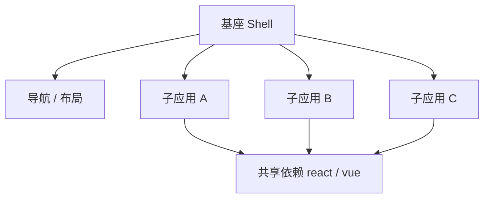

# 09 · 微前端与模块联邦

> **目标**：在大型组织或多团队并行开发场景下，实现应用拆分、独立部署与运行时集成。

---

## 一、何时需要微前端

### 1.1 典型痛点

- 单体 SPA 代码量达数十万行，构建、测试、发布周期拉长  
- 多团队共用一套仓库，权限与发布节奏互相牵制  
- 技术栈无法统一（遗留 Angular 与新版 React 并存）  
- 某子域功能需独立扩容或独立回滚  

### 1.2 微前端定义

**微前端**是将前端应用按**业务域**拆成多个可独立开发、构建、部署的子应用，在**运行时**由容器（主应用 / 基座）组装成完整用户体验的架构风格。



### 1.3 适用与不适用

| 适用 | 暂不适用 |
|------|----------|
| 多团队、多发布节奏 | 小团队单体应用 |
| 子系统边界清晰 | 子应用间高频共享状态 |
| 需独立回滚某业务域 | 团队尚无基本工程化能力 |

---

## 二、架构模式对比

### 2.1 构建时集成 vs 运行时集成

| 模式 | 集成时机 | 部署 | 代表 |
|------|----------|------|------|
| **npm 包 / Monorepo** | 构建时打包进 host | 与 host 同发版 | 组件库、内部 packages |
| **Module Federation** | 运行时加载 remoteEntry | **子应用独立部署** | Webpack 5 MF、Rspack |
| **iframe** | 运行时 | 完全隔离 | 简单嵌入、强隔离 |
| **Web Components** | 运行时 | 框架无关 | 跨框架嵌入 |
| **qiankun / single-spa** | 运行时路由级加载 | 子应用独立 | 国内微前端框架 |

### 2.2 iframe 方案

**优点**：JS/CSS 完全隔离；实现简单。  
**缺点**：URL 不同步、弹窗受限、性能与体验差、父子通信繁琐。

适用：第三方系统嵌入、强安全隔离、短期过渡。

### 2.3 Web Components

将子应用封装为自定义元素 `<my-widget>`，框架无关。

**优点**：标准、隔离 Shadow DOM。  
**缺点**：与 React/Vue 集成需适配层；Design Token 统一难。

### 2.4 路由分发式（single-spa / qiankun）

基座根据路由加载不同子应用的 bootstrap / mount / unmount 生命周期。

```javascript
// single-spa 概念
registerApplication({
  name: 'app-a',
  app: () => loadAppA(),
  activeWhen: '/app-a',
});
start();
```

**qiankun** 在 single-spa 上封装：样式隔离、JS 沙箱、预加载、应用通信。

---

## 三、Module Federation 详解

Webpack 5 引入，Rspack 等兼容。核心思想：**构建时不合并 remote 代码，运行时从 URL 加载**。

### 3.1 角色

| 角色 | 说明 |
|------|------|
| **Host** | 消费远程模块的主应用 |
| **Remote** | 暴露模块的子应用 |
| **Shared** | 共享单例依赖（react、react-dom） |

### 3.2 Remote 配置

```javascript
// remote/webpack.config.js
const { ModuleFederationPlugin } = require('@module-federation/enhanced/webpack');

module.exports = {
  plugins: [
    new ModuleFederationPlugin({
      name: 'remoteApp',
      filename: 'remoteEntry.js',
      exposes: {
        './Page': './src/pages/UserPage.tsx',
        './Widget': './src/components/Widget.tsx',
      },
      shared: {
        react: { singleton: true, requiredVersion: '^18.0.0' },
        'react-dom': { singleton: true, requiredVersion: '^18.0.0' },
      },
    }),
  ],
};
```

### 3.3 Host 配置

```javascript
new ModuleFederationPlugin({
  name: 'host',
  remotes: {
    remoteApp: 'remoteApp@https://cdn.example.com/remoteApp/remoteEntry.js',
  },
  shared: {
    react: { singleton: true },
    'react-dom': { singleton: true },
  },
});
```

### 3.4 消费远程模块

```tsx
import { lazy, Suspense } from 'react';

const RemotePage = lazy(() => import('remoteApp/Page'));

export function App() {
  return (
    <Suspense fallback={<div>Loading...</div>}>
      <RemotePage />
    </Suspense>
  );
}
```

### 3.5 Shared 依赖协商

Host 与 Remote 均声明 `shared.react`。运行时 MF 运行时：

1. 检查已加载版本是否满足 `requiredVersion`  
2. `singleton: true` 保证全页仅一份 React  
3. 版本冲突可能导致**双 React** — 白屏、Hooks 报错  

**治理**：Monorepo 内统一 React 版本；remoteEntry URL 带版本号；CI 契约测试 shared 范围。

---

## 四、应用间通信

| 方式 | 场景 |
|------|------|
| **URL / 路由** | 跨应用导航、分享链接 |
| **CustomEvent / window** | 轻量事件广播 |
| **Shared Worker / BroadcastChannel** | 同源多 Tab |
| **全局状态库** | 谨慎；易耦合 |
| **BFF / API** | 业务数据以服务端为准 |

避免子应用直接 import 另一子应用源码 — 破坏独立部署边界。

---

## 五、样式与隔离

### 5.1 样式冲突

多子应用 CSS 全局污染：类名冲突、z-index 战争。

**手段**：

- CSS Modules / CSS-in-JS  
- BEM + 前缀（`app-a__btn`）  
- Shadow DOM（Web Components、qiankun experimental）  
- qiankun 严格样式隔离（性能代价）  

### 5.2 Design Token 统一

微前端 UI 一致性的关键是 **Token 层**（颜色、间距、字体）由基座或 npm 包统一下发，子应用禁止硬编码品牌色。

---

## 六、部署与版本

```plaintext
https://cdn.example.com/host/v1.2.0/        ← 基座
https://cdn.example.com/remote-a/v3.0.1/    ← 子应用 A
https://cdn.example.com/remote-b/v2.5.0/    ← 子应用 B
```

- **remoteEntry.js** 宜短缓存；带 hash 的 chunk 长缓存  
- Host 配置 remote URL 可通过 **Runtime Config** 注入，避免每次改 host 发版  
- 子应用回滚不影响其他子应用 — 微前端核心价值  

---

## 七、与 Monorepo 的关系

Monorepo 解决**源码组织**；微前端解决**运行时集成与独立部署**。常见组合：

- Monorepo 内多个 `apps/*` 各自 MF build，Turbo 编排  
- 共享 `packages/ui`、`packages/utils` 通过 workspace 引用  
- 仅 expose 的入口对外，内部模块不 remote  

---

## 八、选型决策矩阵

| 场景 | 推荐 |
|------|------|
| 同框架、同仓库、同发版 | Monorepo + 路由 lazy，不必微前端 |
| 同框架、独立部署 | Module Federation 或 qiankun |
| 跨框架嵌入 | Web Components 或 iframe |
| 极简单页嵌入 | iframe |
| Webpack 存量 + 独立部署 | Module Federation |

---

## 九、import maps 与原生 ESM 加载

浏览器原生 **import maps** 可映射裸说明符到 URL（实验性用于微前端轻量场景）：

```html
<script type="importmap">
{
  "imports": {
    "react": "https://cdn.example.com/react@18/esm/index.js",
    "remote-app/": "https://cdn.example.com/remote-a/"
  }
}
</script>
<script type="module">
  import { mount } from 'remote-app/bootstrap.js';
  mount('#container');
</script>
```

**局限**：Safari 支持已完善但 CSP、版本协商、shared 单例仍须自研；生产大规模更常用 Module Federation / qiankun。

### 9.1 动态 import 加载子应用

```typescript
async function loadSubApp(name: string) {
  const entry = window.__MICRO_APPS__[name];
  const mod = await import(/* @vite-ignore */ entry);
  return mod.mount(document.getElementById('subapp-root'));
}
```

Runtime Config 注入各子应用 `remoteEntry` URL — 与 CI/CD 解耦。

### 9.2 错误隔离

子应用加载失败不应拖垮基座 — Host 侧 **Error Boundary** + 降级 UI + 重试按钮；Sentry 按 `subAppName` tag 分组。

### 9.3 E2E 测试矩阵

| 层级 | 测什么 |
|------|--------|
| 子应用单测 | expose 组件可 mount |
| 契约测试 | remote 导出 API 不变 |
| Host 集成 | MSW mock remote |
| E2E | Playwright 从 Host 路由切换 |

---

## 十、qiankun 沙箱与生命周期

### 9.1 子应用生命周期

| 阶段 | 职责 |
|------|------|
| `bootstrap` | 全局初始化（仅一次） |
| `mount` | 挂载到 DOM 容器 |
| `unmount` | 卸载、清理定时器与订阅 |
| `update` | props 变更（可选） |

**泄漏典型**：`unmount` 未移除 `window.addEventListener`、未 `clearInterval` → 切换子应用后内存与事件堆积。

### 9.2 JS 沙箱

qiankun 默认 **Proxy 沙箱**（单实例）或 **快照沙箱**（多实例降级）：

- 拦截子应用对 `window` 的写操作，避免污染全局  
- **无法隔离**：原生 `document` 写全局样式、部分第三方 SDK 直接挂 `window`  
- React 18 Strict Mode 双 mount 可能触发重复 bootstrap — 须幂等  

### 9.3 样式隔离

| 模式 | 机制 | 代价 |
|------|------|------|
| `strictStyleIsolation` | Shadow DOM | 弹层、Portal 可能失效 |
| `experimentalStyleIsolation` | 选择器前缀 | 略增 CSS 体积 |
| 约定 BEM 前缀 | 人工规范 | 依赖纪律 |

Modal / Tooltip 常挂到 `document.body`，须统一 **Portal 容器** 到子应用根或基座指定节点。

### 9.4 预加载与性能

```javascript
import { prefetchApps } from 'qiankun';

prefetchApps([
  { name: 'app-a', entry: '//localhost:7101' },
]);
```

路由 hover 或 idle 时 prefetch `remoteEntry.js`，降低首次切换白屏。监控 **子应用 FCP**、**切换耗时** 作为 SLO。

---

## 十一、Module Federation 故障与治理

### 10.1 常见运行时错误

| 现象 | 根因 | 处理 |
|------|------|------|
| `Invalid hook call` | 双 React 实例 | 统一 shared 版本 + singleton |
| `Loading chunk failed` | remoteEntry 404 / 缓存 | Runtime URL + 版本回滚 |
| `Shared module is not available` | requiredVersion 不满足 | 锁定 monorepo 依赖 |
| 白屏无报错 | remote 未 lazy + Suspense | 边界 Error Boundary |

### 10.2 契约测试

Remote 在 CI 中 **expose 模块可 import 并 render smoke test**；Host 用 MSW mock remote 边界做集成测试。

### 10.3 安全

- remoteEntry 与 chunk 走 HTTPS + **SRI**（若静态托管支持）  
- 仅信任 allowlist 域名加载 remote  
- 子应用与基座 **统一 CSP**，避免 remote 内联脚本被拦  

### 10.4 版本矩阵（示例）

| Host React | Remote React | 结果 |
|------------|--------------|------|
| 18.2.0 | 18.2.0 | ✅ singleton 正常 |
| 18.2.0 | 18.3.0 patch | ✅ 通常满足 ^18 |
| 18.x | 17.x | ❌ Hooks / 并发特性冲突 |
| 18.x | 19.x | ❌ major 不可混用 |

---

## 十二、组织与团队边界

微前端拆分应跟 **Conway 定律** 对齐：一个子应用对应一个能独立交付的团队。边界按 **业务域**（订单、用户、报表）而非按 **技术层**（header 团队、table 团队）切，否则跨应用状态与 UX 碎片化。

**反模式**：

- 为「微前端而微前端」 — 单体 5 万行就拆  
- 子应用间共享大量业务状态 — 应用应通过 BFF/API 同步  
- 基座承担过多业务逻辑 — 基座应薄：路由、布局、鉴权壳、Token  

---

## 十三、single-spa 与 Rspack Federation

```javascript
import { registerApplication, start } from 'single-spa';

registerApplication({
  name: 'orders',
  app: () => System.import('https://cdn.example.com/orders/main.js'),
  activeWhen: (location) => location.pathname.startsWith('/orders'),
});

start({ urlRerouteOnly: true });
```

Vite/Rspack 生产 MF 须验证 shared 协商与远程 TS 类型（`@module-federation/typescript`）。

---

## 十四、常见问题

**Q：微前端一定比单体好吗？**  
否。增加复杂度、shared 版本、通信与 UX 一致性成本。边界清晰且组织需要时再上。

**Q：Vite 如何做 Module Federation？**  
`@module-federation/vite` 或 `@originjs/vite-plugin-federation`，生态仍在演进，生产需充分验证。

**Q：子应用能否用不同 React 大版本？**  
 practically 困难。shared 单例要求 major 一致，否则运行时错误。

**Q：如何做 E2E 测试？**  
Playwright 从 host 入口测完整链路；各子应用保留单测 + 契约测试 remote expose 的模块可挂载。

---

## 十五、小结

微前端是**组织与架构**问题，不只是技术选型。Module Federation 与 qiankun 提供运行时集成能力；成功依赖清晰边界、统一 Token、shared 依赖治理与独立部署流水线。小团队优先把单体工程化做扎实，再评估拆分收益。
