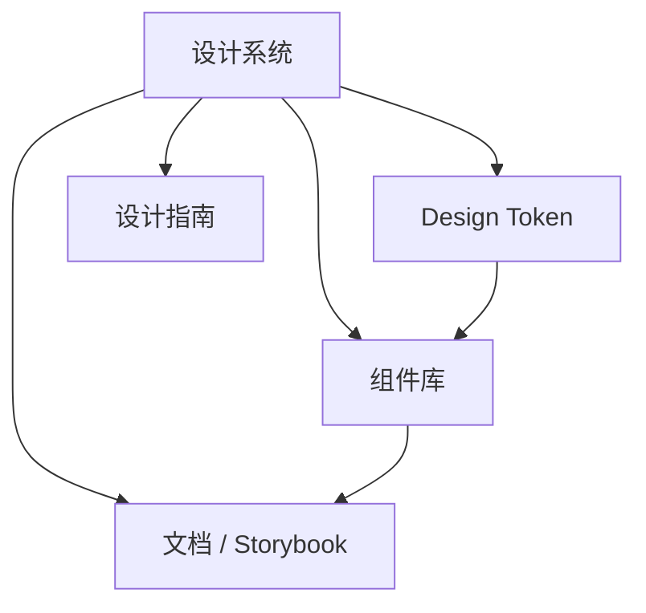

# 10 · 设计系统与组件工程化

## 设计系统是什么

**设计系统（Design System）** 是 UI 规范、Design Token、组件库、文档与协作流程的集合，回答三个问题：

1. **长什么样** — 颜色、字体、间距、圆角、动效  
2. **怎么用** — Button、Input、Table 等组件 API 与交互  
3. **怎么扩展** — 主题、变体、业务组件分层  



---

## Design Token

### 2.1 概念

Token 是设计决策的**命名变量**，与具体色值解耦：

```css
:root {
  --color-primary: #1677ff;
  --color-text: rgba(0, 0, 0, 0.88);
  --spacing-md: 16px;
  --radius-sm: 4px;
  --font-size-base: 14px;
  --z-index-modal: 500;
}
```

暗色主题切换 Token，而非重写组件 CSS：

```css
:root[data-theme='dark'] {
  --color-text: rgba(255, 255, 255, 0.85);
  --color-bg: #141414;
}
```

### 2.2 Token 分层

| 层级 | 示例 | 说明 |
|------|------|------|
| 全局 | `color-blue-500` | 原始色板 |
| 语义 | `color-primary`、`color-error` | 用途导向 |
| 组件 | `button-primary-bg` | 可选，细粒度 |

**实践**：业务代码引用语义 Token（`var(，color-primary)`），禁止散落 `#1677ff`。

### 2.3 跨平台 Token

工具链：**Style Dictionary**、**Tokens Studio** 导出 JSON → CSS / SCSS / JS / iOS / Android。

```json
{
  "color": {
    "primary": { "value": "#1677ff" }
  },
  "spacing": {
    "md": { "value": "16px" }
  }
}
```

Monorepo 中 `packages/tokens` 作为唯一来源，应用与 Storybook 共同消费。

---

## 组件库分层

### 3.1 三层模型

```plaintext
基础层（Base）     Button、Input、Icon — 无业务语义
  ↑
业务通用层         UserCard、SearchBar — 跨页面复用
  ↑
页面层（Views）    具体业务页面 — 组合上述组件
```

**原则**：下层不得 import 上层；业务通用层不得耦合单一页面路由。

### 3.2 Headless + 样式

**Headless UI**（Radix、React Aria、Headless UI）提供无障碍与行为，样式由设计系统封装：

```tsx
// 设计系统封装
import * as Dialog from '@radix-ui/react-dialog';

export function Modal({ open, onOpenChange, title, children }) {
  return (
    <Dialog.Root open={open} onOpenChange={onOpenChange}>
      <Dialog.Portal>
        <Dialog.Overlay className={styles.overlay} />
        <Dialog.Content className={styles.content}>
          <Dialog.Title>{title}</Dialog.Title>
          {children}
        </Dialog.Content>
      </Dialog.Portal>
    </Dialog.Root>
  );
}
```

### 3.3 变体管理（CVA）

```typescript
import { cva } from 'class-variance-authority';

export const buttonVariants = cva('inline-flex items-center justify-center rounded-md', {
  variants: {
    variant: {
      primary: 'bg-primary text-white',
      secondary: 'bg-gray-100',
      ghost: 'bg-transparent',
    },
    size: {
      sm: 'h-8 px-3 text-sm',
      md: 'h-10 px-4',
      lg: 'h-12 px-6 text-lg',
    },
  },
  defaultVariants: { variant: 'primary', size: 'md' },
});
```

Props API 与 Figma 组件变体对齐，减少设计还原偏差。

---

## Storybook 文档化

### 4.1 作用

- **开发沙盒**：隔离调试组件各状态  
- **活文档**：设计师 / PM / 开发共用  
- **视觉回归**：Chromatic 等对比截图  
- **交互测试**：`@storybook/test`、play 函数  

### 4.2 基本结构

```tsx
// Button.stories.tsx
import type { Meta, StoryObj } from '@storybook/react';
import { Button } from './Button';

const meta: Meta<typeof Button> = {
  title: 'Base/Button',
  component: Button,
  tags: ['autodocs'],
  argTypes: {
    variant: { control: 'select', options: ['primary', 'secondary'] },
  },
};
export default meta;

type Story = StoryObj<typeof Button>;

export const Primary: Story = {
  args: { children: '确定', variant: 'primary' },
};

export const Loading: Story = {
  args: { children: '提交中', loading: true },
};
```

### 4.3 文档规范

每个组件 Story 应覆盖：**默认态、禁用态、加载态、错误态、空态、边界尺寸**。  
Props 表由 `react-docgen-typescript` 或 Storybook autodocs 自动生成。

---

## 组件库工程化

### 5.1 包结构

```plaintext
packages/ui/
├── src/
│   ├── Button/
│   │   ├── Button.tsx
│   │   ├── Button.module.scss
│   │   ├── Button.stories.tsx
│   │   └── index.ts
│   └── index.ts          # 统一 export
├── package.json
├── tsconfig.json
└── vite.config.ts        # library mode build
```

### 5.2 构建配置（Vite library mode）

```typescript
export default defineConfig({
  build: {
    lib: {
      entry: 'src/index.ts',
      name: 'MyUI',
      formats: ['es', 'cjs'],
      fileName: (format) => `index.${format === 'es' ? 'mjs' : 'cjs'}`,
    },
    rollupOptions: {
      external: ['react', 'react-dom'],
      output: {
        globals: { react: 'React', 'react-dom': 'ReactDOM' },
      },
    },
  },
});
```

**peerDependencies**：`react`、`react-dom` 由宿主提供，不打进 bundle。

### 5.3 package.json exports

```json
{
  "name": "@org/ui",
  "exports": {
    ".": {
      "import": "./dist/index.mjs",
      "require": "./dist/index.cjs"
    },
    "./styles.css": "./dist/style.css"
  },
  "sideEffects": ["**/*.css"]
}
```

### 5.4 版本与发布

- **Changesets** 管理 semver 与 changelog  
- **Breaking change** 须 major bump + 迁移指南  
- 预发布：`1.0.0-beta.1` 供业务试用  

---

## 主题与多品牌

多租户 / 多品牌场景：

1. Token JSON 按品牌分文件  
2. 构建时或运行时注入 CSS 变量  
3. 组件只消费语义 Token  

```typescript
function applyTheme(brand: 'default' | 'partner-a') {
  document.documentElement.dataset.brand = brand;
}
```

避免为每个品牌维护完整 duplicate 组件库。

---

## 设计 ↔ 开发协作

| 环节 | 工具 / 实践 |
|------|-------------|
| 设计稿 | Figma Variables 对齐 Token |
| 设计走查 | Storybook 与 Figma 对照 |
| Code Connect | Figma 组件映射代码 snippet |
| 变更流程 | Token 变更 → UI 包 minor bump → 业务升级 |

**DoD**：新组件必须有 Story、无障碍基本支持、Token 无硬编码色值。

---

## 质量保障

- **单元测试**：交互与可访问性（Testing Library）  
- **视觉回归**：Chromatic / Percy 在 PR 评论 diff  
- **a11y 扫描**：Storybook `@storybook/addon-a11y`、axe-core  
- **Bundle 体积**：组件库单独 size-limit  

---

## 常见问题（选型）

**Q：CSS Modules 还是 Tailwind？**  
团队统一；设计系统层 Token + Modules/CVA，业务页避免原子类失控。

---

## 组件 API 设计原则

### 10.1 组合优于配置

复杂组件提供 **Compound Components** 或 **slots**，避免 20+ props：

```tsx
// ✅ 组合式
<Select>
  <Select.Trigger />
  <Select.Content>
    <Select.Item value="a">A</Select.Item>
  </Select.Content>
</Select>

// ❌ 上帝 props
<Select items={[]} renderItem={} onOpen={} header={} footer={} ... />
```

### 10.2 受控与非受控

| 模式 | 适用 |
|------|------|
| 受控 `value` + `onChange` | 表单、与外部状态同步 |
| 非受控 `defaultValue` | 简单独立控件 |
| 两者皆支持 | 基础组件标配 |

文档须标明 **default** 与 **受控切换** 行为（如 `open` 从 undefined → false 的语义）。

### 10.3 转发 ref 与 DOM 暴露

基础组件用 `forwardRef` 暴露原生元素，便于焦点管理与动画库集成。避免暴露整个内部实例。

### 10.4 破坏性变更策略

- **major**：删 props、改事件签名  
- **minor**：新 optional props、新变体  
- **deprecation**：至少保留 **2 个 minor** 的 `@deprecated` JSDoc + codemod  

```typescript
/** @deprecated 使用 variant="outline" 代替 */
type?: 'default' | 'ghost';
```

---

## Tree-shaking 与按需加载

### 11.1 sideEffects 声明

```json
{
  "sideEffects": ["**/*.css", "./src/polyfills.ts"]
}
```

误标 `sideEffects: false` 会导致 CSS 被摇掉。

### 11.2 子路径导出

```json
{
  "exports": {
    ".": "./dist/index.mjs",
    "./button": "./dist/button.mjs"
  }
}
```

业务侧 `import { Button } from '@org/ui/button'` 避免拉全库。Babel / bundler **禁止** 默认 import 整包再解构（破坏 tree-shaking）。

### 11.3 图标与重型依赖

图标单独包或 SVG sprite；Chart、Editor 等重型组件 **lazy export** 或独立 `@org/ui-charts` 包。

---

## 设计 Token 治理流程

1. **设计** — Figma Variables 与 Token JSON 双向同步（Tokens Studio）  
2. **评审** — 新增语义 Token 须设计 + 前端双签  
3. **构建** — Style Dictionary 生成 CSS / TS 常量  
4. **发布** — `@org/tokens` patch/minor semver  
5. **消费** — UI 包 bump → Storybook 视觉回归 → 业务升级  

**禁止**：业务页面直接 `#1677ff`；临时色须走 `// TODO(token)` 并排期纳入 Token。

---

## 暗色模式与 @layer

### 13.1 暗色 Token

```css
:root[data-theme='dark'] {
  --color-bg: #141414;
  --color-text: rgba(255, 255, 255, 0.85);
}
```

切换时更新 `data-theme`，勿维护两套组件。

### 13.2 CSS @layer 顺序

```css
@layer reset, tokens, components, utilities;
```

设计系统组件样式放在 `components` 层，业务覆盖放在 `utilities` — 可预测优先级。

### 13.3 组件测试矩阵

| 维度 | 工具 / 方法 |
|------|-------------|
| 交互 | Storybook play + `@storybook/test` |
| a11y | addon-a11y、jest-axe |
| 视觉 | Chromatic PR 评论 diff |
| 体积 | size-limit 单组件入口 |

### 13.4 Chromatic 工作流

1. PR 触发 Storybook build  
2. 上传 baseline 与 branch 截图  
3. Review UI diff → Approve / Request change  
4. 合并后更新 baseline  

---

## 常见问题

**Q：设计系统与 UI 框架库（Ant Design）关系？**  
可基于 Ant Design 做 Token 主题定制 + 业务二次封装；或完全自研 Base 层。关键是 Token 与分层清晰。

**Q：业务组件放哪？**  
跨 2+ 页面复用 → `packages/ui-business`；仅单页 → 页面目录。

**Q：CSS Modules 还是 Tailwind？**  
团队统一即可；Design System 层建议 Token + Modules/CVA，避免业务页原子类泛滥。

---

## 小结

设计系统把**视觉与交互决策**沉淀为 token + 组件 + 文档，Storybook/Chromatic 保障跨产品一致与回归。

Design Token → CSS 变量；组件 API 稳定 semver；Compound 组件模式；a11y 内置；Changesets 发版。

**易混点**：token 与组件样式双轨不同步；breaking 未 major bump；文档 Story 与生产用法脱节。

核对：Contrast 是否过 WCAG？组件是否 tree-shake 友好？
