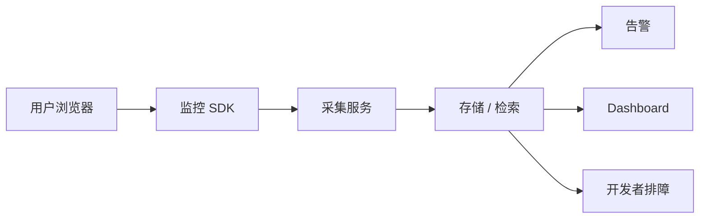

# 11 · 可观测性与错误监控

## 可观测性三支柱（前端视角）

| 支柱 | 前端对应 | 典型数据 |
|------|----------|----------|
| **Logs** | 结构化日志、面包屑 | 用户操作路径、API 失败上下文 |
| **Metrics** | 性能指标、业务指标 | LCP、错误率、接口耗时 |
| **Traces** | 分布式追踪（部分场景） | 请求链路 ID 关联前后端 |

前端运行在用户浏览器，无法像服务端一样 SSH 登录 — **RUM（Real User Monitoring）** 与 **错误监控** 是核心手段。



---

## 错误监控基础

### 2.1 应捕获的错误类型

| 类型 | 捕获方式 |
|------|----------|
| 同步 JS 异常 | `window.onerror` |
| Promise rejection | `unhandledrejection` |
| 资源加载失败 | `error` 事件 capture |
| React 渲染错误 | Error Boundary + 上报 |
| 接口错误 | axios 拦截器 |
| 路由错误 | Router errorElement |

### 2.2 全局钩子示例

```typescript
window.addEventListener('error', (event) => {
  reportError({
    type: 'js',
    message: event.message,
    filename: event.filename,
    lineno: event.lineno,
    colno: event.colno,
    stack: event.error?.stack,
  });
});

window.addEventListener('unhandledrejection', (event) => {
  reportError({
    type: 'promise',
    message: String(event.reason),
    stack: event.reason?.stack,
  });
});
```

### 2.3 Error Boundary（React）

```tsx
class ErrorBoundary extends React.Component {
  state = { hasError: false };

  static getDerivedStateFromError() {
    return { hasError: true };
  }

  componentDidCatch(error: Error, info: React.ErrorInfo) {
    reportError({ type: 'react', error, componentStack: info.componentStack });
  }

  render() {
    if (this.state.hasError) return <FallbackUI />;
    return this.props.children;
  }
}
```

分层挂载：根 Boundary（全页 fallback）+ 路由级 + 重型 Widget 级。

---

## Sentry 集成实践

### 3.1 初始化

```typescript
import * as Sentry from '@sentry/react';

Sentry.init({
  dsn: import.meta.env.VITE_SENTRY_DSN,
  environment: import.meta.env.VITE_APP_ENV,
  release: `web@${import.meta.env.VITE_APP_VERSION}`,
  integrations: [
    Sentry.browserTracingIntegration(),
    Sentry.replayIntegration({ maskAllText: true }),
  ],
  tracesSampleRate: 0.1,
  replaysSessionSampleRate: 0.01,
  replaysOnErrorSampleRate: 1.0,
  beforeSend(event) {
    // 脱敏：移除 cookie、localStorage 中的 token
    return scrubPii(event);
  },
});
```

### 3.2 上下文 enrichment

```typescript
Sentry.setUser({ id: userId }); // 勿传手机号明文
Sentry.setTag('tenant', tenantId);
Sentry.addBreadcrumb({
  category: 'navigation',
  message: `Navigated to ${path}`,
  level: 'info',
});
```

**面包屑（Breadcrumb）**：错误发生前 N 步用户行为 — 排障关键。

### 3.3 Source Map

生产构建：

```typescript
// vite.config.ts
build: {
  sourcemap: 'hidden',
},
```

CI 上传 map 到 Sentry，**不部署到 CDN**：

```bash
sentry-cli sourcemaps upload --release=web@1.2.0 ./dist/assets
```

用户侧栈：`app.a1b2.js:1:9842` → 还原为 `UserProfile.tsx:42`。

---

## 性能监控（RUM）

### 4.1 Web Vitals 上报

```typescript
import { onLCP, onINP, onCLS } from 'web-vitals';

function sendToAnalytics(metric) {
  fetch('/api/rum', {
    method: 'POST',
    body: JSON.stringify({
      name: metric.name,
      value: metric.value,
      id: metric.id,
      page: location.pathname,
    }),
    keepalive: true,
  });
}

onLCP(sendToAnalytics);
onINP(sendToAnalytics);
onCLS(sendToAnalytics);
```

关注 **p75 / p95** 分位，而非平均值。

### 4.2 自定义性能 mark

```typescript
performance.mark('dashboard-data-ready');
performance.measure('dashboard-load', 'navigationStart', 'dashboard-data-ready');
const [entry] = performance.getEntriesByName('dashboard-load');
reportMetric({ name: 'dashboard-load', duration: entry.duration });
```

### 4.3 长任务监控

```typescript
const observer = new PerformanceObserver((list) => {
  for (const entry of list.getEntries()) {
    if (entry.duration > 50) {
      reportLongTask({ duration: entry.duration, startTime: entry.startTime });
    }
  }
});
observer.observe({ type: 'longtask', buffered: true });
```

---

## 日志规范

### 5.1 结构化日志

```typescript
interface LogPayload {
  level: 'info' | 'warn' | 'error';
  message: string;
  context?: Record<string, unknown>;
  timestamp: string;
  traceId?: string;
}

function log(payload: LogPayload) {
  if (import.meta.env.PROD) {
    sendLog(payload);
  } else {
    console[payload.level](payload);
  }
}
```

### 5.2 禁止与建议

| 禁止 | 建议 |
|------|------|
| 生产 `console.log` 调试残留 | 统一 logger，build 时 strip |
| 日志含 Token、密码 | 脱敏函数 |
| 无限循环打日志 | 采样、聚合 |

### 5.3 与后端 trace 关联

API 响应头返回 `X-Trace-Id`，前端存入上下文，错误上报时附带 — 前后端日志一键串联。

---

## 告警与 On-Call

### 6.1 告警指标

| 指标 | 阈值示例 |
|------|----------|
| JS 错误率 | > 1% 会话（5min 窗口） |
| 新 issue 首次出现 | 立即 |
| LCP p75 | > 4s |
| 接口 5xx 率 | > 0.5% |

### 6.2 告警质量

- **分组**：按 release、浏览器、路由聚合  
- **抑制**：同一 root cause 勿重复告警  
- **Runbook**：每条告警链接处理步骤  

### 6.3 Issue 生命周期

```plaintext
New → 分配 → 修复 → 发布 → Resolved → 监控 24h → Closed
```

Sentry `regression` 检测：已修复 issue 在新 release 再现。

---

## Session Replay 与隐私

Session Replay 录制 DOM 变化辅助复现 bug。

**合规**：

- 默认 mask 输入框、文本  
- 排除支付、身份证区域  
- 用户同意（GDPR / 个保法）  
- 保留期限限制  

---

## 本地与预发调试

| 环境 | 手段 |
|------|------|
| 本地 | DevTools、React/Vue DevTools |
| 预发 | 与生产相同 SDK，`environment: staging` |
| 生产 | Source Map + Sentry issue；禁止直接连 prod 调试 |

**复现模板**：浏览器版本、路由、用户角色、时间、requestId、是否首访。

---

## beforeSend 脱敏与指纹

### 9.1 脱敏实现要点

```typescript
function scrubPii(event: Sentry.Event): Sentry.Event | null {
  if (event.request?.headers) {
    delete event.request.headers.Authorization;
    delete event.request.headers.Cookie;
  }
  if (event.user) {
    event.user = { id: event.user.id }; // 仅保留匿名 id
  }
  event.breadcrumbs?.forEach((b) => {
    if (b.data?.url) b.data.url = b.data.url.replace(/token=[^&]+/, 'token=[REDACTED]');
  });
  return event;
}
```

### 9.2 错误分组（Fingerprint）

同类错误应合并为同一 Issue，避免告警风暴：

```typescript
Sentry.init({
  beforeSend(event) {
    if (event.exception?.values?.[0]?.type === 'ChunkLoadError') {
      event.fingerprint = ['chunk-load', event.release ?? 'unknown'];
    }
    return event;
  },
});
```

### 9.3 采样策略

| 类型 | 建议采样 |
|------|----------|
| 错误事件 | 100% |
| Performance trace | 5–20% |
| Session Replay | 1% 正常会话，100% 出错会话 |
| RUM vitals | 10–30% |

---

## Vue 与接口层监控

### 10.1 Vue errorHandler

```typescript
app.config.errorHandler = (err, instance, info) => {
  reportError({ type: 'vue', err, info, component: instance?.$options?.name });
};
```

### 10.2 axios 统一上报

```typescript
axios.interceptors.response.use(
  (res) => res,
  (error) => {
    if (error.response?.status >= 500) {
      reportError({
        type: 'api',
        url: error.config?.url,
        status: error.response.status,
        traceId: error.response.headers['x-trace-id'],
      });
    }
    return Promise.reject(error);
  },
);
```

---

## 告警 Runbook

### 12.1 JS 错误率突增

对比最近 release → Sentry 按 browser/route 分组 → 检查 chunk 404 → 回滚或 hotfix。

### 12.2 LCP 退化

RUM 分国家/CDN → 新大图或第三方脚本 → 拆分 TTFB 与下载耗时。

### 12.3 日志统一字段

`traceId`、`userId`（匿名）、`route`、`release`、`level` — 便于检索与关联后端。

### 12.4 Release Health

按 `release` 对比 crash-free sessions、LCP p75 — 灰度版本指标劣化时触发 regression 告警。

---

## 小结

可观测性三连：**日志、指标、链路**，前端侧重错误监控、性能 RUM 与用户会话回放，与后端 traceId 关联排障。

Sentry 等捕获未处理 rejection；source map 上传脱敏；Performance API + Web Vitals；用户上下文 breadcrumbs；采样率分级。

**易混点**：生产开完整 source map 公开；PII 打进 error payload；告警阈值过低噪音。

核对：新错误是否有 owner？release 是否 tagged 到监控？
