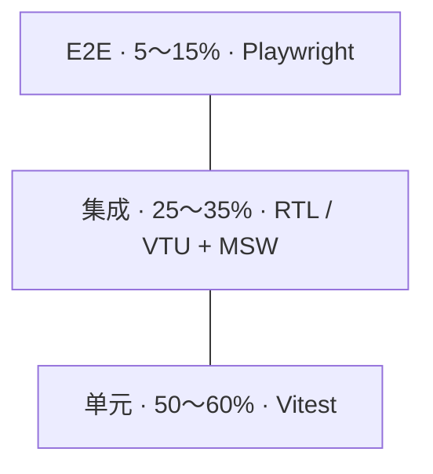
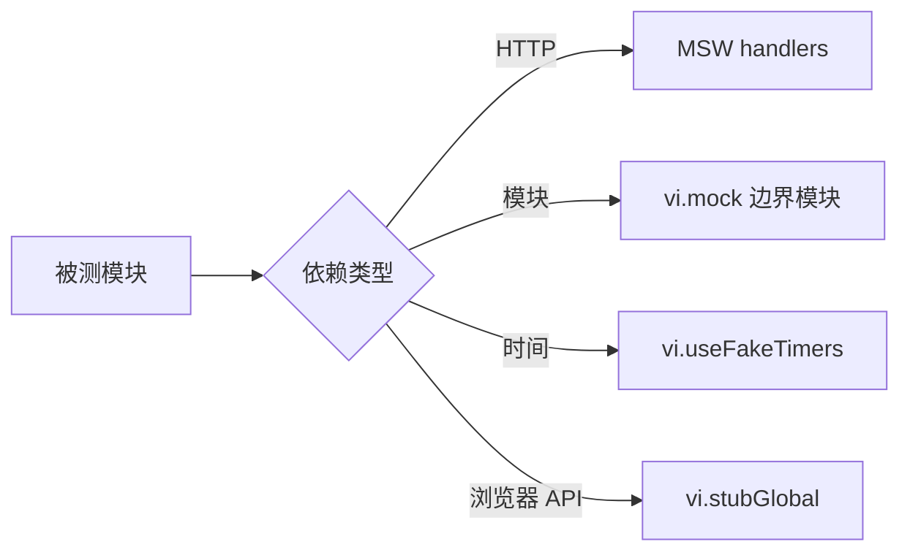

# 13 · 前端测试方法论

测试知识散落在 React 15、Vue 17 与工程化 04 的工具配置中；本篇抽成**通识方法论**：测什么、怎么分层、如何 Mock、覆盖率怎么用、CI 怎么门禁。框架实操见各框架测试模块。

---

## 测试目标

| 目标 | 说明 |
|------|------|
| 回归防护 | 改 A 不 silently 坏 B |
| 重构信心 | 有测试才敢动结构 |
| 活文档 | 用例描述「系统应有什么行为」 |
| 设计反馈 | 难测往往意味着耦合过重 |

测试**不能**替代：产品验收、探索性测试、性能压测、安全渗透。

---

## 测试金字塔



| 层级 | 速度 | 稳定性 | 测什么 |
|------|------|--------|--------|
| **单元** | ms 级 | 高 | 纯函数、reducer、composable、hook |
| **集成** | 10～100ms | 中高 | 组件 + 用户交互 + Provider |
| **E2E** | 秒～分钟 | 中（需治理 flaky） | 跨页业务流程 |
| **视觉** | 慢 | 中 | UI 像素/regression（Storybook + Chromatic） |

**反模式**：E2E 测所有表单校验；100% snapshot；mock 整棵子树测了个寂寞。

---

## 测行为，不测实现

| ❌ 实现细节 | ✅ 用户可感知行为 |
|-------------|-------------------|
| `wrapper.state()` | 点击后是否出现「保存成功」 |
| 私有方法 `_validate` | 通过 UI 输入触发校验文案 |
| 整树 snapshot | 关键 role / 文案 / alert |
| CSS 像素 | 布局类名是否存在（低价值） |

**查询优先级**（Testing Library）：`getByRole` > `getByLabelText` > `getByText` > `getByTestId`。

---

## 工具选型矩阵

| 场景 | React | Vue | 说明 |
|------|-------|-----|------|
| 单元/集成运行器 | Vitest | Vitest | 与 Vite 共享配置 |
| 组件测试 | @testing-library/react | @vue/test-utils + testing-library | 都强调用户视角 |
| DOM 环境 | jsdom | jsdom / happy-dom | happy-dom 更快，部分 API 差异 |
| E2E | Playwright | Playwright | 多浏览器、trace、Codegen |
| HTTP Mock | MSW | MSW | 拦截网络层，不 mock fetch 实现 |
| 视觉回归 | Chromatic / Percy | 同左 | 基于 Storybook |

配置细节见 [04-代码规范与质量保障](./04-代码规范与质量保障.md) 第 8、13、15 节。

---

## Mock 分层策略



### MSW（推荐用于 API）

```typescript
// src/test/server.ts
import { setupServer } from 'msw/node';
import { http, HttpResponse } from 'msw';

export const handlers = [
  http.get('/api/users', () => {
    return HttpResponse.json([{ id: '1', name: 'Alice' }]);
  }),
  http.post('/api/login', async ({ request }) => {
    const body = await request.json();
    if (body.email === 'bad@x.com') {
      return HttpResponse.json({ message: 'Invalid' }, { status: 401 });
    }
    return HttpResponse.json({ token: 'mock-token' });
  }),
];

export const server = setupServer(...handlers);
```

```typescript
// src/test/setup.ts
import { beforeAll, afterEach, afterAll } from 'vitest';
import { server } from './server';

beforeAll(() => server.listen({ onUnhandledRequest: 'error' }));
afterEach(() => server.resetHandlers());
afterAll(() => server.close());
```

`onUnhandledRequest: 'error'` 强迫每个测试显式声明 HTTP mock，避免静默走真实网络。

### vi.mock（模块边界）

```typescript
vi.mock('@/lib/analytics', () => ({
  trackEvent: vi.fn(),
}));
```

只 mock **边界**（analytics、第三方 SDK），不 mock 正在测的业务组件。

---

## Provider 测试壳（React / Vue）

**React** — 每测新建 QueryClient，避免 cache 污染：

```tsx
function createWrapper() {
  const queryClient = new QueryClient({
    defaultOptions: { queries: { retry: false } },
  });
  return ({ children }: { children: React.ReactNode }) => (
    <QueryClientProvider client={queryClient}>
      <MemoryRouter>{children}</MemoryRouter>
    </QueryClientProvider>
  );
}
```

**Vue** — Pinia + Router：

```typescript
import { mount } from '@vue/test-utils';
import { createPinia, setActivePinia } from 'pinia';
import { createRouter, createMemoryHistory } from 'vue-router';

export function mountWithPlugins(component: Component) {
  const pinia = createPinia();
  setActivePinia(pinia);
  const router = createRouter({
    history: createMemoryHistory(),
    routes: [{ path: '/', component }],
  });
  return mount(component, {
    global: { plugins: [pinia, router] },
  });
}
```

框架专项用例见 [React 15](../前端框架篇/React/15-测试/) · [Vue 17](../前端框架篇/Vue/17-测试/)。

---

## 覆盖率：测什么、阈值多少

| 目录/类型 | 是否纳入 coverage | 说明 |
|-----------|-------------------|------|
| `src/utils/**` | ✅ | 纯逻辑 ROI 高 |
| `src/hooks/**` / `composables/**` | ✅ | 核心行为 |
| `src/components/base/**` | ⚠️ 按需 | 简单展示可省略 |
| `src/views/**` | ⚠️ 集成测覆盖 | 单测 ROI 低 |
| 生成的类型 / `*.d.ts` | ❌ exclude | |

```typescript
// vitest.config.ts
coverage: {
  provider: 'v8',
  thresholds: {
    lines: 70,
    functions: 70,
    branches: 60,
  },
  include: ['src/utils/**', 'src/hooks/**', 'src/composables/**'],
},
```

**原则**：覆盖率是**下限门禁**，不是 KPI。100% 行覆盖仍可能漏测行为。人审关注分支与边界（空列表、401、超时）。

---

## 契约测试（可选进阶）

前后端分离项目，可用 **Pact** 或 **OpenAPI + MSW 从 schema 生成 mock** 保证接口形状一致：

```typescript
// 从 OpenAPI 生成 MSW handler（示意）
import { generateHandlers } from '@mswjs/source/open-api';
import spec from '../openapi.json';

export const contractHandlers = await generateHandlers(spec);
```

CI 在 consumer 侧跑契约测试，provider 变更 breaking 时 fail。

---

## Flaky Test 治理

| 原因 | 对策 |
|------|------|
| 定时器 | `vi.useFakeTimers()` |
| 异步未 await | `findBy*`、`waitFor` |
| 共享 mutable 状态 | 每 test 独立 render + cleanup |
| 网络竞态 | MSW + 固定 response |
| E2E 固定 sleep | 改 `expect(locator).toBeVisible()` |
| 执行顺序依赖 | 禁止 describe 间共享变量 |

CI：**最多重试 1 次**并标记 quarantine；长期 flaky 须修或删。

---

## CI 门禁建议

```yaml
# .github/workflows/test.yml（示意）
jobs:
  unit:
    runs-on: ubuntu-latest
    steps:
      - uses: actions/checkout@v4
      - uses: pnpm/action-setup@v4
      - run: pnpm install --frozen-lockfile
      - run: pnpm test:run
      - run: pnpm test:coverage

  e2e:
    runs-on: ubuntu-latest
    steps:
      - run: pnpm exec playwright install --with-deps chromium
      - run: pnpm exec playwright test --grep @smoke
```

| PR | Nightly |
|----|---------|
| lint + typecheck + unit + coverage | 全量 E2E |
| smoke E2E（@smoke） | 视觉回归 |

---

## 与 Code Review 分工

| 自动化 | 人工 Review |
|--------|-------------|
| 格式、lint、类型 | 业务逻辑是否正确 |
| 覆盖率阈值 | 用例是否测到关键分支 |
| 架构依赖规则 | 可读性、可维护性 |
| MSW onUnhandled error | 产品语义、边界场景 |

---

## 小结

前端测试按金字塔分配：单元多（Vitest）、集成适中（RTL/VTU + MSW）、E2E 少而精（Playwright）。测用户可见行为，Mock 打 HTTP 边界而非业务组件。覆盖率门禁针对 utils/hooks/composables，不追求 100%。CI：PR 跑 unit + smoke E2E，flaky 重试最多 1 次并限期修复。

**易混点**：snapshot 滥用；mock 子树导致测空壳；E2E 覆盖所有边界；开发与 CI 用不同 test 命令。

核对：MSW 是否 `onUnhandledRequest: 'error'`？每个 bugfix PR 是否带回归用例？

---

## 延伸阅读

- 工具配置细节：[04-代码规范与质量保障](./04-代码规范与质量保障.md)
- React 组件测试实操：[React 15-测试](../前端框架篇/React/15-测试/)
- Vue 组件测试实操：[Vue 17-测试](../前端框架篇/Vue/17-测试/)
