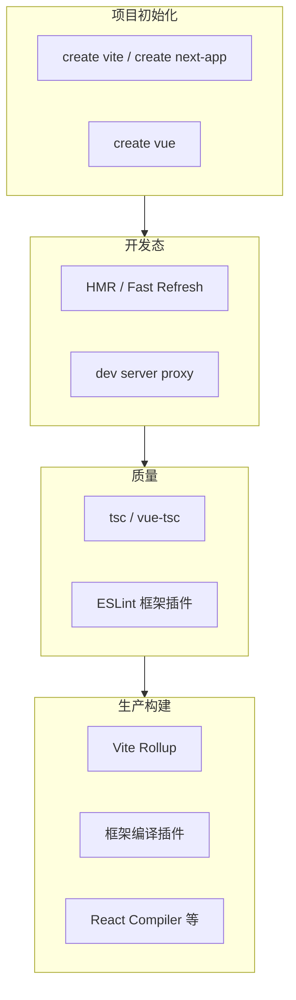
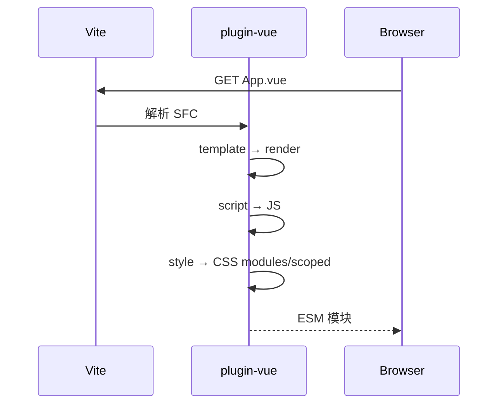

# 14 · 框架工程化实践

React / Vue 框架篇中的**工具链、类型检查、编译插件、升级迁移**等工程化内容，本篇从框架视角抽离为通识对照表。原理与选型见 02～04；框架 API 见各框架模块。

---

## 框架工程化全景



---

## 项目初始化对照

| 维度 | React | Vue |
|------|-------|-----|
| 官方 SPA 脚手架 | `pnpm create vite --template react-ts` | `pnpm create vue@latest` |
| 全栈 / SSR | `pnpm create next-app@latest` | `pnpm create nuxt` |
| 遗留脚手架 | CRA（已停维护） | Vue CLI（Webpack） |
| 入口 HTML | 根目录 `index.html` | 根目录 `index.html` |
| 挂载 | `createRoot` → `main.tsx` | `createApp` → `main.ts` |
| 环境变量前缀 | `VITE_*` / `NEXT_PUBLIC_*` | `VITE_*` / `NUXT_PUBLIC_*` |
| 读取方式 | `import.meta.env` / `process.env`（Next） | `import.meta.env` |

详细目录结构见框架篇 [React 开发环境](../前端框架篇/React/01-认知与生态/03-开发环境与项目结构.md) · [Vue 工具链](../前端框架篇/Vue/01-渐进式框架与Vue全景/03-工具链-create-vue-Vite-VueCLI.md)。

---

## Vite 框架插件

| 插件 | 框架 | 职责 |
|------|------|------|
| `@vitejs/plugin-react` | React | JSX、Fast Refresh |
| `@vitejs/plugin-react-swc` | React | SWC 替代 Babel，更快 |
| `@vitejs/plugin-vue` | Vue | SFC 编译、HMR |
| `@vitejs/plugin-vue-jsx` | Vue | JSX in Vue |
| `vite-plugin-vue-devtools` | Vue | 开发调试 |

**React 最小配置**：

```typescript
import { defineConfig } from 'vite';
import react from '@vitejs/plugin-react';

export default defineConfig({
  plugins: [react()],
  resolve: { alias: { '@': '/src' } },
});
```

**Vue 最小配置**：

```typescript
import { defineConfig } from 'vite';
import vue from '@vitejs/plugin-vue';
import { fileURLToPath, URL } from 'node:url';

export default defineConfig({
  plugins: [vue()],
  resolve: {
    alias: { '@': fileURLToPath(new URL('./src', import.meta.url)) },
  },
});
```

---

## 类型检查：tsc vs vue-tsc

| 项目 | 命令 | 说明 |
|------|------|------|
| React + Vite | `tsc -b --noEmit` 或 `tsc --noEmit` | Vite **不**做完整类型检查 |
| Vue + Vite | `vue-tsc --noEmit` 或 `vue-tsc -b` | 须解析 `.vue` SFC |
| Next.js | `tsc --noEmit` | 内置 TS，仍建议 CI 独立跑 |

**CI 必跑类型检查**，不能仅依赖 `vite build`（esbuild 转译跳过类型）。

```json
{
  "scripts": {
    "build": "tsc -b && vite build",
    "type-check": "tsc --noEmit"
  }
}
```

Vue 项目：

```json
{
  "scripts": {
    "build": "vue-tsc -b && vite build",
    "type-check": "vue-tsc --build --force"
  }
}
```

`tsconfig` 要点：`moduleResolution: "bundler"`、`strict: true`、路径别名与 Vite `resolve.alias` **双端一致**。

---

## HMR 与 Fast Refresh

| | React Fast Refresh | Vue HMR |
|---|-------------------|---------|
| 粒度 | 组件级，尽量保 state | SFC 模块级 |
| 失效条件 | 非组件 export、匿名默认导出 | — |
| 插件 | `@vitejs/plugin-react` 内置 | `@vitejs/plugin-vue` |

**Fast Refresh 失效常见原因**：把组件与 util 混在同一文件 export；改 hook 规则违反时全页刷新。

---

## ESLint 框架插件

| 框架 | 插件 | 关键规则 |
|------|------|----------|
| React | `eslint-plugin-react-hooks` | rules-of-hooks、exhaustive-deps |
| React | `eslint-plugin-react` | jsx-key 等 |
| Vue | `eslint-plugin-vue` | `vue/no-v-html`、`vue/no-deprecated-*` |
| 通用 | `typescript-eslint` | type-aware lint |

Flat Config 示例见 [04-代码规范与质量保障](./04-代码规范与质量保障.md)。

---

## React Compiler（构建期优化）

React Compiler 是 **Babel 插件**，构建期自动插入 memo 等价优化，与 React 19 解耦发布。

```bash
pnpm add -D babel-plugin-react-compiler
```

Next.js 15+：`experimental.reactCompiler: true`。

编译原理、输出对比、opt-out 见框架篇 [React Compiler 概览](../前端框架篇/React/18-React19与新特性/03-React-Compiler概览.md)；构建层定位见 [02-模块化与构建层](./02-模块化与构建层.md) 第 8.6 节。

---

## Vue SFC 编译链（工程视角）



工程关注点：

- `<style scoped>` 注入 data 属性选择器
- `unplugin-auto-import` / `unplugin-vue-components` 减少样板 import
- SSR 项目避免 setup 顶层访问 `window`

---

## 环境变量约定

| 框架 / 工具 | 客户端暴露前缀 | 服务端私有 |
|-------------|----------------|------------|
| Vite | `VITE_` | 无前缀、不 import |
| Next.js | `NEXT_PUBLIC_` | 无 `NEXT_PUBLIC_` 的 env |
| Nuxt 3 | `NUXT_PUBLIC_` | `runtimeConfig` 私有字段 |
| Vue CLI（遗留） | `VUE_APP_` | — |

**切忌**把 API Secret 写入客户端前缀变量 — 会打进 bundle。

---

## 升级与 Codemod

| 迁移 | 工具 / 做法 |
|------|-------------|
| React 18 → 19 | `codemod` react/19、`types-react-codemod` |
| Vue 2 → 3 | `@vue/compat`、vue-codemod、eslint-plugin-vue |
| Vue CLI → Vite | `VUE_APP_` → `VITE_`，根目录 index.html |
| CRA → Vite | 官方迁移指南、手动迁入口与 env |

Checklist 见框架篇 [React 19 迁移](../前端框架篇/React/18-React19与新特性/04-React19迁移与升级指南.md) · [Vue 2→3 升级](../前端框架篇/Vue/19-Vue2迁移与版本演进/05-升级Checklist.md)。

---

## 框架与微前端

架构选型与 Module Federation 配置见 [09-微前端与模块联邦](./09-微前端与模块联邦.md)。

框架篇补充**运行时集成**：

| 框架 | 关键坑 | 文档 |
|------|--------|------|
| React | 双 React 实例、Invalid hook call | [React 微前端集成](../前端框架篇/React/19-跨端与集成/02-微前端与模块联邦.md) |
| Vue | vue 单例、路由 base、qiankun 生命周期 | [Vue 微前端集成](../前端框架篇/Vue/20-跨端与生产实践/02-微前端与模块联邦.md) |

---

## Monorepo 中的框架包

```plaintext
packages/
├── ui/              # 共享组件库（React 或 Vue）
├── utils/           # 框架无关
apps/
├── web-react/       # React SPA
└── admin-vue/       # Vue SPA
```

| 注意 | 说明 |
|------|------|
| `react` / `vue` 提升 | 根 `package.json` `pnpm.overrides` 或 workspace 协议 |
| 组件库打包 | `tsdown` / `unbuild` / Vite library mode |
| 类型导出 | `package.json` `exports` + `types` 字段 |

---

## 小结

React 与 Vue 工程化共性：Vite 作 SPA 默认构建、CI 独立跑类型检查、环境变量前缀严格区分、ESLint 框架插件进门禁。差异：React 侧可选 Compiler / Fast Refresh；Vue 侧 vue-tsc 解析 SFC、create-vue 交互模板。升级用 compat + codemod 渐进；微前端架构看工程化 09，集成细节看各框架篇。

**易混点**：vite build 通过 ≠ 类型安全；`@/` 别名只配 vite 不配 tsconfig；Vue CLI 的 `VUE_APP_` 与 Vite 的 `VITE_` 混用。

核对：build 脚本是否先 typecheck 再 vite build？lockfile 是否锁定框架主版本？
