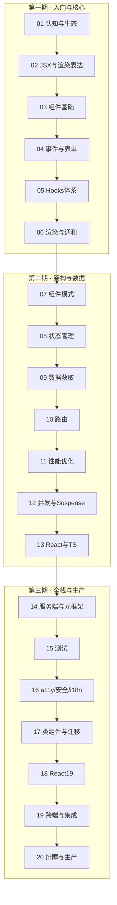

# React 体系 · 阅读地图

> 本目录系统梳理 **React 18+** 从入门到生产的完整知识链。写法对齐仓库内 [JavaScript 体系](../../前端基础体系/03-JavaScript体系.md)、[TypeScript 体系](../../前端基础体系/04-TypeScript体系.md)：**叙述 + 表格 + 示意图 + 代码**，由浅入深、由粗到细。

**前置建议**：HTML/CSS 基础 → JavaScript（闭包、异步、模块）→ TypeScript → 再进入 React。

**独立文档**：[React 编码规范](./React编码规范.md) 为团队工程规范，与原理正文互补，Review 时对照使用。

---

## 目录总览

---

## 模块索引

### 01 · 认知与生态

| 文档 | 主题 |
|------|------|
| [01-React是什么与核心思想](./01-认知与生态/01-React是什么与核心思想.md) | 声明式、组件化、单向数据流、UI=f(state) |
| [02-React发展脉络与版本演进](./01-认知与生态/02-React发展脉络与版本演进.md) | 15→19、Fiber、Concurrent、RSC |
| [03-开发环境与项目结构](./01-认知与生态/03-开发环境与项目结构.md) | Vite/Next、目录、入口、Strict Mode |
| [04-React生态全景图](./01-认知与生态/04-React生态全景图.md) | 路由/状态/样式/测试/元框架选型 |

### 02 · JSX 与渲染表达

| 文档 | 主题 |
|------|------|
| [01-JSX语法与编译机制](./02-JSX与渲染表达/01-JSX语法与编译机制.md) | jsx-runtime、表达式、属性 |
| [02-条件渲染与列表渲染](./02-JSX与渲染表达/02-条件渲染与列表渲染.md) | 分支、Fragment、key |
| [03-样式方案与CSS-in-JS](./02-JSX与渲染表达/03-样式方案与CSS-in-JS.md) | Modules、Tailwind、CSS-in-JS |
| [04-静态资源与SVG-Icon](./02-JSX与渲染表达/04-静态资源与SVG-Icon.md) | 资源导入、图标体系 |

### 03 · 组件基础

| 文档 | 主题 |
|------|------|
| [01-函数组件与组件树](./03-组件基础/01-函数组件与组件树.md) | 组件即函数、组合 |
| [02-Props与单向数据流](./03-组件基础/02-Props与单向数据流.md) | props 设计、只读 |
| [03-Children与组合模式](./03-组件基础/03-Children与组合模式.md) | children、插槽式 API |
| [04-State基础与更新语义](./03-组件基础/04-State基础与更新语义.md) | 快照、不可变更新 |
| [05-受控与非受控组件](./03-组件基础/05-受控与非受控组件.md) | 表单控件数据流 |

### 04 · 事件与表单

| 文档 | 主题 |
|------|------|
| [01-合成事件与事件处理](./04-事件与表单/01-合成事件与事件处理.md) | SyntheticEvent、委托 |
| [02-表单基础与受控表单](./04-事件与表单/02-表单基础与受控表单.md) | 校验、多字段 |
| [03-React-Hook-Form与Schema校验](./04-事件与表单/03-React-Hook-Form与Schema校验.md) | RHF + zod |
| [04-复杂交互-拖拽-上传-富文本](./04-事件与表单/04-复杂交互-拖拽-上传-富文本.md) | 第三方 DOM 集成 |

### 05 · Hooks 体系

| 文档 | 主题 |
|------|------|
| [00-Hooks总览与规则](./05-Hooks体系/00-Hooks总览与规则.md) | 分类表、两条规则 |
| [01-useState与useReducer](./05-Hooks体系/01-useState与useReducer.md) | 本地状态 |
| [02-useEffect与useLayoutEffect](./05-Hooks体系/02-useEffect与useLayoutEffect.md) | 副作用 |
| [03-useRef-useImperativeHandle](./05-Hooks体系/03-useRef-useImperativeHandle.md) | ref 与命令式 |
| [04-useContext与跨层通信](./05-Hooks体系/04-useContext与跨层通信.md) | Context |
| [05-useMemo-useCallback](./05-Hooks体系/05-useMemo-useCallback.md) | 记忆化 |
| [06-useId-useSyncExternalStore等](./05-Hooks体系/06-useId-useSyncExternalStore等.md) | 其余内置 Hooks |
| [07-自定义Hooks设计与模式库](./05-Hooks体系/07-自定义Hooks设计与模式库.md) | 逻辑复用 |

### 06 · 渲染与调和

| 文档 | 主题 |
|------|------|
| [01-渲染流程总览](./06-渲染与调和/01-渲染流程总览.md) | render → commit |
| [02-Virtual-DOM与Diff](./06-渲染与调和/02-Virtual-DOM与Diff.md) | 协调算法 |
| [03-Fiber架构与可中断渲染](./06-渲染与调和/03-Fiber架构与可中断渲染.md) | Fiber |
| [04-Key与列表调和](./06-渲染与调和/04-Key与列表调和.md) | key 语义 |
| [05-批处理与自动批处理](./06-渲染与调和/05-批处理与自动批处理.md) | batching |
| [06-StrictMode与开发态行为](./06-渲染与调和/06-StrictMode与开发态行为.md) | 严格模式 |

### 07 · 组件模式与架构

| 文档 | 主题 |
|------|------|
| [01-复合组件与状态共享](./07-组件模式与架构/01-复合组件与状态共享.md) | Compound Components |
| [02-容器与展示分离](./07-组件模式与架构/02-容器与展示分离.md) | Container / Presentational |
| [03-HOC与Render-Props](./07-组件模式与架构/03-HOC与Render-Props.md) | 逻辑复用 |
| [04-插槽-多态与as-prop](./07-组件模式与架构/04-插槽-多态与as-prop.md) | Slot、polymorphic |
| [05-特性目录与模块边界](./07-组件模式与架构/05-特性目录与模块边界.md) | Feature folders |

### 08 · 状态管理

| 文档 | 主题 |
|------|------|
| [01-状态分类与放置原则](./08-状态管理/01-状态分类与放置原则.md) | 四分法、决策流 |
| [02-Context进阶与性能](./08-状态管理/02-Context进阶与性能.md) | 拆分、memo |
| [03-Zustand与轻量全局状态](./08-状态管理/03-Zustand与轻量全局状态.md) | 轻量 store |
| [04-Redux-Toolkit与RTK-Query](./08-状态管理/04-Redux-Toolkit与RTK-Query.md) | RTK、RTK Query |
| [05-Jotai-Recoil等原子化状态](./08-状态管理/05-Jotai-Recoil等原子化状态.md) | atom 模型 |
| [06-URL状态与路由参数](./08-状态管理/06-URL状态与路由参数.md) | searchParams、nuqs |

### 09 · 数据获取与缓存

| 文档 | 主题 |
|------|------|
| [01-服务端状态本质](./09-数据获取与缓存/01-服务端状态本质.md) | 服务端 vs 客户端 |
| [02-TanStack-Query核心概念](./09-数据获取与缓存/02-TanStack-Query核心概念.md) | queryKey、staleTime |
| [03-Query与Mutation实战模式](./09-数据获取与缓存/03-Query与Mutation实战模式.md) | 分页、乐观更新 |
| [04-SWR与Alternatives对比](./09-数据获取与缓存/04-SWR与Alternatives对比.md) | SWR、选型 |
| [05-请求封装-错误与重试策略](./09-数据获取与缓存/05-请求封装-错误与重试策略.md) | fetch 层、retry |

### 10 · 路由

| 文档 | 主题 |
|------|------|
| [01-React-Router-v6基础](./10-路由/01-React-Router-v6基础.md) | Routes、Hooks |
| [02-嵌套路由与Layout](./10-路由/02-嵌套路由与Layout.md) | Outlet、index |
| [03-Data-Router与Loader-Action](./10-路由/03-Data-Router与Loader-Action.md) | loader、action |
| [04-路由鉴权与导航守卫](./10-路由/04-路由鉴权与导航守卫.md) | ProtectedRoute |
| [05-懒加载与代码分割](./10-路由/05-懒加载与代码分割.md) | lazy、Suspense |

### 11 · 性能优化

| 文档 | 主题 |
|------|------|
| [01-React渲染性能原理](./11-性能优化/01-React渲染性能原理.md) | render 触发链 |
| [02-memo-useMemo-useCallback](./11-性能优化/02-memo-useMemo-useCallback.md) | 记忆化三件套 |
| [03-Profiler与性能分析](./11-性能优化/03-Profiler与性能分析.md) | DevTools Profiler |
| [04-虚拟列表与大数据渲染](./11-性能优化/04-虚拟列表与大数据渲染.md) | 窗口化 |
| [05-Web-Vitals与体验指标](./11-性能优化/05-Web-Vitals与体验指标.md) | LCP、INP、CLS |
| [06-性能优化Checklist](./11-性能优化/06-性能优化Checklist.md) | 上线清单 |

### 12 · 并发与 Suspense

| 文档 | 主题 |
|------|------|
| [01-并发渲染概述](./12-并发与Suspense/01-并发渲染概述.md) | Concurrent React |
| [02-useTransition与useDeferredValue](./12-并发与Suspense/02-useTransition与useDeferredValue.md) | 优先级 |
| [03-Suspense与数据加载](./12-并发与Suspense/03-Suspense与数据加载.md) | fallback、Await |
| [04-Streaming-SSR与hydration](./12-并发与Suspense/04-Streaming-SSR与hydration.md) | SSR、hydrate |
| [05-Error-Boundary与错误恢复](./12-并发与Suspense/05-Error-Boundary与错误恢复.md) | 错误边界 |

### 13 · React 与 TypeScript

| 文档 | 主题 |
|------|------|
| [01-组件Props与Children类型](./13-React与TypeScript/01-组件Props与Children类型.md) | Props、联合类型 |
| [02-事件-Ref与DOM类型](./13-React与TypeScript/02-事件-Ref与DOM类型.md) | 事件泛型、ref |
| [03-泛型组件与forwardRef](./13-React与TypeScript/03-泛型组件与forwardRef.md) | 泛型组件 |
| [04-Context与自定义Hooks类型](./13-React与TypeScript/04-Context与自定义Hooks类型.md) | Context、useXxx |
| [05-组件库类型导出](./13-React与TypeScript/05-组件库类型导出.md) | 库打包、d.ts |

### 14 · 服务端与元框架

| 文档 | 主题 |
|------|------|
| [01-SSR-CSR与元框架选型](./14-服务端与元框架/01-SSR-CSR与元框架选型.md) | CSR / SSR / SSG |
| [02-SSR基础与请求生命周期](./14-服务端与元框架/02-SSR基础与请求生命周期.md) | hydrate、脱水 |
| [03-React-Server-Components](./14-服务端与元框架/03-React-Server-Components.md) | RSC、use client |
| [04-Server-Actions与表单变更](./14-服务端与元框架/04-Server-Actions与表单变更.md) | Server Action |
| [05-Nextjs-App-Router架构](./14-服务端与元框架/05-Nextjs-App-Router架构.md) | app/ 目录 |
| [06-Remix与其它元框架简览](./14-服务端与元框架/06-Remix与其它元框架简览.md) | Remix 等 |

### 15 · 测试

| 文档 | 主题 |
|------|------|
| [01-测试策略与金字塔](./15-测试/01-测试策略与金字塔.md) | 金字塔、Vitest |
| [02-React-Testing-Library基础](./15-测试/02-React-Testing-Library基础.md) | RTL 查询 |
| [03-组件测试模式](./15-测试/03-组件测试模式.md) | 表单、Modal |
| [04-Hooks与Provider测试](./15-测试/04-Hooks与Provider测试.md) | renderHook、Query |
| [05-Storybook与视觉回归](./15-测试/05-Storybook与视觉回归.md) | Story、Chromatic |

### 16 · 可访问性 · 安全 · 国际化

| 文档 | 主题 |
|------|------|
| [01-可访问性基础与ARIA](./16-可访问性-安全-国际化/01-可访问性基础与ARIA.md) | WCAG、ARIA |
| [02-键盘导航与焦点管理](./16-可访问性-安全-国际化/02-键盘导航与焦点管理.md) | focus trap |
| [03-XSS-安全与dangerouslySetInnerHTML](./16-可访问性-安全-国际化/03-XSS-安全与dangerouslySetInnerHTML.md) | DOMPurify、CSP |
| [04-国际化i18n实践](./16-可访问性-安全-国际化/04-国际化i18n实践.md) | i18next、Intl |
| [05-可访问性测试与Review清单](./16-可访问性-安全-国际化/05-可访问性测试与Review清单.md) | axe、PR checklist |

### 17 · 类组件与迁移

| 文档 | 主题 |
|------|------|
| [01-类组件语法与生命周期](./17-类组件与迁移/01-类组件语法与生命周期.md) | class 基础 |
| [02-生命周期与Hooks对照表](./17-类组件与迁移/02-生命周期与Hooks对照表.md) | 速查对照 |
| [03-setState机制与常见陷阱](./17-类组件与迁移/03-setState机制与常见陷阱.md) | 批处理、函数式更新 |
| [04-类组件迁移策略与步骤](./17-类组件与迁移/04-类组件迁移策略与步骤.md) | codemod、顺序 |
| [05-遗留类组件维护指南](./17-类组件与迁移/05-遗留类组件维护指南.md) | legacy 原则 |

### 18 · React 19 与新特性

| 文档 | 主题 |
|------|------|
| [01-React19要点](./18-React19与新特性/01-React19要点.md) | 19 总览 |
| [02-Actions与useActionState](./18-React19与新特性/02-Actions与useActionState.md) | 表单 Actions |
| [03-React-Compiler概览](./18-React19与新特性/03-React-Compiler概览.md) | 自动 memo |
| [04-React19迁移与升级指南](./18-React19与新特性/04-React19迁移与升级指南.md) | 升级步骤 |

### 19 · 跨端与集成

| 文档 | 主题 |
|------|------|
| [01-React-Native概览](./19-跨端与集成/01-React-Native概览.md) | RN / Expo |
| [02-微前端与模块联邦](./19-跨端与集成/02-微前端与模块联邦.md) | Module Federation |
| [03-嵌入非React页面与渐进迁移](./19-跨端与集成/03-嵌入非React页面与渐进迁移.md) | createRoot 岛 |
| [04-动画与手势](./19-跨端与集成/04-动画与手势.md) | Motion、dnd-kit |
| [05-跨端选型与Monorepo实践](./19-跨端与集成/05-跨端选型与Monorepo实践.md) | pnpm workspace |

### 20 · 排障与生产实践

| 文档 | 主题 |
|------|------|
| [01-常见运行时错误与修复](./20-排障与生产实践/01-常见运行时错误与修复.md) | 报错对照 |
| [02-Hooks与渲染排障手册](./20-排障与生产实践/02-Hooks与渲染排障手册.md) | effect、闭包 |
| [03-生产环境监控与日志](./20-排障与生产实践/03-生产环境监控与日志.md) | Sentry、RUM |
| [04-面试题串联与答题框架](./20-排障与生产实践/04-面试题串联与答题框架.md) | 面试结构 |
| [05-生产上线Checklist](./20-排障与生产实践/05-生产上线Checklist.md) | 上线清单 |

---

## 推荐学习路径

| 目标 | 路径 | 预计篇幅 |
|------|------|----------|
| **零基础上岗** | 01 → 02 → 03 → 04 → 05 → 10 → 编码规范 | 第一期 + 路由 |
| **理解原理** | 06 → 12 → 08 → 09 | 渲染 + 并发 + 状态 |
| **中高级** | 07 → 11 → 13 → 14 → 15 | 架构 + 全栈 + 测试 |
| **维护遗留** | 17 → 05 → 编码规范 | 类组件迁移 |
| **面试冲刺** | 06 + 08 + 12 + 20-04 | 原理 + 排障清单 |

---

## 与仓库其他文档的衔接

| 本篇主题 | 延伸阅读 |
|----------|----------|
| 事件、异步 | [JavaScript 体系 · 事件与异步](../../前端基础体系/03-JavaScript体系.md) |
| 组件类型 | [TypeScript 体系 · 泛型与类型运算](../../前端基础体系/04-TypeScript体系.md) |
| ESLint、测试 CI | [代码规范与质量保障](../../前端工程化体系/04-代码规范与质量保障.md) |
| 构建、Vite | [模块化与构建层](../../前端工程化体系/02-模块化与构建层.md) |
| 性能指标 | [性能优化与监控](../../前端工程化体系/06-性能优化与监控.md) |

---

## 写作进度

| 批次 | 范围 | 状态 |
|------|------|------|
| **P0-1** | 00 阅读地图、01 认知与生态 | ✅ 已完成 |
| **P0-2** | 02 JSX与渲染表达 | ✅ 已完成 |
| **P0-3** | 03 组件基础、04 事件与表单 | ✅ 已完成 |
| **P0-4** | 05 Hooks体系、06 渲染与调和 | ✅ 已完成 |
| **P1-a** | 07 组件模式、08 状态管理、09 数据获取 | ✅ 已完成 |
| **P1-b** | 10 路由、11 性能、12 并发、13 TS | ✅ 已完成 |
| **P2-a** | 14 服务端与元框架、15 测试 | ✅ 已完成 |
| **P2-b** | 16 a11y/安全/i18n、17 类组件迁移 | ✅ 已完成 |
| **P2-c** | 18 React19、19 跨端、20 排障 | ✅ 已完成 |
| **全文** | 00～20 共 84+ 篇 + 编码规范 | ✅ **体系完成** |

---

## 外部参考

[React 官方文档](https://react.dev/) · [React GitHub](https://github.com/facebook/react) · [React RFC](https://github.com/reactjs/rfcs) · [TanStack Query](https://tanstack.com/query) · [React Router](https://reactrouter.com/)
