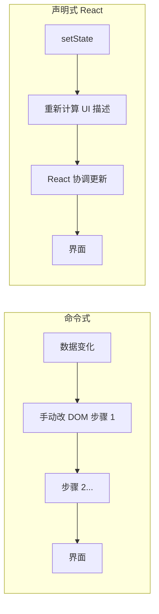
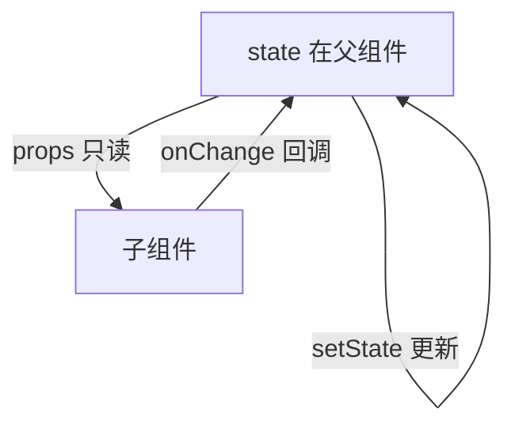
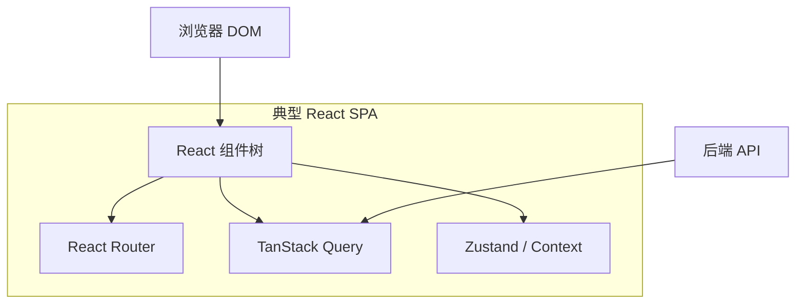

# React 是什么与核心思想

> React 是用于构建用户界面的 **JavaScript 库**（不是完整框架）。它用**组件**描述 UI，用 **state** 驱动界面变化，由 React 负责高效更新 DOM。

---

## 一、一句话理解 React

**你描述「界面在某个状态下长什么样」，React 负责把它画到屏幕上，并在状态变化时做最小代价的更新。**

```tsx
function Counter() {
  const [count, setCount] = useState(0);
  return (
    <button onClick={() => setCount(count + 1)}>
      点了 {count} 次
    </button>
  );
}
```

| 你写的 | React 做的 |
|--------|------------|
| `count === 0` 时按钮显示「点了 0 次」 | 首次渲染，创建 DOM |
| 点击后 `setCount(1)` | 重新执行组件函数，对比新旧描述，只改文本节点 |

---

## 二、React 解决什么问题？

### 2.1 命令式 UI 的痛点

早期用 jQuery 等**命令式** API：手动找 DOM、改属性、绑事件。页面简单时可行，复杂后易出现：

| 问题 | 表现 |
|------|------|
| **状态分散** | 数据在变量里，DOM 在页面上，两者容易不一致 |
| **更新遗漏** | 改 A 忘了同步改 B（例如列表条数与「共 N 条」） |
| **逻辑耦合** | 同一块 UI 的 HTML、CSS、JS 散落在多处 |
| **难以复用** | 复制粘贴 DOM 片段，改一处漏一处 |

```javascript
// 命令式：你要逐步告诉浏览器「怎么做」
const btn = document.getElementById('btn');
const label = document.getElementById('label');
let count = 0;
btn.addEventListener('click', () => {
  count++;
  label.textContent = `点了 ${count} 次`; // 必须记得更新 label
});
```

### 2.2 声明式：描述「结果」

React 采用**声明式**：给定 `count`，UI **应该**长什么样由 JSX 表达；点击只改 state，**不必手写** `label.textContent = ...`。

```tsx
// 声明式：描述「是什么」
function Counter() {
  const [count, setCount] = useState(0);
  return <span>点了 {count} 次</span>;
}
```



---

## 三、四大核心思想

### 3.1 组件化（Component）

UI 拆成**独立、可复用**的块，每块是一个函数（或类），输入 props，输出 JSX。

```tsx
function Avatar({ name, src }: { name: string; src: string }) {
  return (
    <figure>
      
      <figcaption>{name}</figcaption>
    </figure>
  );
}

function UserCard({ user }: { user: User }) {
  return (
    <article>
      <Avatar name={user.name} src={user.avatar} />
      <p>{user.bio}</p>
    </article>
  );
}
```

| 好处 | 说明 |
|------|------|
| 复用 | `Avatar` 可用于列表、详情、评论 |
| 分工 | 每人维护若干组件，边界清晰 |
| 测试 | 小组件单独测 props → 输出 |

### 3.2 单向数据流（One-Way Data Flow）

数据从**父 → 子**通过 props 传递；子组件**不应直接修改** props。状态变更通过**回调**通知父组件。



```tsx
function Parent() {
  const [text, setText] = useState('');
  return <Child value={text} onChange={setText} />;
}

function Child({ value, onChange }: {
  value: string;
  onChange: (v: string) => void;
}) {
  return <input value={value} onChange={(e) => onChange(e.target.value)} />;
}
```

**为什么单向？** 数据流向可预测，bug 时容易追溯「谁改了 state」。

### 3.3 UI = f(state)

界面是**状态**的函数。同一 state 应对应同一 UI；不应在 DOM 里藏一份「额外真相」。

| 概念 | 含义 |
|------|------|
| **state** | 会随时间变化、且影响渲染的数据 |
| **props** | 父传入的配置，对子而言像「只读参数」 |
| **衍生数据** | 可由 state/props 算出来，不必再存一份 state（避免不同步） |

```tsx
// ❌ 冗余 state：fullName 可由 first/last 算出
const [first, setFirst] = useState('');
const [last, setLast] = useState('');
const [fullName, setFullName] = useState('');

// ✅ 渲染时计算
const fullName = `${first} ${last}`.trim();
```

### 3.4 虚拟 DOM 与协调（Reconciliation）— 概念预览

React 在内存中维护 UI 的**描述树**（React Element 树），状态变化时生成新描述，与旧树**对比（diff）**，再**批量**更新真实 DOM。

细节见 [06-渲染与调和](../06-渲染与调和/01-渲染流程总览.md)；此处只需建立直觉：

| 术语 | 通俗理解 |
|------|----------|
| **React Element** | 轻量对象，描述「这里要一个 div / 按钮」 |
| **协调 / Diff** | 找最小变更集，避免整页重绘 |
| **Fiber** | React 16+ 内部调度单元，支持可中断渲染（见 06 模块） |

---

## 四、React 在应用中的位置

React **只管视图层**。路由、全局状态、请求、样式方案等由**生态**补充。



| 层次 | 常见选型 | React 是否内置 |
|------|----------|----------------|
| 视图 | React | ✅ 核心 |
| 路由 | React Router / 框架自带 | ❌ |
| 服务端数据 | TanStack Query / SWR | ❌ |
| 客户端全局状态 | Zustand / Redux | ❌ |
| 构建 | Vite / Next.js | ❌ |
| 样式 | CSS Modules / Tailwind | ❌ |

**元框架**（Next.js、Remix 等）在 React 之上集成路由、SSR、数据加载，见 [14-服务端与元框架](../14-服务端与元框架/)。

---

## 五、React vs 其他方案（粗粒度对比）

| 维度 | React | Vue 3 | 原生 JS |
|------|-------|-------|---------|
| 范式 | 函数 + JSX，库 + 生态 | 单文件组件 + 模板/JSX | 命令式 DOM |
| 学习曲线 | JSX + Hooks + 生态选型 | 模板指令 + Composition API | 低入门，难维护大项目 |
| 灵活性 | 高（自己拼生态） | 中高（官方全家桶更完整） | 最高 |
| 就业与社区 | 极大 | 大（国内尤甚） | — |
| TS 配合 | 成熟 | 成熟 | 无框架约束 |

**选型提示**：没有绝对「最好」；团队熟悉度、招聘、元框架（是否要强 SSR/RSC）往往比语法偏好更重要。

---

## 六、函数组件 + Hooks 是现行标准

| 时代 | 写法 | 现状 |
|------|------|------|
| React 15 及以前 | `React.createClass` | 已废弃 |
| React 16～17 | Class 组件 + 生命周期 | 遗留项目仍会遇到 |
| **React 18+** | **函数组件 + Hooks** | **新项目默认** |

```tsx
// 现行推荐
function Welcome({ name }: { name: string }) {
  const [open, setOpen] = useState(false);
  useEffect(() => {
    document.title = name;
  }, [name]);
  return <h1>{name}</h1>;
}
```

类组件语法、生命周期与迁移见 [17-类组件与迁移](../17-类组件与迁移/)。

---

## 七、React 不是什么

| 误解 | 事实 |
|------|------|
| React 是框架 | 官方定位是 **UI 库** |
| 学了 React 就会前端 | 还需 HTML/CSS/JS/TS、网络、工程化 |
| Virtual DOM 一定更快 | 目的是**可预测 + 开发效率**；性能靠 key、memo、分割等优化 |
| useEffect 等于 mounted | Hooks 语义不同，见 [05-Hooks体系](../05-Hooks体系/) |
| 必须用 Redux | 多数场景本地 state + Query + 轻量全局即可 |

---

## 八、第一个组件心智 checklist

读下一篇前，确认理解：

- [ ] 能说出**声明式**与**命令式**的区别
- [ ] 知道 **props 向下、事件向上**
- [ ] 知道 **UI = f(state)**，避免重复存可算出的 state
- [ ] 知道 React 只负责 UI，路由/请求等靠生态
- [ ] 知道新项目以**函数组件 + Hooks** 为主

---

## 九、小结

React 的核心是：**用组件拆分 UI，用 state 驱动变化，用协调算法高效更新 DOM**。掌握这四点，再学 JSX、Hooks、渲染机制会顺畅很多。

**下一篇**：[02-React发展脉络与版本演进](./02-React发展脉络与版本演进.md)
