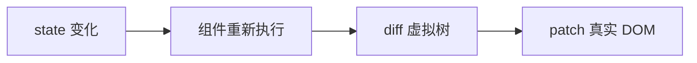

# React 是什么与核心思想

React 管视图层；路由、请求、全局状态宜交给生态，不宜全塞进 `useEffect`。

---

## 管 state，React 管 DOM

React 是做 UI 的 **JavaScript 库**，不是自带路由和数据层的完整框架。组件描述「在某个 state 下界面长什么样」，state 变了 React 重新算、尽量做小的 DOM 更新。

```tsx
function Counter() {
  const [count, setCount] = useState(0);
  return (
    <button onClick={() => setCount(c => c + 1)}>
      点了 {count} 次
    </button>
  );
}
```

对比命令式写法，差异在于谁负责同步：

```javascript
// 命令式：每改一次数据，要记得改 DOM
let count = 0;
btn.addEventListener('click', () => {
  count++;
  label.textContent = `点了 ${count} 次`;
});
```

```tsx
// 声明式：UI 是 state 的结果
return <span>点了 {count} 次</span>;
```

页面越复杂，越不宜当「DOM 同步员」。写组件时先想 **state 放哪、UI 怎么由 state 推出来**；必须直接碰 DOM 的（聚焦、滚动）才用 ref。



---

## 四个思想，写代码时会反复碰到

**组件化**， UI 拆成块，进 props 出 JSX。头像、按钮这种会重复的，抽成组件改一处就够。

**单向数据流**， 数据父→子用 props；子要改父的数据，回调通知父改 state。props 只读，在子组件里改 props 既会警告又乱逻辑：

```tsx
function SearchInput({ value, onChange }: { value: string; onChange: (v: string) => void }) {
  return <input value={value} onChange={e => onChange(e.target.value)} />;
}
```

出 bug 时顺着「谁拥有这份 state」往上查，路径是固定的。

**UI = f(state)**， 同一 state 应对应同一 UI。能算出来的别塞进 state：常见坑是把「可由 props 推导的值」也 `useState` 一份，props 变了 state 没跟上，界面 stale。

**协调（Reconciliation）**， state 变后 React diff 新旧 vnode 再 patch DOM。列表 **key** 帮 React 认「哪一行还是同一项」；可排序列表用 index 当 key，删插 reorder 时 state 可能对错行：

```tsx
items.map(item => <Row key={item.id} item={item} />); // ✅ 稳定 id
```

---

## React 只管视图，别的要另选

React 自带的是组件树和局部 state。React Router 管 URL，TanStack Query 管服务端数据和缓存，Zustand/Redux 管更大的客户端状态，都是生态，不是 `react` 包自带的。

把请求、缓存、重试全塞进 `useEffect` + 全局变量，后期一定乱。粗分如下：

| 需求 | 常见选型 |
|------|----------|
| 组件内 UI 状态 | `useState` / `useReducer` |
| 跨组件、量不大 | Context 或轻量 store |
| 列表/详情/缓存 | TanStack Query 等 |
| URL 与页面 | React Router |

---

## 函数组件 + Hooks 是默认；class 是遗留

新文件宜用函数组件 + Hooks；看到 class 通常是在维护老代码。Hooks 让函数组件能写 state 和副作用，已是现行默认写法。

---

## 几个常见误解

| 误解 | 实际 |
|------|------|
| React = 全家桶 | 只是 UI 库 |
| 用了 React 就不用 HTML/CSS | 语义、a11y、布局仍要懂 |
| Virtual DOM 永远更快 | 开发模型；性能靠架构和优化 |
| setState 立刻改 DOM | 批量异步；要最新值用函数式更新或 ref |

---

## 小结

React 的本质可以收成 **组件 + state + 声明式 JSX**：给定 state，描述 UI；state 变，React 通过协调（diff + patch）更新 DOM，不必手写逐步改 DOM。

**组件化**让界面可复用、可分工；**单向数据流**让数据去向可追溯，props 向下，事件向上，state 归属清晰。**UI = f(state)** 提醒少存冗余 state， derivable 的值用计算或 memo 即可。**协调**解释为何要关心列表 key：帮助 React 识别列表项身份，避免错误复用 DOM。

React **不负责**路由、服务端数据缓存、全局业务状态，这些在生态里选专门工具。组件内 UI 用 Hooks；跨组件小范围用 Context 或轻量 store；接口数据用 Query 类库；URL 用 Router。切忌把「所有异步和数据」都堆进 `useEffect`。

**写法默认**：函数组件 + Hooks；class 仅遗留维护。

常见错因：这份 state 谁拥有？props 有没有被当可变对象改？列表 key 是否稳定？更新后读到的 state 是不是旧的（异步批量）？

**延伸方向**：Fiber、Hooks、18 并发等是在这套核心思想上叠能力；先立住「声明式 + 组件 + 单向数据流」，再去看各版本分别解决了什么新问题，会顺很多。
