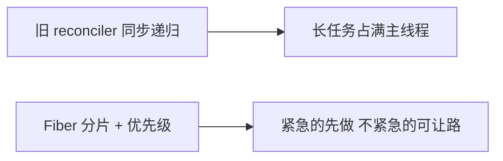
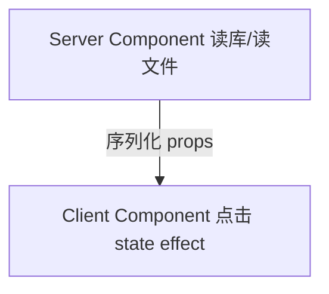

# React 发展脉络与版本演进

把 React 从 2013 到现在串成一条线，被问到 Fiber、Hooks、18 并发、19、RSC 时，能按**当时遇到了什么问题、官方怎么解的**来讲，而不是背版本号和发布时间。

---

## 从 Virtual DOM 说起

React 刚出来时，打的是这套牌：用 JS 描述 UI（Virtual DOM），state 变了就重新算一遍描述，再 diff 出要改的真实 DOM。

```tsx
function Counter() {
  const [count, setCount] = useState(0);
  return <button onClick={() => setCount(c => c + 1)}>{count}</button>;
}
```

改的是 `count`，按钮文字怎么变，不必自己写 `textContent`。以前用 jQuery，数据和 DOM 是两套东西，改 count 还得记着改 label，页面一大就容易漏。Virtual DOM 换的是**开发模型**：只管 state，DOM 同步交给 React。

容易误解的一点：Virtual DOM 不等于「一定比手写 DOM 快」。它有 diff 的 CPU 成本；早期 API（createClass、Mixin）也很乱。它首先是**声明式 + 可预测的更新路径**，性能是后面 Fiber、批处理、Compiler 继续优化的对象。

---

## Fiber：渲染终于能「让路了」（React 16）

Virtual DOM 能用了，但 React 15 及以前的协调是**同步递归**，一旦开始更新大树，主线程得一口气跑完，输入、动画会卡。

Fiber 就是为此来的：把渲染拆成链表上的小步，可以**暂停、恢复、按优先级排队**。用户点击是高优，后台筛大列表可以低优、晚点再算。不必背 Fiber 的链表结构，先记住它要解决的是**同步递归占满主线程**；链表实现属于源码层，日常开发只要理解「可中断、可排序」即可。



同一时期还常碰到 Error Boundary、Fragment `<>...</>`、Portal、新 Context，和 Fiber 一起构成 16 时代的日常工具箱。

---

## Hooks：函数组件终于能当家（16.8）

Class 组件的几类典型痛点：逻辑想复用得 HOC 套 HOC；订阅写在 `componentDidMount`、清理在 `willUnmount`，改需求要跳文件；`this` 还要 bind 来 bind 去。Hooks 的变化在于，**按「功能」写代码，而不是按「生命周期阶段」拆**。

```tsx
useEffect(() => {
  const sub = subscribe(userId);
  return () => sub.unsubscribe();
}, [userId]);
```

挂载、清理、依赖变化重新订阅，全在一个 effect 里。新组件宜一律函数 + Hooks；class 仅在维护遗留代码时碰。

写 Hook 有两条铁律：**只在顶层调**（别放 if/for 里），**只在组件或自定义 Hook 里调**。在 if 里写 `useState` 会直接报错，Hook 调用顺序必须稳定。

```tsx
// ❌
if (loggedIn) {
  const [user, setUser] = useState(null);
}

// ✅ 条件放在 Hook 外面或 JSX 里
const [user, setUser] = useState(null);
if (!loggedIn) return null;
```

改 effect 依赖时，务必明确「这段逻辑依赖谁」，漏依赖会闭包拿旧值，乱填依赖会导致无限请求，都是高频 bug。

---

## React 17：故意「没什么新特性」

17 几乎不加新 API，主要是让升级不那么疼：事件委托从 `document` 改到**挂载 root**，新 JSX 运行时不用 `import React`。微前端、渐进升级需要多版本共存，17 是到 18 的桥。

项目若还停在 17，合理下一步是 18 + `createRoot`，而不是在 17 上继续堆新能力。升级后第三方库事件行为异常，要想到**委托位置变了**这一层。

---

## React 18：Fiber 的能力端到应用层

18 把可中断、优先级真正开放：`useTransition`、`useDeferredValue` 标记「不着急的更新」；**自动批处理**也扩到 `setTimeout`、Promise 里的多次 setState。

搜索框要立刻响应、大列表过滤可以慢半拍，这就是 transition 的典型场景。根 API 也要换，不然 18 特性用不全：

```tsx
// 旧 API 能跑，但等于没上 18
ReactDOM.render(<App />, root);

import { createRoot } from 'react-dom/client';
createRoot(root).render(<App />); // ✅
```

开发态 Strict Mode **双调 effect**，应理解为帮暴露「清理没写干净」的副作用，不是 React 异常行为。

**并发**容易想歪，不是多线程同时 render，仍是单线程，只是任务**可打断、可排序**。

---

## 19 与 Compiler：少手写 memo，表单有 Actions

19 往 **Actions**（提交中、错误、乐观 UI）、`useOptimistic`、`ref` 当 prop（少包 `forwardRef`）、**React Compiler**（编译期自动 memo）走。

手写 `useMemo` / `memo` 常落在两个极端：该加没加，或堆一堆可读性很差。Compiler 想把后者交给工具；Actions 是把各项目自己封装的「提交状态机」往官方模式收。宜按项目版本渐进采用；Compiler 未全面推广前，热点仍按 18 的方式显式优化。

---

## Server Components：取数放服务端，交互留客户端

很多页大半是结构和读库，全发客户端 bundle 浪费。**Server Component** 在服务端跑，默认不下发组件 JS；要 state、事件、`useEffect` 的标 `'use client'`。



硬规则：`useState` 不能写进 Server Component。在 SC 里 import 操作 `window` 的库，构建或运行会报错。用 App Router 类方案时，先判断「这块能不能 server」。

---

## 文档和工具链的变迁

| 以前 | 现在默认 |
|------|----------|
| reactjs.org + class 示例 | react.dev，Hooks 优先 |
| CRA | Vite / Next.js |
| 什么都 Redux | Query 管服务端状态 + 轻量 store |

---

## 升级时的合理顺序

很老、还在 class → 先 16.8+ 迁 Hooks，再 18。16.8～17 → 换 `createRoot`，Strict Mode 查 effect。18 → 按需 19、Compiler、RSC。

不宜追求「一次升到最新」，**分步、每步可测**更稳。

---

## 小结

React 演进有一条清晰主线：**声明式 UI（Virtual DOM）→ 可中断调度（Fiber）→ 函数组件统一（Hooks）→ 并发体验与自动批处理（18）→ 服务端/编译器分工（RSC、Compiler、19）**。记版本时，把每个节点和「它解什么痛」绑在一起，比背发布年份有用得多。

**Virtual DOM** 解决的是命令式 DOM 同步负担，不是天然的性能银弹；diff 有成本，性能靠后续架构和工具链继续挖。

**Fiber** 解决同步递归占满主线程；理解「可中断、有优先级」即可，不必先啃源码链表。

**Hooks** 解决 class 逻辑复用难、生命周期割裂；函数组件成为默认写法。Hook 规则（顶层、仅在 React 函数内）和 effect 依赖写法是日常排错重点。

**17** 是升级桥，**18** 把并发 API 和 `createRoot` 推到台前；「并发」是单线程调度，不是多线程。

**19 / Compiler** 方向是少手写 memo、表单 Actions 标准化；**RSC** 方向是取数在服务端、交互在客户端，Server Component 里不能写客户端 Hook。

**生态侧**：文档以 react.dev 和 Hooks 为准，脚手架以 Vite/Next 为主，服务端状态宜交给 Query 类库而不是全塞 Redux。

**升级策略**：先 Hooks、再 `createRoot`、再 19/RSC；遗留 class 分步迁移，每步可回归测试。

**易混点备忘**：Virtual DOM ≠ 一定更快；Concurrent ≠ 多线程；Strict Mode 双调 effect ≠ 生产行为；Server Component ≠ 整站只能在服务端写组件。
