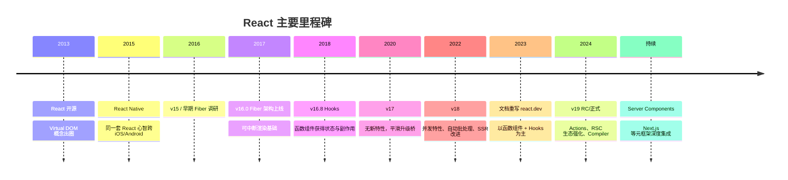
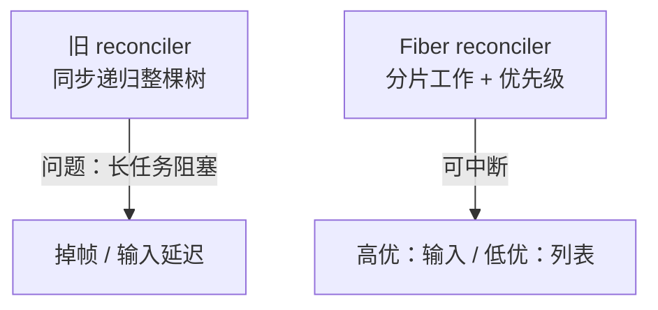
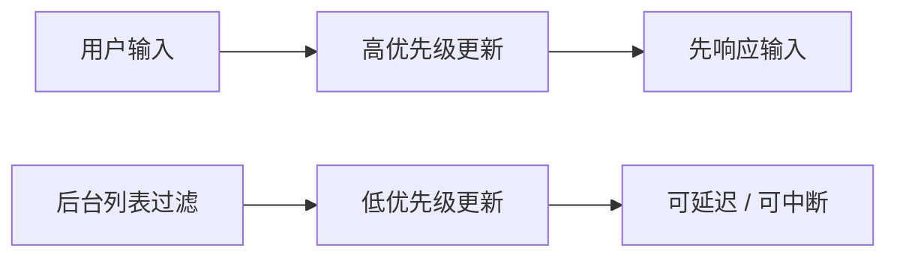
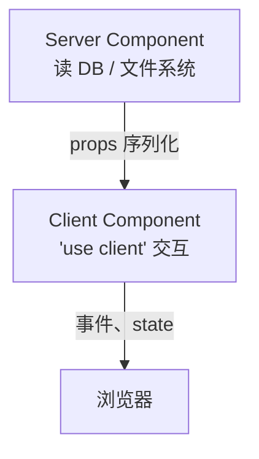

# React 发展脉络与版本演进

> 了解版本脉络，才能理解「为什么 Hooks 取代 class」「为什么 Concurrent」「RSC 解决什么」。不必背年份，要抓**每次变革要解决什么问题**。

---

## 一、时间线总览



| 版本 | 发布时间（约） | 关键词 |
|------|----------------|--------|
| 0.3～15 | 2013–2016 | createClass、Mixin、PropTypes |
| **16.0** | 2017 | **Fiber**、Error Boundary、Fragment |
| 16.3 | 2018 | getDerivedStateFromProps、Context 新 API |
| **16.8** | 2019 | **Hooks** |
| 17 | 2020 | 渐进升级，事件委托改 root |
| **18** | 2022 | **Concurrent**、useTransition、Suspense SSR |
| **19** | 2024 | **Actions**、useOptimistic、ref 作 prop、Compiler |

---

## 二、阶段一：Virtual DOM 时代（～2015）

### 2.1 背景

Facebook 新闻 Feed 需要频繁更新 UI，命令式 DOM 难维护。React 提出：

1. 每次 state 变化，重新生成整棵 **Virtual DOM 树**
2. **Diff** 新旧树，得到最小 DOM 操作集

### 2.2 影响

| 收益 | 代价 |
|------|------|
| 组件化 + 声明式成为主流 | Diff 有 CPU 成本（通常可接受） |
| 跨平台可能（React Native） | 早期 API 混乱（createClass、Mixin） |

---

## 三、阶段二：Fiber 架构（React 16）

### 3.1 旧栈 reconciler 的局限

React 15 及以前，协调过程是**同步递归**，一旦开始不能中断。大组件树更新会**长时间占用主线程**，导致输入卡顿。

### 3.2 Fiber 是什么？

**Fiber** 是 React 内部的**工作单元**（链表结构上的节点），把渲染拆成可**暂停、恢复、优先级调度**的小步。



| 对比 | 同步 reconciler | Fiber |
|------|-----------------|-------|
| 中断 | 不能 | 可以 |
| 优先级 | 无 | 有（为 Concurrent 铺路） |
| 数据结构 | 递归栈 | 链表 Fiber 节点 |

深入见 [03-Fiber架构与可中断渲染](../06-渲染与调和/03-Fiber架构与可中断渲染.md)。

### 3.3 16 同期重要 API

| API | 作用 |
|-----|------|
| `Error Boundary` | 捕获子树渲染错误，避免整页白屏 |
| `Fragment` `<>...</>` | 无多余 DOM 包裹 |
| `Portals` | 渲染到 DOM 其他位置（模态框） |
| 新 Context API | `createContext` / `useContext` 前身 |

---

## 四、阶段三：Hooks 革命（16.8，2019）

### 4.1 为什么要 Hooks？

Class 组件的问题：

| 问题 | 举例 |
|------|------|
| **逻辑难复用** | 复用要 HOC / render props，嵌套地狱 |
| **生命周期割裂** | 订阅在 `componentDidMount`，清理在 `willUnmount`，相关逻辑分散 |
| **`this` 绑定** | 新手易错 |
| **热重载 / 优化** | class 较重 |

Hooks 让**函数组件**拥有 state 与副作用，且相关逻辑可抽成**自定义 Hook**。

```tsx
// 同一逻辑：class 分散在多个生命周期
// Hooks：集中在一个 useEffect
useEffect(() => {
  const sub = subscribe(userId);
  return () => sub.unsubscribe();
}, [userId]);
```

### 4.2 内置 Hooks 首次亮相

| Hook | 替代 class 的 |
|------|----------------|
| `useState` | `this.state` / `setState` |
| `useEffect` | `componentDidMount` / `Update` / `WillUnmount` |
| `useContext` | `contextType` / Consumer |
| `useReducer` | 复杂 state + `dispatch` |
| `useRef` | 实例属性、DOM ref |
| `useMemo` / `useCallback` | 性能优化 |
| 等 | 见 [05-Hooks体系](../05-Hooks体系/) |

### 4.3 规则

1. 只在**顶层**调用 Hooks（不在 if/for 里）
2. 只在 **React 函数**里调用（组件或自定义 Hook）

---

## 五、React 17：过渡桥

** intentionally 几乎无新特性**，便于：

- 多版本 React 共存（微前端）
- 升级 `@types/react`、事件系统（委托到 root）
- 为 18 的 Concurrent 做准备

| 变化 | 说明 |
|------|------|
| 事件委托 | 从 `document` 改为挂载 **root 容器** |
| JSX Transform | 无需 `import React`（新编译器） |
| 无新 Hooks | — |

---

## 六、React 18：并发渲染（Concurrent）

### 6.1 「并发」指什么？

不是多线程，而是 React **可中断、可恢复**渲染，并根据**优先级**调度更新（例如用户输入优先于列表筛选）。



### 6.2 面向开发者的 API

| API / 行为 | 作用 |
|------------|------|
| **自动批处理** | 异步回调里多次 setState 也合并一次渲染 |
| `useTransition` | 标记「非紧急」更新 |
| `useDeferredValue` | 延迟显示某值（如搜索框 vs 结果列表） |
| **Suspense SSR** | 流式 HTML、`hydrateRoot` |
| `StrictMode` 开发双调用 | 帮助发现不安全的副作用 |

见 [12-并发与Suspense](../12-并发与Suspense/)。

### 6.3 根 API 变化

```tsx
// React 17
import ReactDOM from 'react-dom';
ReactDOM.render(<App />, document.getElementById('root'));

// React 18+
import { createRoot } from 'react-dom/client';
createRoot(document.getElementById('root')!).render(<App />);
```

---

## 七、React 19 与 Compiler（2024+）

### 7.1 主要特性（概览）

| 特性 | 解决的问题 |
|------|------------|
| **Actions** | 表单/异步提交统一 pending、错误、乐观 UI |
| `useActionState` | Action 状态机 |
| `useOptimistic` | 乐观更新 |
| **ref 作为 prop** | 少包一层 `forwardRef` |
| **Document Metadata** | `<title>` 等内置支持 |
| **React Compiler** | 编译期自动 memo，减手动 useMemo |

详情见 [18-React19与新特性](../18-React19与新特性/)。

### 7.2 React Compiler 直觉

手动 `useMemo` / `memo` 易漏、过度。Compiler 分析组件与 Hooks 依赖，**自动插入**记忆化。与手写优化可共存，逐步推广。

---

## 八、Server Components（RSC）— 跨版本架构

RSC 不替代 Client Components，而是**默认在服务端运行**的组件，减少发到浏览器的 JS。



| 类型 | 运行位置 | 典型用途 |
|------|----------|----------|
| Server Component | 服务端 | 取数、静态结构 |
| Client Component | 浏览器 | 点击、state、useEffect |

见 [14-服务端与元框架](../14-服务端与元框架/03-React-Server-Components.md)。

---

## 九、文档与生态变迁

| 时期 | 文档 | 特点 |
|------|------|------|
| 旧 | reactjs.org | class 示例多 |
| 现 | **react.dev** | Hooks 优先、Sandpack 示例、RSC 章节 |

| 工具 | 变迁 |
|------|------|
| 脚手架 | CRA（维护模式）→ **Vite** / **Next.js** |
| 状态 | Flux → Redux → Redux Toolkit + **TanStack Query** + **Zustand** |
| 路由 | React Router 4/5 → **v6/v7** 数据路由 |

---

## 十、升级策略建议

| 当前版本 | 建议 |
|----------|------|
| &lt; 16.8 | 先升到 16.8+ 并迁 Hooks，再 18 |
| 16.8～17 | 换 `createRoot`，开 Strict Mode 测副作用 |
| 18 | 评估 19、Compiler；Next App Router 可渐进 RSC |
| 类组件多 | 新功能用函数组件；旧代码见 [17-类组件与迁移](../17-类组件与迁移/) |

---

## 十一、小结

| 演进 | 驱动力 |
|------|--------|
| Virtual DOM | 声明式 + 可预测更新 |
| Fiber | 可中断、为性能与 Concurrent 打基础 |
| Hooks | 逻辑复用、函数组件一统 |
| Concurrent | 保持输入响应、改善 UX |
| RSC | 减 bundle、数据靠近源 |
| 19 + Compiler | 简化异步表单、减手动优化 |

**上一篇**：[01-React是什么与核心思想](./01-React是什么与核心思想.md)  
**下一篇**：[03-开发环境与项目结构](./03-开发环境与项目结构.md)
