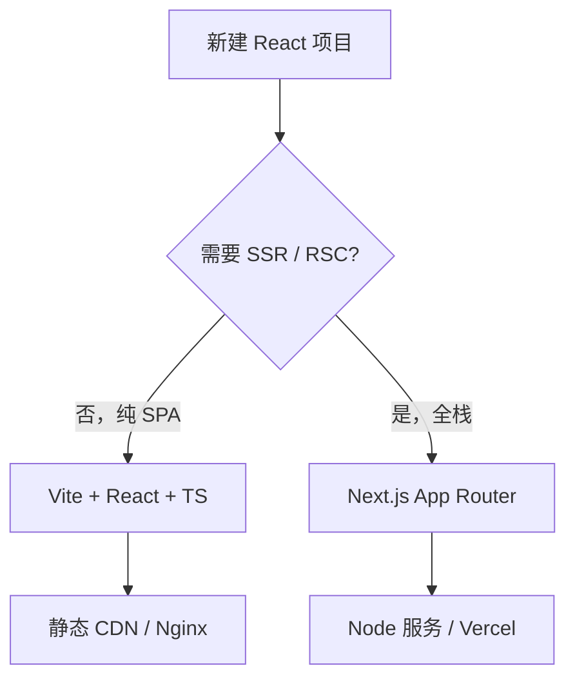
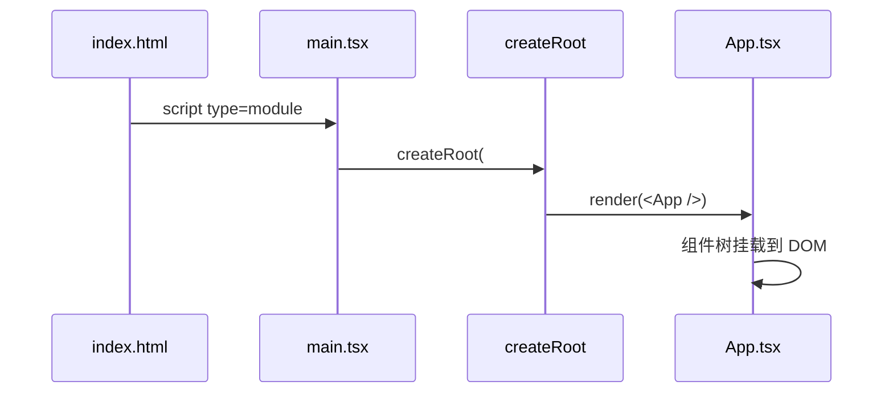
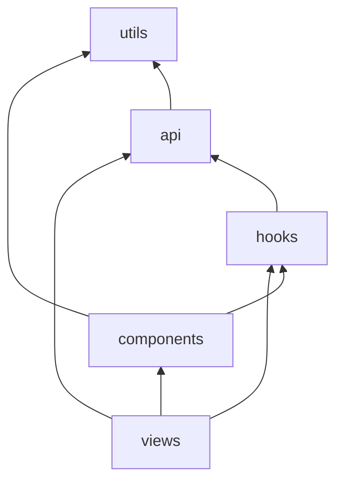

# 开发环境与项目结构

> 现代 React 项目很少从零配 Webpack。本文讲 **Vite SPA** 与 **Next.js** 两种主流起点、目录约定、入口文件与 Strict Mode——能创建项目、知道文件该放哪。

---

## 一、环境准备

### 1.1 必备工具

| 工具 | 推荐版本 | 用途 |
|------|----------|------|
| **Node.js** | 20 LTS 或 22 LTS | 运行构建、包管理 |
| **pnpm** | 9+ | 包管理（与 [编码规范](../React编码规范.md) 一致；npm/yarn 亦可） |
| **编辑器** | VS Code / Cursor | TS、ESLint、Prettier 插件 |

```bash
node -v    # v20.x 或 v22.x
pnpm -v    # 9.x
```

### 1.2 与前端基础的关系

| 技能 | 对应文档 |
|------|----------|
| 模块 import/export | [JavaScript · 模块化](../../../前端基础体系/03-JavaScript体系.md) |
| TypeScript | [TypeScript 体系](../../../前端基础体系/04-TypeScript体系.md) |
| 包与 lock | [包管理层](../../../前端工程化体系/01-包管理层.md) |

---

## 二、创建项目：两条主路径



### 2.1 Vite + React + TypeScript（SPA）

```bash
pnpm create vite my-app --template react-ts
cd my-app
pnpm install
pnpm dev
```

| 脚本 | 作用 |
|------|------|
| `pnpm dev` | 开发服务器，HMR |
| `pnpm build` | 生产构建到 `dist/` |
| `pnpm preview` | 本地预览构建产物 |

**适用**：管理后台、营销页、纯客户端应用、嵌入现有后端的 SPA。

### 2.2 Next.js（App Router）

```bash
pnpm create next-app@latest my-app
# 建议：TypeScript ✅、ESLint ✅、App Router ✅、src/ 目录按团队习惯
cd my-app
pnpm dev
```

| 能力 | 说明 |
|------|------|
| 文件系统路由 | `app/` 下文件夹即路由 |
| SSR / SSG / ISR | 服务端渲染与静态生成 |
| RSC | Server Components 默认 |

**适用**：SEO 敏感、首屏要快、需要 API 同仓的全栈应用。详见 [14-服务端与元框架](../14-服务端与元框架/)。

### 2.3 Create React App（CRA）

Facebook 官方旧脚手架，**已进入维护模式**，新项目**不推荐**。遗留项目可继续维护或迁 Vite。

---

## 三、Vite 项目结构详解

### 3.1 默认目录

```plaintext
my-app/
├── public/              # 原样拷贝到 dist 根（favicon、robots.txt）
├── src/
│   ├── assets/          # 需 import 的资源（图片、字体）
│   ├── App.tsx          # 根组件
│   ├── App.css
│   ├── main.tsx         # 应用入口
│   ├── index.css        # 全局样式
│   └── vite-env.d.ts    # Vite 类型声明
├── index.html           # HTML 壳，挂载 #root
├── package.json
├── tsconfig.json
├── vite.config.ts
└── eslint.config.js
```

### 3.2 入口链路



**index.html**

```html
<div id="root"></div>
<script type="module" src="/src/main.tsx"></script>
```

**main.tsx（React 18+）**

```tsx
import { StrictMode } from 'react';
import { createRoot } from 'react-dom/client';
import App from './App';
import './index.css';

createRoot(document.getElementById('root')!).render(
  <StrictMode>
    <App />
  </StrictMode>,
);
```

| 文件 | 职责 |
|------|------|
| `index.html` | 页面壳、meta、根节点 |
| `main.tsx` | 创建 root、挂载 `<App />`、可选 StrictMode |
| `App.tsx` | 应用根组件：路由、Provider 常放这里 |

### 3.3 推荐的中大型 SPA 目录（对齐编码规范）

```plaintext
src/
├── api/                 # HTTP 客户端、接口函数
│   ├── request.ts
│   └── modules/
├── assets/
├── components/
│   ├── base/            # Button、Input 等无业务
│   └── business/        # 跨页面业务块
├── config/              # 常量、枚举
├── hooks/               # 自定义 Hooks
├── layouts/             # MainLayout、AuthLayout
├── router/              # 路由表、守卫
├── store/               # Zustand 等
├── types/
├── utils/
├── views/               # 页面级组件
├── App.tsx
└── main.tsx
```

**依赖方向**（避免循环引用）：



| 层级 | 可依赖 | 不应依赖 |
|------|--------|----------|
| `views` | components、hooks、api | 被 components 依赖 |
| `components/base` | utils | views、api 业务 |
| `utils` | 无业务 | 任何 UI |

完整规范见 [React编码规范 · 工程与目录](../React编码规范.md)。

---

## 四、Next.js App Router 结构（简览）

```plaintext
my-app/
├── app/
│   ├── layout.tsx       # 根布局（html/body）
│   ├── page.tsx         # / 路由
│   ├── loading.tsx      # Suspense 边界 loading
│   ├── error.tsx        # 错误 UI
│   └── dashboard/
│       ├── layout.tsx
│       └── page.tsx     # /dashboard
├── components/
├── lib/
├── public/
└── next.config.ts
```

| 文件 | 作用 |
|------|------|
| `layout.tsx` | 共享 UI 包裹子路由 |
| `page.tsx` | 该段路由的页面（默认 Server Component） |
| `'use client'` | 文件顶行标记客户端组件 |

---

## 五、关键配置文件

### 5.1 package.json 片段

```json
{
  "type": "module",
  "scripts": {
    "dev": "vite",
    "build": "tsc -b && vite build",
    "preview": "vite preview",
    "lint": "eslint ."
  },
  "dependencies": {
    "react": "^19.0.0",
    "react-dom": "^19.0.0"
  },
  "devDependencies": {
    "@types/react": "^19.0.0",
    "@types/react-dom": "^19.0.0",
    "@vitejs/plugin-react": "^4.0.0",
    "typescript": "^5.0.0",
    "vite": "^6.0.0"
  }
}
```

### 5.2 vite.config.ts

```typescript
import { defineConfig } from 'vite';
import react from '@vitejs/plugin-react';
import path from 'path';

export default defineConfig({
  plugins: [react()],
  resolve: {
    alias: {
      '@': path.resolve(__dirname, 'src'),
    },
  },
  server: {
    port: 5173,
    proxy: {
      '/api': 'http://localhost:3000',
    },
  },
});
```

| 配置 | 说明 |
|------|------|
| `@/` alias | 与 tsconfig `paths` 一致 |
| `proxy` | 开发时代理 API，避免 CORS |

### 5.3 tsconfig 要点

```json
{
  "compilerOptions": {
    "target": "ES2022",
    "lib": ["ES2022", "DOM", "DOM.Iterable"],
    "module": "ESNext",
    "moduleResolution": "bundler",
    "jsx": "react-jsx",
    "strict": true,
    "noEmit": true,
    "paths": { "@/*": ["./src/*"] }
  },
  "include": ["src"]
}
```

| 选项 | 说明 |
|------|------|
| `jsx: react-jsx` | 新 JSX 运行时，无需每文件 import React |
| `strict` | 强烈建议开启 |

---

## 六、Strict Mode 是什么？

开发环境下，Strict Mode 会**故意双重调用**部分函数（如组件函数、useState 初始化、useEffect  setup/cleanup），帮助发现：

| 问题 | 示例 |
|------|------|
| 副作用未清理 | 重复订阅 |
| 非纯渲染 | 渲染里改外部变量 |
| 过时的 API | 如 findDOMNode |

```tsx
<StrictMode>
  <App />
</StrictMode>
```

**注意**：仅开发环境行为；生产不会双调用。见 [06-StrictMode](../06-渲染与调和/06-StrictMode与开发态行为.md)。

---

## 七、环境变量

### 7.1 Vite 约定

| 前缀 | 暴露给客户端 |
|------|--------------|
| `VITE_` | ✅ |
| 无前缀 | ❌（不应放密钥） |

```bash
# .env.development
VITE_API_BASE=http://localhost:8080
```

```tsx
const base = import.meta.env.VITE_API_BASE;
```

### 7.2 安全红线

| 禁止 | 原因 |
|------|------|
| 把 API Secret 放进 `VITE_` | 会打进客户端 bundle |
| 把密钥提交 git | 用 CI Secret / 服务端环境变量 |

---

## 八、本地开发常见问题

| 现象 | 排查 |
|------|------|
| 改代码不热更新 | 检查是否在 `node_modules` 外；保存是否成功 |
| 端口占用 | `vite --port 5174` 或改 config |
| 路径 `@/` 报错 | 同步 `vite.config` 与 `tsconfig paths` |
| Invalid hook call | 多份 react、或 Hook 用在非组件函数 |
| 白屏 | 看控制台；检查 `root` 元素是否存在 |

---

## 九、从「能跑」到「能协作」

| 步骤 | 动作 |
|------|------|
| 1 | 统一 Node 版本（`.nvmrc` / `engines`） |
| 2 | ESLint + Prettier + husky |
| 3 | 目录按 [编码规范](../React编码规范.md) 落地 |
| 4 | `pnpm lint` 进 CI |

见 [代码规范与质量保障](../../../前端工程化体系/04-代码规范与质量保障.md)。

---

## 十、小结

| 场景 | 选型 |
|------|------|
| 纯浏览器 SPA | Vite + React + TS |
| SEO / SSR / 全栈 | Next.js App Router |
| 入口 | `main.tsx` → `createRoot` → `<App />` |
| 目录 | api / components / hooks / views 分层 |

**上一篇**：[02-React发展脉络与版本演进](./02-React发展脉络与版本演进.md)  
**下一篇**：[04-React生态全景图](./04-React生态全景图.md)
