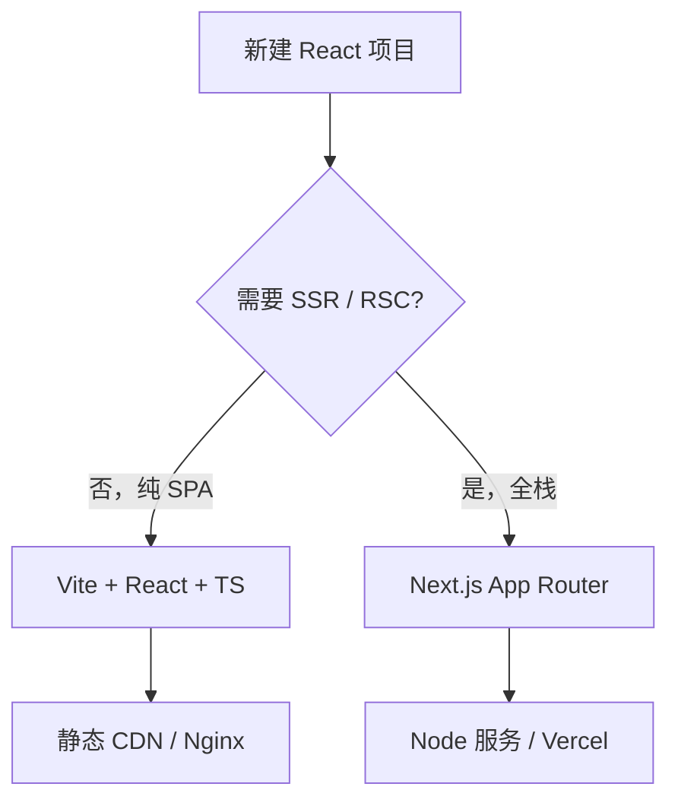
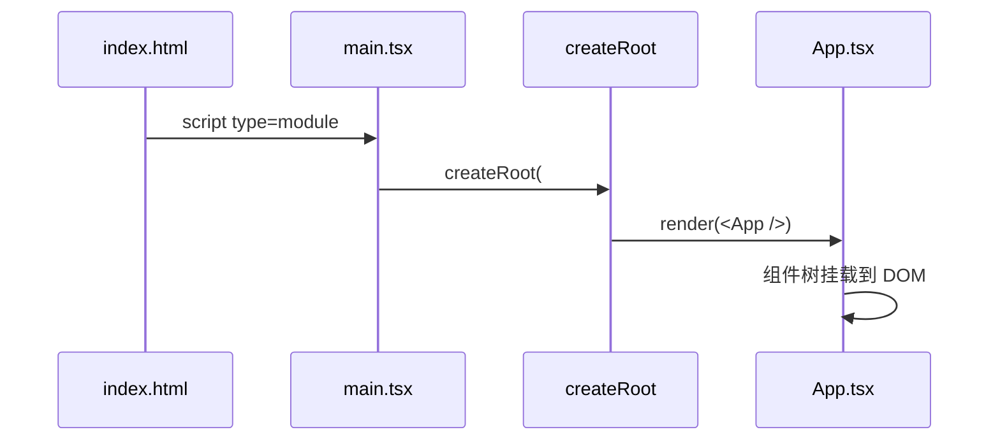
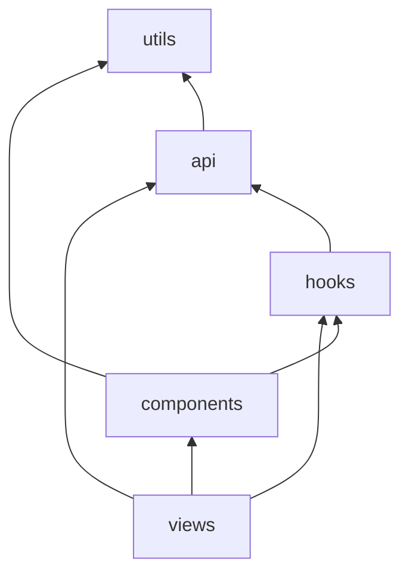

# 开发环境与项目结构

讲清楚三件事：用什么工具链搭 React 项目、入口文件怎么串起来、代码该放哪一层。能跑只是第一步，目录和依赖方向对了，后面协作才不会乱。

---

## 环境准备

| 工具 | 推荐版本 | 用途 |
|------|----------|------|
| **Node.js** | 20 LTS 或 22 LTS | 运行构建、包管理 |
| **pnpm** | 9+ | 包管理（npm/yarn 亦可） |
| **编辑器** | VS Code / Cursor | TS、ESLint、Prettier 插件 |

```bash
node -v    # v20.x 或 v22.x
pnpm -v    # 9.x
```

Node 版本建议团队统一（`.nvmrc` 或 `package.json` 的 `engines`），否则 lock 文件和本地行为可能对不上。

---

## 创建项目：Vite SPA 还是 Next.js



**Vite + React + TypeScript** 适合管理后台、营销页、纯客户端应用，后端已有 API，浏览器里跑完即可：

```bash
pnpm create vite my-app --template react-ts
cd my-app
pnpm install
pnpm dev
```

| 脚本 | 作用 |
|------|------|
| `pnpm dev` | 开发服务器，HMR |
| `pnpm build` | 生产构建到 `dist/` |
| `pnpm preview` | 本地预览构建产物 |

**Next.js App Router** 适合 SEO 敏感、首屏要快、需要 API 同仓的全栈应用，文件系统路由、`app/` 下默认 Server Component、SSR/SSG/ISR 开箱：

```bash
pnpm create next-app@latest my-app
# 建议：TypeScript ✅、ESLint ✅、App Router ✅
cd my-app
pnpm dev
```

**Create React App（CRA）** 已进入维护模式，新项目不推荐；遗留项目可继续维护或迁 Vite。

| 选型 | 何时选 |
|------|--------|
| Vite SPA | 只要浏览器里跑、后端已有 API |
| Next.js | 要强 SEO、首屏、服务端取数、全栈同仓 |

---

## Vite 项目结构与入口链

默认目录大致如下：

```plaintext
my-app/
├── public/              # 原样拷贝到 dist 根（favicon、robots.txt）
├── src/
│   ├── assets/          # 需 import 的资源
│   ├── App.tsx          # 根组件
│   ├── main.tsx         # 应用入口
│   └── index.css        # 全局样式
├── index.html           # HTML 壳，挂载 #root
├── package.json
├── tsconfig.json
└── vite.config.ts
```

入口链路：`index.html` → `main.tsx` → `createRoot` → `<App />`。



**index.html** 提供 `#root` 和模块入口：

```html
<div id="root"></div>
<script type="module" src="/src/main.tsx"></script>
```

**main.tsx（React 18+）** 创建 root 并挂载，开发态建议包一层 `StrictMode`：

```tsx
import { StrictMode } from 'react';
import { createRoot } from 'react-dom/client';
import App from './App';
import './index.css';

createRoot(document.getElementById('root')!).render(
  <StrictMode>
    <App />
  </StrictMode>,
);
```

| 文件 | 职责 |
|------|------|
| `index.html` | 页面壳、meta、根节点 |
| `main.tsx` | 创建 root、挂载 `<App />`、全局样式 import |
| `App.tsx` | 应用根：路由、Provider 常放这里 |

中大型 SPA 可按职责分层：

```plaintext
src/
├── api/                 # HTTP 客户端、接口函数
├── components/
│   ├── base/            # Button、Input 等无业务
│   └── business/        # 跨页面业务块
├── hooks/
├── layouts/
├── router/
├── store/
├── views/               # 页面级组件
├── App.tsx
└── main.tsx
```

依赖方向宜单向，避免循环引用：



| 层级 | 可依赖 | 不应依赖 |
|------|--------|----------|
| `views` | components、hooks、api | 被 components 依赖 |
| `components/base` | utils | views、api 业务 |
| `utils` | 无业务 | 任何 UI |

---

## Next.js App Router 结构（简览）

```plaintext
my-app/
├── app/
│   ├── layout.tsx       # 根布局（html/body）
│   ├── page.tsx         # / 路由
│   ├── loading.tsx      # Suspense 边界 loading
│   ├── error.tsx        # 错误 UI
│   └── dashboard/
│       ├── layout.tsx
│       └── page.tsx     # /dashboard
├── components/
├── lib/
├── public/
└── next.config.ts
```

| 文件 | 作用 |
|------|------|
| `layout.tsx` | 共享 UI 包裹子路由 |
| `page.tsx` | 该段路由的页面（默认 Server Component） |
| `'use client'` | 文件顶行标记客户端组件 |

---

## 关键配置文件

**package.json** 核心依赖与脚本：

```json
{
  "type": "module",
  "scripts": {
    "dev": "vite",
    "build": "tsc -b && vite build",
    "preview": "vite preview",
    "lint": "eslint ."
  },
  "dependencies": {
    "react": "^19.0.0",
    "react-dom": "^19.0.0"
  }
}
```

**vite.config.ts** 常用 alias 与开发代理：

```typescript
import { defineConfig } from 'vite';
import react from '@vitejs/plugin-react';
import path from 'path';

export default defineConfig({
  plugins: [react()],
  resolve: {
    alias: { '@': path.resolve(__dirname, 'src') },
  },
  server: {
    port: 5173,
    proxy: { '/api': 'http://localhost:3000' },
  },
});
```

`@/` alias 须与 `tsconfig` 的 `paths` 同步，否则 IDE 和构建行为不一致。

**tsconfig** 要点：

```json
{
  "compilerOptions": {
    "jsx": "react-jsx",
    "strict": true,
    "noEmit": true,
    "paths": { "@/*": ["./src/*"] }
  }
}
```

`jsx: react-jsx` 启用新 JSX 运行时，单文件写 JSX 不必 `import React`。

---

## Strict Mode 与开发态双调用

开发环境下，`StrictMode` 会**故意双重调用**部分函数（组件函数、useState 初始化、useEffect setup/cleanup），帮暴露：

| 问题 | 示例 |
|------|------|
| 副作用未清理 | 重复订阅 |
| 非纯渲染 | 渲染里改外部变量 |
| 过时的 API | 如 findDOMNode |

```tsx
<StrictMode>
  <App />
</StrictMode>
```

**易混点**：仅开发环境行为；生产不会双调用。effect 在开发态跑两遍是**刻意模拟卸载再挂载**，不是 React 坏了，cleanup 必须写对。

---

## 环境变量与安全

Vite 约定：只有 **`VITE_` 前缀**的变量会暴露给客户端 bundle。

```bash
# .env.development
VITE_API_BASE=http://localhost:8080
```

```tsx
const base = import.meta.env.VITE_API_BASE;
```

| 禁止 | 原因 |
|------|------|
| 把 API Secret 放进 `VITE_` | 会打进客户端 bundle |
| 把密钥提交 git | 用 CI Secret / 服务端环境变量 |

---

## 本地开发常见问题

| 现象 | 排查 |
|------|------|
| 改代码不热更新 | 文件是否在 `node_modules` 外；保存是否成功 |
| 端口占用 | `vite ，port 5174` 或改 config |
| 路径 `@/` 报错 | 同步 `vite.config` 与 `tsconfig paths` |
| Invalid hook call | 多份 react、或 Hook 用在非组件函数 |
| 白屏 | 看控制台；检查 `root` 元素是否存在 |

**Invalid hook call** 高频原因：monorepo 里 `react` 被解析到两个路径，或把 Hook 写在普通函数/事件回调里。

---

## 从「能跑」到「能协作」

| 步骤 | 动作 |
|------|------|
| 1 | 统一 Node 版本（`.nvmrc` / `engines`） |
| 2 | ESLint + Prettier + husky |
| 3 | 目录按 api / components / hooks / views 分层落地 |
| 4 | `pnpm lint` 进 CI |

---

## 小结

**选型**：纯 SPA 用 `pnpm create vite` + React + TS；要强 SEO/SSR/全栈选 Next.js App Router。CRA 仅遗留维护。

**入口链**：`index.html` → `main.tsx` → `createRoot` → `<App />`；开发建议包 `StrictMode`，理解开发态双调 effect 是帮查清理遗漏。

**目录**：中大型 SPA 按 api / components / hooks / views 分层；依赖方向 views → components → utils，避免反向引用和循环依赖。

**配置**：`@/` alias 同步 vite.config 与 tsconfig；`jsx: react-jsx` 启用新运行时；`strict: true` 强烈建议开。

**环境变量**：客户端只用 `VITE_` 前缀；密钥不进 bundle、不进 git。

**排错备忘**：白屏看控制台和 `#root`；Invalid hook call 查多份 react 与 Hook 调用位置；HMR 失效查文件路径与保存。

**协作落地**：统一 Node、ESLint + Prettier + husky、`pnpm lint` 进 CI。

工程化通识（Vite 插件、类型检查、环境变量、升级迁移）见 [14-框架工程化实践](../../../前端工程化体系/14-框架工程化实践.md)。
