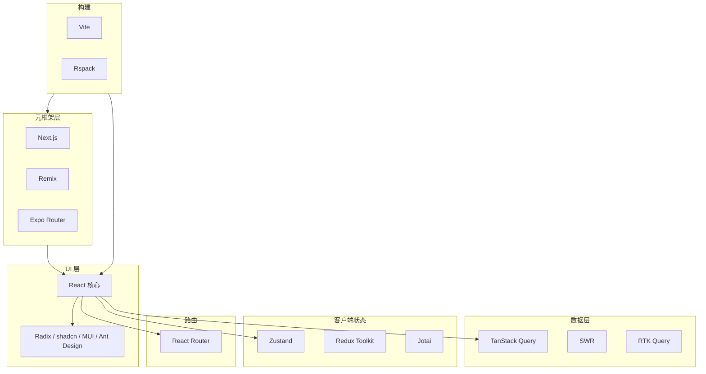
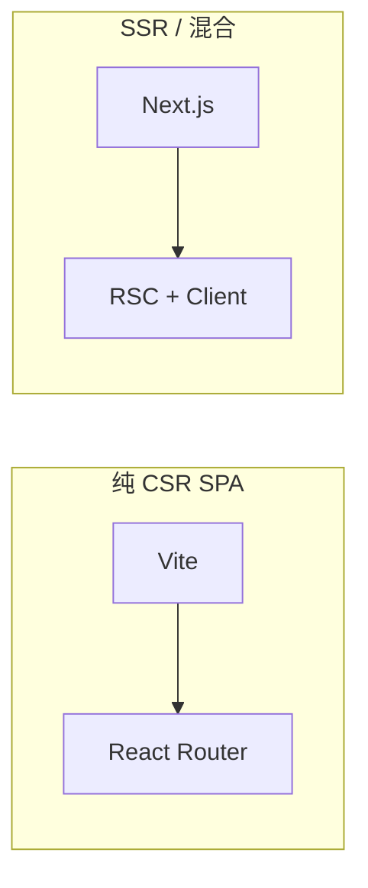
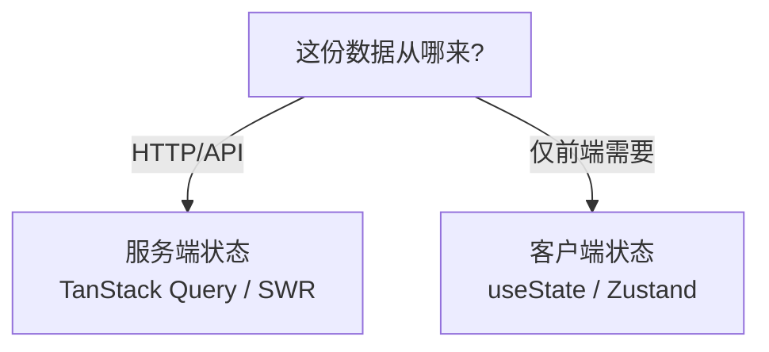
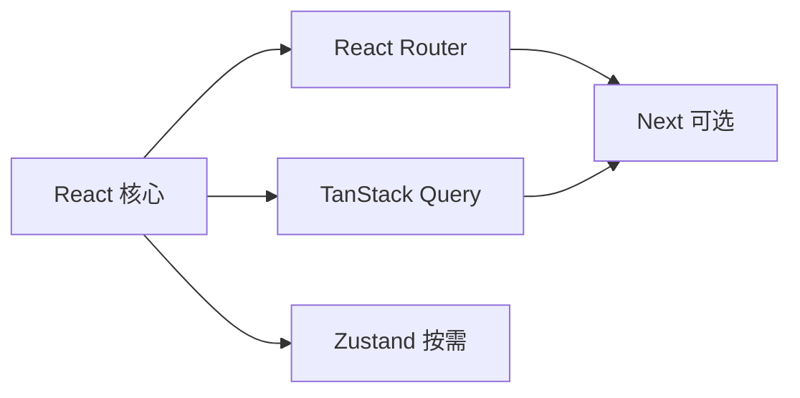

# React 生态全景图

> React 本身是 **UI 库**。路由、请求、状态、样式、测试、部署等由生态补齐。本文给一张**选型地图**：知道「这类问题该找谁」，避免重复造轮子或选型打架。

---

## 一、生态分层模型



| 层次 | 回答的问题 |
|------|------------|
| **React 核心** | 组件如何渲染、更新 |
| **元框架** | 路由文件在哪、SSR/RSC 怎么做 |
| **数据/状态** | 服务端数据放哪、全局 UI 状态放哪 |
| **UI 库** | 按钮表格 Modal 谁提供 |
| **构建** | 如何打包、HMR、代码分割 |

---

## 二、元框架（Meta-frameworks）

在 React 之上集成**路由、渲染模式、数据约定**。

| 框架 | 特点 | 典型场景 |
|------|------|----------|
| **Next.js** | App Router、RSC、Server Actions、生态最大 | 官网、电商、全栈 TS |
| **Remix** | Web 标准、Loader/Action、嵌套路由数据 | 表单重、Web Fundamentals |
| **Expo Router** | React Native + 文件路由 | 移动 App |
| **Gatsby** | 静态站点、GraphQL 源 | 博客、营销（份额下降） |



**选型口诀**：

- 只要浏览器里跑、后端已有 API → **Vite SPA**
- 要强 SEO、首屏、服务端取数 → **Next.js**（或 Remix）

深入：[14-服务端与元框架](../14-服务端与元框架/)。

---

## 三、路由

| 库 | 版本 | 适用 |
|----|------|------|
| **React Router** | v6 / v7 | SPA、也可嵌在部分全栈方案 |
| **TanStack Router** | 类型安全路由 | 新项目可选 |
| 框架自带 | Next / Remix | 不必再装 RR |

### React Router v6 核心概念

| API | 作用 |
|-----|------|
| `<Routes>` / `<Route>` | 路径 → 组件映射 |
| `<Outlet />` | 嵌套子路由出口 |
| `useNavigate` | 编程式导航 |
| `useParams` / `useSearchParams` | 动态段、查询串 |
| Data Router | `loader` / `action` 与路由绑数据 |

见 [10-路由](../10-路由/)。

---

## 四、服务端状态 vs 客户端状态

### 4.1 先分清两类 state



| 类型 | 例子 | 推荐 |
|------|------|------|
| **服务端状态** | 用户列表、商品详情、分页 | **TanStack Query** |
| **客户端 UI 状态** | 侧边栏开闭、主题、向导步骤 | useState / Zustand |
| **表单草稿** | 当前输入 | 本地 state 或 RHF |
| **URL 状态** | 页码、筛选、tab | searchParams |

### 4.2 TanStack Query（推荐默认）

```tsx
const { data, isLoading, error } = useQuery({
  queryKey: ['users', page],
  queryFn: () => fetchUsers(page),
});
```

| 能力 | 说明 |
|------|------|
| 缓存 | 同 key 不重复请求 |
| 后台刷新 | staleTime、refetchOnFocus |
| 突变 | `useMutation` + 失效缓存 |
| 乐观更新 | UI 先变，失败回滚 |

见 [09-数据获取与缓存](../09-数据获取与缓存/)。

### 4.3 客户端全局状态

| 库 | 特点 | 何时选 |
|----|------|--------|
| **Zustand** | 小 API、无 Provider 地狱 | 大多数全局 UI |
| **Redux Toolkit** | 规范强、DevTools、中间件 | 大型、时间旅行调试 |
| **Jotai / Recoil** | 原子化 | 细粒度订阅 |
| **Context** | 内置 | 低频、小范围主题/语言 |

见 [08-状态管理](../08-状态管理/)。

---

## 五、样式方案

| 方案 | 优点 | 注意 |
|------|------|------|
| **CSS Modules** | 作用域清晰、零运行时 | 与 Vite 原生支持 |
| **Tailwind CSS** | 快、设计一致 | 类名长；团队需约定 |
| **CSS-in-JS** styled-components / Emotion | 组件内聚 | 运行时成本；RSC 限制 |
| **Vanilla Extract** | 零运行时 CSS | 构建时生成 |
| **组件库** MUI / Ant Design / shadcn | 开箱即用 | 包体积、定制成本 |

见 [02-JSX · 样式方案](../02-JSX与渲染表达/03-样式方案与CSS-in-JS.md)。

---

## 六、UI 组件库

| 类型 | 代表 | 说明 |
|------|------|------|
| 全量组件库 | Ant Design、MUI | 企业后台常见 |
| Headless + 样式 | **Radix** + **shadcn/ui** | 可访问性、可复制源码 |
| 移动端 | Ant Design Mobile | H5 |
| 图表 | ECharts、Recharts | 与 React 包装层配合 |

**shadcn/ui** 不是 npm 大包，而是把组件**复制进项目**，便于改。

---

## 七、表单

| 方案 | 适用 |
|------|------|
| 受控 + useState | 字段极少 |
| **React Hook Form** + **zod** | 中大型表单、校验 |
| Formik | 遗留项目 |
| Server Actions + 19 Forms | Next 全栈 |

见 [04-事件与表单](../04-事件与表单/)。

---

## 八、测试

| 工具 | 用途 |
|------|------|
| **Vitest** | 单元测试运行器（Vite 系） |
| **React Testing Library** | 按用户行为测组件 |
| **MSW** | Mock HTTP |
| **Playwright / Cypress** | E2E |
| **Storybook** | 组件隔离开发、文档 |

见 [15-测试](../15-测试/)。

---

## 九、动画与交互

| 库 | 说明 |
|----|------|
| CSS transition / animation | 简单 hover、展开 |
| **Framer Motion** | 声明式动画、布局动画 |
| **react-spring** | 弹簧物理 |
| **@dnd-kit** | 拖拽 |

见 [19-跨端与集成 · 动画](../19-跨端与集成/04-动画与手势.md)。

---

## 十、国际化与无障碍

| 需求 | 工具 |
|------|------|
| i18n | **react-i18next**、FormatJS |
| a11y  lint | eslint-plugin-jsx-a11y |
| 焦点陷阱 | Radix Dialog、focus-trap-react |

见 [16-可访问性-安全-国际化](../16-可访问性-安全-国际化/)。

---

## 十一、典型技术栈组合（2025 参考）

### 11.1 中后台 SPA

| 层 | 选型 |
|----|------|
| 构建 | Vite |
| 路由 | React Router v6 |
| 服务端数据 | TanStack Query |
| 全局 UI | Zustand |
| UI | Ant Design 或 shadcn |
| 表单 | RHF + zod |
| 请求 | axios 封装 |

### 11.2 面向 C 端 / SEO

| 层 | 选型 |
|----|------|
| 框架 | Next.js App Router |
| 数据 | Server Component 取数 + Query 客户端 |
| 样式 | Tailwind + shadcn |
| 部署 | Vercel / 自建 Node |

### 11.3 与 [编码规范](../React编码规范.md) 对齐

规范中推荐：**Vite + TS + pnpm + React Router + TanStack Query + Zustand**，与本节中后台组合一致。

---

## 十二、选型反模式

| 反模式 | 为什么不好 |
|--------|------------|
| 所有数据进 Redux | 服务端数据应用 Query，Redux 变缓存二份 |
| 到处 Context 大对象 | 任意字段变 → 全树重渲染 |
| 重复装多个 UI 库 | 体积、风格不统一 |
| 每个列表自己 fetch + useEffect | 无缓存、竞态、难维护 |
| 为了用 Hook 而拆过度细组件 | 可读性下降 |

---

## 十三、生态学习顺序建议



1. 熟练组件 + Hooks（03～06 模块）  
2. React Router + Query（10、09）  
3. 按需 Zustand、RHF、UI 库  
4. 需要 SSR 再上 Next / RSC（14）

---

## 十四、小结

| 问题 | 首选方向 |
|------|----------|
| 怎么搭 SPA | Vite + React Router |
| 怎么搭全栈 | Next.js |
| API 数据 | TanStack Query |
| 主题 / 侧边栏 | Zustand 或 Context |
| 表单 | React Hook Form + zod |
| 组件外观 | shadcn / Ant Design / MUI |
| 测试 | Vitest + RTL |

**上一篇**：[03-开发环境与项目结构](./03-开发环境与项目结构.md)  
**下一模块**：[02-JSX与渲染表达](../02-JSX与渲染表达/01-JSX语法与编译机制.md)（P0-2 批次）
