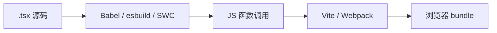

# JSX 语法与编译机制

JSX 是写在 JS/TS 里的语法糖，不是 HTML 字符串，编译后变成 `createElement` 或 `jsx-runtime` 调用，产出 React Element 描述对象。搞清编译链和常见坑，写模板会稳很多。

---

## JSX 是什么，和 HTML 模板有何不同

```tsx
const element = <h1 className="title">Hello</h1>;
```

经典运行时大致等价于：

```javascript
const element = React.createElement(
  'h1',
  { className: 'title' },
  'Hello',
);
```

| 对比 | 模板字符串 HTML | JSX |
|------|-----------------|-----|
| 类型 | 字符串 | JavaScript 表达式 |
| XSS | 需注意转义 | 默认转义文本 |
| 逻辑 | 难嵌入 if/for | 直接用 `{}` |

为什么用 JSX：结构与逻辑同文件，组件边界清晰；编译期能抓未闭合标签；工具链友好（跳转、重构、TS 类型）。

```tsx
function UserBadge({ name, vip }: { name: string; vip: boolean }) {
  return (
    <div className="badge">
      <span>{name}</span>
      {vip && <em>VIP</em>}
    </div>
  );
}
```

---

## 基本语法：根节点、表达式、属性命名

**必须有一个根（或 Fragment）**：

```tsx
// ❌ 相邻多个根（旧语法）
return (
  <h1>Title</h1>
  <p>Body</p>
);

// ✅ Fragment
return (
  <>
    <h1>Title</h1>
    <p>Body</p>
  </>
);
```

**`{}` 内必须是表达式**，不能是语句：

```tsx
// ❌
return <div>{ if (ok) 'yes' }</div>;

// ✅
return <div>{ ok ? 'yes' : 'no' }</div>;
return <div>{ ok && 'yes' }</div>;
```

**HTML 与 JSX 属性命名差异**：

| HTML | JSX | 原因 |
|------|-----|------|
| `class` | `className` | class 是 JS 保留字 |
| `for` | `htmlFor` | for 是 JS 保留字 |
| `onclick` | `onClick` | 驼峰 + 传函数 |
| `style="color:red"` | `style={{ color: 'red' }}` | 对象，camelCase |
| `tabindex` | `tabIndex` | 驼峰 |

```tsx
<label htmlFor="email">邮箱</label>
<input id="email" className="input" tabIndex={0} />
<div style={{ backgroundColor: '#fff', fontSize: 14 }} />
```

布尔属性可省略值：`<input disabled />` 等价 `disabled={true}`；`disabled={false}` 不会出现在 DOM。

---

## 展开属性与 children

```tsx
type InputProps = React.ComponentProps<'input'>;

function TextField(props: InputProps) {
  return <input {...props} />;
}

// 覆盖顺序：后面的 wins
<input {...defaults} {...props} className="final" />
```

合并 `className` 常用 `clsx` 或 shadcn 的 `cn`（tailwind-merge + clsx）。

**children** 是默认插槽：

```tsx
function Card({ children }: { children: React.ReactNode }) {
  return <section className="card">{children}</section>;
}

<Card>
  <h2>标题</h2>
  <p>正文</p>
</Card>
```

| `React.ReactNode` 可表示 | 不渲染 |
|--------------------------|--------|
| 元素、文本、数字、数组 | `null`、`undefined`、`false` |
| Portal、Fragment | `true`（单独 true 不显示） |

---

## 编译机制：Classic vs Automatic Runtime

**Classic（React 17 前）**：每文件需 `import React from 'react'`，编译为 `React.createElement(...)`。

**Automatic（`react-jsx`）**：`tsconfig` 设 `jsx: react-jsx` 后：

```tsx
// 源码
<div id="a">hi</div>;

// 编译后（简化）
import { jsx as _jsx } from 'react/jsx-runtime';
_jsx('div', { id: 'a', children: 'hi' });
```

| 对比 | Classic | Automatic |
|------|---------|-----------|
| import React | 需要 | **不需要**（仅 JSX 时） |
| 运行时入口 | `react` | `react/jsx-runtime` |
| 开发 | — | `react-jsxdev` 带调试信息 |



Vite 默认用 **esbuild** 转 TS/JSX，速度快。

---

## JSX 与 TypeScript

```tsx
interface ButtonProps {
  variant?: 'primary' | 'ghost';
  onClick?: () => void;
  children: React.ReactNode;
}

function Button({ variant = 'primary', ...rest }: ButtonProps) {
  return <button type="button" data-variant={variant} {...rest} />;
}
```

| 类型工具 | 用途 |
|----------|------|
| `React.ReactNode` | children |
| `React.ComponentProps<'button'>` | 继承原生 button 属性 |
| `React.CSSProperties` | style 对象 |

---

## 常见陷阱

### `0` 与 `&&` 条件渲染

```tsx
{count && <span>{count}</span>}
// count === 0 时，屏幕会显示 "0" 而不是什么都不显示

{count > 0 && <span>{count}</span>}  // ✅
{count ? <span>{count}</span> : null} // ✅
```

| 左侧值 | `&&` 右侧渲染结果 |
|--------|-------------------|
| `0` | 显示 **0** |
| `''` | 空 |
| `null` / `undefined` | 空 |

### 大小写区分组件与原生标签

```tsx
<dialog />     // 原生 HTML 元素
<Dialog />     // 自定义组件（必须大写开头）
```

React 用**首字母大小写**区分 intrinsic 与组件。

### dangerouslySetInnerHTML

```tsx
<div dangerouslySetInnerHTML={{ __html: sanitizedHtml }} />
```

仅用于**已消毒** HTML；优先正常 JSX。

### JSX 注释

```tsx
{/* 这是 JSX 注释 */}
// 这是 JS 注释，在 JSX 标签外
```

---

## 小结

JSX 是语法糖，编译为 `createElement` 或 **jsx-runtime**；Automatic Runtime 下可不 `import React`。

**语法**：`{}` 内必须是**表达式**；HTML 属性用 `className`、`htmlFor` 等 React 命名；多根用 Fragment `<>...</>`。

**属性与组合**：`{...rest}` 透传 DOM 属性，注意覆盖顺序；`children` 类型用 `React.ReactNode`。

**编译**：Vite 经 esbuild 转 JSX；`jsx: react-jsx` 走 Automatic Runtime。

**易混点**：`0 && <X />` 会渲染 **0**；小写标签是 DOM，大写是组件；`dangerouslySetInnerHTML` 必须消毒。

常见错因：条件渲染左侧会不会是 `0` 或 `''`？组件名是否 PascalCase？style 是否传了对象而非字符串？
