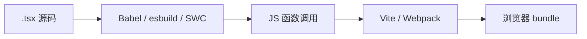

# JSX 语法与编译机制

> **JSX** 是在 JavaScript 里写 HTML 结构的语法扩展。它不是字符串，编译后变成 `React.createElement` 或 **jsx-runtime** 函数调用。

---

## 一、JSX 是什么？

```tsx
const element = <h1 className="title">Hello</h1>;
```

大致等价于（经典运行时）：

```javascript
const element = React.createElement(
  'h1',
  { className: 'title' },
  'Hello',
);
```

| 对比 | 模板字符串 HTML | JSX |
|------|-----------------|-----|
| 类型 | 字符串 | JavaScript 表达式 |
| XSS | 需注意转义 | 默认转义文本 |
| 逻辑 | 难嵌入 if/for | 直接用 `{}` |

---

## 二、为什么需要 JSX？

```tsx
function UserBadge({ name, vip }: { name: string; vip: boolean }) {
  return (
    <div className="badge">
      <span>{name}</span>
      {vip && <em>VIP</em>}
    </div>
  );
}
```

| 好处 | 说明 |
|------|------|
| 结构与逻辑同文件 | 组件边界清晰 |
| 编译期检查 | 未闭合标签、部分 typo 可报错 |
| 工具链友好 | 跳转、重构、TS 类型 |

---

## 三、基本语法规则

### 3.1 必须有一个根（或 Fragment）

```tsx
// ❌ 相邻多个根（旧语法）
return (
  <h1>Title</h1>
  <p>Body</p>
);

// ✅ Fragment
return (
  <>
    <h1>Title</h1>
    <p>Body</p>
  </>
);
```

### 3.2 闭合标签

| 类型 | 写法 |
|------|------|
| 有子节点 | `<div>...</div>` |
| 自闭合 | ``、`<input />`、`<br />` |

### 3.3 JavaScript 表达式 `{ }`

```tsx
const count = 3;
return (
  <ul>
    <li>{count + 1}</li>
    <li>{user.name.toUpperCase()}</li>
    <li>{formatDate(createdAt)}</li>
  </ul>
);
```

**可以放**：表达式（有返回值）  
**不能放**：语句（if、for、function 声明、class）

```tsx
// ❌
return <div>{ if (ok) 'yes' }</div>;

// ✅
return <div>{ ok ? 'yes' : 'no' }</div>;
return <div>{ ok && 'yes' }</div>;
```

### 3.4 属性命名差异

| HTML | JSX | 原因 |
|------|-----|------|
| `class` | `className` | class 是 JS 保留字 |
| `for` | `htmlFor` | for 是 JS 保留字 |
| `onclick` | `onClick` | 驼峰 + 传函数 |
| `style="color:red"` | `style={{ color: 'red' }}` | 对象，camelCase |
| `tabindex` | `tabIndex` | 驼峰 |

```tsx
<label htmlFor="email">邮箱</label>
<input id="email" className="input" tabIndex={0} />
<div style={{ backgroundColor: '#fff', fontSize: 14 }} />
```

### 3.5 布尔与省略属性

```tsx
<input disabled={true} />   // 可写
<input disabled />            // 等价 disabled={true}
<input disabled={false} />    // 不会出现在 DOM
```

---

## 四、展开属性

```tsx
type InputProps = React.ComponentProps<'input'>;

function TextField(props: InputProps) {
  return <input {...props} />;
}

// 覆盖顺序：后面的 wins
<input {...defaults} {...props} className="final" />
```

| 场景 | 用法 |
|------|------|
| 透传 DOM 属性 | `{...rest}` |
| 合并 className | `clsx(defaults, props.className)` |

---

## 五、children

```tsx
function Card({ children }: { children: React.ReactNode }) {
  return <section className="card">{children}</section>;
}

<Card>
  <h2>标题</h2>
  <p>正文</p>
</Card>
```

| `React.ReactNode` 可表示 | 示例 |
|--------------------------|------|
| 元素 | `<div />` |
| 文本 | `'hello'` |
| 数字 | `{42}` |
| 数组 | `{items.map(...)}` |
| null / undefined / boolean | 不渲染 |
| Portal、Fragment | 合法 |

---

## 六、编译机制：Classic vs Automatic Runtime

### 6.1 Classic（React 17 前）

每个文件需：

```tsx
import React from 'react';
```

编译为 `React.createElement(type, props, ...children)`。

### 6.2 Automatic（`react-jsx` / `react-jsxdev`）

`tsconfig` / Babel 配置 `jsx: react-jsx` 后：

```tsx
// 源码
<div id="a">hi</div>;

// 编译后（简化）
import { jsx as _jsx } from 'react/jsx-runtime';
_jsx('div', { id: 'a', children: 'hi' });
```

| 对比 | Classic | Automatic |
|------|---------|-----------|
| import React | 需要 | **不需要**（仅 JSX 时） |
| 运行时入口 | `react` | `react/jsx-runtime` |
| 开发 | — | `react-jsxdev` 带调试信息 |

### 6.3 编译流水线



Vite 默认用 **esbuild** 转 TS/JSX，速度快。

---

## 七、JSX 与 TypeScript

```tsx
interface ButtonProps {
  variant?: 'primary' | 'ghost';
  onClick?: () => void;
  children: React.ReactNode;
}

function Button({ variant = 'primary', ...rest }: ButtonProps) {
  return <button type="button" data-variant={variant} {...rest} />;
}
```

| 类型工具 | 用途 |
|----------|------|
| `React.ReactNode` | children |
| `React.ComponentProps<'button'>` | 继承原生 button 属性 |
| `React.CSSProperties` | style 对象 |

详见 [13-React与TypeScript](../13-React与TypeScript/)。

---

## 八、常见陷阱

### 8.1 `false` / `0` 与 `&&`

```tsx
{count && <span>{count}</span>}
// count === 0 时，屏幕会显示 "0" 而不是什么都不显示

{count > 0 && <span>{count}</span>}  // ✅
{count ? <span>{count}</span> : null} // ✅
```

| 左侧值 | `&&` 右侧渲染结果 |
|--------|-------------------|
| `0` | 显示 **0** |
| `''` | 空 |
| `null` / `undefined` | 空 |

### 8.2 注释

```tsx
{/* 这是 JSX 注释 */}
// 这是 JS 注释，在 JSX 标签外
```

### 8.3 大写 vs 小写标签

```tsx
<dialog />     // 原生 HTML 元素
<Dialog />     // 自定义组件（必须大写开头）
```

React 用**首字母大小写**区分 intrinsic 与组件。

### 8.4 dangerouslySetInnerHTML

```tsx
<div dangerouslySetInnerHTML={{ __html: sanitizedHtml }} />
```

仅用于**已消毒** HTML；优先正常 JSX。见 [16-安全](../16-可访问性-安全-国际化/03-XSS-安全与dangerouslySetInnerHTML.md)。

---

## 九、JSX 与 Figma / 设计稿

| 设计 | JSX |
|------|-----|
| Auto Layout | Flex / Grid |
| Component / Variant | React 组件 + props |
| Text style | className / design token |

组件化思维与设计系统一致，见 [10-设计系统](../../../前端工程化体系/10-设计系统与组件工程化.md)。

---

## 十、小结

| 要点 | 记忆 |
|------|------|
| JSX 是语法糖 | 编译成 createElement / jsx |
| `{}` 内是表达式 | 不是语句 |
| `className` / `htmlFor` | HTML 属性映射 |
| Automatic Runtime | 可不 import React |
| `0 && <X />` | 会渲染 0 |

**下一篇**：[02-条件渲染与列表渲染](./02-条件渲染与列表渲染.md)
