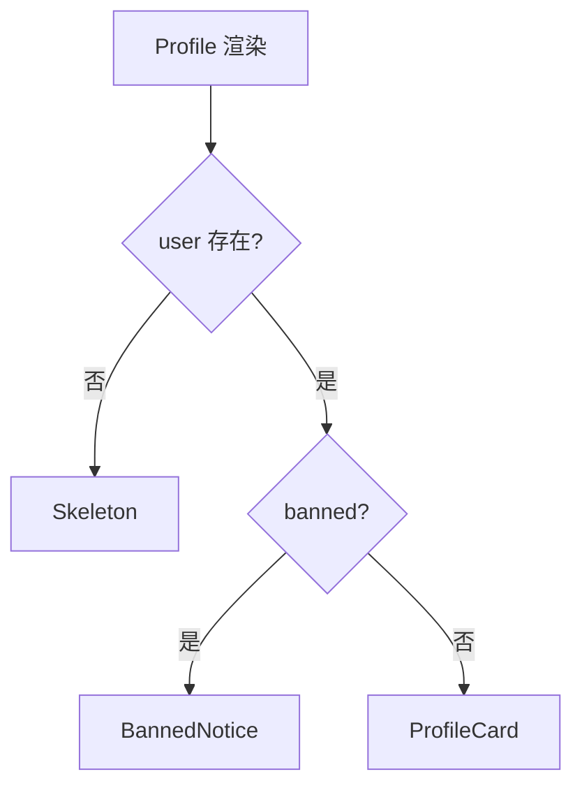

# 条件渲染与列表渲染

界面经常要「有/无」「二选一」「枚举状态」和「一组数据逐行展示」；按场景选写法，并强调列表 **key** 与 `0 &&` 这类高频坑。

---

## 条件渲染：按场景选写法

**三元 `? :`**，二选一，两边都要渲染组件：

```tsx
function Greeting({ loggedIn }: { loggedIn: boolean }) {
  return (
    <header>
      {loggedIn ? <UserMenu /> : <LoginButton />}
    </header>
  );
}
```

**逻辑与 `&&`**，有/无，仅一侧有 UI：

```tsx
{unreadCount > 0 && <Badge count={unreadCount} />}
{error && <Alert message={error} />}
```

**陷阱**：左侧不能是 `0`（会显示 0）。应写 `count > 0 && ...` 或三元。

**if / early return**，多分支、互斥状态，比嵌套三元清晰：

```tsx
function Profile({ user }: { user: User | null }) {
  if (!user) return <Skeleton />;
  if (user.banned) return <BannedNotice />;
  return <ProfileCard user={user} />;
}
```



**变量暂存**，多种状态码映射：

```tsx
function Status({ code }: { code: number }) {
  let content: React.ReactNode;
  if (code === 200) content = <Success />;
  else if (code === 404) content = <NotFound />;
  else content = <Error code={code} />;
  return <div className="status">{content}</div>;
}
```

**查表组件**，固定枚举状态机：

```tsx
const VIEW: Record<OrderStatus, React.ComponentType> = {
  pending: PendingView,
  paid: PaidView,
  shipped: ShippedView,
};

function Order({ status }: { status: OrderStatus }) {
  const View = VIEW[status];
  return <View />;
}
```

| 写法 | 可读性 | 场景 |
|------|--------|------|
| 三元 | 中 | 行内二选一 |
| `&&` | 高 | 简单显隐（警惕 `0`） |
| if + return | 高 | 多分支页面 |
| 查表 `map[status]` | 高 | 状态机固定枚举 |

```tsx
// ❌ 嵌套地狱
return <div>{a ? (b ? (c ? <X /> : <Y />) : <Z />) : <W />}</div>;

// ✅ 拆组件或提前 return
```

---

## Fragment：无包裹 DOM

避免无意义 `div` 破坏 Flex/Grid 布局：

```tsx
return (
  <>
    <dt>名称</dt>
    <dd>{name}</dd>
  </>
);

// 带 key 的列表 Fragment（仅 React.Fragment 可带 key）
return items.map(item => (
  <React.Fragment key={item.id}>
    <dt>{item.label}</dt>
    <dd>{item.value}</dd>
  </React.Fragment>
));
```

| 语法 | key |
|------|-----|
| `<>...</>` | ❌ 不能 |
| `<Fragment key={id}>` | ✅ |

---

## 列表渲染：map + 稳定 key

```tsx
function TodoList({ todos }: { todos: Todo[] }) {
  return (
    <ul>
      {todos.map(todo => (
        <li key={todo.id}>{todo.text}</li>
      ))}
    </ul>
  );
}
```

| 规则 | 说明 |
|------|------|
| map 在 **JSX 的 `{}` 内** | 返回元素数组 |
| 每项要有 **key** | 帮 React 认身份 |
| 空数组 | 渲染空，不报错 |

**空列表 UX**：

```tsx
{todos.length === 0 ? (
  <Empty description="暂无待办" />
) : (
  <ul>{todos.map(...)}</ul>
)}
```

**key 选型**：

| key 来源 | 推荐度 | 说明 |
|----------|--------|------|
| **稳定唯一 id** | ✅ 最佳 | 来自数据库、uuid |
| 业务唯一字段 | ✅ | 如 sku |
| **数组 index** | ⚠️ 慎用 | 排序/过滤/插入时会乱 |
| `Math.random()` | ❌ | 每次渲染变，失去协调意义 |

```tsx
// ❌ 列表重排后 state 可能对错行
items.map((item, index) => <Input key={index} defaultValue={item.name} />);

// ✅
items.map(item => <Input key={item.id} defaultValue={item.name} />);
```

---

## filter、flatMap 与其他形式

```tsx
{users
  .filter(u => u.active)
  .map(u => <UserChip key={u.id} user={u} />)}

{sections.flatMap(section =>
  section.items.map(item => (
    <Cell key={item.id} item={item} section={section.title} />
  )),
)}
```

`for` 推入数组可以，但 React 代码更常见 `map`。

---

## 与 state 联动示例

```tsx
function FilterableList() {
  const [keyword, setKeyword] = useState('');
  const { data: users = [] } = useQuery({ queryKey: ['users'], queryFn: fetchUsers });

  const visible = users.filter(u =>
    u.name.toLowerCase().includes(keyword.toLowerCase()),
  );

  return (
    <>
      <input value={keyword} onChange={e => setKeyword(e.target.value)} />
      {visible.length === 0 ? (
        <p>无匹配用户</p>
      ) : (
        <ul>
          {visible.map(u => (
            <li key={u.id}>{u.name}</li>
          ))}
        </ul>
      )}
    </>
  );
}
```

---

## 长列表性能直觉

| 数据量 | 策略 |
|--------|------|
| 几百以内 | 直接 map 通常足够 |
| 上千可见行 | **虚拟列表**（react-window） |
| 分页 | 服务端分页 + Query |

---

## 小结

**条件渲染**：二选一用语义清晰的三元或 if 早 return；有/无用 `&&`（**警惕 `0`**）；多分支用查表或 switch；避免嵌套三元地狱。

**Fragment**：不需包裹 DOM 时用 `<>...</>`；列表里需要 key 时用 `<React.Fragment key={id}>`。

**列表**：`array.map` + **稳定 key**；可排序/增删场景勿用 index 作唯一 key；空列表单独处理 UX。

**易混点**：`0 && <X />` 显示 0；`Math.random()` 作 key 每轮重建；index key 在 reorder 时 state 错位。

常见错因：条件左侧会不会是 falsy 但可渲染的数字？列表项是否有稳定业务 id？
