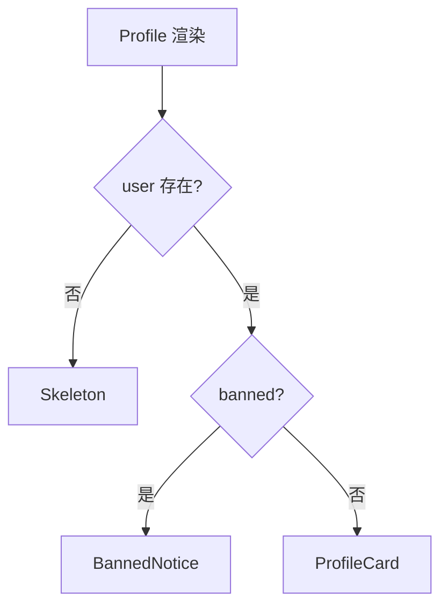

# 条件渲染与列表渲染

> 界面随 state 变化：有时显示 A 有时 B（**条件**），有时要渲染一组同质项（**列表**）。本篇讲常见写法、可读性对比，以及 **key** 的初识。

---

## 一、条件渲染

### 1.1 三元运算符 `? :`

```tsx
function Greeting({ loggedIn }: { loggedIn: boolean }) {
  return (
    <header>
      {loggedIn ? <UserMenu /> : <LoginButton />}
    </header>
  );
}
```

| 适用 | 二选一，且**两边都要渲染组件** |
|------|--------------------------------|

### 1.2 逻辑与 `&&`

```tsx
{unreadCount > 0 && <Badge count={unreadCount} />}
{error && <Alert message={error} />}
```

| 适用 | 有/无，**仅一侧**有 UI |
|------|------------------------|

**陷阱**：左侧不能是 `0`（会显示 0）。见 [01-JSX · 陷阱](../02-JSX与渲染表达/01-JSX语法与编译机制.md#81-false--0-与-)。

### 1.3 if / early return（组件顶层）

```tsx
function Profile({ user }: { user: User | null }) {
  if (!user) {
    return <Skeleton />;
  }
  if (user.banned) {
    return <BannedNotice />;
  }
  return <ProfileCard user={user} />;
}
```



| 适用 | 多种互斥状态、分支多，比嵌套三元清晰 |
|------|--------------------------------------|

### 1.4 变量暂存

```tsx
function Status({ code }: { code: number }) {
  let content: React.ReactNode;
  if (code === 200) content = <Success />;
  else if (code === 404) content = <NotFound />;
  else content = <Error code={code} />;

  return <div className="status">{content}</div>;
}
```

### 1.5 模式对比

| 写法 | 可读性 | 场景 |
|------|--------|------|
| 三元 | 中 | 行内二选一 |
| `&&` | 高 | 简单显隐 |
| if + return | 高 | 多分支页面 |
| 查表 `map[status]` | 高 | 状态机固定枚举 |

```tsx
const VIEW: Record<OrderStatus, React.ComponentType> = {
  pending: PendingView,
  paid: PaidView,
  shipped: ShippedView,
};

function Order({ status }: { status: OrderStatus }) {
  const View = VIEW[status];
  return <View />;
}
```

### 1.6 避免嵌套地狱

```tsx
// ❌ 难读
return (
  <div>
    {a ? (b ? (c ? <X /> : <Y />) : <Z />) : <W />}
  </div>
);

// ✅ 拆组件或提前 return
```

---

## 二、Fragment

避免无意义包裹 div 破坏 Flex/Grid 布局。

```tsx
return (
  <>
    <dt>名称</dt>
    <dd>{name}</dd>
  </>
);

// 带 key 的列表 Fragment（仅 React.Fragment 可带 key）
return items.map(item => (
  <React.Fragment key={item.id}>
    <dt>{item.label}</dt>
    <dd>{item.value}</dd>
  </React.Fragment>
));
```

| 语法 | key |
|------|-----|
| `<>...</>` | ❌ 不能 |
| `<Fragment key={id}>` | ✅ |

---

## 三、列表渲染

### 3.1 map 基础

```tsx
function TodoList({ todos }: { todos: Todo[] }) {
  return (
    <ul>
      {todos.map(todo => (
        <li key={todo.id}>{todo.text}</li>
      ))}
    </ul>
  );
}
```

| 规则 | 说明 |
|------|------|
| map 在 **JSX 的 `{}` 内** | 返回元素数组 |
| 每项要有 **key** | 见下节 |
| 空数组 | 渲染空，不报错 |

### 3.2 空列表 UX

```tsx
{todos.length === 0 ? (
  <Empty description="暂无待办" />
) : (
  <ul>{todos.map(...)}</ul>
)}
```

### 3.3 列表 + 条件项

```tsx
{users.map(user => (
  <UserRow
    key={user.id}
    user={user}
    highlight={user.id === selectedId}
  />
))}
```

---

## 四、key 初识（深入见 06 模块）

**key** 帮助 React 识别列表项身份，优化 reorder、插入、删除。

```tsx
{items.map(item => (
  <Row key={item.id} data={item} />
))}
```

| key 来源 | 推荐度 | 说明 |
|----------|--------|------|
| **稳定唯一 id** | ✅ 最佳 | 来自数据库、uuid |
| 业务唯一字段 | ✅ | 如 sku |
| **数组 index** | ⚠️ 慎用 | 排序/过滤/插入时会乱 |
| `Math.random()` | ❌ | 每次渲染变，失去协调意义 |

```tsx
// ❌ 列表重排后 state 错位
items.map((item, index) => <Input key={index} defaultValue={item.name} />);

// ✅
items.map(item => <Input key={item.id} defaultValue={item.name} />);
```

深入：[04-Key与列表调和](../06-渲染与调和/04-Key与列表调和.md)。

---

## 五、渲染数组的其他形式

### 5.1 filter + map

```tsx
{users
  .filter(u => u.active)
  .map(u => <UserChip key={u.id} user={u} />)}
```

### 5.2 flatMap

```tsx
{sections.flatMap(section =>
  section.items.map(item => (
    <Cell key={item.id} item={item} section={section.title} />
  )),
)}
```

### 5.3 不要用 for 推入数组（可以但不 idiomatic）

```tsx
// 可以，但 React 代码更常见 map
const nodes = [];
for (const x of list) nodes.push(<li key={x.id}>{x.name}</li>);
return <ul>{nodes}</ul>;
```

---

## 六、性能直觉（列表很长时）

| 数据量 | 策略 |
|--------|------|
| &lt; 几百 | 直接 map 通常足够 |
| 上千可见行 | **虚拟列表**（react-window） |
| 分页 | 服务端分页 + Query |

见 [11-性能优化 · 虚拟列表](../11-性能优化/04-虚拟列表与大数据渲染.md)。

---

## 七、与 state 联动示例

```tsx
function FilterableList() {
  const [keyword, setKeyword] = useState('');
  const { data: users = [] } = useQuery({ queryKey: ['users'], queryFn: fetchUsers });

  const visible = users.filter(u =>
    u.name.toLowerCase().includes(keyword.toLowerCase()),
  );

  return (
    <>
      <input value={keyword} onChange={e => setKeyword(e.target.value)} />
      {visible.length === 0 ? (
        <p>无匹配用户</p>
      ) : (
        <ul>
          {visible.map(u => (
            <li key={u.id}>{u.name}</li>
          ))}
        </ul>
      )}
    </>
  );
}
```

---

## 八、小结

| 场景 | 推荐 |
|------|------|
| 二选一 | 三元或 if return |
| 有/无 | `&&`（注意 0） |
| 多状态 | 查表组件 / switch |
| 列表 | `map` + **稳定 key** |
| 无包裹 DOM | Fragment |

**上一篇**：[01-JSX语法与编译机制](./01-JSX语法与编译机制.md)  
**下一篇**：[03-样式方案与CSS-in-JS](./03-样式方案与CSS-in-JS.md)
