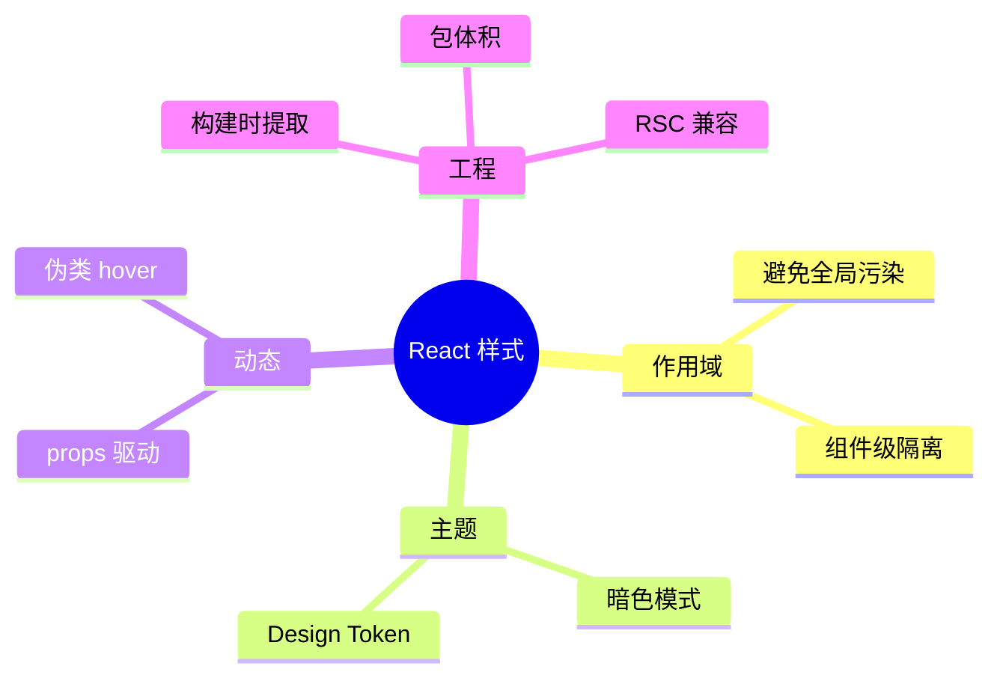
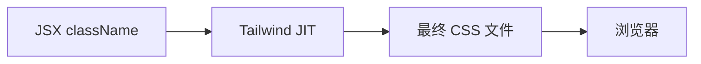
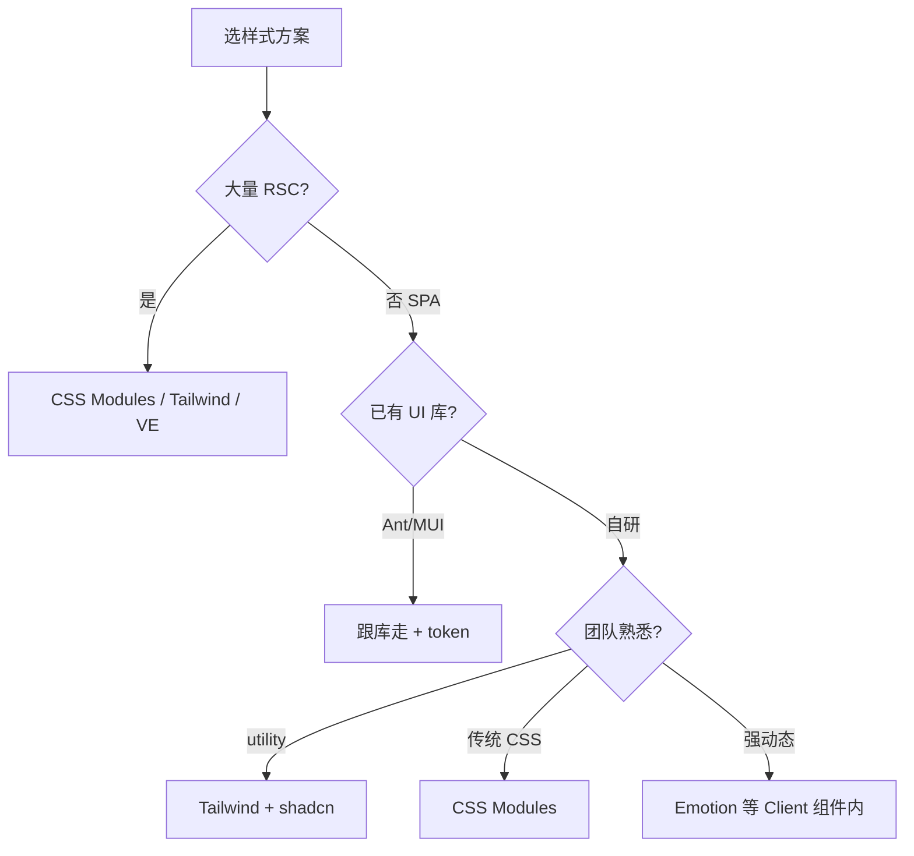

# 样式方案与 CSS-in-JS

> React 不规定样式怎么写。团队要在 **作用域、运行时成本、RSC 兼容、设计系统** 之间做选型。本篇对比主流方案并给出组合建议。

---

## 一、样式需求拆解



| 需求 | 说明 |
|------|------|
| **作用域** | `.title` 不污染全局 |
| **动态** | `disabled`、`size` 变样式 |
| **主题** | 色板、间距统一 |
| **性能** | 少运行时、少 CSS 体积 |
| **DX** | 与组件同文件 or 分离 |

---

## 二、方案总览

| 方案 | 运行时 | RSC 友好 | 典型工具 |
|------|--------|----------|----------|
| 全局 CSS | 无 | ✅ | 普通 `.css` |
| **CSS Modules** | 无 | ✅ | `*.module.css` |
| **Tailwind** | 无（JIT 构建） | ✅ | utility class |
| CSS-in-JS | 有（多数） | ⚠️ 受限 | styled-components, Emotion |
| 零运行时 CSS-in-JS | 无 | ✅ | Vanilla Extract, Linaria |
| 组件库自带 | 视库而定 | 视库而定 | MUI, Ant Design |

---

## 三、全局 CSS

```tsx
// main.tsx
import './index.css';
```

```css
/* index.css */
:root {
  --color-primary: #1677ff;
}
body { margin: 0; font-family: system-ui, sans-serif; }
```

| 适用 | 重置样式、字体、CSS 变量 token |
| 注意 | 类名易冲突；组件专用样式别全放全局 |

---

## 四、CSS Modules（推荐默认之一）

文件：`Button.module.css`

```css
.root {
  padding: 8px 16px;
  border-radius: 6px;
}
.primary {
  background: var(--color-primary);
  color: #fff;
}
```

```tsx
import styles from './Button.module.css';

function Button({ primary, children }: { primary?: boolean; children: React.ReactNode }) {
  return (
    <button
      type="button"
      className={[styles.root, primary && styles.primary].filter(Boolean).join(' ')}
    >
      {children}
    </button>
  );
}
```

Vite 编译后类名类似 `_root_x7s9a_1`，**局部作用域**。

| 优点 | 缺点 |
|------|------|
| 零运行时、简单 | 动态样式要写多 class 或 CSS 变量 |
| 与 RSC 无冲突 | 主题切换靠变量或额外方案 |

**合并 className**：常用 `clsx` 或 `cn`（shadcn 封装 tailwind-merge + clsx）。

---

## 五、Tailwind CSS

```tsx
function Alert({ variant }: { variant: 'info' | 'error' }) {
  return (
    <div
      className={clsx(
        'rounded-lg px-4 py-3 text-sm',
        variant === 'info' && 'bg-blue-50 text-blue-800',
        variant === 'error' && 'bg-red-50 text-red-800',
      )}
    >
      ...
    </div>
  );
}
```



| 优点 | 缺点 |
|------|------|
| 开发快、设计一致 | 类名长；需团队规范 |
| tree-shake 未用 class | HTML 可读性争议 |
| 与 shadcn 生态好 | 复杂动画仍可能要 CSS |

**配置设计 token**（tailwind.config）：

```javascript
theme: {
  extend: {
    colors: { brand: { DEFAULT: '#1677ff', dark: '#0958d9' } },
    spacing: { 18: '4.5rem' },
  },
},
```

与 [设计系统](../../../前端工程化体系/10-设计系统与组件工程化.md) 对齐。

---

## 六、CSS-in-JS（styled-components / Emotion）

```tsx
import styled from 'styled-components';

const Button = styled.button<{ $primary?: boolean }>`
  padding: 8px 16px;
  background: ${p => (p.$primary ? '#1677ff' : '#eee')};
`;
```

| 优点 | 缺点 |
|------|------|
| 样式与 props 强绑定 | **运行时**插入 style |
| 主题 Provider 方便 | SSR 要抽 critical CSS |
| 动态能力强 | **RSC 中不能直接用**（需 Client 边界） |

### 6.1 与 React Server Components

Server Component **不能**使用 styled-components 等依赖运行时的库。样式方案需：

- 服务端组件用 **CSS Modules / Tailwind**
- 客户端子树再用 CSS-in-JS（若必须）

---

## 七、零运行时：Vanilla Extract

```typescript
// button.css.ts
import { style } from '@vanilla-extract/css';

export const button = style({
  padding: '8px 16px',
  ':hover': { opacity: 0.9 },
});
```

```tsx
import { button } from './button.css.ts';
<button className={button} />
```

构建时生成静态 CSS 文件，**无运行时**，类型安全。

---

## 八、组件库自带样式

| 库 | 样式机制 | 定制 |
|----|----------|------|
| **Ant Design** | less/css-in-js | ConfigProvider theme token |
| **MUI** | Emotion + sx | ThemeProvider |
| **shadcn/ui** | Tailwind + Radix | 改源码 / CSS 变量 |

```tsx
// Ant Design 5 token
<ConfigProvider theme={{ token: { colorPrimary: '#1677ff' } }}>
  <App />
</ConfigProvider>
```

---

## 九、inline style

```tsx
<div style={{ display: 'flex', gap: 8, opacity: loading ? 0.6 : 1 }} />
```

| 适用 | 动态坐标、Canvas  overlay、少量一次性 |
| 不适用 | 整套设计系统（难维护、无伪类） |

类型：`React.CSSProperties`，属性 camelCase。

---

## 十、暗色模式常见做法

| 方案 | 实现 |
|------|------|
| CSS 变量 | `:root` / `[data-theme=dark]` 切换变量 |
| Tailwind | `dark:` 前缀 + class on html |
| MUI/Ant | Provider algorithm |

```css
:root { --bg: #fff; --text: #111; }
[data-theme='dark'] { --bg: #111; --text: #eee; }
body { background: var(--bg); color: var(--text); }
```

---

## 十一、选型决策树



---

## 十二、与编码规范协作

| 实践 | 说明 |
|------|------|
| 禁止随意全局类 | 除 reset/token |
| BEM 或 Modules | 二选一，不混用无规范 |
| 设计 token 单一来源 | CSS 变量或 Tailwind theme |
| 样式审查 | 过大 bundle、重复 utility |

---

## 十三、小结

| 场景 | 建议 |
|------|------|
| 默认 SPA | CSS Modules 或 Tailwind |
| 中后台 | Ant Design / MUI + token |
| 现代组件库自研 | Tailwind + Radix/shadcn |
| 强 RSC | 避免运行时 CSS-in-JS 在 Server |
| props 驱动复杂样式 | CSS 变量 + Modules，或 Client + Emotion |

**上一篇**：[02-条件渲染与列表渲染](./02-条件渲染与列表渲染.md)  
**下一篇**：[04-静态资源与SVG-Icon](./04-静态资源与SVG-Icon.md)
