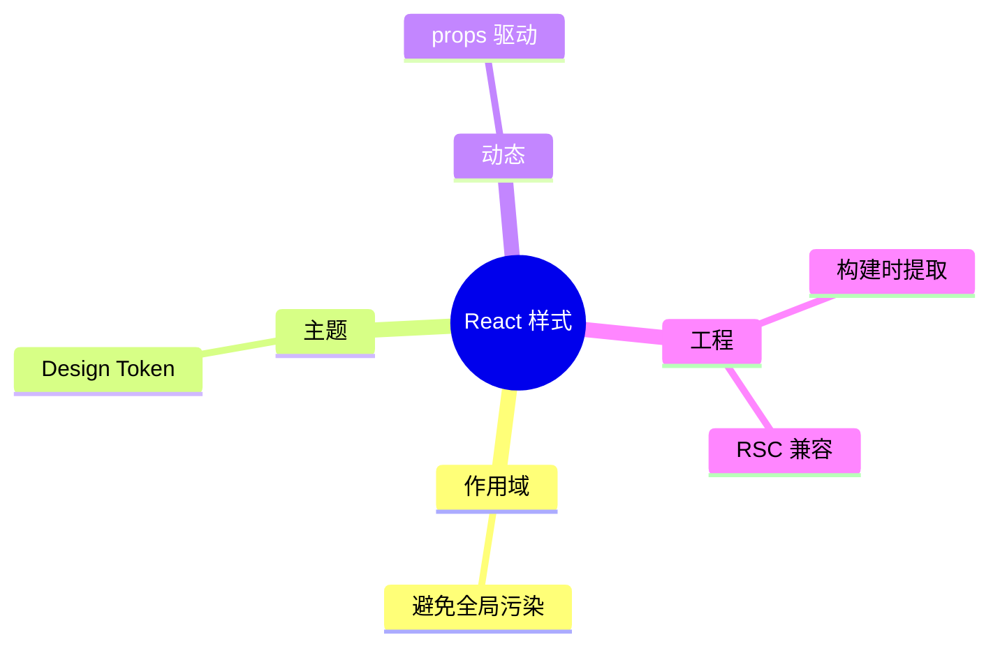
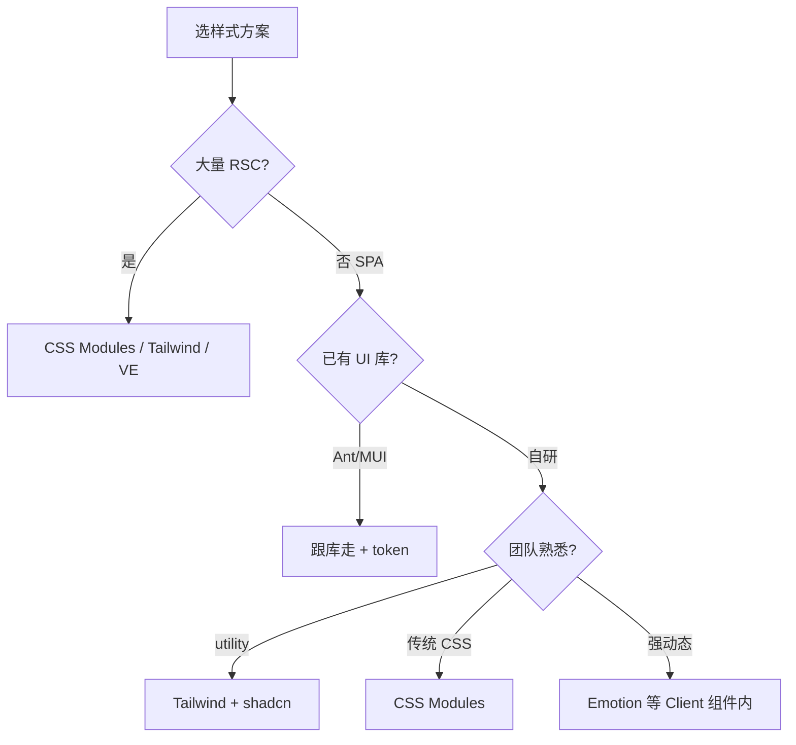

# 样式方案与 CSS-in-JS

React 不规定怎么写样式，选方案要看作用域、主题、动态样式、运行时成本和是否用 Server Components；按四维需求对比主流方案，并给出 SPA 与中后台的默认组合。

---

## 样式需求拆解

| 需求 | 说明 |
|------|------|
| **作用域** | `.title` 不污染全局 |
| **动态** | `disabled`、`size` 变样式 |
| **主题** | 色板、间距统一 |
| **性能** | 少运行时、少 CSS 体积 |
| **RSC** | Server Component 能否直接用 |



---

## 方案总览

| 方案 | 运行时 | RSC 友好 | 典型工具 |
|------|--------|----------|----------|
| 全局 CSS | 无 | ✅ | 普通 `.css` |
| **CSS Modules** | 无 | ✅ | `*.module.css` |
| **Tailwind** | 无（JIT 构建） | ✅ | utility class |
| CSS-in-JS | 有（多数） | ⚠️ 受限 | styled-components, Emotion |
| 零运行时 CSS-in-JS | 无 | ✅ | Vanilla Extract, Linaria |
| 组件库自带 | 视库而定 | 视库而定 | MUI, Ant Design |

---

## 全局 CSS 与 CSS Modules

**全局 CSS** 适合 reset、字体、CSS 变量 token：

```tsx
// main.tsx
import './index.css';
```

```css
:root {
  --color-primary: #1677ff;
}
body { margin: 0; font-family: system-ui, sans-serif; }
```

组件专用样式不宜全堆全局，易冲突。

**CSS Modules** 是 SPA 的推荐默认之一，零运行时、作用域清晰：

```css
/* Button.module.css */
.root { padding: 8px 16px; border-radius: 6px; }
.primary { background: var(--color-primary); color: #fff; }
```

```tsx
import styles from './Button.module.css';

function Button({ primary, children }: { primary?: boolean; children: React.ReactNode }) {
  return (
    <button
      type="button"
      className={[styles.root, primary && styles.primary].filter(Boolean).join(' ')}
    >
      {children}
    </button>
  );
}
```

Vite 编译后类名类似 `_root_x7s9a_1`，**局部作用域**。合并 className 常用 `clsx` 或 shadcn 的 `cn`。

---

## Tailwind CSS

```tsx
function Alert({ variant }: { variant: 'info' | 'error' }) {
  return (
    <div
      className={clsx(
        'rounded-lg px-4 py-3 text-sm',
        variant === 'info' && 'bg-blue-50 text-blue-800',
        variant === 'error' && 'bg-red-50 text-red-800',
      )}
    >
      ...
    </div>
  );
}
```

| 优点 | 缺点 |
|------|------|
| 开发快、设计一致 | 类名长；需团队规范 |
| JIT tree-shake 未用 class | HTML 可读性争议 |
| 与 shadcn 生态好 | 复杂动画仍可能要 CSS |

设计 token 在 `tailwind.config` 的 `theme.extend` 里扩展，与团队设计系统对齐。

---

## CSS-in-JS 与零运行时方案

**styled-components / Emotion**，样式与 props 强绑定，但有运行时成本：

```tsx
import styled from 'styled-components';

const Button = styled.button<{ $primary?: boolean }>`
  padding: 8px 16px;
  background: ${p => (p.$primary ? '#1677ff' : '#eee')};
`;
```

| 优点 | 缺点 |
|------|------|
| 样式与 props 强绑定 | **运行时**插入 style |
| 主题 Provider 方便 | SSR 要抽 critical CSS |
| 动态能力强 | **RSC 中不能直接用**（需 Client 边界） |

**RSC 规则**：Server Component 不能用 styled-components 等运行时库；服务端组件用 **CSS Modules / Tailwind**，客户端子树再用 CSS-in-JS（若必须）。

**Vanilla Extract**，构建时生成静态 CSS，无运行时：

```typescript
import { style } from '@vanilla-extract/css';

export const button = style({
  padding: '8px 16px',
  ':hover': { opacity: 0.9 },
});
```

```tsx
import { button } from './button.css.ts';
<button className={button} />
```

---

## 组件库、inline style、暗色模式

| 库 | 样式机制 | 定制 |
|----|----------|------|
| **Ant Design** | less/css-in-js | ConfigProvider theme token |
| **MUI** | Emotion + sx | ThemeProvider |
| **shadcn/ui** | Tailwind + Radix | 改源码 / CSS 变量 |

```tsx
<ConfigProvider theme={{ token: { colorPrimary: '#1677ff' } }}>
  <App />
</ConfigProvider>
```

**inline style** 适合动态坐标、少量一次性样式，不适合整套设计系统：

```tsx
<div style={{ display: 'flex', gap: 8, opacity: loading ? 0.6 : 1 }} />
```

类型用 `React.CSSProperties`，属性 camelCase。

**暗色模式**常见做法：

```css
:root { --bg: #fff; --text: #111; }
[data-theme='dark'] { --bg: #111; --text: #eee; }
body { background: var(--bg); color: var(--text); }
```

Tailwind 用 `dark:` 前缀 + `class` on `html`；MUI/Ant 用 Provider algorithm。

---

## 选型决策



| 实践 | 说明 |
|------|------|
| 禁止随意全局类 | 除 reset/token |
| 设计 token 单一来源 | CSS 变量或 Tailwind theme |
| 样式审查 | 过大 bundle、重复 utility |

---

## 小结

**默认 SPA**：**CSS Modules** 或 **Tailwind**；中后台常配 Ant Design / MUI + design token。

**CSS-in-JS**（Emotion 等）有运行时成本；**RSC** 场景 Server 组件避免运行时 CSS-in-JS，样式放 Client 边界内。

**零运行时**：Vanilla Extract；复杂动态样式也可用 CSS 变量 + Modules。

**inline style**：少量动态值可用；整套 UI 不宜靠 inline。

**暗色模式**：优先 **CSS 变量 + class/data-theme**；全局样式只放 reset/token。

**易混点**：CSS-in-JS ≠ 能在 Server Component 里写；Tailwind 类名长不等于「无 CSS」，仍要约定和审查 bundle。

常见错因：这块是 Server 还是 Client 组件？是否混了多套无规范的全局类？
