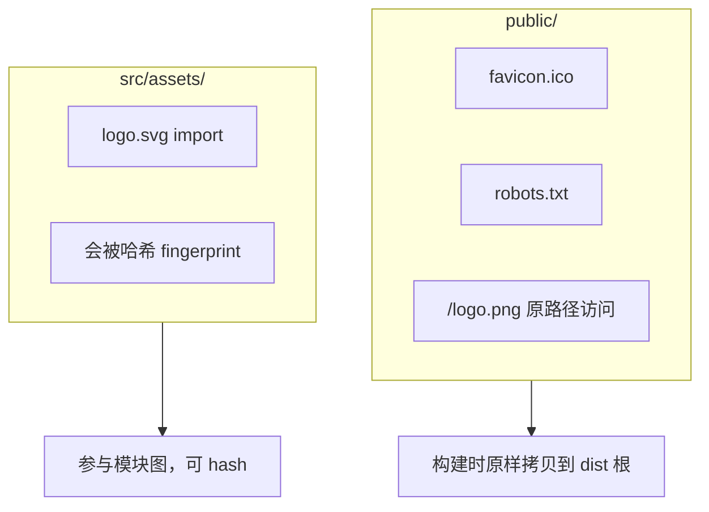

# 静态资源与 SVG · Icon

图片、图标、字体在 Vite/Next 里的引用方式不同，放错目录会影响缓存和 bundle 体积。下面区分 `public/` 与 `src/assets/`，顺带讲 Icon 封装与上传、富文本相关的安全要点。

---

## Vite：`public/` 与 `src/assets/`



| 位置 | 引用方式 | 构建行为 |
|------|----------|----------|
| `public/` | `/logo.png` 绝对路径 | 不 hash，原文件名 |
| `src/assets/` | `import url from './x.png'` | hash 文件名，利于缓存 |

```tsx
// public — 适合不常变、无需 hash 的文件


// import — 推荐组件内图片
import hero from '@/assets/hero.webp';

```

**import 返回值**：

| 后缀 / 查询 | 效果 |
|-------------|------|
| `.png` `.jpg` `.webp` | URL 字符串 |
| `?raw` | 文件内容字符串 |
| `?url` | 显式 URL |
| `?inline` | 小图 base64 内联（视配置） |

**易混点**：组件内业务图宜 `import`（带 hash）；favicon、robots 等固定 URL 放 `public/`。

---

## 图片优化

| 格式 | 适用 |
|------|------|
| **WebP / AVIF** | 照片、大图 |
| **SVG** | 图标、简单插画 |
| **PNG** | 透明、像素风 |
| **JPEG** | 无透明照片 |

```tsx

```

| 属性 | 作用 |
|------|------|
| `loading="lazy"` | 视口外延迟加载 |
| `decoding="async"` | 异步解码 |
| `alt` | **必填**（无障碍 + SEO） |

| 元素 | 适用 |
|------|------|
| `` | 内容图、需 alt、SEO |
| CSS background | 装饰、已知尺寸容器 |

预览用 `URL.createObjectURL` 时，须在 effect cleanup 里 `revokeObjectURL`，避免内存泄漏。

---

## SVG 使用方式

| 方式 | 优点 | 缺点 |
|------|------|------|
| `` | 简单 | 难改色 |
| **内联 SVG JSX** | 完全控制 fill/stroke | JSX 体积大 |
| **SVGR（import 为组件）** | 组件化 + 改 props | 需构建配置 |

**Vite + SVGR**：

```bash
pnpm add -D vite-plugin-svgr
```

```tsx
import Logo from '@/assets/logo.svg?react';

function Header() {
  return <Logo className="h-8 w-auto text-brand" aria-hidden />;
}
```

**内联 SVG** 用 `currentColor` 继承文字颜色：

```tsx
function ChevronDown({ className }: { className?: string }) {
  return (
    <svg className={className} viewBox="0 0 24 24" fill="none"
      stroke="currentColor" strokeWidth={2} aria-hidden>
      <path d="M6 9l6 6 6-6" />
    </svg>
  );
}
```

---

## Icon 体系设计

统一封装便于约束名称、尺寸和替换实现：

```tsx
import * as Icons from './icons';

const ICON_MAP = {
  search: Icons.SearchIcon,
  close: Icons.CloseIcon,
} as const;

type IconName = keyof typeof ICON_MAP;

function Icon({ name, size = 16, className }: {
  name: IconName;
  size?: number;
  className?: string;
}) {
  const Svg = ICON_MAP[name];
  return <Svg width={size} height={size} className={className} aria-hidden />;
}
```

| 来源 | 说明 |
|------|------|
| **lucide-react** | 树摇友好，shadcn 默认 |
| **@ant-design/icons** | Ant Design 项目 |
| **@mui/icons-material** | MUI 项目 |
| Iconfont / 雪碧图 | 遗留；新项目不优先 |

```tsx
import { Search } from 'lucide-react';
<Search size={20} strokeWidth={1.5} />
```

装饰性图标加 **`aria-hidden`**；有语义的图标需配 `aria-label` 或可见文字。

---

## 字体

```css
@font-face {
  font-family: 'AppSans';
  src: url('./AppSans.woff2') format('woff2');
  font-display: swap;
}
```

`font-display: swap` 先系统字体，加载后替换，减少 FOIT。生产更推荐**自托管 woff2**，少第三方请求。

---

## Next.js 差异（简记）

| 能力 | API |
|------|-----|
| 静态 import | 同 Vite |
| 图片优化 | `next/image` 自动尺寸、lazy、格式 |
| public | 同样在根 `public/` |

```tsx
import Image from 'next/image';
import hero from '@/assets/hero.png';

<Image src={hero} alt="..." placeholder="blur" />
```

---

## 安全与路径

| 风险 | 防护 |
|------|------|
| 用户上传 URL 当 src | 校验域名或走 CDN |
| SVG 内嵌 script | 消毒或禁止用户 SVG 内联 |
| 绝对路径硬编码环境 | 用 import 或 env |

---

## 小结

**引用**：组件内资源 **`import` from assets**（带 hash）；固定 URL（favicon）放 **`public/`**。

**图片**：内容图用 `` + 有意义 **alt**；大图 **WebP + lazy**；`createObjectURL` 记得 revoke。

**SVG/Icon**：lucide-react 或 SVGR 组件化；装饰 SVG 加 **`aria-hidden`**；`currentColor` 配合 Tailwind 改色。

**字体**：自托管 **woff2** + `font-display: swap`。

**Next**：内容图优先 **next/image**。

**易混点**：`public/` 不参与 hash，不宜滥用放业务大图；SVG 用户内容必须消毒。

常见错因：这张图该 import 还是绝对路径？预览 URL 有没有 revoke？图标是否统一尺寸与命名？
