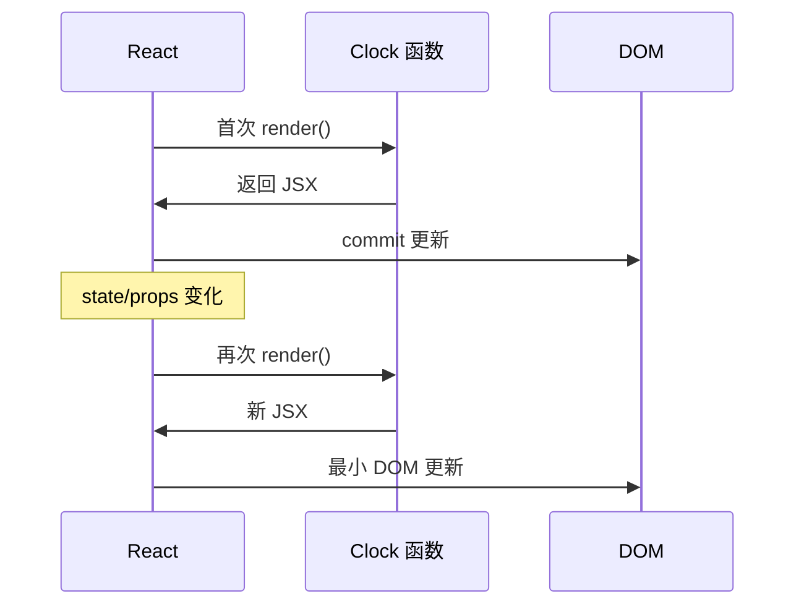
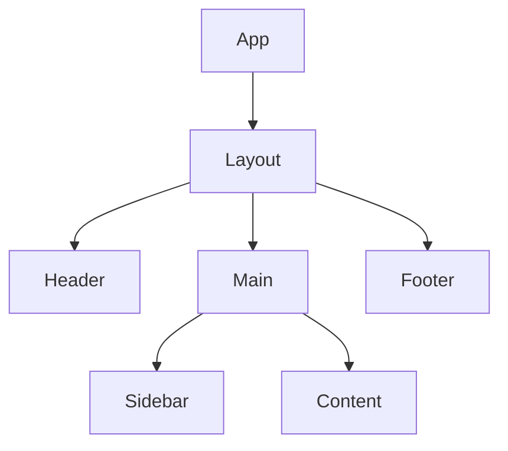

# 函数组件与组件树

React 18+ 默认写法是**函数组件**：每次 state/props 变化，React 会**再次调用**这个函数，得到新的 JSX 描述，再 diff 更新 DOM。理解「组件 = 函数 + 树」和「render 要纯」，是后面 Hooks 和排错的基础。

---

## 组件是什么

```tsx
function Welcome({ name }: { name: string }) {
  return <h1>你好，{name}</h1>;
}

<Welcome name="Li" />
// 等价于 Welcome({ name: 'Li' })
```

| 概念 | 含义 |
|------|------|
| **组件** | 封装 UI + 逻辑的函数 |
| **元素（Element）** | `<Welcome />` 描述「在此位置渲染 Welcome」 |
| **实例** | 运行时 React 在树上维护的节点（无需手动 new） |

**PascalCase** = 自定义组件，**小写** = 原生 HTML：

```tsx
<div />      // DOM
<UserCard /> // 组件
```

---

## 执行模型：每次 render 重新执行

```tsx
function Clock() {
  const now = new Date().toLocaleTimeString();
  console.log('Clock 执行了一次');
  return <time>{now}</time>;
}
```



| 要点 | 说明 |
|------|------|
| 函数应**纯**（同一 props/state → 同一输出） | 渲染阶段不要做副作用 |
| 每次 render 是**新一次函数调用** | 局部变量不会自动保留，要靠 state/ref |
| 子组件 props 变 → 子组件也会 re-render | 默认向下传递更新 |

**易混点**：render 里写的 `let x = 0` 每次都会重置；要跨 render 保留用 `useState` / `useRef`。

---

## 组件树与组合优于继承

```tsx
function App() {
  return (
    <Layout>
      <Header />
      <Main>
        <Sidebar />
        <Content />
      </Main>
      <Footer />
    </Layout>
  );
}
```



| 术语 | 说明 |
|------|------|
| **根组件** | `App`，通常挂到 `#root` |
| **父 / 子** | 谁包含谁；数据默认父 → 子 |
| **叶子** | 不再渲染子组件的节点 |

React 推荐 **props 与 children 组合**，而不是 class 继承扩展 UI：

```tsx
// ❌ 不太 React
class PrimaryButton extends Button { ... }

// ✅ 组合：props 变体
function Button({ variant = 'default', ...rest }: ButtonProps) {
  return <button className={variants[variant]} {...rest} />;
}
```

逻辑复用抽 **自定义 Hook**，而非基类。

---

## 命名、导出与依赖方向

| 规则 | 示例 |
|------|------|
| 组件名 **PascalCase** | `UserCard` |
| 文件名与主组件一致 | `UserCard.tsx` |
| Hook 名 **use** 前缀 | `useUserList` |

```tsx
export function UserCard(props: UserCardProps) { ... }
```

依赖方向：页面 → 业务组件 → 基础组件 → 工具；避免反向引用造成循环依赖。

---

## 渲染阶段边界：纯 vs 副作用

**渲染阶段应做**：根据 props/state 算 JSX；派生变量；调用纯工具函数。

**渲染阶段不应做**：

| 禁止 | 应放在 |
|------|--------|
| `fetch` / 改 DOM | `useEffect` 或事件处理 |
| 无条件 `setState` | 事件 / effect（否则无限循环） |
| `Math.random()` 当展示且无 state | 需稳定则 state 或 ref |
| 改外部模块变量 | 事件 / effect |

```tsx
// ❌ 每次 render 都请求 → 死循环风险
function Bad() {
  const [data, setData] = useState(null);
  fetch('/api').then(setData);
  return <div>{data}</div>;
}

// ✅
function Good() {
  const [data, setData] = useState(null);
  useEffect(() => {
    fetch('/api').then(setData);
  }, []);
  return <div>{data}</div>;
}
```

---

## React 元素 vs DOM 节点

```tsx
const el = <div className="box">hi</div>;
// { type: 'div', props: { className: 'box', children: 'hi' }, ... }
```

| | React Element | DOM Node |
|---|---------------|----------|
| 存在位置 | 内存中的描述对象 | 浏览器真实节点 |
| 谁创建 | jsx / createElement | React commit 阶段 |

---

## 组件粒度与 Strict Mode

| 过大 | 过小 |
|------|------|
| 单文件上千行 | 每个 div 一个组件 |
| 难测、难复用 | props 爆炸 |

经验：同一视觉块/业务单元成一个组件；重复两次考虑抽取；只服务局部 UI 的 state 留在子组件。

开发环境 `StrictMode` 会**两次调用**组件函数，帮发现不纯副作用；生产不会。

函数组件 + Hooks 是默认；class 仅遗留维护。

---

## 小结

**组件 = 函数**：`<Comp />` 即调用；应用是一棵**组件树**，数据默认向下流。

**执行模型**：每次 render **重新执行**组件函数；跨 render 保留用 **state / ref**；子随父 props 更新而 render。

**纯度**：副作用进 useEffect 或事件，不在 render 里 fetch、setState、改全局。

**组合**：用 props/children 扩展 UI，用 Hook 复用逻辑；忌 class 继承 UI。

**命名**：PascalCase 组件、小写 DOM；Hook 以 `use` 开头。

**易混点**：Element 是描述不是 DOM；Strict Mode 双 render 仅开发态；render 里 setState 易死循环。

常见错因：这份数据该 state 还是 render 里算？副作用是否误写在 render？
