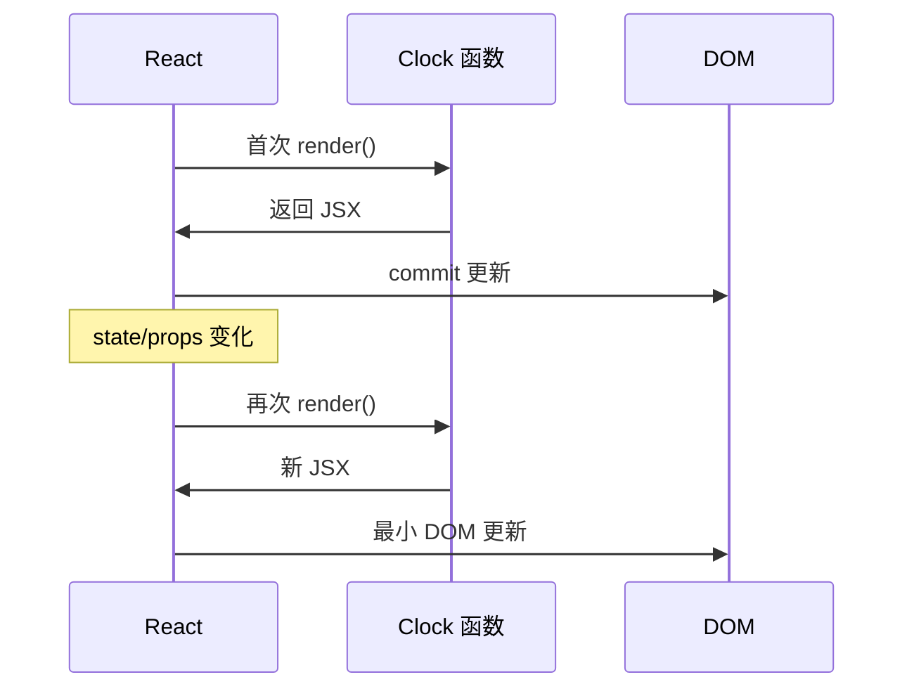
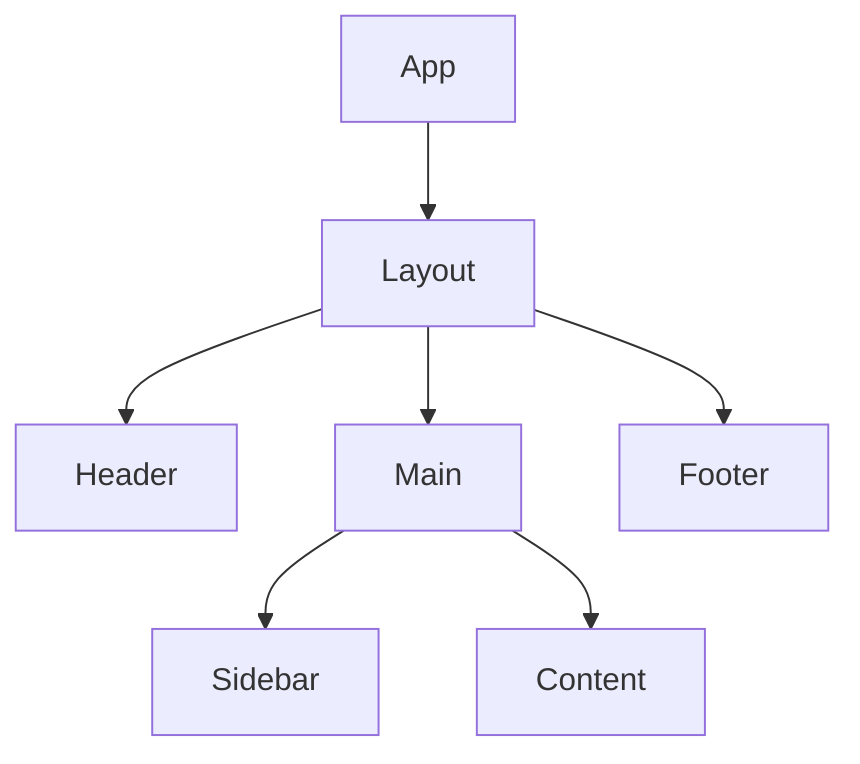
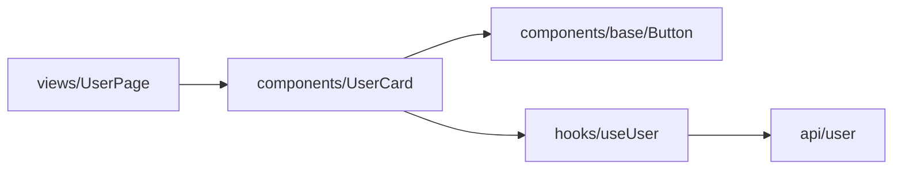

# 函数组件与组件树

> React 应用是一棵**组件树**：每个节点是一个函数（或类），接收 props，返回 UI 描述。理解「树」与「函数组件」，是读懂后续 props、state、Hooks 的基础。

---

## 一、组件是什么？

**组件**是 UI 的独立、可复用单元。在 React 18+ 中，**默认写法是函数组件**：

```tsx
function Welcome({ name }: { name: string }) {
  return <h1>你好，{name}</h1>;
}
```

调用方式像 HTML 标签，但本质是 **JavaScript 函数**：

```tsx
<Welcome name="Li" />
// 等价于 Welcome({ name: 'Li' })
```

| 概念 | 含义 |
|------|------|
| **组件** | 封装 UI + 逻辑的函数 |
| **元素（Element）** | `<Welcome />` 描述「在此位置渲染 Welcome」 |
| **实例** | 运行时 React 在树上维护的节点（无需手动 new） |

---

## 二、函数组件的执行模型

每次 **渲染**，React 会**再次调用**你的组件函数。

```tsx
function Clock() {
  const now = new Date().toLocaleTimeString();
  console.log('Clock 执行了一次');
  return <time>{now}</time>;
}
```



| 要点 | 说明 |
|------|------|
| 函数应**纯**（同一 props/state → 同一输出） | 渲染阶段不要做副作用（请求、改全局变量） |
| 每次 render 是**新一次函数调用** | 局部变量不会「自动保留」，要靠 state/ref |
| 子组件 props 变 → 子组件也会 re-render | 默认向下传递更新 |

---

## 三、组件树结构

```tsx
function App() {
  return (
    <Layout>
      <Header />
      <Main>
        <Sidebar />
        <Content />
      </Main>
      <Footer />
    </Layout>
  );
}
```



| 术语 | 说明 |
|------|------|
| **根组件** | `App`，通常挂到 `#root` |
| **父 / 子** | 谁包含谁；数据默认父 → 子 |
| **兄弟** | 同一父下的并列组件 |
| **叶子** | 不再渲染子组件的节点 |

**树的意义**：更新从某节点开始，可能向下传播；错误边界、Context 也沿树作用。

---

## 四、组合优于继承

React 官方推荐用 **props 与 children 组合**，而不是 class 继承来扩展 UI。

```tsx
// ❌ 不太 React：继承改 Button
class PrimaryButton extends Button { ... }

// ✅ 组合：props 变体
function Button({ variant = 'default', ...rest }: ButtonProps) {
  return <button className={variants[variant]} {...rest} />;
}
```

| 继承（OOP UI） | 组合（React） |
|----------------|---------------|
| 层级深、难预测 | 显式 props，树状清晰 |
| 逻辑散落基类 | 抽 **自定义 Hook** 复用逻辑 |

见 [07-组件模式与架构](../07-组件模式与架构/)。

---

## 五、命名与文件约定

| 规则 | 示例 |
|------|------|
| 组件名 **PascalCase** | `UserCard` |
| 文件名与默认导出一致 | `UserCard.tsx` |
| 一个文件一个主组件 | 小辅助组件可同文件但不导出 |
| Hook 名 **use** 前缀 | `useUserList` |

```tsx
// UserCard.tsx
export function UserCard(props: UserCardProps) {
  return ...;
}

// 默认导出也可，团队统一即可
export default function UserCard() { ... }
```

HTML 标签必须**小写**；PascalCase 一定表示自定义组件：

```tsx
<div />      // DOM
<UserCard /> // 组件
```

---

## 六、导出与模块边界

```tsx
// components/base/Button/index.ts
export { Button } from './Button';
export type { ButtonProps } from './Button';
```



**依赖方向**：页面 → 业务组件 → 基础组件 → 工具；避免反向引用造成循环依赖。

---

## 七、纯函数与副作用边界

### 7.1 渲染阶段应做的

- 根据 props/state 计算 JSX
- 派生变量（`const fullName = ...`）
- 调用 **纯** 工具函数

### 7.2 渲染阶段不应做的

| 禁止 | 应放在 |
|------|--------|
| `fetch` / 改 DOM | `useEffect` 或事件处理 |
| `setState` 无条件调用 | 事件 / effect（否则无限循环） |
| `Math.random()` 当展示用且无 state | 需稳定则 state 或 ref |
| 改外部模块变量 | 事件 / effect |

```tsx
// ❌ 每次 render 都请求 + setState → 死循环风险
function Bad() {
  const [data, setData] = useState(null);
  fetch('/api').then(setData);
  return <div>{data}</div>;
}

// ✅
function Good() {
  const [data, setData] = useState(null);
  useEffect(() => {
    fetch('/api').then(setData);
  }, []);
  return <div>{data}</div>;
}
```

---

## 八、组件粒度：多大合适？

| 过大 | 过小 |
|------|------|
| 单文件上千行 | 每个 div 一个组件 |
| 难测、难复用 | props 爆炸、跳转频繁 |

**经验法则**：

1. **同一视觉块 / 同一业务单元** 可成一个组件  
2. **重复出现两次** → 考虑抽取  
3. **state 只服务局部 UI** → 留在子组件，不必抬升  

```tsx
function UserPage() {
  return (
    <PageLayout title="用户详情">
      <UserProfile userId={id} />
      <UserOrders userId={id} />
    </PageLayout>
  );
}
```

---

## 九、React 元素 vs DOM 节点

```tsx
const el = <div className="box">hi</div>;
console.log(el);
// { type: 'div', props: { className: 'box', children: 'hi' }, key: null, ... }
```

| | React Element | DOM Node |
|---|---------------|----------|
| 存在位置 | 内存中的描述对象 | 浏览器真实节点 |
| 谁创建 | `createElement` / jsx | React commit 阶段 |

一棵 **React 元素树** 在一次 render 中生成；React 对比后更新 **DOM 树**。

---

## 十、Strict Mode 下的双调用（开发）

开发环境 `StrictMode` 会**两次调用**组件函数，帮助发现不纯的副作用。生产环境不会。

```tsx
// main.tsx
<StrictMode>
  <App />
</StrictMode>
```

见 [06-StrictMode](../06-渲染与调和/06-StrictMode与开发态行为.md)。

---

## 十一、与 class 组件的对比（了解即可）

| | 函数组件 + Hooks | class 组件 |
|---|------------------|------------|
| 现状 | **默认** | 遗留 |
| 状态 | useState / useReducer | this.state |
| 副作用 | useEffect | 生命周期 |
| this | 无 | 需绑定 |

新代码不写 class；维护见 [17-类组件与迁移](../17-类组件与迁移/)。

---

## 十二、小结 Checklist

- [ ] 组件是函数，`<Comp />` 是调用  
- [ ] 应用是**树**，数据默认向下  
- [ ] 每次 render 重新执行函数；持久数据用 state/ref  
- [ ] 渲染保持纯，副作用进 effect / 事件  
- [ ] PascalCase = 组件，小写 = HTML  

**下一篇**：[02-Props与单向数据流](./02-Props与单向数据流.md)
