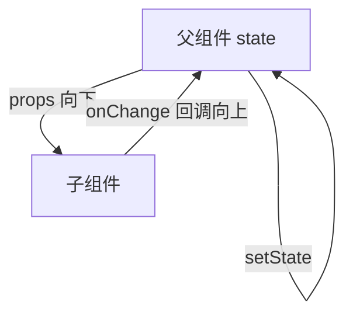
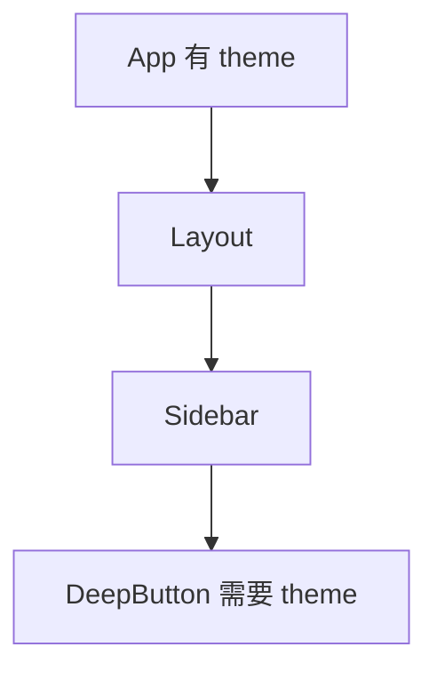

# Props 与单向数据流

> **Props**（properties）是父组件传给子组件的**只读参数**。React 强调**单向数据流**：数据从父到子，子通过**回调**通知父去改 state。

---

## 一、Props 是什么？

```tsx
function Avatar({ src, alt, size = 40 }: {
  src: string;
  alt: string;
  size?: number;
}) {
  return (
    
  );
}

<Avatar src="/a.png" alt="Li" size={48} />
```

| 特点 | 说明 |
|------|------|
| **只读** | 子组件不能 `props.x = ...` |
| **任意类型** |  string、对象、函数、ReactNode、甚至组件 |
| **默认值** | 解构默认参数、`defaultProps`（legacy） |

---

## 二、单向数据流



```tsx
function SearchPage() {
  const [keyword, setKeyword] = useState('');

  return (
    <>
      <SearchInput value={keyword} onChange={setKeyword} />
      <ResultList keyword={keyword} />
    </>
  );
}

function SearchInput({ value, onChange }: {
  value: string;
  onChange: (v: string) => void;
}) {
  return (
    <input
      value={value}
      onChange={e => onChange(e.target.value)}
    />
  );
}
```

| 好处 | 说明 |
|------|------|
| 数据流向清晰 | bug 时追溯「谁拥有 state」 |
| 子组件可预测 | 相同 props → 相同 UI |
| 易测试 | 传入 props 断言输出 |

---

## 三、Props 的类型设计（TypeScript）

### 3.1 内联 vs 独立类型

```tsx
interface UserCardProps {
  user: User;
  onFollow?: (id: string) => void;
  className?: string;
}

function UserCard({ user, onFollow, className }: UserCardProps) {
  ...
}
```

### 3.2 扩展原生属性

```tsx
type ButtonProps = React.ComponentProps<'button'> & {
  variant?: 'primary' | 'ghost';
};

function Button({ variant, className, ...rest }: ButtonProps) {
  return (
    <button
      className={clsx(styles[variant ?? 'default'], className)}
      {...rest}
    />
  );
}
```

| 工具类型 | 用途 |
|----------|------|
| `ComponentProps<'button'>` | 继承 button 全部合法属性 |
| `ComponentPropsWithoutRef<'div'>` | 不要 ref 时 |
| `Pick` / `Omit` | 从大型 props 挑/删字段 |

### 3.3 可选与必填

```tsx
interface ModalProps {
  open: boolean;           // 必填
  title?: string;          // 可选 → string | undefined
  onClose: () => void;
}
```

---

## 四、默认值

```tsx
// ✅ 推荐：解构默认值
function Badge({ count = 0, max = 99 }: { count?: number; max?: number }) {
  const display = count > max ? `${max}+` : count;
  return <span>{display}</span>;
}
```

```tsx
// 仅当 prop 为 undefined 时用默认值
<Badge count={0} />  // 显示 0，不是默认值覆盖 0
```

---

## 五、Props 展开与透传

```tsx
function TextField({ label, ...inputProps }: {
  label: string;
} & React.ComponentProps<'input'>) {
  return (
    <label>
      {label}
      <input {...inputProps} />
    </label>
  );
}
```

| 模式 | 场景 |
|------|------|
| `{...rest}` 放最后 | 允许调用方覆盖（慎用 className 冲突） |
| 显式列出 | API 稳定、防透传敏感属性 |

**合并 className**：

```tsx
<input {...rest} className={clsx(styles.input, rest.className)} />
```

---

## 六、传递函数 Props（回调）

```tsx
function TodoItem({ todo, onToggle, onDelete }: {
  todo: Todo;
  onToggle: (id: string) => void;
  onDelete: (id: string) => void;
}) {
  return (
    <li>
      <input
        type="checkbox"
        checked={todo.done}
        onChange={() => onToggle(todo.id)}
      />
      <button type="button" onClick={() => onDelete(todo.id)}>删除</button>
    </li>
  );
}
```

| 命名 | 约定 |
|------|------|
| `onXxx` | 父传子，事件发生时调用 |
| `handleXxx` | 组件内部处理函数（可选命名） |

**不要**在 JSX 里无必要地内联创建函数导致子组件 memo 失效（见 [11-性能优化](../11-性能优化/)）——在确实需要优化时再处理。

---

## 七、传递 ReactNode 与 render props

```tsx
function Panel({ title, children }: {
  title: string;
  children: React.ReactNode;
}) {
  return (
    <section>
      <h2>{title}</h2>
      <div>{children}</div>
    </section>
  );
}
```

```tsx
function List<T>({ items, renderItem }: {
  items: T[];
  renderItem: (item: T, index: number) => React.ReactNode;
}) {
  return <ul>{items.map((item, i) => <li key={i}>{renderItem(item, i)}</li>)}</ul>;
}
```

详见 [03-Children与组合模式](./03-Children与组合模式.md)。

---

## 八、Prop Drilling（属性层层传递）



中间层不传 theme 就不显示，传了却不用 → **prop drilling**。

| 解法 | 适用 |
|------|------|
| **组件组合** | 把 `DeepButton` 作为 children 提升 |
| **Context** | 主题、语言、当前用户 |
| **状态库** | 全局频繁读写的客户端 state |

见 [08-状态管理](../08-状态管理/)、[05-useContext](../05-Hooks体系/04-useContext与跨层通信.md)。

---

## 九、Props 不变性

```tsx
function Child({ user }: { user: User }) {
  // ❌ 禁止
  user.name = 'hack';

  // ✅ 通知父组件改
  // props.onUpdate({ ...user, name: 'new' });
}
```

父组件应使用**不可变更新**：

```tsx
setUser(prev => ({ ...prev, name: 'new' }));
```

---

## 十、特殊 Props

| Prop | 作用 |
|------|------|
| `key` | 列表身份，**不是**传给组件的 props |
| `ref` | 引用 DOM/实例，React 19 可作普通 prop |
| `children` | 子内容 |

```tsx
function Demo(props: { id: string }) {
  console.log(props.key); // undefined — key 在 React 内部用
}
```

---

## 十一、反模式

| 反模式 | 问题 |
|--------|------|
| 子组件自己 fetch 父组件已有的数据 | 数据源重复 |
| 复制 props 到 state「备份」 | 易不同步 |
| 10+ 个 boolean props | 用 `variant` 或组合组件 |
| 任何数据都放 Context | 过度渲染 |

```tsx
// ❌ 复制 props → state
function Bad({ value }: { value: number }) {
  const [v, setV] = useState(value);
  // value 变了 v 不会自动变
}
```

---

## 十二、小结

| 要点 | 记忆 |
|------|------|
| props 只读 | 改数据在拥有 state 的组件 |
| 单向流 | 数据下、事件上 |
| 类型 | `ComponentProps`、独立 interface |
| drilling | 组合 / Context / 状态库 |

**上一篇**：[01-函数组件与组件树](./01-函数组件与组件树.md)  
**下一篇**：[03-Children与组合模式](./03-Children与组合模式.md)
