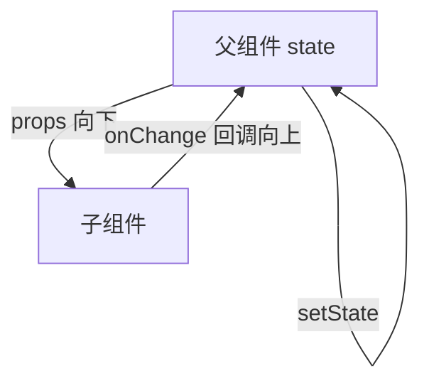

# Props 与单向数据流

Props 是父传给子的**只读参数**，子不能改 props，要改父的数据就通过回调通知。单向数据流让「谁拥有 state」可追溯，是 React 排错时最有用的线索之一。

---

## Props 是什么

```tsx
function Avatar({ src, alt, size = 40 }: {
  src: string;
  alt: string;
  size?: number;
}) {
  return (
    
  );
}

<Avatar src="/a.png" alt="Li" size={48} />
```

| 特点 | 说明 |
|------|------|
| **只读** | 子组件不能 `props.x = ...` |
| **任意类型** | string、对象、函数、ReactNode、组件 |
| **默认值** | 解构默认参数（推荐） |

解构默认值仅当 prop 为 `undefined` 时生效：`<Badge count={0} />` 显示 0，不会被默认值覆盖。

---

## 单向数据流



```tsx
function SearchPage() {
  const [keyword, setKeyword] = useState('');

  return (
    <>
      <SearchInput value={keyword} onChange={setKeyword} />
      <ResultList keyword={keyword} />
    </>
  );
}

function SearchInput({ value, onChange }: {
  value: string;
  onChange: (v: string) => void;
}) {
  return (
    <input value={value} onChange={e => onChange(e.target.value)} />
  );
}
```

出 bug 时顺着「谁拥有这份 state」往上查，路径固定。

---

## TypeScript 类型设计

```tsx
interface UserCardProps {
  user: User;
  onFollow?: (id: string) => void;
  className?: string;
}

function UserCard({ user, onFollow, className }: UserCardProps) { ... }
```

扩展原生属性：

```tsx
type ButtonProps = React.ComponentProps<'button'> & {
  variant?: 'primary' | 'ghost';
};

function Button({ variant, className, ...rest }: ButtonProps) {
  return (
    <button className={clsx(styles[variant ?? 'default'], className)} {...rest} />
  );
}
```

| 工具类型 | 用途 |
|----------|------|
| `ComponentProps<'button'>` | 继承 button 全部合法属性 |
| `ComponentPropsWithoutRef<'div'>` | 不要 ref 时 |
| `Pick` / `Omit` | 从大型 props 挑/删字段 |

---

## 透传、回调与 ReactNode

```tsx
function TextField({ label, ...inputProps }: {
  label: string;
} & React.ComponentProps<'input'>) {
  return (
    <label>
      {label}
      <input {...inputProps} />
    </label>
  );
}

<input {...rest} className={clsx(styles.input, rest.className)} />
```

回调命名约定：父传子用 **`onXxx`**；组件内部处理函数可用 `handleXxx`。

```tsx
function TodoItem({ todo, onToggle, onDelete }: {
  todo: Todo;
  onToggle: (id: string) => void;
  onDelete: (id: string) => void;
}) {
  return (
    <li>
      <input type="checkbox" checked={todo.done}
        onChange={() => onToggle(todo.id)} />
      <button type="button" onClick={() => onDelete(todo.id)}>删除</button>
    </li>
  );
}
```

**render props**，父把「如何渲染」交给函数 prop：

```tsx
function List<T>({ items, renderItem }: {
  items: T[];
  renderItem: (item: T, index: number) => React.ReactNode;
}) {
  return <ul>{items.map((item, i) => <li key={i}>{renderItem(item, i)}</li>)}</ul>;
}
```

多数场景可被自定义 Hook + 普通 children 替代。

---

## Prop Drilling 与特殊 Props

中间层不传、深层却要 → **prop drilling**。

| 解法 | 适用 |
|------|------|
| **组件组合** | 把深层子作为 children 提升 |
| **Context** | 主题、语言、当前用户 |
| **状态库** | 全局频繁读写的客户端 state |

**Props 不变性**：

```tsx
// ❌
user.name = 'hack';

// ✅ 通知父改
setUser(prev => ({ ...prev, name: 'new' }));
```

| Prop | 说明 |
|------|------|
| `key` | 列表身份，**不是**传给组件的 props（`props.key` 为 undefined） |
| `ref` | 引用 DOM/实例；React 19 可作普通 prop |
| `children` | 子内容 |

---

## 反模式

| 反模式 | 问题 |
|--------|------|
| 子组件 fetch 父已有数据 | 数据源重复 |
| 复制 props 到 state「备份」 | 易不同步 |
| 10+ 个 boolean props | 用 `variant` 或复合组件 |
| 任何数据都放 Context | 过度渲染 |

```tsx
// ❌ props 变但 state 不更新
function Bad({ value }: { value: number }) {
  const [v, setV] = useState(value);
}
```

受控模式或 `key` 重置子树。

---

## 小结

**Props 只读**：谁拥有 state 谁更新；子通过**回调**通知父。

**单向数据流**：数据向下、事件向上；勿在子组件直接改 props 或 mutate 对象。

**类型**：独立 interface 或 `ComponentProps`；透传用 rest；合并 className 用 clsx。

**Drilling**：先试组合提升 children，再 Context/状态库。

**易混点**：`key` 不进 props；props 初始化 state 后不同步；内联函数导致 memo 失效是优化问题，不是数据流错误。

常见错因：这份 state 在谁手里？props 有没有被当可变对象改？
