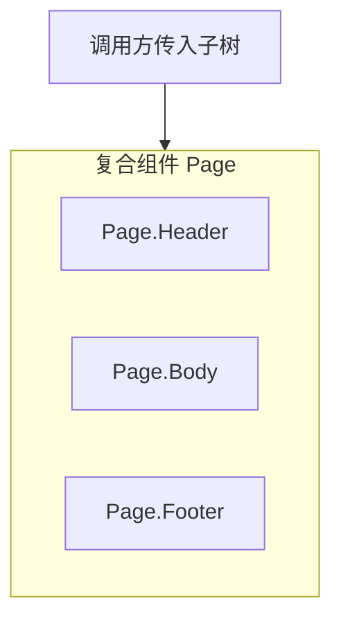
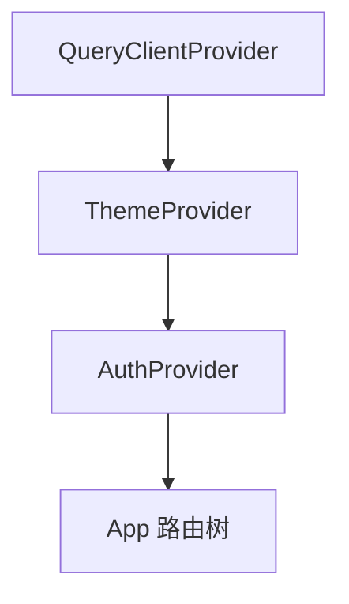

# Children 与组合模式

> **children** 是最常用的组合 API：父组件声明「槽位」，调用方决定填入什么。用好组合，可以避免 prop drilling 和臃肿的 `showX/showY` 开关。

---

## 一、children 基础

```tsx
function Card({ title, children }: {
  title: string;
  children: React.ReactNode;
}) {
  return (
    <article className="card">
      <header>{title}</header>
      <div className="card-body">{children}</div>
    </article>
  );
}

<Card title="公告">
  <p>正文内容</p>
  <button>知道了</button>
</Card>
```

| `React.ReactNode` 包括 | 不渲染 |
|------------------------|--------|
| 元素、字符串、数字、数组 | `null`、`undefined`、`false` |
| Portal、Fragment | `true`（单独 true 不显示） |

---

## 二、children 的类型细分

```tsx
import type { ReactElement, ReactNode } from 'react';

// 只允许单个元素
function Wrapper({ children }: { children: ReactElement }) {
  return <div className="wrap">{children}</div>;
}

// 只允许 string（少见）
function Text({ children }: { children: string }) {
  return <span>{children}</span>;
}
```

| 类型 | 严格度 |
|------|--------|
| `ReactNode` | 最宽，常用 |
| `ReactElement` | 单个元素 |
| `ReactElement<{ id: string }>` | 限定元素 props |

---

## 三、组合 vs 配置 props

### 3.1 配置式（props 爆炸）

```tsx
// ❌ 难扩展
<Page
  showHeader
  showSidebar
  headerTitle="首页"
  sidebar={<Menu />}
  footer={<Footer />}
/>
```

### 3.2 组合式（推荐）

```tsx
<Page>
  <Page.Header title="首页" />
  <Page.Body>
    <Page.Sidebar><Menu /></Page.Sidebar>
    <Page.Content>...</Page.Content>
  </Page.Body>
  <Page.Footer><Footer /></Page.Footer>
</Page>
```



见 [07-复合组件](../07-组件模式与架构/01-复合组件与状态共享.md)。

---

## 四、具名 slot：多 children 替代

React 没有 Vue 的 `slot` 名字，常用 **多个 props** 模拟：

```tsx
interface LayoutProps {
  header?: React.ReactNode;
  sidebar?: React.ReactNode;
  children: React.ReactNode;
  footer?: React.ReactNode;
}

function Layout({ header, sidebar, children, footer }: LayoutProps) {
  return (
    <div className="layout">
      {header && <header>{header}</header>}
      <div className="main">
        {sidebar && <aside>{sidebar}</aside>}
        <main>{children}</main>
      </div>
      {footer && <footer>{footer}</footer>}
    </div>
  );
}
```

| 命名 | 语义 |
|------|------|
| `children` | 主内容区（默认 slot） |
| `header` / `footer` | 具名区域 |

---

## 五、组件组合解决 drilling

**问题**：Theme 在 App，深层 Button 需要 theme。

```tsx
// ❌ 层层传 theme
<Layout theme={theme}>
  <Sidebar theme={theme}>
    <DeepButton theme={theme} />
```

**组合**：中间层不关心 theme，由调用方直接组装：

```tsx
function Layout({ sidebar, children }: {
  sidebar: React.ReactNode;
  children: React.ReactNode;
}) {
  return (
    <div>
      <aside>{sidebar}</aside>
      <main>{children}</main>
    </div>
  );
}

// App 直接把带 theme 的 Button 放进 sidebar
<Layout sidebar={<DeepButton theme={theme} />} >
  ...
</Layout>
```

Facebook 经典文章 *Inversion of Control* 核心：**父级通过组合控制子树结构**。

---

## 六、render props

父组件把「如何渲染」交给 props 函数：

```tsx
function MouseTracker({ render }: {
  render: (pos: { x: number; y: number }) => React.ReactNode;
}) {
  const [pos, setPos] = useState({ x: 0, y: 0 });
  return (
    <div
      onMouseMove={e => setPos({ x: e.clientX, y: e.clientY })}
      style={{ height: 200 }}
    >
      {render(pos)}
    </div>
  );
}

<MouseTracker render={({ x, y }) => <p>{x}, {y}</p>} />
```

| 对比 children | render prop |
|---------------|-------------|
| 静态结构 | 需要父组件内部**数据**参与渲染 |
| `<List>{items}</List>` | `<List renderItem={...} />` |

现代更常改为 **自定义 Hook**（`useMouse`）+ 普通 children，减少嵌套。

---

## 七、function as children

```tsx
function DataProvider({ url, children }: {
  url: string;
  children: (data: User[]) => React.ReactNode;
}) {
  const { data = [] } = useQuery({ queryKey: [url], queryFn: () => fetch(url).then(r => r.json()) });
  return <>{children(data)}</>;
}

<DataProvider url="/api/users">
  {users => users.map(u => <li key={u.id}>{u.name}</li>)}
</DataProvider>
```

与 render prop 类似；注意 children 是函数时类型为 `(data) => ReactNode`。

---

## 八、克隆元素（cloneElement）— 慎用

```tsx
function Row({ children }: { children: React.ReactElement }) {
  return React.cloneElement(children, { className: 'row-item' });
}
```

| 问题 | 说明 |
|------|------|
| 隐式注入 props | 难追踪 |
| 与 TS 不友好 | 替代：Context、组合、显式 wrapper |

**优先** Context 或 compound components，少 `cloneElement`。

---

## 九、Provider 组合模式

```tsx
function AppProviders({ children }: { children: React.ReactNode }) {
  return (
    <QueryClientProvider client={queryClient}>
      <ThemeProvider theme={theme}>
        <AuthProvider>
          {children}
        </AuthProvider>
      </ThemeProvider>
    </QueryClientProvider>
  );
}
```



可抽 `composeProviders` 工具减少嵌套视觉噪音。

---

## 十、空 children 与条件

```tsx
function Optional({ visible, children }: {
  visible: boolean;
  children: React.ReactNode;
}) {
  if (!visible) return null;
  return <>{children}</>;
}
```

---

## 十一、小结

| 模式 | 何时用 |
|------|--------|
| `children` | 单一内容槽、布局包裹 |
| 具名 props | 多区域 layout |
| 复合组件 `Page.Header` | 固定结构 + 灵活内容 |
| render props / FaC | 需要注入数据（可 Hook 替代） |
| Provider 嵌套 | 全局依赖 |

**上一篇**：[02-Props与单向数据流](./02-Props与单向数据流.md)  
**下一篇**：[04-State基础与更新语义](./04-State基础与更新语义.md)
