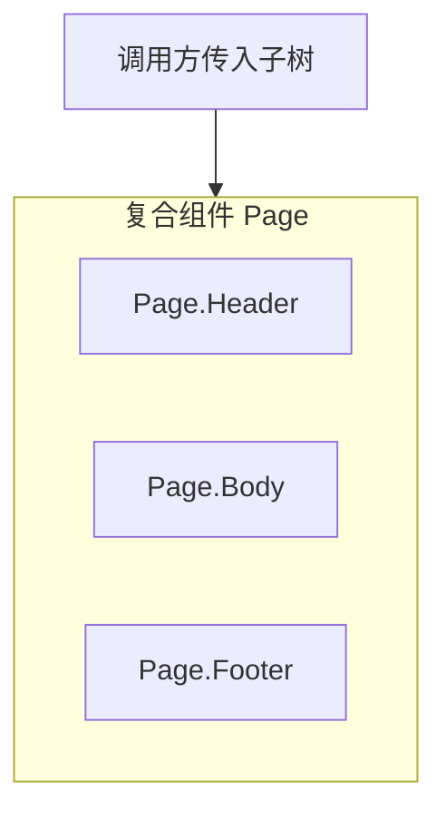

# Children 与组合模式

React 没有 Vue 的具名 slot 语法，但用 `children`、多 prop 插槽和复合组件同样能做出灵活布局。思路是**组合优于配置**，少堆 `showHeader/showSidebar` 布尔开关，多让调用方组装子树。

---

## children 基础与类型

```tsx
function Card({ title, children }: {
  title: string;
  children: React.ReactNode;
}) {
  return (
    <article className="card">
      <header>{title}</header>
      <div className="card-body">{children}</div>
    </article>
  );
}

<Card title="公告">
  <p>正文内容</p>
  <button>知道了</button>
</Card>
```

| `React.ReactNode` 包括 | 不渲染 |
|------------------------|--------|
| 元素、字符串、数字、数组 | `null`、`undefined`、`false` |

更严格时可限定 `ReactElement` 或 `ReactElement<{ id: string }>`。

---

## 组合 vs 配置 props

```tsx
// ❌ 难扩展
<Page showHeader showSidebar headerTitle="首页" sidebar={<Menu />} />

// ✅ 复合组件
<Page>
  <Page.Header title="首页" />
  <Page.Body>
    <Page.Sidebar><Menu /></Page.Sidebar>
    <Page.Content>...</Page.Content>
  </Page.Body>
  <Page.Footer><Footer /></Page.Footer>
</Page>
```



---

## 具名 slot：多 children 替代

```tsx
interface LayoutProps {
  header?: React.ReactNode;
  sidebar?: React.ReactNode;
  children: React.ReactNode;
  footer?: React.ReactNode;
}

function Layout({ header, sidebar, children, footer }: LayoutProps) {
  return (
    <div className="layout">
      {header && <header>{header}</header>}
      <div className="main">
        {sidebar && <aside>{sidebar}</aside>}
        <main>{children}</main>
      </div>
      {footer && <footer>{footer}</footer>}
    </div>
  );
}
```

| 命名 | 语义 |
|------|------|
| `children` | 主内容区（默认 slot） |
| `header` / `footer` | 具名区域 |

---

## 组合解决 prop drilling

```tsx
// ❌ 层层传 theme
<Layout theme={theme}>
  <Sidebar theme={theme}>
    <DeepButton theme={theme} />

// ✅ 中间层不关心 theme，由 App 直接组装
<Layout sidebar={<DeepButton theme={theme} />}>
  ...
</Layout>
```

父级通过**组合控制子树结构**（Inversion of Control），中间层不必转发不用的 props。

---

## render props 与 function as children

```tsx
function MouseTracker({ render }: {
  render: (pos: { x: number; y: number }) => React.ReactNode;
}) {
  const [pos, setPos] = useState({ x: 0, y: 0 });
  return (
    <div onMouseMove={e => setPos({ x: e.clientX, y: e.clientY })}>
      {render(pos)}
    </div>
  );
}
```

```tsx
function DataProvider({ url, children }: {
  url: string;
  children: (data: User[]) => React.ReactNode;
}) {
  const { data = [] } = useQuery({ queryKey: [url], queryFn: () => fetch(url).then(r => r.json()) });
  return <>{children(data)}</>;
}
```

现代更常抽 **`useMouse` / `useUsers`** 等 Hook，减少 JSX 嵌套。

---

## cloneElement — 慎用

```tsx
function Row({ children }: { children: React.ReactElement }) {
  return React.cloneElement(children, { className: 'row-item' });
}
```

隐式注入 props、TS 不友好，优先 Context、复合组件或显式 wrapper。

---

## Provider 组合

```tsx
function AppProviders({ children }: { children: React.ReactNode }) {
  return (
    <QueryClientProvider client={queryClient}>
      <ThemeProvider theme={theme}>
        <AuthProvider>{children}</AuthProvider>
      </ThemeProvider>
    </QueryClientProvider>
  );
}
```

可抽 `composeProviders` 减少嵌套视觉噪音。

---

## 小结

**children**：默认内容槽；多区域用 **header/footer** 等具名 props。

**复合组件**（`Page.Header`）：固定结构 + 灵活内容，优于一堆布尔 props。

**render props / function as children**：需注入数据时用；多数可被**自定义 Hook** 替代。

**组合**：用 children 提升子树，缓解 prop drilling；少 `cloneElement`。

**Provider 嵌套**：全局依赖分层注入；Query/Theme/Auth 可抽 `AppProviders`。

**易混点**：`children` 为函数时类型是 `(data) => ReactNode`；`true` 单独作为 children 不渲染。

常见错因：能否用组合代替中间层转发 props？是否该拆复合组件而非加 `showX`？
