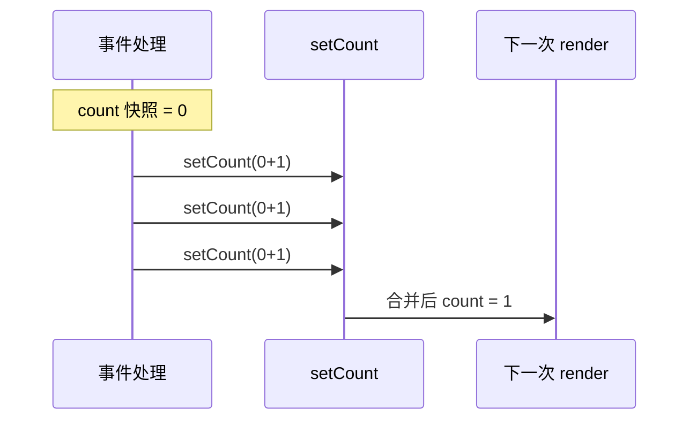
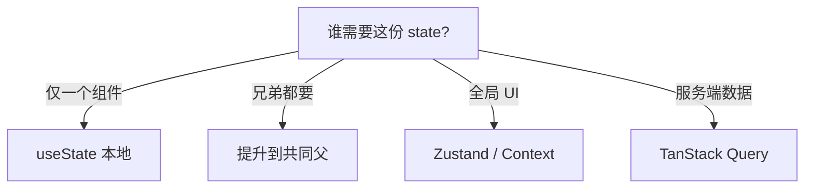

# State 基础与更新语义

> **State** 是组件内「会随时间变化、且会影响 UI」的数据。理解 **state 是快照**、**更新是异步批处理**、**必须不可变更新**，能避免大量 React bug。

---

## 一、State vs Props

| | Props | State |
|---|-------|-------|
| 来源 | 父组件传入 | 组件自身 `useState` / `useReducer` |
| 可变？ | **只读** | 通过 `setState` 更新 |
| 谁拥有 | 父 | 当前组件 |

```tsx
function Counter() {
  const [count, setCount] = useState(0);
  return (
    <button onClick={() => setCount(count + 1)}>
      {count}
    </button>
  );
}
```

---

## 二、useState 基础

```tsx
const [state, setState] = useState(initialState);
```

| 部分 | 说明 |
|------|------|
| `state` | 当前渲染使用的值 |
| `setState` | 触发更新；可传新值或 **updater 函数** |
| `initialState` | 首次 render 用；可以是 `() => T` 惰性初始化 |

```tsx
// 惰性初始化：昂贵计算只执行一次
const [items] = useState(() => buildLargeList());
```

---

## 三、State 是快照（Snapshot）

**每次 render 里的 `count` 是「那一次渲染」的快照**，不会在你调用 `setCount` 后立刻变。

```tsx
function Counter() {
  const [count, setCount] = useState(0);

  function handleClick() {
    setCount(count + 1);
    setCount(count + 1);
    setCount(count + 1);
    // 三次都是 setCount(0 + 1) → 最终 count 为 1，不是 3
  }

  return <button onClick={handleClick}>{count}</button>;
}
```



### 3.1 函数式更新

```tsx
setCount(c => c + 1);
setCount(c => c + 1);
setCount(c => c + 1);
// 最终 +3 ✅
```

| 场景 | 用法 |
|------|------|
| 新值不依赖旧 state | `setCount(5)` |
| 依赖旧 state | `setCount(c => c + 1)` |
| 快速连续点击 | 函数式更新 |

---

## 四、对象与数组的不可变更新

State 应视为**不可变**：不直接改原对象/数组，而是**新建**副本。

```tsx
// ❌ 突变
user.name = 'x';
setUser(user);

// ✅ 新对象
setUser(prev => ({ ...prev, name: 'x' }));
```

### 4.1 数组

| 操作 | 写法 |
|------|------|
| 追加 | `[...arr, item]` |
| 删除 | `arr.filter(x => x.id !== id)` |
| 更新一项 | `arr.map(x => x.id === id ? { ...x, ...patch } : x)` |
| 插入 | `[...arr.slice(0, i), item, ...arr.slice(i)]` |

```tsx
setTodos(prev =>
  prev.map(t => (t.id === id ? { ...t, done: !t.done } : t)),
);
```

### 4.2 嵌套对象

```tsx
setForm(prev => ({
  ...prev,
  address: {
    ...prev.address,
    city: 'Shanghai',
  },
}));
```

嵌套过深时考虑 **useReducer** 或 **Immer**（`useImmer`）。

---

## 五、批处理（Batching）

React 18 **自动批处理**：同一事件或 effect 内多次 setState，通常**只触发一次 re-render**。

```tsx
function handleClick() {
  setA(a => a + 1);
  setB(b => b + 1);
  // 一般只 render 一次
}
```

| 场景 | React 18 |
|------|----------|
| 事件处理器内 | 批处理 ✅ |
| setTimeout / Promise 内 | 批处理 ✅ |
| 需要立刻读 DOM | `flushSync(() => setState(...))` |

见 [05-批处理](../06-渲染与调和/05-批处理与自动批处理.md)。

---

## 六、派生 state：能算就别存

```tsx
// ❌ 冗余
const [items, setItems] = useState<Item[]>([]);
const [filtered, setFiltered] = useState<Item[]>([]);

// ✅ 渲染时派生
const [items, setItems] = useState<Item[]>([]);
const [keyword, setKeyword] = useState('');
const filtered = items.filter(i => i.name.includes(keyword));
```

| 存 state | 不存，派生 |
|----------|-----------|
| 用户输入 | 由 A+B 算出的展示值 |
| 服务端原始数据 + 本地筛选词 | 筛选结果列表（filter） |
| 需要「撤销」的草稿 | 仅展示用的 fullName |

**例外**：派生计算**极昂贵** → `useMemo`；或需要缓存给子组件优化。

---

## 七、Props → State 同步陷阱

```tsx
// ❌ props 变但 state 不更新
function Bad({ userId }: { userId: string }) {
  const [user, setUser] = useState(fetchUser(userId));
  ...
}

// ✅ key 重置 或 effect 同步
function Good({ userId }: { userId: string }) {
  const [user, setUser] = useState<User | null>(null);
  useEffect(() => {
    fetchUser(userId).then(setUser);
  }, [userId]);
  ...
}

// ✅ 或整棵子树 remount
<UserPanel key={userId} userId={userId} />
```

---

## 八、State 放置位置



| 原则 | 说明 |
|------|------|
| **Colocation** | state 尽量靠近使用处 |
| 不必全局 | 对话框开闭放本地即可 |
| URL 可分享 | 页码、筛选放 searchParams |

见 [08-状态管理](../08-状态管理/01-状态分类与放置原则.md)。

---

## 九、多个 state 还是单个对象？

```tsx
// 分散：更新互不影响，少误合并
const [name, setName] = useState('');
const [age, setAge] = useState(0);

// 对象：字段总是一起变、一起提交
const [form, setForm] = useState({ name: '', age: 0 });
```

| 选分散 | 选对象 |
|--------|--------|
| 独立字段频繁单独更新 | 表单一次 set 多字段 |
| 避免 `{ ...form, x }` 遗漏 | 与 useReducer 配合 |

---

## 十、useReducer 预览

复杂 state 转移用 **useReducer**：

```tsx
type Action = { type: 'inc' } | { type: 'dec' } | { type: 'reset' };

function reducer(state: number, action: Action): number {
  switch (action.type) {
    case 'inc': return state + 1;
    case 'dec': return state - 1;
    case 'reset': return 0;
    default: return state;
  }
}

const [count, dispatch] = useReducer(reducer, 0);
```

详见 [05-useState与useReducer](../05-Hooks体系/01-useState与useReducer.md)。

---

## 十一、调试技巧

| 手段 | 作用 |
|------|------|
| React DevTools | 看 props/state、Profiler |
| `console.log` 在 render | 看渲染次数（开发） |
| 为什么 render 两次 | 开发 StrictMode |

---

## 十二、小结

| 要点 | 记忆 |
|------|------|
| state 快照 | 事件里连续 set 用函数式 |
| 不可变 | 对象/数组 spread 或 map/filter |
| 能算不存 | 派生数据不要重复 state |
| 放哪 | 本地 → 提升 → Context/Query |

**上一篇**：[03-Children与组合模式](./03-Children与组合模式.md)  
**下一篇**：[05-受控与非受控组件](./05-受控与非受控组件.md)
