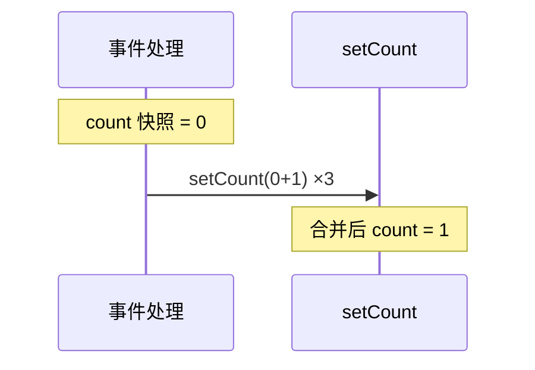
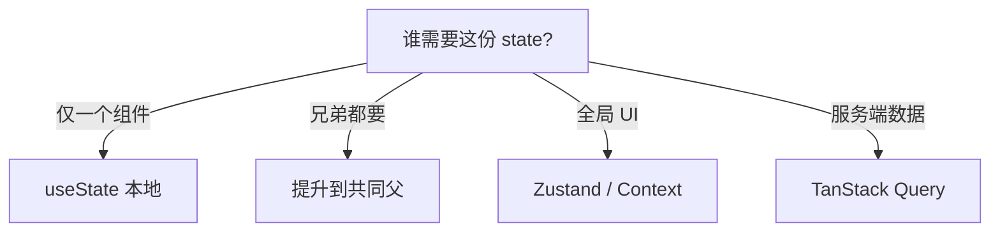

# State 基础与更新语义

State 是组件**自己拥有、会驱动 UI 变化**的数据；props 是只读入参。搞懂 state 是**快照**、更新要**不可变**、以及**放哪一层**，能避开大半「点了没反应」「数据不同步」类 bug。

---

## State vs Props

| | Props | State |
|---|-------|-------|
| 来源 | 父组件传入 | `useState` / `useReducer` |
| 可变？ | **只读** | 通过 `setState` 更新 |
| 谁拥有 | 父 | 当前组件 |

```tsx
function Counter() {
  const [count, setCount] = useState(0);
  return (
    <button onClick={() => setCount(count + 1)}>{count}</button>
  );
}
```

---

## useState：惰性初始化与函数式更新

```tsx
const [state, setState] = useState(initialState);
const [items] = useState(() => buildLargeList()); // 昂贵计算只算一次
```

**State 是快照**，事件处理里的 `count` 是「那一次渲染」的值，`setCount` 后不会立刻变：

```tsx
function handleClick() {
  setCount(count + 1);
  setCount(count + 1);
  setCount(count + 1);
  // 三次都是 setCount(0+1) → 最终为 1，不是 3
}
```



**函数式更新**，依赖最新 state 时用：

```tsx
setCount(c => c + 1);
setCount(c => c + 1);
setCount(c => c + 1);
// 最终 +3 ✅
```

| 场景 | 用法 |
|------|------|
| 新值不依赖旧 state | `setCount(5)` |
| 依赖旧 state / 连续点击 | `setCount(c => c + 1)` |

---

## 不可变更新

```tsx
// ❌ 突变
user.name = 'x';
setUser(user);

// ✅ 新对象
setUser(prev => ({ ...prev, name: 'x' }));
```

| 数组操作 | 写法 |
|----------|------|
| 追加 | `[...arr, item]` |
| 删除 | `arr.filter(x => x.id !== id)` |
| 更新一项 | `arr.map(x => x.id === id ? { ...x, ...patch } : x)` |

嵌套过深考虑 **useReducer** 或 Immer。

---

## 批处理与派生 state

React 18 **自动批处理**：同一事件或 effect 内多次 setState，通常只 re-render 一次（含 `setTimeout`/Promise 内）。

```tsx
// ❌ 冗余派生 state
const [items, setItems] = useState<Item[]>([]);
const [filtered, setFiltered] = useState<Item[]>([]);

// ✅ 渲染时派生
const filtered = items.filter(i => i.name.includes(keyword));
```

能算出来的别塞进 state；极昂贵再用 `useMemo`。

---

## Props → State 陷阱

```tsx
// ❌ userId 变但 user 不更新
function Bad({ userId }: { userId: string }) {
  const [user, setUser] = useState(fetchUser(userId));
}

// ✅ effect 同步 或 key 重置
useEffect(() => {
  fetchUser(userId).then(setUser);
}, [userId]);

<UserPanel key={userId} userId={userId} />
```

---

## State 放置与结构



| 原则 | 说明 |
|------|------|
| **Colocation** | state 尽量靠近使用处 |
| URL 可分享 | 页码、筛选放 searchParams |

**分散 vs 对象**：

| 选分散 | 选对象 |
|--------|--------|
| 独立字段频繁单独更新 | 表单一次 set 多字段 |
| 避免 `{ ...form, x }` 遗漏 | 配合 useReducer |

复杂转移预览 **useReducer**（纯函数 reducer，副作用仍在 effect）。

---

## 小结

**快照**：事件里连续 set 用**函数式更新**；set 后读到的仍是当前 render 的旧值。

**不可变**：对象/数组用 spread、map/filter；禁止原地 mutate。

**派生**：能算不存；与源 state 不同步是常见 stale UI 原因。

**放置**：本地 → 提升 → Context/Query/状态库；对话框开闭不必全局。

**Props→State**：勿用 props 初始化后放任不同步；用 effect、`key` 或受控。

**批处理**：18 自动批；要立刻读 DOM 用 `flushSync`（少用）。

**易混点**：三次 `setCount(count+1)` 只 +1；复制 props 到 state 会 stale。

常见错因：这份 state 谁拥有？更新是否 mutate？是否该派生而非再存一份？
