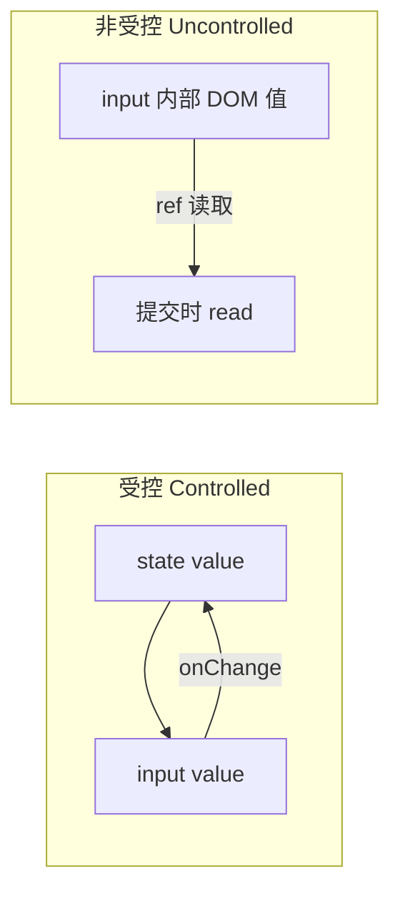
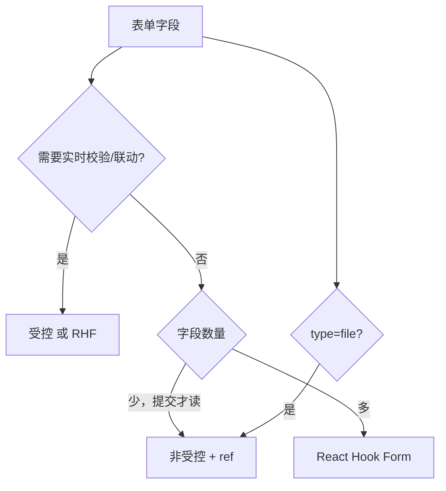

# 受控与非受控组件

> 表单元素（input、select、textarea）的值谁说了算？**受控**：React state 是唯一数据源；**非受控**：DOM 自己存，用 ref 读取。两种模型都要会，并知道何时选哪种。

---

## 一、核心对比



| | 受控 | 非受控 |
|---|------|--------|
| 值存在哪 | React state | DOM |
| 更新方式 | `onChange` + `setState` | 用户输入直接进 DOM |
| 读值 | `value` state | `ref.current.value` |
| 校验/联动 | 容易 | 需额外同步 |
| React 推荐 | **默认首选** | 简单场景、文件 input |

---

## 二、受控 input

```tsx
function NameField() {
  const [name, setName] = useState('');

  return (
    <input
      value={name}
      onChange={e => setName(e.target.value)}
      placeholder="姓名"
    />
  );
}
```

| 要点 | 说明 |
|------|------|
| `value` + `onChange` 成对 | 缺一会变「半受控」警告 |
| `value={name}` 不能是 `undefined` | 用 `''` 初始化，避免非受控→受控切换 |

### 2.1 常见错误

```tsx
// ❌ 只有 value 没有 onChange → 只读
<input value={name} />

// ❌ undefined 初始 → 警告
const [name, setName] = useState<string | undefined>();
<input value={name} onChange={...} />

// ✅
const [name, setName] = useState('');
<input value={name ?? ''} onChange={e => setName(e.target.value)} />
```

---

## 三、受控 textarea / select

```tsx
const [bio, setBio] = useState('');
<textarea value={bio} onChange={e => setBio(e.target.value)} />

const [city, setCity] = useState('sh');
<select value={city} onChange={e => setCity(e.target.value)}>
  <option value="sh">上海</option>
  <option value="bj">北京</option>
</select>
```

HTML 里 textarea 用 children 放初值；React 受控用 **value**。

---

## 四、checkbox / radio

### 4.1 单个 checkbox（boolean）

```tsx
const [agree, setAgree] = useState(false);

<input
  type="checkbox"
  checked={agree}
  onChange={e => setAgree(e.target.checked)}
/>
```

用 **`checked`**，不是 `value`。

### 4.2 多个 checkbox（数组）

```tsx
const [tags, setTags] = useState<string[]>([]);

function toggle(tag: string) {
  setTags(prev =>
    prev.includes(tag) ? prev.filter(t => t !== tag) : [...prev, tag],
  );
}

<label>
  <input
    type="checkbox"
    checked={tags.includes('react')}
    onChange={() => toggle('react')}
  />
  React
</label>
```

### 4.3 radio 组

```tsx
const [gender, setGender] = useState('m');

<label>
  <input type="radio" value="m" checked={gender === 'm'} onChange={e => setGender(e.target.value)} />
  男
</label>
<label>
  <input type="radio" value="f" checked={gender === 'f'} onChange={e => setGender(e.target.value)} />
  女
</label>
```

---

## 五、非受控组件

```tsx
function LoginForm() {
  const emailRef = useRef<HTMLInputElement>(null);
  const pwdRef = useRef<HTMLInputElement>(null);

  function handleSubmit(e: React.FormEvent) {
    e.preventDefault();
    const email = emailRef.current?.value ?? '';
    const password = pwdRef.current?.value ?? '';
    login({ email, password });
  }

  return (
    <form onSubmit={handleSubmit}>
      <input ref={emailRef} type="email" defaultValue="" />
      <input ref={pwdRef} type="password" />
      <button type="submit">登录</button>
    </form>
  );
}
```

| API | 作用 |
|-----|------|
| `ref` | 拿到 DOM 节点 |
| `defaultValue` / `defaultChecked` | 仅初始值，之后 DOM 自持 |

### 5.1 适用场景

| 场景 | 原因 |
|------|------|
| 简单登录框、一次性提交 | 少 state |
| 与非 React 库集成 | 库直接写 DOM |
| `type="file"` | 几乎总是非受控 |

```tsx
const fileRef = useRef<HTMLInputElement>(null);
<input ref={fileRef} type="file" accept="image/*" />
// fileRef.current.files
```

---

## 六、混合模式（不推荐）

同一 input 既 `value` 又 `defaultValue`，或 value 与 DOM 不同步 → 难维护。团队内选一种为主。

---

## 七、受控表单对象 state

```tsx
interface FormState {
  name: string;
  email: string;
}

function ProfileForm() {
  const [form, setForm] = useState<FormState>({ name: '', email: '' });

  function update(field: keyof FormState, value: string) {
    setForm(prev => ({ ...prev, [field]: value }));
  }

  return (
    <>
      <input value={form.name} onChange={e => update('name', e.target.value)} />
      <input value={form.email} onChange={e => update('email', e.target.value)} />
    </>
  );
}
```

字段多时改用 **React Hook Form**，见 [04-事件与表单 · RHF](../04-事件与表单/03-React-Hook-Form与Schema校验.md)。

---

## 八、选型决策



---

## 九、与 DOM 默认值

| HTML | React 受控 | React 非受控 |
|------|------------|--------------|
| `value="a"` | `value={state}` | `defaultValue="a"` |
| 选中 option | `value={state}` | `defaultValue` on select |

---

## 十、小结

| 要点 | 记忆 |
|------|------|
| 受控 | value/checked + onChange，state 为唯一真相 |
| 非受控 | ref + defaultValue，提交时读 |
| checkbox | `checked` + `e.target.checked` |
| file | ref 读 files |
| 复杂表单 | RHF + zod |

**上一篇**：[04-State基础与更新语义](./04-State基础与更新语义.md)  
**下一模块**：[04-事件与表单 · 合成事件](../04-事件与表单/01-合成事件与事件处理.md)
