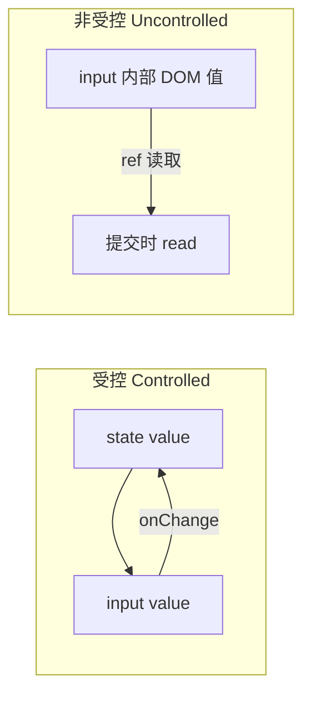
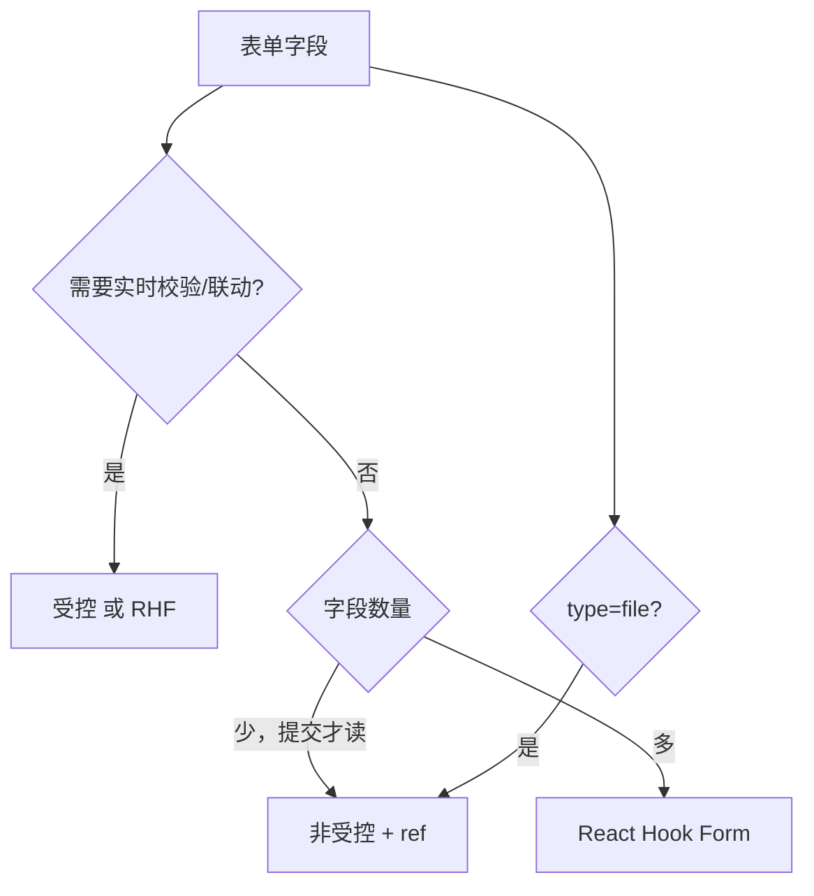

# 受控与非受控组件

表单控件的值可以存在 **React state**（受控）或 **DOM 自身**（非受控）。React 默认推荐受控，单一真相源、校验联动容易；非受控适合极简提交、`type="file"` 等场景。

---

## 核心对比



| | 受控 | 非受控 |
|---|------|--------|
| 值存在哪 | React state | DOM |
| 更新方式 | `onChange` + `setState` | 用户输入直接进 DOM |
| 读值 | `value` state | `ref.current.value` |
| 校验/联动 | 容易 | 需额外同步 |
| React 推荐 | **默认首选** | 简单场景、file input |

---

## 受控 input 与常见错误

```tsx
function NameField() {
  const [name, setName] = useState('');
  return (
    <input
      value={name}
      onChange={e => setName(e.target.value)}
      placeholder="姓名"
    />
  );
}
```

| 要点 | 说明 |
|------|------|
| `value` + `onChange` 成对 | 缺一会变「半受控」警告 |
| `value` 不能是 `undefined` | 用 `''` 初始化 |

```tsx
// ❌ 只有 value 没有 onChange → 只读
<input value={name} />

// ❌ undefined 初始 → 非受控→受控切换警告
const [name, setName] = useState<string | undefined>();

// ✅
const [name, setName] = useState('');
<input value={name ?? ''} onChange={e => setName(e.target.value)} />
```

**textarea / select** 受控用 `value`（HTML textarea 用 children 放初值，React 受控用 value）：

```tsx
<textarea value={bio} onChange={e => setBio(e.target.value)} />
<select value={city} onChange={e => setCity(e.target.value)}>...</select>
```

**checkbox** 用 **`checked`**，不是 `value`：

```tsx
<input type="checkbox" checked={agree}
  onChange={e => setAgree(e.target.checked)} />
```

多选 checkbox 用数组 + `includes` / `toggle`。

**radio 组**：同一 `name`，`checked={gender === 'm'}`，`onChange` 更新 state。

---

## 非受控：ref + defaultValue

```tsx
function LoginForm() {
  const emailRef = useRef<HTMLInputElement>(null);
  const pwdRef = useRef<HTMLInputElement>(null);

  function handleSubmit(e: React.FormEvent) {
    e.preventDefault();
    const email = emailRef.current?.value ?? '';
    const password = pwdRef.current?.value ?? '';
    login({ email, password });
  }

  return (
    <form onSubmit={handleSubmit}>
      <input ref={emailRef} type="email" defaultValue="" />
      <input ref={pwdRef} type="password" />
      <button type="submit">登录</button>
    </form>
  );
}
```

| 场景 | 原因 |
|------|------|
| 简单登录、一次性提交 | 少 state |
| 与非 React 库集成 | 库直接写 DOM |
| `type="file"` | 几乎总是非受控 |

```tsx
const fileRef = useRef<HTMLInputElement>(null);
<input ref={fileRef} type="file" accept="image/*" />
```

---

## 混合模式与多字段受控

同一 input 既 `value` 又 `defaultValue` → 难维护。团队内选一种为主。

多字段可用单对象 state：

```tsx
const [form, setForm] = useState({ name: '', email: '' });

function update(field: keyof typeof form, value: string) {
  setForm(prev => ({ ...prev, [field]: value }));
}
```

字段多时改用 **React Hook Form + zod**。

---

## 选型



| HTML | React 受控 | React 非受控 |
|------|------------|--------------|
| `value="a"` | `value={state}` | `defaultValue="a"` |
| 选中 option | `value={state}` | `defaultValue` on select |

---

## 小结

**受控**：`value`/`checked` + `onChange`，React state 为唯一真相源；初始用 `''` 勿 `undefined`。

**非受控**：`defaultValue`/`defaultChecked` + **ref**；file 输入几乎总是非受控。

**checkbox**：用 `checked` + `e.target.checked`；radio 用 `checked` 比较当前值。

**勿混用** value 与 defaultValue；多字段少用手写十几个 useState，复杂表单用 RHF。

**易混点**：半受控警告；textarea 受控用 value 非 children；受控切换非受控会报警。

常见错因：value 和 onChange 是否成对？checkbox 是否误用 value？
