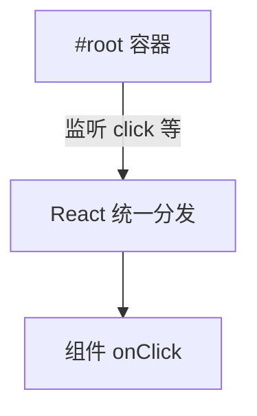

# 合成事件与事件处理

React 里事件名驼峰、传函数而非字符串，底层用 **SyntheticEvent** 统一浏览器差异，并在 root 上做委托。搞清绑定方式、类型和与原生 listener 的分工，表单和交互才不容易踩坑。

---

## 绑定事件

```tsx
function Button() {
  function handleClick(e: React.MouseEvent<HTMLButtonElement>) {
    console.log('clicked', e.currentTarget);
  }

  return (
    <button type="button" onClick={handleClick}>点击</button>
  );
}
```

| 对比 HTML | React JSX |
|-----------|-----------|
| `onclick` | `onClick`（驼峰） |
| 字符串 | **函数** |
| — | 非提交按钮常用 `type="button"` |

常见事件：`onClick`、`onChange`、`onSubmit`、`onKeyDown`、`onFocus`、`onBlur` 等。

---

## SyntheticEvent 与委托

```tsx
function handleChange(e: React.ChangeEvent<HTMLInputElement>) {
  const value = e.target.value;
}
```

| 特点 | 说明 |
|------|------|
| 跨浏览器包装 | `target`、`currentTarget` 等与原生类似 |
| React 17+ | **已移除事件池化**，异步访问不必 `persist()` |
| `nativeEvent` | 访问底层 DOM 事件 |

**target vs currentTarget**：

| | 含义 |
|---|------|
| `e.target` | 实际触发事件的元素 |
| `e.currentTarget` | 绑定处理函数的 DOM 节点 |

React 17+ 监听器挂在 **root 容器**上，而非 `document`：



混用原生 `addEventListener` 时注意与合成层的顺序差异。

---

## TypeScript 事件类型

```tsx
React.MouseEvent<HTMLButtonElement>
React.ChangeEvent<HTMLInputElement>
React.FormEvent<HTMLFormElement>
React.KeyboardEvent<HTMLInputElement>
```

泛型参数对应绑定元素类型。

---

## 传参、阻止默认与表单

```tsx
// ✅ 箭头函数包一层
<button onClick={() => deleteItem(id)}>删</button>

// ❌ 立即执行
<button onClick={deleteItem(id)}>删</button>
```

```tsx
function onSubmit(e: React.FormEvent) {
  e.preventDefault(); // 阻止页面刷新
  submitData();
}
```

| 方法 | 作用 |
|------|------|
| `preventDefault()` | 阻止默认行为（链接跳转、表单提交） |
| `stopPropagation()` | 阻止冒泡到外层 React 处理器 |

**onChange vs onInput**：受控 input 用 **`onChange`** 即可（React 对表单控件已统一语义）。

---

## 键盘与无障碍

```tsx
<div
  role="button"
  tabIndex={0}
  onClick={onSelect}
  onKeyDown={e => {
    if (e.key === 'Enter' || e.key === ' ') {
      e.preventDefault();
      onSelect();
    }
  }}
/>
```

优先用原生 `<button>`，少 `div` + `role`。

---

## 原生 addEventListener 与性能

```tsx
useEffect(() => {
  function onWindowResize() { ... }
  window.addEventListener('resize', onWindowResize);
  return () => window.removeEventListener('resize', onWindowResize);
}, []);
```

| 用 React `onXxx` | 用原生 listener |
|------------------|-----------------|
| 组件树内 UI 交互 | window/document、第三方非 React DOM |
| 与生命周期对齐 | 须在 effect 里 **cleanup** |

**不要**在 render 里 `addEventListener`（泄漏 + 重复绑定）。

`touchstart`/`wheel`/`scroll` 等默认 passive，`preventDefault` 可能无效；滚动锁定需查库或 `{ passive: false }`。

高频 `mousemove` 考虑节流；闭包拿不到最新 state 时用**函数式 setState** 或 ref。

---

## 常见问题

| 现象 | 原因 |
|------|------|
| 点击无反应 | `disabled`、pointer-events、被遮挡 |
| 双击触发两次 | 未 debounce 提交按钮 |
| 合成事件里 state 是旧的 | 闭包快照 |

---

## 小结

React 事件：**驼峰** + `onClick={fn}`；类型用 `React.XEvent<HTMLElement>`。

**SyntheticEvent** 统一差异；委托挂在 **root**；理解 target vs currentTarget。

**表单**：`onSubmit` + `preventDefault`；非 React DOM 在 effect 里 addListener + cleanup。

**传参**：`onClick={() => fn(id)}`，勿 `onClick={fn(id)}`。

**易混点**：17+ 无事件池化；React 事件与 document 原生监听顺序；passive 导致 preventDefault 无效。

常见错因：handler 是否误写成立即调用？state 旧值是否闭包问题？
