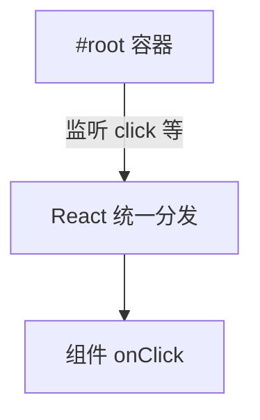

# 合成事件与事件处理

> React 在原生 DOM 事件之上包装了**合成事件（SyntheticEvent）**，统一浏览器差异，并配合**事件委托**提升性能。写交互逻辑前，要分清「React 事件」与「原生事件」的边界。

---

## 一、在 React 里绑定事件

```tsx
function Button() {
  function handleClick(e: React.MouseEvent<HTMLButtonElement>) {
    console.log('clicked', e.currentTarget);
  }

  return (
    <button type="button" onClick={handleClick}>
      点我
    </button>
  );
}
```

| 对比 HTML | React JSX |
|-----------|-----------|
| `onclick` | `onClick`（驼峰） |
| 字符串 | **函数** |
| — | 常用 `type="button"` 防表单误提交 |

### 1.1 常见事件名

| 类别 | React 属性 |
|------|------------|
| 鼠标 | `onClick`、`onDoubleClick`、`onMouseEnter`、`onMouseLeave` |
| 键盘 | `onKeyDown`、`onKeyUp`（表单用 `onKeyDown` 拦 Enter） |
| 表单 | `onChange`、`onInput`、`onSubmit`、`onFocus`、`onBlur` |
| 剪贴板 | `onCopy`、`onPaste` |
| 滚动 | `onScroll`（注意 passive，见下） |

---

## 二、SyntheticEvent

```tsx
function handleChange(e: React.ChangeEvent<HTMLInputElement>) {
  const value = e.target.value;
  const name = e.target.name;
}
```

| 特点 | 说明 |
|------|------|
| 跨浏览器包装 | `target`、`currentTarget` 等与原生类似 |
| **池化（旧行为）** | React 17 前异步访问需 `e.persist()`；**17+ 已移除池化** |
| `nativeEvent` | 访问底层 DOM 事件 |

### 2.1 target vs currentTarget

| | 含义 |
|---|------|
| `e.target` | 实际触发事件的元素（可能是最内层子节点） |
| `e.currentTarget` | 绑定处理函数的 DOM 节点（委托时常为绑定元素） |

```tsx
<div onClick={e => console.log(e.target, e.currentTarget)}>
  <button>子按钮</button>
</div>
// 点按钮：target=button, currentTarget=div
```

---

## 三、事件委托机制

React 17+：事件监听器挂在 **root 容器**上，而非 `document`。



| 好处 | 说明 |
|------|------|
| 少绑监听器 | 大量节点不各自 addListener |
| 与 React 更新协调 | 合成事件与批处理配合 |

**注意**：React 事件经过合成层；**原生** `addEventListener` 在 document 上可能**先于或后于** React 处理，混用时注意顺序。

---

## 四、TypeScript 事件类型

```tsx
// 按元素选类型
React.MouseEvent<HTMLButtonElement>
React.ChangeEvent<HTMLInputElement>
React.FormEvent<HTMLFormElement>
React.KeyboardEvent<HTMLInputElement>
```

| 泛型参数 | 绑定元素类型 |
|----------|--------------|
| `HTMLButtonElement` | button |
| `HTMLInputElement` | input |
| `HTMLDivElement` | div |

```tsx
function Input(props: React.ComponentProps<'input'>) {
  const handleChange: React.ChangeEventHandler<HTMLInputElement> = (e) => {
    props.onChange?.(e);
  };
  return <input {...props} onChange={handleChange} />;
}
```

---

## 五、传参方式

```tsx
// ✅ 箭头函数包一层
<button onClick={() => deleteItem(id)}>删</button>

// ✅ bind（少见）
<button onClick={deleteItem.bind(null, id)}>删</button>

// ❌ 立即执行
<button onClick={deleteItem(id)}>删</button>
```

### 5.1 列表项事件

```tsx
{items.map(item => (
  <button key={item.id} type="button" onClick={() => select(item.id)}>
    {item.name}
  </button>
))}
```

每个项需要自己的 id；避免在循环里用错误闭包（见 state 快照篇）。

---

## 六、阻止默认与停止传播

```tsx
function Link() {
  function handleClick(e: React.MouseEvent) {
    e.preventDefault();   // 等同原生
    e.stopPropagation();  // 阻止冒泡到父 React 监听
    // 原生：e.nativeEvent.stopImmediatePropagation()
  }

  return <a href="/old" onClick={handleClick}>跳转</a>;
}
```

| 方法 | 作用 |
|------|------|
| `preventDefault()` | 阻止默认行为（链接跳转、表单提交） |
| `stopPropagation()` | 阻止冒泡到外层 React 处理器 |

表单提交：

```tsx
function onSubmit(e: React.FormEvent) {
  e.preventDefault(); // 阻止页面刷新
  submitData();
}
```

---

## 七、onChange vs onInput

| | `onChange` | `onInput` |
|---|------------|-----------|
| React 推荐 | **表单受控默认** | 较少用 |
| 触发时机 | input/textarea/select 值变 | 每次输入（含粘贴） |

受控 input 用 `onChange` 即可。

---

## 八、键盘与无障碍

```tsx
function MenuItem({ onSelect }: { onSelect: () => void }) {
  return (
    <div
      role="button"
      tabIndex={0}
      onClick={onSelect}
      onKeyDown={e => {
        if (e.key === 'Enter' || e.key === ' ') {
          e.preventDefault();
          onSelect();
        }
      }}
    >
      选项
    </div>
  );
}
```

| 键 | 常见用途 |
|----|----------|
| `Enter` | 确认、提交 |
| `Escape` | 关闭弹层 |
| `ArrowUp/Down` | 列表导航 |

优先用原生 `<button>`，少 div+role。

---

## 九、passive 与 scroll

浏览器对 `touchstart`、`wheel`、`scroll` 等默认 **passive: true**，`preventDefault` 可能无效。

| 场景 | 做法 |
|------|------|
| 自定义滚动锁定 | 查库实现或原生 listener `{ passive: false }` |
| React `onScroll` | 一般只读位置，不 preventDefault |

---

## 十、React 事件 vs 原生 addEventListener

```tsx
useEffect(() => {
  function onWindowResize() { ... }
  window.addEventListener('resize', onWindowResize);
  return () => window.removeEventListener('resize', onWindowResize);
}, []);
```

| 用 React `onXxx` | 用原生 listener |
|------------------|-----------------|
| 组件树内 UI 交互 | window/document、第三方非 React DOM |
| 自动与组件生命周期对齐 | 须在 effect 里清理 |

**不要**在 render 里 `document.addEventListener`（泄漏 + 重复绑定）。

---

## 十一、性能注意

| 问题 | 缓解 |
|------|------|
| 大列表每项 onClick 新函数 | 可接受；优化时 memo + 稳定回调 |
| 高频 mousemove | 节流、requestAnimationFrame |
| 不必要 setState in mousemove | 拖动用 ref 或 CSS |

见 [09-防抖节流](../../../前端基础体系/03-JavaScript体系.md)（JS 篇）。

---

## 十二、常见问题

| 现象 | 原因 |
|------|------|
| 点击无反应 | `disabled`、pointer-events、被遮挡 |
| 双击触发两次 | 未 debounce 提交按钮 |
| 移动端 300ms 延迟 | 已少见；仍可用 `touch-action` |
| 合成事件里拿不到最新 state | 闭包快照 → 用函数式 setState 或 ref |

---

## 十三、小结

| 要点 | 记忆 |
|------|------|
| 驼峰 + 函数 | `onClick={fn}` |
| SyntheticEvent | 用 `React.XEvent<HTMLElement>` 类型 |
| 表单 | `onSubmit` + `preventDefault` |
| 委托 | 挂在 root，理解 target/currentTarget |
| 非 React DOM | effect + addEventListener + 清理 |

**下一篇**：[02-表单基础与受控表单](./02-表单基础与受控表单.md)
