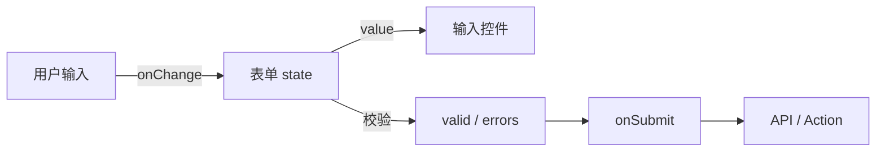

# 表单基础与受控表单

多字段表单宜走受控数据流：输入 → state → value 回显，提交前校验，错误按字段展示。字段少用手写 state；字段多、校验复杂时上 RHF + zod。

---

## 表单数据流



---

## 基础受控表单

```tsx
function LoginForm() {
  const [email, setEmail] = useState('');
  const [password, setPassword] = useState('');
  const [error, setError] = useState<string | null>(null);
  const [loading, setLoading] = useState(false);

  async function handleSubmit(e: React.FormEvent<HTMLFormElement>) {
    e.preventDefault();
    setError(null);
    if (!email.includes('@')) {
      setError('邮箱格式不正确');
      return;
    }
    setLoading(true);
    try {
      await login({ email, password });
    } catch (err) {
      setError(err instanceof Error ? err.message : '登录失败');
    } finally {
      setLoading(false);
    }
  }

  return (
    <form onSubmit={handleSubmit} noValidate>
      <label>
        邮箱
        <input type="email" name="email" value={email}
          onChange={e => setEmail(e.target.value)} autoComplete="email" />
      </label>
      <label>
        密码
        <input type="password" name="password" value={password}
          onChange={e => setPassword(e.target.value)} autoComplete="current-password" />
      </label>
      {error && <p role="alert">{error}</p>}
      <button type="submit" disabled={loading}>
        {loading ? '登录中…' : '登录'}
      </button>
    </form>
  );
}
```

`noValidate` 可关浏览器默认 UI 改用自定义校验；`disabled={loading}` 防重复提交。

---

## 单对象 state 管理多字段

```tsx
interface LoginForm {
  email: string;
  password: string;
}

const initial: LoginForm = { email: '', password: '' };

function setField<K extends keyof LoginForm>(key: K, value: LoginForm[K]) {
  setForm(prev => ({ ...prev, [key]: value }));
}
```

避免十几个独立 `useState` 难以维护。

---

## 校验时机

| 时机 | 体验 | 适用 |
|------|------|------|
| **提交时** | 少打扰 | 简单表单 |
| **失焦 blur** | 中等 | 字段级错误 |
| **输入时** | 即时 | 密码强度 |
| **混合** | 常见 | 严重错误提交时，其余 blur |

```tsx
function handleBlur(field: keyof LoginForm) {
  const next = validate(form);
  setErrors(prev => ({ ...prev, [field]: next[field] }));
}
```

---

## zod Schema 校验

```tsx
import { z } from 'zod';

const schema = z.object({
  email: z.string().email('邮箱格式错误'),
  password: z.string().min(8, '至少 8 位'),
});

const result = schema.safeParse(form);
if (!result.success) {
  // 映射 fieldErrors
  return;
}
login(result.data);
```

复杂表单推荐 **React Hook Form + zodResolver**。

---

## 字段级错误与 a11y

```tsx
<input
  aria-invalid={!!errors.email}
  aria-describedby={errors.email ? 'email-error' : undefined}
/>
{errors.email && (
  <span id="email-error" role="alert">{errors.email}</span>
)}
```

---

## 重置、多步骤与防重复

```tsx
setForm(initial);
setErrors({});
// 非受控：formRef.current?.reset()
```

多步骤向导：`step` + 累积 `data`，每步 `validateStep` 再 `setStep`。

```tsx
if (pending) return;
setPending(true);
try { await save(form); } finally { setPending(false); }
```

React 19 **Actions** 可进一步统一 pending 状态。

---

## 小结

多字段受控用**单对象 state** + `setField`；提交 `preventDefault` + **loading 锁**。

校验以**提交时全量**为主，blur 可选；错误按字段 + **`role="alert"`**、`aria-invalid`。

**zod**：`safeParse` 映射字段错误；中大型表单用 **RHF + zod**。

**多步骤**：单对象跨步或分步 state；可选 URL `?step=` 分享进度。

**易混点**：忘记 `preventDefault` 页面刷新；未防重复提交；props 回填未 reset 表单。

常见错因：错误是全局还是字段级？校验时机是否打扰过重？
