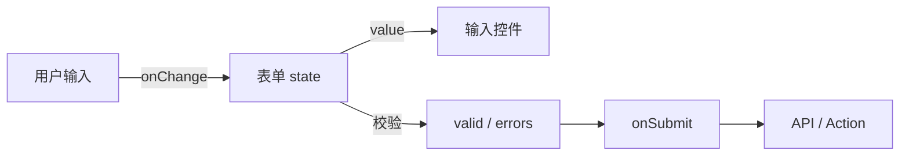
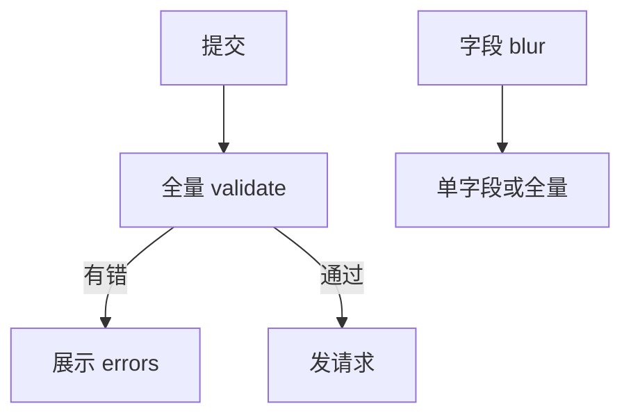

# 表单基础与受控表单

> 表单是前端高频场景：登录、搜索、配置、审批。本篇在 [受控组件](../03-组件基础/05-受控与非受控组件.md) 基础上，讲**整表设计**、校验时机、提交与错误展示。

---

## 一、表单数据流



| 阶段 | 职责 |
|------|------|
| 输入 | 受控更新 state |
| 校验 | 同步/异步规则 |
| 提交 | preventDefault + 请求 |
| 反馈 | 错误信息、loading、成功跳转 |

---

## 二、基础受控表单

```tsx
function LoginForm() {
  const [email, setEmail] = useState('');
  const [password, setPassword] = useState('');
  const [error, setError] = useState<string | null>(null);
  const [loading, setLoading] = useState(false);

  async function handleSubmit(e: React.FormEvent<HTMLFormElement>) {
    e.preventDefault();
    setError(null);
    if (!email.includes('@')) {
      setError('邮箱格式不正确');
      return;
    }
    setLoading(true);
    try {
      await login({ email, password });
    } catch (err) {
      setError(err instanceof Error ? err.message : '登录失败');
    } finally {
      setLoading(false);
    }
  }

  return (
    <form onSubmit={handleSubmit} noValidate>
      <label>
        邮箱
        <input
          type="email"
          name="email"
          value={email}
          onChange={e => setEmail(e.target.value)}
          autoComplete="email"
        />
      </label>
      <label>
        密码
        <input
          type="password"
          name="password"
          value={password}
          onChange={e => setPassword(e.target.value)}
          autoComplete="current-password"
        />
      </label>
      {error && <p role="alert">{error}</p>}
      <button type="submit" disabled={loading}>
        {loading ? '登录中…' : '登录'}
      </button>
    </form>
  );
}
```

| 属性 | 说明 |
|------|------|
| `noValidate` | 关闭浏览器默认校验 UI，用自定义（可选） |
| `autoComplete` | 密码管理器、浏览器填充 |
| `role="alert"` | 错误区无障碍 |
| `disabled={loading}` | 防重复提交 |

---

## 三、单对象 state 管理多字段

```tsx
interface LoginForm {
  email: string;
  password: string;
}

const initial: LoginForm = { email: '', password: '' };

function LoginForm() {
  const [form, setForm] = useState(initial);

  function setField<K extends keyof LoginForm>(key: K, value: LoginForm[K]) {
    setForm(prev => ({ ...prev, [key]: value }));
  }

  return (
    <form onSubmit={...}>
      <input
        value={form.email}
        onChange={e => setField('email', e.target.value)}
      />
      <input
        type="password"
        value={form.password}
        onChange={e => setField('password', e.target.value)}
      />
    </form>
  );
}
```

---

## 四、校验时机

| 时机 | 体验 | 适用 |
|------|------|------|
| **提交时** | 少打扰 | 简单表单 |
| **失焦 blur** | 中等 | 字段级错误 |
| **输入时** | 即时 | 密码强度、用户名占用 |
| **混合** | 常见 | 严重错误提交时，其余 blur |

```tsx
const [errors, setErrors] = useState<Partial<Record<keyof LoginForm, string>>>({});

function validate(values: LoginForm) {
  const next: typeof errors = {};
  if (!values.email) next.email = '必填';
  if (values.password.length < 8) next.password = '至少 8 位';
  return next;
}

function handleBlur(field: keyof LoginForm) {
  const next = validate(form);
  setErrors(prev => ({ ...prev, [field]: next[field] }));
}
```



---

## 五、与 Schema 校验（zod）结合

```tsx
import { z } from 'zod';

const schema = z.object({
  email: z.string().email('邮箱格式错误'),
  password: z.string().min(8, '至少 8 位'),
});

function handleSubmit(e: React.FormEvent) {
  e.preventDefault();
  const result = schema.safeParse(form);
  if (!result.success) {
    const fieldErrors: Record<string, string> = {};
    result.error.issues.forEach(issue => {
      const key = issue.path[0] as string;
      fieldErrors[key] = issue.message;
    });
    setErrors(fieldErrors);
    return;
  }
  login(result.data);
}
```

复杂表单推荐 **React Hook Form + zod**，见下一篇。

---

## 六、字段级错误展示

```tsx
function Field({
  label,
  error,
  children,
}: {
  label: string;
  error?: string;
  children: React.ReactNode;
}) {
  return (
    <div className="field">
      <label>{label}</label>
      {children}
      {error && (
        <span className="error" role="alert" id={`${label}-error`}>
          {error}
        </span>
      )}
    </div>
  );
}

<Field label="邮箱" error={errors.email}>
  <input
    aria-invalid={!!errors.email}
    aria-describedby={errors.email ? '邮箱-error' : undefined}
    ...
  />
</Field>
```

| a11y | 属性 |
|------|------|
| 标为无效 | `aria-invalid` |
| 关联错误文案 | `aria-describedby` |

---

## 七、重置表单

```tsx
// 受控：重置 state
setForm(initial);
setErrors({});

// 非受控：form ref
formRef.current?.reset();
```

提交成功后常 `setForm(initial)` 或 `navigate` 离开。

---

## 八、多步骤表单（向导）

```tsx
const [step, setStep] = useState(0);
const [data, setData] = useState<WizardData>({ ... });

function next() {
  const errs = validateStep(step, data);
  if (Object.keys(errs).length) { setErrors(errs); return; }
  setStep(s => s + 1);
}
```

| 模式 | state |
|------|-------|
| 单对象累积 | `data` 跨步共享 |
| 每步独立 | 最后一步合并提交 |

URL 带 `?step=2` 可分享进度（可选）。

---

## 九、原生 constraint 与 React

```tsx
<input required minLength={8} pattern="..." />
```

| 方式 | 说明 |
|------|------|
| 仅 HTML5 | `reportValidity()`，样式难统一 |
| 仅 JS/zod | 完全可控，推荐中后台 |
| 混合 | `required` + zod 双保险 |

---

## 十、防重复提交

```tsx
const [pending, setPending] = useState(false);

async function onSubmit(e: React.FormEvent) {
  e.preventDefault();
  if (pending) return;
  setPending(true);
  try {
    await save(form);
  } finally {
    setPending(false);
  }
}
```

React 19 **Actions** 可进一步统一 pending，见 [18-React19](../18-React19与新特性/)。

---

## 十一、小结

| 要点 | 实践 |
|------|------|
| 受控 + 单对象 | 多字段 `setField` |
| 校验 | 提交全量 + blur 可选 |
| 错误 | 字段级 + `role="alert"` |
| 复杂 | RHF + zod |
| 提交 | preventDefault + loading + 防重复 |

**上一篇**：[01-合成事件与事件处理](./01-合成事件与事件处理.md)  
**下一篇**：[03-React-Hook-Form与Schema校验](./03-React-Hook-Form与Schema校验.md)
