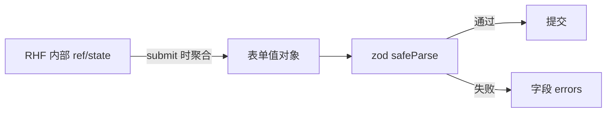

# React Hook Form 与 Schema 校验

字段一多，手写受控 state 和校验会又慢又易 re-render。RHF 以**非受控注册**为主，提交时聚合值；**zod** 做 Schema 与类型推断，是中后台表单的默认组合。

---

## 为什么需要 RHF

| 手写受控 | RHF |
|----------|-----|
| 每字段 state + onChange | `register` 绑定 |
| 字段多 → 大量 re-render | **非受控为主**，性能更好 |
| 校验分散 | `resolver` 统一 |
| 动态列表繁琐 | `useFieldArray` |



---

## 最小示例

```bash
pnpm add react-hook-form zod @hookform/resolvers
```

```tsx
import { useForm } from 'react-hook-form';
import { z } from 'zod';
import { zodResolver } from '@hookform/resolvers/zod';

const schema = z.object({
  email: z.string().email('邮箱格式不正确'),
  password: z.string().min(8, '至少 8 位'),
});

type FormValues = z.infer<typeof schema>;

function LoginForm() {
  const {
    register,
    handleSubmit,
    formState: { errors, isSubmitting },
  } = useForm<FormValues>({
    resolver: zodResolver(schema),
    defaultValues: { email: '', password: '' },
  });

  async function onSubmit(data: FormValues) {
    await login(data);
  }

  return (
    <form onSubmit={handleSubmit(onSubmit)} noValidate>
      <input {...register('email')} type="email" />
      {errors.email && <span role="alert">{errors.email.message}</span>}

      <input {...register('password')} type="password" />
      {errors.password && <span role="alert">{errors.password.message}</span>}

      <button type="submit" disabled={isSubmitting}>登录</button>
    </form>
  );
}
```

| API | 作用 |
|-----|------|
| `register('name')` | 绑定 name、ref、onChange、onBlur |
| `handleSubmit(onValid)` | 校验通过后调用 |
| `formState.errors` | 字段级错误 |
| `isSubmitting` | async onSubmit 提交中 |

---

## zod Schema 进阶

```tsx
const schema = z
  .object({
    password: z.string().min(8),
    confirm: z.string(),
  })
  .refine(data => data.password === data.confirm, {
    message: '两次密码不一致',
    path: ['confirm'],
  });
```

`z.coerce.number()`、`z.enum`、`z.array`、嵌套 `z.object` 等；`z.infer<typeof schema>` 推断表单类型。

---

## 校验模式 mode

```tsx
useForm({
  resolver: zodResolver(schema),
  mode: 'onBlur',
  reValidateMode: 'onChange',
});
```

| mode | 体验 |
|------|------|
| `onSubmit` | 默认，少打扰 |
| `onBlur` | 失焦再报错 |
| `onChange` | 实时 |

---

## Controller 与 useFieldArray

第三方 UI 库（Ant Design、MUI）用 **`Controller`**：

```tsx
<Controller
  name="city"
  control={control}
  render={({ field, fieldState }) => (
    <Select
      value={field.value}
      onChange={field.onChange}
      onBlur={field.onBlur}
      error={fieldState.error?.message}
    />
  )}
/>
```

动态列表：

```tsx
const { fields, append, remove } = useFieldArray({ control, name: 'items' });

{fields.map((field, index) => (
  <div key={field.id}>
    <input {...register(`items.${index}.name`)} />
    <button type="button" onClick={() => remove(index)}>删</button>
  </div>
))}
```

**`key={field.id}`** 必须用 RHF 生成的稳定 id，**不要用 index**。

---

## watch、reset 与 Query 回填

```tsx
const role = watch('role');
{role === 'admin' && <input {...register('adminCode')} />}

useEffect(() => {
  if (user) reset(user);
}, [user, reset]);
```

`setValue('email', 'x@y.com', { shouldValidate: true })` 程序化改字段。

编辑页：`useQuery` 取数 → `reset(user)` → `handleSubmit` → `useMutation`。

---

## RHF vs Formik

| | RHF | Formik |
|---|-----|--------|
| 重渲染 | 较少 | 常较多 |
| 生态 | zod resolver 成熟 | 同样支持 |

中后台新项目默认 **RHF + zod**。

---

## 小结

**RHF + zod**：`z.infer` 推断类型；`zodResolver` 统一校验；原生控件 **`register`**。

**第三方**：**`Controller`** 桥接受控组件；动态行 **`useFieldArray`** + `field.id` key。

**mode**：按体验选 onSubmit/onBlur；有错后 `reValidateMode: onChange` 常见。

**回填**：`reset(data)`；勿在 render 里 reset。

**易混点**：动态列表用 index 作 key；`watch()` 全表单导致频繁 render，优先 `useWatch` 单字段。

常见错因：是否该 Controller 而非 register？field.id 是否作 key？
