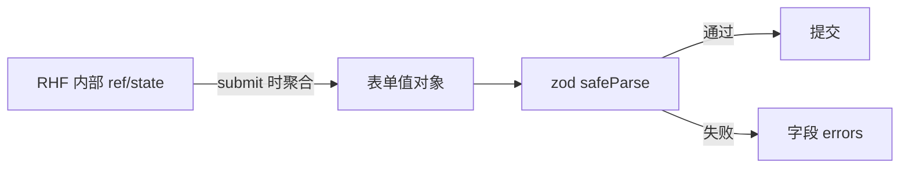

# React Hook Form 与 Schema 校验

> 字段多、校验复杂时，手写 `useState` + 每个 `onChange` 成本高。**React Hook Form（RHF）** 用 **ref 注册字段**、减少重渲染，与 **zod** 结合可做类型安全的 Schema 校验。

---

## 一、为什么需要 RHF？

| 手写受控 | RHF |
|----------|-----|
| 每个字段 state + onChange | `register` 绑定 |
| 字段多 → 大量 re-render | **非受控为主**，性能更好 |
| 校验逻辑分散 | `resolver` 统一 |
| 嵌套/数组字段繁琐 | `useFieldArray` |



---

## 二、最小示例

```bash
pnpm add react-hook-form zod @hookform/resolvers
```

```tsx
import { useForm } from 'react-hook-form';
import { z } from 'zod';
import { zodResolver } from '@hookform/resolvers/zod';

const schema = z.object({
  email: z.string().email('邮箱格式不正确'),
  password: z.string().min(8, '至少 8 位'),
});

type FormValues = z.infer<typeof schema>;

function LoginForm() {
  const {
    register,
    handleSubmit,
    formState: { errors, isSubmitting },
  } = useForm<FormValues>({
    resolver: zodResolver(schema),
    defaultValues: { email: '', password: '' },
  });

  async function onSubmit(data: FormValues) {
    await login(data);
  }

  return (
    <form onSubmit={handleSubmit(onSubmit)} noValidate>
      <input {...register('email')} type="email" autoComplete="email" />
      {errors.email && <span role="alert">{errors.email.message}</span>}

      <input {...register('password')} type="password" autoComplete="current-password" />
      {errors.password && <span role="alert">{errors.password.message}</span>}

      <button type="submit" disabled={isSubmitting}>登录</button>
    </form>
  );
}
```

| API | 作用 |
|-----|------|
| `register('name')` | 绑定 name、ref、onChange、onBlur |
| `handleSubmit(onValid, onInvalid?)` | 校验通过后调 onValid |
| `formState.errors` | 字段级错误 |
| `isSubmitting` | 提交中（配合 async onSubmit） |

---

## 三、zod Schema 进阶

```tsx
const schema = z.object({
  age: z.coerce.number().min(18, '须年满 18'),
  role: z.enum(['admin', 'user']),
  tags: z.array(z.string()).min(1, '至少一个标签'),
  profile: z.object({
    bio: z.string().max(200),
  }),
});

type FormValues = z.infer<typeof schema>;
```

| zod 能力 | 示例 |
|----------|------|
| 联合 refine | `.refine(v => v.password === v.confirm, { path: ['confirm'] })` |
| 条件 | `z.discriminatedUnion` |
| 异步 | `refine` + async（少用，注意 UX） |

```tsx
const schema = z
  .object({
    password: z.string().min(8),
    confirm: z.string(),
  })
  .refine(data => data.password === data.confirm, {
    message: '两次密码不一致',
    path: ['confirm'],
  });
```

---

## 四、校验模式 mode

```tsx
useForm({
  resolver: zodResolver(schema),
  mode: 'onBlur',        // 失焦校验
  // mode: 'onChange',   // 输入即校验
  // mode: 'onSubmit',   // 默认，提交时
  reValidateMode: 'onChange', // 有错后再改，即时重验
});
```

| mode | 体验 |
|------|------|
| `onSubmit` | 默认，少打扰 |
| `onBlur` | 字段离开再报错 |
| `onChange` | 实时，适合强校验 |
| `all` | blur + change |

---

## 五、Controller：第三方受控组件

UI 库（Ant Design、MUI）不直接支持 `register`，用 **`Controller`**：

```tsx
import { Controller, useForm } from 'react-hook-form';

function Form() {
  const { control, handleSubmit } = useForm<FormValues>({ ... });

  return (
    <form onSubmit={handleSubmit(onSubmit)}>
      <Controller
        name="city"
        control={control}
        render={({ field, fieldState }) => (
          <Select
            options={cities}
            value={field.value}
            onChange={field.onChange}
            onBlur={field.onBlur}
            error={fieldState.error?.message}
          />
        )}
      />
    </form>
  );
}
```

| `field` | `value`、`onChange`、`onBlur`、`name`、`ref` |
|---------|-----------------------------------------------|
| `fieldState` | `error`、`isDirty`、`isTouched` |

---

## 六、useFieldArray 动态列表

```tsx
const { control, register } = useForm<{ items: { name: string }[] }>({
  defaultValues: { items: [{ name: '' }] },
});

const { fields, append, remove } = useFieldArray({ control, name: 'items' });

return (
  <>
    {fields.map((field, index) => (
      <div key={field.id}>
        <input {...register(`items.${index}.name`)} />
        <button type="button" onClick={() => remove(index)}>删</button>
      </div>
    ))}
    <button type="button" onClick={() => append({ name: '' })}>加一行</button>
  </>
);
```

| 注意 | 说明 |
|------|------|
| `key={field.id}` | RHF 生成的稳定 id，**不要用 index** |

---

## 七、watch 与联动

```tsx
const role = watch('role');

return (
  <>
    <select {...register('role')}>
      <option value="user">用户</option>
      <option value="admin">管理员</option>
    </select>
    {role === 'admin' && <input {...register('adminCode')} />}
  </>
);
```

| API | 用途 |
|-----|------|
| `watch('field')` | 订阅单字段，触发重渲染 |
| `watch()` | 整个表单（慎用，频繁 render） |
| `useWatch({ control, name })` | 组件级订阅，更细 |

---

## 八、setValue / reset

```tsx
// 编辑页回填
useEffect(() => {
  if (user) reset(user);
}, [user, reset]);

// 程序化改字段
setValue('email', 'x@y.com', { shouldValidate: true, shouldDirty: true });
```

| `reset` | 恢复 defaultValues 或传入新对象 |
|---------|--------------------------------|

---

## 九、与 TanStack Query 配合

```tsx
function EditUser({ id }: { id: string }) {
  const { data: user } = useQuery({ queryKey: ['user', id], queryFn: () => fetchUser(id) });
  const form = useForm<FormValues>({ resolver: zodResolver(schema) });

  useEffect(() => {
    if (user) form.reset(user);
  }, [user, form]);

  const mutation = useMutation({
    mutationFn: updateUser,
    onSuccess: () => toast.success('已保存'),
  });

  return (
    <form onSubmit={form.handleSubmit(data => mutation.mutate(data))}>
      ...
    </form>
  );
}
```

---

## 十、错误展示与 a11y

```tsx
const { errors } = formState;

<input
  {...register('email')}
  aria-invalid={!!errors.email}
  aria-describedby={errors.email ? 'email-error' : undefined}
/>
{errors.email && (
  <span id="email-error" role="alert">{errors.email.message}</span>
)}
```

---

## 十一、RHF vs 其他

| | RHF | Formik |
|---|-----|--------|
| 重渲染 | 较少（非受控注册） | 常较多 |
| API 体积 | 小 | 中 |
| 生态 | zod resolver 成熟 | 同样支持 |

中后台新项目默认 **RHF + zod**（与 [编码规范](../React编码规范.md) 一致）。

---

## 十二、小结

| 要点 | 实践 |
|------|------|
| 类型 | `z.infer<typeof schema>` |
| 绑定 | `register` 或 `Controller` |
| 动态行 | `useFieldArray` + `field.id` |
| 校验 | `zodResolver` + mode 策略 |
| 回填 | `reset(serverData)` |

**上一篇**：[02-表单基础与受控表单](./02-表单基础与受控表单.md)  
**下一篇**：[04-复杂交互-拖拽-上传-富文本](./04-复杂交互-拖拽-上传-富文本.md)
