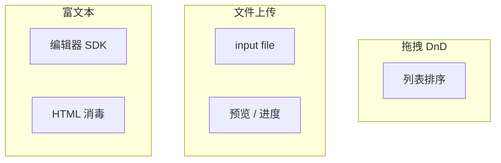
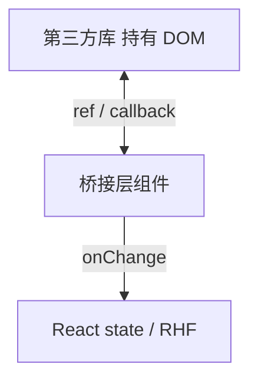

# 复杂交互：拖拽 · 上传 · 富文本

上传、拖拽、富文本都会碰到**非 React 管理的 DOM** 和大块状态。模式是：桥接层组件 + effect 初始化/cleanup + 安全边界（文件大小、HTML 消毒）。

---

## 三类交互共性



| 类型 | 难点 | 常见库 |
|------|------|--------|
| 拖拽 | 指针、滚动、触摸 | **@dnd-kit** |
| 上传 | file 非受控、进度 | 原生 + fetch/axios |
| 富文本 | HTML、光标、性能 | **Tiptap**、Slate |

---

## 文件上传

```tsx
function AvatarUpload({ onFile }: { onFile: (file: File) => void }) {
  const inputRef = useRef<HTMLInputElement>(null);

  function handleChange(e: React.ChangeEvent<HTMLInputElement>) {
    const file = e.target.files?.[0];
    if (!file) return;
    if (file.size > 5 * 1024 * 1024) {
      alert('最大 5MB');
      e.target.value = ''; // 允许重选同一文件
      return;
    }
    onFile(file);
  }

  return (
    <>
      <button type="button" onClick={() => inputRef.current?.click()}>选择头像</button>
      <input ref={inputRef} type="file" accept="image/png,image/jpeg"
        className="hidden" onChange={handleChange} />
    </>
  );
}
```

`type="file"` 几乎总是非受控；`accept` 可被绕过，**服务端再验**。

预览 + 进度：`URL.createObjectURL` 后须在 cleanup **`revokeObjectURL`**。

拖拽区：`dragover` 上 **`preventDefault`** 才能 drop。

---

## 拖拽排序（@dnd-kit）

```tsx
import { DndContext, closestCenter, PointerSensor, useSensor, useSensors } from '@dnd-kit/core';
import { arrayMove, SortableContext, useSortable, verticalListSortingStrategy } from '@dnd-kit/sortable';
import { CSS } from '@dnd-kit/utilities';

function SortableItem({ id, label }: { id: string; label: string }) {
  const { attributes, listeners, setNodeRef, transform, transition } = useSortable({ id });
  const style = { transform: CSS.Transform.toString(transform), transition };
  return (
    <div ref={setNodeRef} style={style} {...attributes} {...listeners}>{label}</div>
  );
}

// onDragEnd 里 arrayMove 更新 state；items 用稳定业务 id
```

长列表 DnD 需虚拟化方案；配置 **KeyboardSensor** 提供键盘排序（无障碍）。

---

## 富文本（Tiptap）

```tsx
import { useEditor, EditorContent } from '@tiptap/react';
import StarterKit from '@tiptap/starter-kit';

function RichEditor({ value, onChange }: { value: string; onChange: (html: string) => void }) {
  const editor = useEditor({
    extensions: [StarterKit],
    content: value,
    onUpdate: ({ editor }) => onChange(editor.getHTML()),
  });
  return <EditorContent editor={editor} />;
}
```

存 HTML 须 **DOMPurify** 消毒后再 `dangerouslySetInnerHTML`；更安全是存 ProseMirror JSON。

**永远不要**直接渲染用户富文本 HTML。

---

## 集成通用模式



```tsx
useEffect(() => {
  const chart = createChart(ref.current!, data);
  return () => chart.destroy();
}, [data]);
```

切换文档时 `key={docId}` remount；勿与受控 value 硬绑冲突。

---

## 性能与无障碍

大文件：进度、取消、OSS 直传；富文本 onChange 可 debounce；粘贴图片转 URL 别嵌巨串 base64。

上传：按钮触发隐藏 input 仍须可聚焦；拖拽提供键盘上移/下移替代；编辑器工具栏 `aria-label`。

---

## 小结

**上传**：`input type=file` + ref；清空 value 以重选同文件；预览 URL 要 revoke。

**拖拽**：优先 **@dnd-kit**；**稳定 id** 非 index；长列表考虑虚拟化 + KeyboardSensor。

**富文本**：**Tiptap** 等 SDK；展示用户 HTML 必须 **消毒**。

**集成**：effect 里 init + **cleanup**；`key` 重置文档；桥接层连接 RHF/state。

**易混点**：file 几乎不能受控；drop 忘 preventDefault；富文本 XSS。

常见错因：第三方实例是否在卸载时销毁？用户内容是否消毒？
